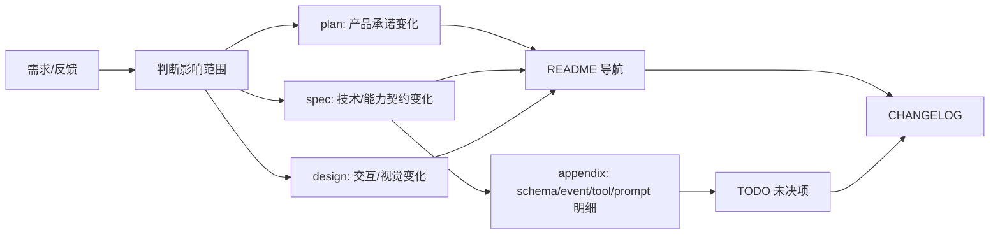

# WORKFLOW · 文档与实现协作流程

本文件定义 Open Novel 的文档更新工作流。它补充 `AGENTS.md` / `CLAUDE.md`:前者是 agent 行为规范,本文件是一次需求从想法进入文档、设计、实现和验收时的更新顺序。

## 总原则



任何显著变更至少要判断四件事:

| 问题 | 更新位置 |
|---|---|
| 产品承诺是否变化 | `plan/*.md` |
| 技术行为或能力边界是否变化 | `spec/*.md` |
| 用户交互或视觉是否变化 | `design/*.md` + 原型 |
| 是否有未关闭风险或实施前验证 | `TODO.md` |

跨文档变更必须写入 `CHANGELOG.md`。

## spec 更新流程

| 类型 | 做法 |
|---|---|
| 系统主权变化 | 更新根层 `spec/00-11` 对应文档 |
| 用户可感知能力变化 | 直接新增或更新根层编号 spec,例如 `12-universal-search.md` |
| schema / event / tool / prompt 明细变化 | 更新 `spec/appendix/*` |
| 历史材料迁移 | 归 `progress/`,不要放回 active spec |

### 能力级核心 spec 规则

新能力不要另建二级能力目录。如果一个能力值得单独实现、测试和设计验收,它就是核心 spec,直接进入 `spec/NN-name.md`。

能力 spec 必须讲完整闭环:

- 用户如何触发。
- 它读取哪些事实和索引。
- 它输出什么。
- 它与相邻能力的边界。
- 它如何失败和降级。
- 它引用哪些 design 文档。
- 它的测试清单。

当前能力级核心 spec:

| 能力 | 文档 | design |
|---|---|---|
| Universal Search | [spec/12](./spec/12-universal-search.md) | [design/01](./design/01-main-layout.md) · [design/06](./design/06-command-palette.md) |
| Discuss Mode | [spec/13](./spec/13-discuss-mode.md) | [design/01](./design/01-main-layout.md) |
| Trace Observability | [spec/14](./spec/14-trace-observability.md) | [design/01](./design/01-main-layout.md) · [design/04](./design/04-settings.md) |
| Approval Cascade | [spec/15](./spec/15-approval-cascade.md) | [design/02](./design/02-approval-cascade.md) |
| ReaderPanel | [spec/16](./spec/16-reader-panel.md) | [design/03](./design/03-reader-panel.md) |

## design 更新流程

design 不是 SoT,但它也不是可忽略的草图。它是交互和视觉契约,必须随能力 spec 同步更新。

| 变更 | design 处理 |
|---|---|
| 新增浮层/面板/快捷键 | 更新对应 `design/*.md`;必要时更新原型 |
| spec 改了行为 | design 补交互状态、空态、错态、键盘和视觉层级 |
| design 发现实现不可行 | 回写 spec 或 TODO,并记 CHANGELOG |
| 原型与 md 不一致 | 以 md 为当前契约,原型需要同步 |

Markdown 文档不得超链接到仓库内 `.html`;引用原型只写路径。

## TODO 规则

TODO 只放仍开放的问题:

- 未验证外部事实。
- 需要代码 spike 才能关闭的风险。
- 已知设计/实现不同步。
- 用户明确要求之后裁决的问题。

已完成的迁移、历史解释和关闭项写 `CHANGELOG.md` 或 `progress/`,不要留在 TODO 活跃区。

## CHANGELOG 规则

每次跨文档变更都要在顶部新增一节,说明:

| 字段 | 内容 |
|---|---|
| 变更 | 做了什么 |
| 影响文档 | 文件或文档组 |
| 关联 | 用户反馈、技术风险或设计原因 |

CHANGELOG 不是 TODO,不要把未决问题写成完成事实。

## 提交前验证

文档变更提交前至少跑:

```bash
git diff --check
diff -u AGENTS.md CLAUDE.md
```

并检查:

- Markdown 内部链接存在。
- Markdown 不超链接仓库内 `.html`。
- 新核心 spec 已进入 README 导航。
- 如果改了 design,对应 spec 有引用或说明。
- 如果有未关闭项,已进入 TODO。
