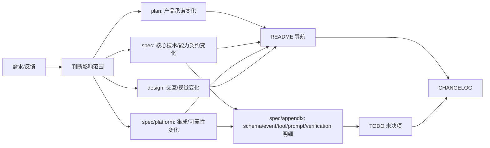

# WORKFLOW · 文档与实现协作流程

本文件定义一个需求从想法进入文档、设计、实现和验收时的更新顺序。它应尽量保持项目无关:项目专属文档地图放在 `README.md`,项目专属 agent 约束放在 `AGENTS.md` / `CLAUDE.md`。

## 总原则



任何显著变更至少判断四件事:

| 问题 | 更新位置 |
|---|---|
| 产品承诺是否变化 | `plan/*.md` |
| 核心技术行为或能力边界是否变化 | `spec/S*.md` 或 `spec/M*.md` |
| 集成、恢复、迁移、诊断等支撑契约是否变化 | `spec/platform/*.md` |
| 用户交互或视觉是否变化 | `design/*.md` 和必要原型 |
| 是否有未关闭风险或实施前验证 | `TODO.md` |

跨文档变更必须写入 `CHANGELOG.md`。

## 编号体系

文档编号采用“单字母 + 数字”。字母表示读法,数字表示该类文档内部顺序。

| 前缀 | 位置 | 含义 | 适用内容 |
|---|---|---|---|
| `Sxx` | `spec/` 根层 | System Design | 系统主权、跨层契约、运行时、存储、上下文、底层协议 |
| `Mxx` | `spec/` 根层 | User-facing Capability | 用户可触发、可感知、可验收的能力闭环 |
| `Ixx` | `spec/platform/` | Integration Contract | 模型、编辑器、文件系统、桌面壳、第三方服务等跨边界接入 |
| `Rxx` | `spec/platform/` | Reliability / Runtime Operations | 生命周期、迁移升级、索引修复、诊断排障 |
| `Axx` | `spec/appendix/` | Appendix Implementation Detail | 表结构、schema、事件、工具、prompt、迁移字段等实现明细 |
| `Vxx` | `spec/appendix/` | Verification Detail | 测试矩阵、golden cases、外部能力 spike、实查记录 |
| `Pxxx` | `progress/` | Progress Record | 历史进度、迁移记录、复盘归档 |

`S/M` 是读者需要主动理解的核心技术文档。`I/R` 是与 appendix 平级的支撑契约,放在 `spec/platform/`。`A/V` 是实现者偶尔查的明细,放在 `spec/appendix/`。`P` 只用于历史档案。

## 更新流程

| 变更类型 | 做法 |
|---|---|
| 系统主权、核心状态机、跨层失败语义变化 | 更新 `spec/Sxx-*.md` |
| 用户可感知能力变化 | 新增或更新 `spec/Mxx-*.md` |
| 跨边界接入变化 | 新增或更新 `spec/platform/Ixx-*.md` |
| 运行维护、恢复、迁移、诊断变化 | 新增或更新 `spec/platform/Rxx-*.md` |
| schema / event / tool / prompt / migration 字段变化 | 更新 `spec/appendix/Axx-*.md` |
| 测试、golden case、外部 spike 或实查记录变化 | 更新 `spec/appendix/Vxx-*.md` |
| 历史材料迁移或复盘 | 归 `progress/Pxxx-*.md` 或专题 archive |

### 核心 Spec 规则

如果一篇文档决定读者理解系统主路径所必需的设计,它应进入 `Sxx` 或 `Mxx`,而不是 appendix。

核心 spec 必须讲清:

- 读者为什么需要这篇文档。
- 它负责什么、不负责什么。
- 它拥有哪些主权对象或职责边界。
- 输入、输出、依赖和下游影响。
- 关键流程或状态如何流转。
- 失败事故如何收场。
- 用户看见什么结果。
- 哪些支撑契约被后置到 `platform/`,哪些实现明细被后置到 `appendix/`。

核心 spec 应优先用场景、mermaid 图、表格和 FAQ 解释设计。图表用于说明系统关系和状态流转,表格用于对齐边界和取舍,FAQ 用于回答实现者最容易误解的问题。

### Platform 规则

`spec/platform/` 放支撑核心体验但不应打断主阅读路径的工程契约。它不是 appendix,因为它仍然定义行为边界和失败收场;它也不是根层核心 spec,因为读者通常不需要先读它才能理解产品能力。

`Ixx` 文档回答:

- 这个外部/跨边界系统提供什么能力。
- 接入前必须验证什么。
- 它的失败如何影响核心路径。
- 什么时候应降级、阻断或回写 TODO。

`Rxx` 文档回答:

- 某个运维或恢复闭环何时触发。
- 它保护哪些主权数据或用户结果。
- 失败时系统停在哪个可解释状态。
- 哪些修复动作需要用户确认。

### Appendix 规则

appendix 只承接实现者偶尔需要查的机器级明细。读者不需要先读 appendix 才能理解系统。

appendix 可以保存:

- 表结构、字段字典、索引和迁移字段。
- 完整 JSON Schema / interface / 结构化输出样例。
- 工具参数、命令清单和事件字段。
- prompt 模板全文和公共片段。
- 测试矩阵、golden cases、外部能力实查记录。

appendix 不保存:

- 根层 spec 应讲清的主路径。
- 平台契约应讲清的接入/恢复失败语义。
- 历史阶段叙事、旧方案对比和迁移过程流水账。
- 已关闭问题、旧排期计划、未验证事实伪装成当前契约。

## Design 更新流程

design 不是 source of truth,但它也不是可忽略的草图。它是交互和视觉契约,必须随能力 spec 同步更新。

| 变更 | design 处理 |
|---|---|
| 新增浮层、面板、快捷键、用户可见状态 | 更新对应 `design/*.md`;必要时更新原型 |
| spec 改了行为 | design 补交互状态、空态、错态、键盘和视觉层级 |
| design 发现实现不可行 | 回写 spec 或 TODO,并记入 CHANGELOG |
| 原型与 Markdown 不一致 | 以 Markdown 为当前契约,原型需要同步 |

Markdown 文档不得超链接到仓库内 `.html`;引用原型只写路径。

## TODO 规则

TODO 只放仍开放的问题:

- 未验证外部事实。
- 需要代码 spike 才能关闭的风险。
- 已知设计/实现不同步。
- 用户明确要求之后裁决的问题。

已完成的迁移、历史解释和关闭项写 `CHANGELOG.md` 或 `progress/`,不要留在 TODO 活跃区。

## CHANGELOG 规则

每次跨文档变更都要在顶部新增一节,说明:

| 字段 | 内容 |
|---|---|
| 变更 | 做了什么 |
| 影响文档 | 文件或文档组 |
| 关联 | 用户反馈、技术风险或设计原因 |

CHANGELOG 不是 TODO,不要把未决问题写成完成事实。

## 提交前验证

文档变更提交前至少跑:

```bash
git diff --check
diff -u AGENTS.md CLAUDE.md
```

并检查:

- Markdown 内部链接存在。
- Markdown 不超链接仓库内 `.html`。
- 新核心 spec 已进入 README 导航。
- 新 platform 文档已进入 README 导航。
- 如果改了 design,对应 spec 有引用或说明。
- 如果有未关闭项,已进入 TODO。
