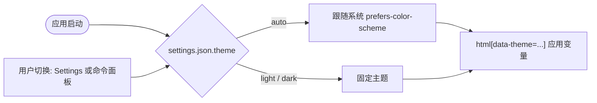

# design/00 — Design Tokens(嫩叶 · 素纸主题 · 双主题)

> 本文是全部界面设计的视觉地基。原型实现见 `design/prototypes/tokens.css`(唯一 token 源,所有原型页共享)。

## 风格基调

Open Novel 的自有视觉语言,关键词是**轻盈、纸感、书卷气**,落在 IDE 形态上:

- **素色中性底,绿只做点缀**:背景一律无色彩倾向——浅色底素白 `#F7F7F7`,深色底炭灰 `#1D1D1D`;绿色不进背景,只出现在 accent 与文字灰墨的极轻倾向(饱和度 ≤5%,读感是墨不是绿)
- **低饱和 + 单一品牌 accent**:界面大面积素灰,唯一高饱和色是嫩叶绿 `#158243`(深色主题 `#3DA066`),只用于主操作、品牌时刻与选中态
- **低反差书卷气**:刻意不用纯黑字、纯白纸。正文对比度收在 **7:1–9:1** 区间——下限保可达性(AAA),上限避免高反差的「屏幕感」;层级靠间距与字重,不靠反差拉满
- **大圆角 + 极轻阴影**:卡片 14px、弹窗 20px;阴影只为分层,不做装饰
- **中文衬线点缀**:品牌性标题与读者引文用宋体系衬线(书卷气,呼应小说创作场景),正文与 UI 全部无衬线
- **克制的动效**:120/200/320ms 三档,均为 ease-out;尊重 `prefers-reduced-motion`

## 主题机制

双主题是硬性要求,实现约定:

- 所有颜色一律经 CSS 变量引用,**禁止在组件样式中硬编码 hex**
- `html[data-theme="light" | "dark"]` 切换整套变量;首次进入跟随系统 `prefers-color-scheme`,用户手动切换后写入本地配置(原型中为 `localStorage.onovel-theme`,产品中为 `settings.json.theme: 'auto' | 'light' | 'dark'`)
- 命令面板提供 `view.toggleDarkMode`(见 [spec/S14 编辑器与交互契约](../spec/S14-editor-and-interaction.md))
- 对比度验收(两套主题同标准):**正文 7:1–9:1、次要文字 4.5:1–5.5:1、占位/disabled ≥ 3:1、accent 底上的按钮文字 ≥ 4.5:1**。区间上限是设计约束(书卷气),下限是可达性红线



## 色彩 Token

### 背景与文字

| Token | Light | Dark | 用途 |
|---|---|---|---|
| `--bg-app` | `#F7F7F7` | `#1D1D1D` | 应用底色(素色,无色彩倾向) |
| `--bg-surface` | `#FCFCFC` | `#252525` | 卡片 / 编辑器纸面(非纯白) |
| `--bg-sunken` | `#EFEFEF` | `#171717` | 侧栏 / 输入底 / 下沉区 |
| `--bg-raised` | `#FDFDFD` | `#2D2D2D` | 浮层 / 弹窗 |
| `--bg-hover` | `rgba(34,38,36,.05)` | `rgba(226,228,227,.06)` | hover 态 |
| `--bg-active` | `rgba(34,38,36,.10)` | `rgba(226,228,227,.11)` | active / 选中底 |
| `--bg-overlay` | `rgba(17,19,18,.40)` | `rgba(0,0,0,.55)` | 模态遮罩 |
| `--text-primary` | `#474F4B` | `#BAC0BD` | 正文灰墨(实测 7.9 / 8.3,落在 7–9 区间) |
| `--text-secondary` | `#646D68` | `#8E9591` | 次要说明(实测 5.0 / 5.0) |
| `--text-tertiary` | `#838A86` | `#717673` | 占位 / 弱提示(实测 3.3 / 3.3) |
| `--border` | `#E5E5E4` | `#373737` | 默认描边 |
| `--border-strong` | `#D1D2D0` | `#4B4C4B` | 分隔强描边 / 控件描边 |

### 品牌与语义

| Token | Light | Dark | 用途 |
|---|---|---|---|
| `--accent` | `#158243` | `#3DA066` | 主按钮 / 选中 / 品牌(嫩叶绿) |
| `--accent-hover` | `#12763C` | `#4CAB73` | accent hover |
| `--accent-subtle` | `#E4F3E9` | `#233B2C` | accent 浅底 |
| `--accent-text` | `#23774A` | `#54B67C` | accent 文字(在浅底上,实测 ≥4.8) |
| `--text-on-accent` | `#F6FBF7` | `#0D2418` | accent 底上的文字(实测 4.7 / 5.0;深色主题为深字浅钮) |
| `--info` | `#4F7DAF` | `#7FA7D1` | 信息(各配 `-subtle` 浅底) |
| `--success` | `#5E8C61` | `#82A886` | 成功 / 已验证 / 新增 diff(灰绿,与高饱和的 accent 拉开) |
| `--warning` | `#B8862C` | `#D9A645` | 警示 / 确认级风险 |
| `--danger` | `#BF4D43` | `#D97066` | 危险 / 阻断级风险 / 删除 diff |

> 注意:accent 与 success 同为绿系,区分逻辑是**饱和度与角色**——accent 是高饱和嫩叶绿、只出现在可点击/选中/品牌处;success 是低饱和灰绿、只做状态徽标与 diff。两者不得互换使用。

### 领域色(Open Novel 特有)

| 组 | Token | Light | Dark | 用途 |
|---|---|---|---|---|
| 实体 | `--entity-character` | `#4F7DAF` | `#7FA7D1` | 角色(下划线/hover 卡,见 [spec/S14](../spec/S14-editor-and-interaction.md)) |
| 实体 | `--entity-place` | `#5E8C61` | `#82A886` | 地点 |
| 实体 | `--entity-item` | `#C2762D` | `#D99A55` | 物品 |
| 实体 | `--entity-org` | `#8A6FB8` | `#AC93D9` | 阵营 / 组织 |
| 实体 | `--entity-violation` | `#BF4D43` | `#D97066` | concept violation 红色虚线 |
| Agent | `--agent-router` | `#838683` | `#8E908E` | `router` 调度员(Trace 摘要色) |
| Agent | `--agent-writer` | `#158243` | `#3DA066` | `writer` 写手(品牌色,与 accent 同值) |
| Agent | `--agent-validator` | `#4F7DAF` | `#7FA7D1` | `validator` 一致性守护者 |
| Agent | `--agent-checker` | `#B8862C` | `#D9A645` | `checker` 审稿人 |
| Agent | `--agent-reflector` | `#8A6FB8` | `#AC93D9` | `reflector` 反思学习者 |
| Agent | `--agent-humanizer` | `#4E9B8F` | `#6FB8AC` | `humanizer` 润色师 |
| Agent | `--agent-reader-panel` | `#C95F8E` | `#D9849E` | `reader_panel` 读者评审团 |
| 置信度 | `--confidence-high/-mid/-low` | 复用 success / warning / tertiary | 同左 | cascade 勾选默认值的视觉对应 |
| Diff | `--diff-del-bg/-text` | `#FBEAE8` / `#A33D34` | `#46302E` / `#E5938A` | 删除行 |
| Diff | `--diff-add-bg/-text` | `#E8F2E8` / `#44693F` | `#2E3A2F` / `#A4C9A0` | 新增行 |

## 字体

| Token | 值 | 用途 |
|---|---|---|
| `--font-ui` | system + `PingFang SC` 栈 | 全部 UI 与编辑器正文(编辑器 16px / 行距 1.8,可调,见 [design/04 §风格定制](./04-settings.md)) |
| `--font-serif` | `Noto Serif SC` / `Songti SC` / `Source Han Serif SC` | 书卷气点缀:品牌标题(Onboarding、空态)与读者引文;中文宋体优先,不依赖任何私有字体 |
| `--font-mono` | `JetBrains Mono` / ui-monospace | diff、路径、kbd、token 用量 |

字号阶梯:11(角标)/ 12(辅助)/ 13(UI 默认)/ 14(正文)/ 16(编辑器)/ 18(区块标题)/ 24(衬线品牌标题)。字重只用 400 / 500 / 600。

## 圆角 · 阴影 · 间距 · 动效

| 类 | Token | 值 |
|---|---|---|
| 圆角 | `--radius-sm/md/lg/xl` | 6 / 10 / 14 / 20px(控件 / 按钮 / 卡片 / 弹窗) |
| 阴影 | `--shadow-sm/md/lg` | 比常规体系更轻(浅色主题 α ≤ .14),只为分层;深色主题用黑色加深 |
| 间距 | 4 的倍数 | 4 / 8 / 12 / 16 / 20 / 24 / 32(组件内 padding 默认 12-16,卡片 16-20) |
| 动效 | `--dur-fast/base/slow` | 120 / 200 / 320ms,`--ease` 标准缓动;主题切换用 `--dur-base` |

## 焦点与可达性

- 键盘焦点一律 `box-shadow: 0 0 0 3px var(--focus-ring)`(accent 半透明),不裸用浏览器默认 outline
- 低反差是美学选择,不是可达性妥协:全部文字 token 带实测对比度,不允许任何文字低于其档位下限;Settings 提供「提高对比度」开关,映射到一套高反差变量覆盖。
- 颜色不是唯一信号:置信度同时有文字(高/中/低),violation 同时有 ⚠ 图标,diff 同时有 +/- 前缀
- 全部浮层可被 `Esc` 关闭(硬约束,[spec/S14](../spec/S14-editor-and-interaction.md));模态实现 Focus Trap

## 实现对接(Tailwind v4 + shadcn/ui)

技术栈已锁定 Next.js 15 + Tailwind v4 + shadcn/ui([spec/S00](../spec/S00-system-contract.md))。落地时 `tokens.css` 原样进入 `app/globals.css`,再做两件事:

### 1. dark variant 绑定 data-theme

项目用 `html[data-theme]` 而非 `.dark` 类,Tailwind v4 需自定义 variant:

```css
@custom-variant dark (&:where([data-theme="dark"], [data-theme="dark"] *));
```

### 2. token → Tailwind / shadcn 变量映射

`@theme inline` 把语义 token 暴露给 utility class;shadcn 变量在 `:root` 直接取值。**命名冲突警告:shadcn 的 `--accent` 是「菜单 hover 底色」,不是品牌色;本文的 `--accent`(品牌)对应 shadcn 的 `--primary`。**

```css
@theme inline {
  --color-app: var(--bg-app);
  --color-surface: var(--bg-surface);
  --color-sunken: var(--bg-sunken);
  --color-raised: var(--bg-raised);
  --color-ink: var(--text-primary);
  --color-ink-2: var(--text-secondary);
  --color-ink-3: var(--text-tertiary);
  --color-brand: var(--accent);
  --color-brand-subtle: var(--accent-subtle);
  --radius-card: 14px;
}
```

| shadcn 变量 | 取本文 token | 说明 |
|---|---|---|
| `--background` / `--foreground` | `--bg-app` / `--text-primary` | 页面级 |
| `--card` / `--card-foreground` | `--bg-surface` / `--text-primary` | Card |
| `--popover` / `--popover-foreground` | `--bg-raised` / `--text-primary` | Popover / Dialog |
| `--primary` / `--primary-foreground` | `--accent` / `--text-on-accent` | 主按钮(注意深色主题是深字浅钮) |
| `--secondary` / `--secondary-foreground` | `--bg-sunken` / `--text-primary` | 次级按钮 |
| `--muted` / `--muted-foreground` | `--bg-sunken` / `--text-secondary` | 弱化区 |
| `--accent` / `--accent-foreground` | `--bg-active` / `--text-primary` | **shadcn 语义**:hover 底,非品牌色 |
| `--destructive` | `--danger` | 危险操作 |
| `--border` / `--input` | `--border` / `--border-strong` | 描边 |
| `--ring` | `--focus-ring` | 焦点环 |
| `--radius` | `10px`(= `--radius-md`) | shadcn 控件圆角基准 |

### 3. 组件对应关系

- Button / Dialog / Toast(sonner)/ Tabs 等 shadcn 组件**不改结构只改变量**;自绘组件(ApprovalCard、Trace 面板、实体高亮、批阅层)直接消费本文 token
- lucide 图标一律 `currentColor`,继承文字色,不单独配色
- 验收方式见 [design/README §交付与验收](./README.md#交付与验收claude-code-落地流程)

## 关联文档

- 上游:[design/README §设计原则](./README.md) · [spec/S00 技术路线](../spec/S00-system-contract.md)
- 应用:design/01~06 全部界面文档,`design/prototypes/*.html` 全部原型
