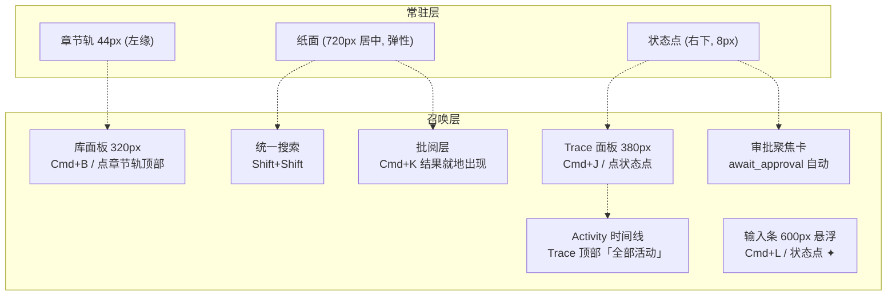

# design/01 — 主界面:章节轨 · 纸面 · 状态点

> 原型:`design/prototypes/01-main-layout.html` · 上游:[plan/07 协作与三模式](../plan/07-collaboration-and-modes.md) · [plan/05 故事世界(边写边查)](../plan/05-story-world.md) · [spec/S14 编辑器与交互](../spec/S13-editor-and-interaction.md)(布局契约 2026-06-11 修订,以本篇为主权)

设计立场:**简约、素雅、克制**。常驻屏幕的只有三样——左缘章节轨、正文纸面、右下状态点;库、对话、trace、审批、调试全部召唤式,`Esc` 即走。层级靠留白与发丝线(1px 边),不靠色块与投影;不引入任何文化符号装饰;除状态点运行态的缓慢呼吸外,没有循环动画,全部过渡只用 120/200ms 的淡入与小位移。进行态列表、报告骨架和 toast 只允许静态占位加进度条,不新增循环闪烁。

## 布局骨架

推开式面板让纸面让位不被遮挡;输入条、批阅层近文操作与审批卡是召唤层。各区尺寸见上图与下文各节;快捷键以 [spec/S14](../spec/S13-editor-and-interaction.md) 为准。

## 视觉分层(双主题)

| 区域 | 表面 | 说明 |
|---|---|---|
| 窗口底 / 章节轨 | `--bg-app` | 安静背景,章节轨无底色、只有右侧 1px `--border` |
| 纸面 | `--bg-surface` + 1px `--paper-edge` | 唯一亮面,左右留白 ≥64px,不用投影;浅色主题靠描边补足与底的边界 |
| 库面板 / Trace 面板 | `--bg-app` + 1px `--border` 分界 | 与窗口底同色,靠发丝线分界,不做下沉色块 |
| 输入条 / 审批卡 / 旁注 | `--bg-raised` + 1px `--border` + `--shadow-md` | 悬浮层;阴影只此一处使用 |
| 批阅层标记 | 细下划线 / 淡底色 / 小号近文操作 | 与正文共面,不使用卡片容器 |

## 章节轨(常驻,44px)

- 结构自上而下:项目返回按钮(hover 显「返回项目选择」)→ 库按钮(☰,hover 显「库 Cmd+B」)→ 当前卷各章的章号列(等宽字体,11px)→ 底部 ?(新手指引)与 ⚙(设置)
- 当前章:章号 `--text-primary` + 左缘 2px accent 短线;其余章号 `--text-tertiary`,hover 变 `--text-secondary` 并浮出章名 tooltip
- 未保存:章号右上一粒 4px accent 点(保存状态唯一常驻信号)
- violation 所在章:章号下一粒 4px danger 点
- 点击章号即切章;拖一个章号到纸面右半 = 对照视图(原型以提示演示)

## 对照视图

对照视图用于「当前上下文不丢」地打开第二个章节、设定或审批命中段。它不是新窗口,也不是常驻多标签,而是纸面区域的临时双 pane:

- 进入:章节轨拖到纸面右半、库面板/最近列表选择「对照打开」、Universal Search / 快速打开使用 `Cmd+Enter`、实体「打开定义」或审批风险「跳对应章节段」。
- 布局:主 pane 保持左侧,宽度不低于 520px;对照 pane 在右侧,宽度 360-520px。窗口不足 1040px 时对照 pane 改为覆盖式阅读层,顶部显示「返回主文」。
- 主 pane 判定:触发前拥有编辑焦点或阅读锚点的 pane 是主 pane;所有会写入的动作默认落在主 pane。对照 pane 只读,除非用户显式点击「设为主文」。
- 章节轨表示:同时打开两个章节时,主 pane 章号仍用 accent 左线,对照章号用右侧 2px info 线;同一章双开只保留主章号标记。
- 焦点路由:打开对照不抢编辑焦点;`Tab` 只在当前 pane 内循环,`Cmd+W` 关闭对照 pane,`Esc` 先关闭对照内浮层,再关闭覆盖式对照。
- 关闭:对照 pane 关闭后主 pane 的滚动位置、选区和输入条内容保持不变。

当审批卡触发对照查看时,见 [design/02 §对照审批](./02-approval-cascade.md#对照审批)。

## 库面板(召唤式,320px)

- 召出:`Cmd+B` / 点库按钮;推开式,纸面右移
- 顶部:纯文字类目行(章节 / 角色 / 世界观 / 大纲),活动类目 `--text-primary` + 底部 2px accent 短线,其余 `--text-secondary`;`Cmd+1~4` 直达(面板收起时先展开)
- 列表:行高 32px,文字 + 右侧弱化元信息(字数/修改时间);活动行左缘 2px accent 线,不做整行底色;真实用户包默认不显示 `_` 前缀派生文件。开发构建可用只读标记展示派生文件,由构建/打包变量决定,不提供普通用户可点开关([spec/M18](../spec/M18-developer-mode.md))
- 「最近」置于章节类目顶部一组(替代 Tabs 的多文件心智);空态(新项目):居中衬线短句 +「让 AI 起草第一章」按钮 → 召出输入条并预填
- 库面板只放「能打开的东西」;查询、引用查看和选区查询都进入统一搜索;偏好是 AI 沉淀的规则(归设置面板「记忆」)

## 统一搜索

作者侧顶层搜索入口只有一个:放大镜式统一搜索。它同时承载对象搜索、事实答案、引用查看、章节片段和选区查询;不同意图只表现为结果类型或上下文动作,不在主界面顶部再放第二个「查询」入口。

- 召出:`Shift+Shift`;再按 `Shift+Shift` 或 `Esc` 收回;IME composition、模态 focus trap、文本拖拽中不触发
- 顶部工具栏只放放大镜图标按钮,hover tooltip「搜索」。演示页可以在原型栏保留短中文按钮,不得同时出现「全局搜索」和「查询」两个入口。
- 形态:屏幕上 1/4 处居中 720px(`--bg-raised` + 1px 边 + `--shadow-md`):单行输入 → 左侧分组结果(角色 / 阵营 / 概念 / 章节 / 事实答案 / 引用 / 可能相关)→ 右侧 hover preview 或答案证据
- 结果行:名称或答案摘要 + 类型 + 来源状态 + 一行说明;`Enter` 打开或采纳主动作,`Cmd+Enter` 对照打开,`Tab` 在类型 filter 间循环
- hover preview:角色展示阵营/状态/关系/最近出现;阵营展示成员/敌对关系;概念展示规则/代价/风险;章节展示命中 snippet;事实答案展示来源片段和引用跳转
- 框选浮动条的「查引用 / 问事实」直接打开统一搜索并预填选区,结果以「事实答案」「引用」类型展示,不另起查询浮层。
- 与 spec 对齐:行为主权见 [spec/M01 Universal Search](../spec/M01-universal-search.md);本篇只定交互形态和视觉层级

## 偏好(learnings)的去处

不在主界面常驻:查看与编辑都在设置面板「记忆」(权重 0-5 + 条目 + 来源记录/证据摘要,[design/04](./04-settings.md));反思学习者新沉淀一条偏好时,在过程面板的对应块内联展示,点击可跳设置面板对应条目。记忆默认注入,不提供逐条注入开关。

## 纸面

- 正文 16px / 行距 1.8 / 段距 0.9em;首行不缩进;最大行宽 720px 居中;章题衬线 22px 在纸内,其上 12px 弱化卷名一行
- 左下微标(纸面外左下角,11px 等宽,`--text-tertiary`,hover 升为 `--text-secondary`):`3,214 字 · 已保存 01:12 · ⚠ 1`;点 ⚠ 跳段
- **实体高亮**:1.5px 下划线按 category 着色(角色蓝 / 地点绿 / 物品橙 / 组织紫);hover 100ms 在**纸面右缘浮出旁注**(190px:名称 + 类别 + 两行摘要 +「打开 →」),与所在段落顶对齐,左缘 2px 实体色线;移开 200ms 收回;点击右侧对照打开,`Cmd+Click` 全屏;F12/Shift+F12/F2 见 [spec/S14](../spec/S13-editor-and-interaction.md)
- **concept violation**:红色虚线下划线,hover 旁注红色语义(「此世界不存在」+ 建议改写);汇总 = 左下 ⚠ 微标 + 滚动条 marker;无段落 gutter 图标(见 [spec/S14](../spec/S13-editor-and-interaction.md))
- **框选浮动条**:选区上方 8px:「✦ 修改 (Cmd+K)」「查引用」;发丝线边框,无投影放大。「查引用」打开统一搜索并预填选区。
- **AI 批阅层**:句内 / 小选区改写在原文附近显示细下划线、淡底色、删除线 / 新增线和近文操作;当前文档段落级问题可用纸面右缘旁注;跨文档变更只在命中位置留锚点或 cascade 序号,完整裁决进入审批流

## 状态点(常驻)与 Trace 面板(召唤)

一粒 8px 的可见点,固定右下角 20px;命中容器 24px。一句话在点左侧浮现(12px,`--text-secondary`),五态:

| 态 | 点 | 旁文 | 点击 |
|---|---|---|---|
| 空闲 | `--text-tertiary` | 无;hover 浮现「✦ 对话 Cmd+L」 | 召出输入条 |
| 运行中 | `--accent`,2.4s 透明度呼吸(全应用唯一循环动效;`prefers-reduced-motion` 下静止) | 「写手正在生成 diff · 12s」+ 进度 `3/5 · 毒舌读者` + 取消 | 展开 Trace 面板 |
| 待审批 | `--accent`,静止 | 「1 个修改待审批 — 查看」(`--accent-text`) | 弹审批聚焦卡 |
| 已停止 | `--text-tertiary`,静止 | 「已停止 · 没有修改 · 查看 recap」 | 展开 Trace 面板 |
| 错误 | `--danger` | 「连接失败 · 去设置检查凭据」 | 直达设置面板「连接凭据」 |

过程面板(`Cmd+J` / 点状态点,380px 推开式):头部 = 最近回执摘要、本轮用量(等宽 11px)+「全部活动」「复制过程」「折叠全部」;主体按 AI 角色分块——角色名 + 耗时一行,工具调用行等宽可展开 JSON,reasoning 默认一句摘要。真实用户包不出现开发模式入口;开发构建可用只读标记展示全文诊断,由构建/打包变量控制。块间发丝线分隔,不做卡片底色。

Activity 时间线由 Trace 顶部的「全部活动」进入,仍是召唤式面板而非常驻侧栏。它按时间列出 recap、作者备注、已审定修改、停止和失败记录;点击条目跳到对应章节、审批卡或 Trace step。

## 输入条(召唤式)

- 召出:`Cmd+L` / 状态点 hover ✦ / 空态按钮。底部居中 600px,距底 24px,`--bg-raised` + 1px 边 + `--shadow-md`,圆角 `--radius-lg`
- 结构:textarea(多行,`@` 引用,`Cmd+↑/↓` 历史)→ 底行:mode 三段纯文字(活动项 `--text-primary` + 底部 2px accent 短线;`Tab` 循环,IME composition 不抢键)+ 右侧「发送 ⌘↵」
- 发送后自动收回,进度与取消移交状态点;右上 pin 可改常驻(记忆选择)
- `await_approval`:召出时保留只读讨论入口,发送按钮旁显示「只读讨论」;会写入、切模式或生成新 ChangeSet 的输入 disabled 并提示「先处理上方审批后才能写入」
- 恢复 banner(仅 in-flight turn):条顶一行「继续审 / 取消本次对话」

## 审批聚焦卡

- `await_approval` 时自动浮出:纸面中央,540px,`--bg-overlay` 轻遮罩(纸面隐约可见)
- 自动浮出不抢编辑器焦点。出现后 600ms 内忽略 `Y/E/N`,防止正在打字时误触落盘。
- 单字母快捷键只在卡片内部有焦点、且焦点不在输入框/textarea/inline 编辑器/IME composition 时生效;否则按普通输入处理。
- 结构:标题行(动作摘要 + 路径等宽小字)→ diff 块 → cascade 提示行(影响数 + 「去整批审 →」[design/02](./02-approval-cascade.md))→ 操作行:同意(primary)/ 编辑后同意 / 拒绝(danger ghost),`Y/E/N` 仅在卡片聚焦后直达
- 含确认级风险时 `Y` 不生效,必须先进入整批审批卡勾选确认;含阻断级风险时同意按钮与 `Y` 都禁用。
- 拒绝复用 [design/02 §行动栏](./02-approval-cascade.md#行动栏) 的必填反馈流程:点拒绝只展开反馈框,提交反馈后才进入拒绝完成,不能直接回 idle。
- 关闭(×/`Esc`)= 暂不处理:卡收回,状态点保持待审批态;不等同拒绝

## 召唤层并存与层级

| 层级 | 对象 | 形态 | 并存 / 互斥 |
|---|---|---|---|
| 10 | 章节轨 / 纸面 / 状态点 | 常驻 | 永远存在 |
| 20 | 批阅层近文操作 / 实体旁注 | 贴近纸面 | 可与推开式面板并存;审批出现时只保留锚点 |
| 30 | 库面板 | 左侧推开 | 可与 Trace 并存;两者并存时纸面最小 520px,不足则后打开者替换先打开者 |
| 31 | Trace / Activity | 右侧推开 | 可与库面板并存;Activity 只在 Trace 内打开 |
| 50 | 输入条 | 底部悬浮 | 可与库/Trace 并存;审批待决时只读讨论可用 |
| 60 | 统一搜索 / 命令面板 / 快速打开 / @引用 | 轻浮层 | 同组互斥,后打开者关闭先打开者 |
| 70 | 审批聚焦卡 / Approval Cascade | 模态召唤层 | 与轻浮层互斥;可通过对照审批临时打开只读对照 pane |
| 80 | 系统确认 / 危险动作确认 | 顶层模态 | 与审批互斥,不能遮住待审卡直接执行写入 |
| 90 | Toast | 非阻断提示 | 不抢焦点,不参与 `Esc` 栈 |

`Esc` 按层级从高到低关闭可关闭对象;推开式面板只在没有更高层浮层时响应。双推开面板并存导致纸面低于 520px 时,优先保留用户最后主动打开的面板,另一个收回为入口按钮。

## 状态矩阵

| 状态 | 表现 |
|---|---|
| 项目加载中 | 纸面骨架屏(段落灰条);状态点旁「正在打开项目…」 |
| 无打开文件 | 纸面空态:衬线一句「从库里打开一章,或让 AI 开始」+「✦ 让 AI 起草」 |
| 流式生成中 | 状态点呼吸;Trace 面板若开启则滚动;输入条未 pin 已收回 |
| inline_review | 正文附近出现批阅层标记;状态点保持空闲或弱进度;输入条不锁定 |
| await_approval | 审批卡浮出;状态点静止 accent;输入条只读讨论可用,写入动作锁定 |
| stopped_no_change | 状态点旁一行 stopped recap;Trace 顶部列出已完成结果、未完成步骤和继续入口 |
| 断网 / key 失效 | 状态点 danger + 旁文;输入条顶部一行「连接失败,去设置面板检查凭据」 |

## 动效清单(全集)

| 动效 | 时长 | 触发 |
|---|---|---|
| 面板推开 / 收回 | 200ms ease-out | 库 / Trace |
| 悬浮层淡入 + 8px 上移 | 160ms | 输入条 / 旁注 / 审批卡 |
| 批阅标记淡入 | 120ms | 近文修订痕迹 / cascade 锚点 |
| 状态点呼吸(透明度 1→0.45) | 2.4s 循环 | 仅运行中;reduced-motion 下静止 |
| 主题切换 | 200ms | 背景/文字色过渡 |

此外没有任何动画:无涟漪、无弹跳、无视差、无骨架闪光(骨架屏为静态灰条)。

## Toast

Toast 固定在右下状态点上方 72px,右边缘与状态点右边缘对齐;不居中悬浮,不遮正文主阅读区。同屏最多 3 条,4s 自动消退,hover 暂停。toast 只做结果与入口提示,不提供即时撤销;需要改变作品状态的修正都进入新的审定动作。该 placement 与 [design/06 §Toast](./06-command-palette.md#toast) 共用。

## 主题切换细节

- 表面明度顺序两主题一致:bg-app < bg-surface(浅色)/ bg-app < bg-surface(深色反向),纸面始终最亮
- 实体下划线与 agent 色深色主题提亮一档(见 [00-design-tokens](./00-design-tokens.md#领域色open-novel-特有))
- 切换只变 CSS 变量,正文不重排不闪烁

## 框选修改流程

框选浮动条的「✦ 让 AI 修改」默认走批阅层,只有跨文档影响才进入整批审批:

- 点击(或选区内 `Cmd+K`)→ 召出输入条,预填 `[选中文字] 修改要求:___`,光标停在要求处
- 发送后输入条照常收回,选区以细线进度表示生成;结果不离开正文,直接在被改写文本附近显示修订痕迹和近文操作
- 句内 / 小选区:近文小注给出一句原因与接受 / 拒绝 / 重试;接受 = 原位替换选区并进入编辑器 undo 栈
- 当前文档段落级:允许使用纸面右缘旁注,旁注必须与当前段对齐,只解释本段问题和本段操作
- 跨文档、跨章节、事实、剧情、设定、关系变更:当前命中处显示轻量锚点或 cascade 序号,不在当前页旁注里裁决;点击锚点打开对应的 Approval Cascade 项
- 拒绝 / 关闭 = 纸面一字不动;已生成结果可收起为锚点,不让大卡片停在正文中央

## 实体右键与全项目改名

- 在高亮实体上右键:纯文字三项菜单——「打开定义 F12」「查看引用 ⇧F12」「全项目改名 F2」;发丝线边框,与框选浮动条同一形态
- 「打开定义」与点击一致 = 右侧对照打开;「查看引用」= 跳到该实体文件的反链区块(见下节)
- **全项目改名(F2 / 右键)**:弹一行输入(预填当前名、全选);确认后不直接写盘——按引用索引找出全项目所有出现位置,生成整批 diff 走审批,逐文件展示,可整批同意或逐条处理([design/02](./02-approval-cascade.md))

## 反链:被这些章节引用

- 打开角色 / 地点等设定文件时,正文之后(纸面内底部)出现一个弱化区块「被 N 处引用」:每条 = 章节名 + 命中处前后约 30 字的 snippet,样式同库面板列表行
- 点击一条 → 跳到该章对应位置(对照打开,当前设定文件不关,不丢上下文)
- 引用数据随章节保存在后台更新,不打断书写(数据与索引时机见 [spec/S14](../spec/S13-editor-and-interaction.md))

## 边界规则

- 章节轨在长卷下按卷折叠:当前卷展开,其余卷收为卷标记;最近打开章节保留 3 个可见入口。
- 段落旁注在窄窗(纸面右缘不足 200px)时降级到段后近文注;跨文档锚点不使用旁注。
- 输入条默认不 pin,只在用户手动固定或本轮仍有待审项时保留;状态点旁文最多一行,详细过程进入 Trace。
- 02-06 文档与原型已经按“章节轨 · 纸面 · 状态点”契约同步;后续变更只通过对应 design 文档和原型更新。
