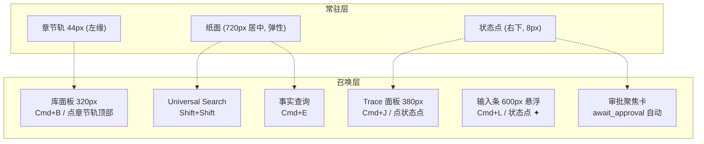

# design/01 — 主界面:章节轨 · 纸面 · 状态点

> 原型:`design/prototypes/01-main-layout.html` · 上游:[plan/07 协作与三模式](../plan/07-collaboration-and-modes.md) · [plan/05 故事世界(边写边查)](../plan/05-story-world.md) · [spec/10 编辑器与交互](../spec/10-editor-and-interaction.md)(布局契约 2026-06-11 修订,以本篇为主权)

设计立场:**简约、素雅、克制**。常驻屏幕的只有三样——左缘章节轨、正文纸面、右下状态点;库、对话、trace、审批、调试全部召唤式,`Esc` 即走。层级靠留白与发丝线(1px 边),不靠色块与投影;不引入任何文化符号装饰;除状态点运行态的缓慢呼吸外,没有循环动画,全部过渡只用 120/200ms 的淡入与小位移。

## 布局骨架

推开式面板用 `react-resizable-panels`(纸面让位不被遮挡);输入条与审批卡是悬浮层。各区尺寸见上图与下文各节;快捷键以 [spec/10](../spec/10-editor-and-interaction.md) 为准。

## 视觉分层(双主题)

| 区域 | 表面 | 说明 |
|---|---|---|
| 窗口底 / 章节轨 | `--bg-app` | 安静背景,章节轨无底色、只有右侧 1px `--border` |
| 纸面 | `--bg-surface` | 唯一亮面,左右留白 ≥64px,无投影、无描边(与底的明度差即边界) |
| 库面板 / Trace 面板 | `--bg-app` + 1px `--border` 分界 | 与窗口底同色,靠发丝线分界,不做下沉色块 |
| 输入条 / 审批卡 / 旁注 | `--bg-raised` + 1px `--border` + `--shadow-md` | 悬浮层;阴影只此一处使用 |

## 章节轨(常驻,44px)

- 结构自上而下:库按钮(☰,hover 显「库 Cmd+B」)→ 当前卷各章的章号列(等宽字体,11px)→ 底部 ?(新手指引)与 ⚙(Settings)
- 当前章:章号 `--text-primary` + 左缘 2px accent 短线;其余章号 `--text-tertiary`,hover 变 `--text-secondary` 并浮出章名 tooltip
- 未保存:章号右上一粒 4px accent 点(保存状态唯一常驻信号)
- violation 所在章:章号下一粒 4px danger 点
- 点击章号即切章;拖一个章号到纸面右半 = 对照视图(原型以提示演示)

## 库面板(召唤式,320px)

- 召出:`Cmd+B` / 点库按钮;推开式,纸面右移
- 顶部:纯文字类目行(章节 / 角色 / 世界观 / 大纲),活动类目 `--text-primary` + 底部 2px accent 短线,其余 `--text-secondary`;`Cmd+1~4` 直达(面板收起时先展开)
- 列表:行高 32px,文字 + 右侧弱化元信息(字数/修改时间);活动行左缘 2px accent 线,不做整行底色;`_` 前缀派生文件默认隐藏(Developer Mode 显示并标「派生」,read-only,[spec/11](../spec/11-settings-and-onboarding.md))
- 「最近」置于章节类目顶部一组(替代 Tabs 的多文件心智);空态(新项目):居中衬线短句 +「让 AI 起草第一章」按钮 → 召出输入条并预填
- 库面板只放「能打开的东西」;查询是动作(独立浮层,见下节),偏好是 AI 沉淀的规则(归 Settings)

## Universal Search 与查询浮层

Universal Search 是全局对象搜索,查询浮层是结构化事实查询,二者都属于召唤层,但服务不同意图。

### Universal Search(`Shift+Shift`)

- 召出:`Shift+Shift`;再按 `Shift+Shift` 或 `Esc` 收回;IME composition、模态 focus trap、文本拖拽中不触发
- 形态:屏幕上 1/4 处居中 720px(`--bg-raised` + 1px 边 + `--shadow-md`):单行输入 → 左侧分组结果(角色 / 阵营 / 概念 / 章节 / 可能相关)→ 右侧 hover preview
- 结果行:名称 + 类型 + 来源状态 + 一行摘要;`Enter` 打开,`Cmd+Enter` 对照打开,`Tab` 在类型 filter 间循环
- hover preview:角色展示阵营/状态/关系/最近出现;阵营展示成员/敌对关系;概念展示规则/代价/风险;章节展示命中 snippet
- 与 spec 对齐:行为主权见 [spec/12 Universal Search](../spec/12-universal-search.md);本篇只定交互形态和视觉层级

### 查询浮层(`Cmd+E`)

queryFacts 是动词不是文件,独立成一键浮层:

- 召出:`Cmd+E`;再按 `Cmd+E` 或 `Esc` 收回(同键互换);框选浮动条的「查询」= 召出并预填选区文字
- 形态:屏幕上 1/4 处居中 560px(`--bg-raised` + 1px 边 + `--shadow-md`):查询输入 → 四类型纯文字 tab(entity-at / relations / mentions / semantic,**`Tab` 键循环互换**,IME 不抢键)→ 等宽结果行(可点击跳转来源章节)
- 结果行点击 → 关浮层并跳到对应位置;`Enter` 执行查询
- 与命令面板的分工:`Shift+Shift` 搜一切、`Cmd+P` 打开文件、`Cmd+Shift+P` 执行命令、`Cmd+E` 问事实([design/06](./06-command-palette.md))

## 偏好(learnings)的去处

不在主界面常驻:查看与编辑都在 **Settings §风格定制**(learnings 列表:权重 + 条目 + 来源 turn,[design/04](./04-settings.md));Reflector 新沉淀一条偏好时,在 Trace 面板的 Reflector 块内联展示,点击可跳 Settings 对应条目。

## 纸面

- 正文 16px / 行距 1.8 / 段距 0.9em;首行不缩进;最大行宽 720px 居中;章题衬线 22px 在纸内,其上 12px 弱化卷名一行
- 左下微标(纸面外左下角,11px 等宽,`--text-tertiary`,hover 升为 `--text-secondary`):`3,214 字 · 已保存 01:12 · ⚠ 1`;点 ⚠ 跳段
- **实体高亮**:1.5px 下划线按 category 着色(角色蓝 / 地点绿 / 物品橙 / 组织紫);hover 100ms 在**纸面右缘浮出旁注**(190px:名称 + 类别 + 两行摘要 +「打开 →」),与所在段落顶对齐,左缘 2px 实体色线;移开 200ms 收回;点击右侧对照打开,`Cmd+Click` 全屏;F12/Shift+F12/F2 见 [spec/10](../spec/10-editor-and-interaction.md)
- **concept violation**:红色虚线下划线,hover 旁注红色语义(「此世界不存在」+ 建议改写);汇总 = 左下 ⚠ 微标 + 滚动条 marker;无段落 gutter 图标(见 [spec/10](../spec/10-editor-and-interaction.md))
- **框选浮动条**:选区上方 8px:「✦ 让 AI 修改 (Cmd+K)」「查询」;发丝线边框,无投影放大

## 状态点(常驻)与 Trace 面板(召唤)

一粒 8px 的点,固定右下角 20px;一句话在点左侧浮现(12px,`--text-secondary`),四态:

| 态 | 点 | 旁文 | 点击 |
|---|---|---|---|
| 空闲 | `--text-tertiary` | 无;hover 浮现「✦ 对话 Cmd+L」 | 召出输入条 |
| 运行中 | `--accent`,2.4s 透明度呼吸(全应用唯一循环动效;`prefers-reduced-motion` 下静止) | 「Writer 正在生成 diff · 12s」+ 进度 `3/5 · 毒舌读者` + 取消 | 展开 Trace 面板 |
| 待审批 | `--accent`,静止 | 「1 个修改待审批 — 查看」(`--accent-text`) | 弹审批聚焦卡 |
| 错误 | `--danger` | 「连接失败 · 去 Settings 检查 key」 | 直达 Settings §API Keys |

Trace 面板(`Cmd+J` / 点状态点,380px 推开式):头部 = 本 turn 成本与 token 量(等宽 11px)+「复制 trace」「折叠全部」;主体按 agent 分块——agent 名 + 耗时一行,工具调用行等宽可展开 JSON,reasoning 默认一句摘要(Developer Mode 展开全文);块间发丝线分隔,不做卡片底色。

## 输入条(召唤式)

- 召出:`Cmd+L` / 状态点 hover ✦ / 空态按钮。底部居中 600px,距底 24px,`--bg-raised` + 1px 边 + `--shadow-md`,圆角 `--radius-lg`
- 结构:textarea(多行,`@` 引用,`Cmd+↑/↓` 历史)→ 底行:mode 三段纯文字(活动项 `--text-primary` + 底部 2px accent 短线;`Tab` 循环,IME composition 不抢键)+ 右侧「发送 ⌘↵」
- 发送后自动收回,进度与取消移交状态点;右上 pin 可改常驻(记忆选择)
- `await_approval`:召出即整条灰显 + 一行说明「完成或取消上方审批后才能继续输入」
- 恢复 banner(仅 in-flight turn):条顶一行「继续审 / 取消本次对话」

## 审批聚焦卡

- `await_approval` 时自动浮出:纸面中央,540px,`--bg-overlay` 轻遮罩(纸面隐约可见)
- 结构:标题行(动作摘要 + 路径等宽小字)→ diff 块 → cascade 提示行(影响数 + 「去整批审 →」[design/02](./02-approval-cascade.md))→ 操作行:同意(primary)/ 编辑后同意 / 拒绝(danger ghost),`Y/E/N` 直达
- 关闭(×/`Esc`)= 暂不处理:卡收回,状态点保持待审批态;不等同拒绝

## 状态矩阵

| 状态 | 表现 |
|---|---|
| 项目加载中 | 纸面骨架屏(段落灰条);状态点旁「正在打开项目…」 |
| 无打开文件 | 纸面空态:衬线一句「从库里打开一章,或让 AI 开始」+「✦ 让 AI 起草」 |
| 流式生成中 | 状态点呼吸;Trace 面板若开启则滚动;输入条未 pin 已收回 |
| await_approval | 审批卡浮出;状态点静止 accent;输入条锁定 |
| 断网 / key 失效 | 状态点 danger + 旁文;输入条顶部一行「连接失败,去 Settings 检查 key」 |

## 动效清单(全集)

| 动效 | 时长 | 触发 |
|---|---|---|
| 面板推开 / 收回 | 200ms ease-out | 库 / Trace |
| 悬浮层淡入 + 8px 上移 | 160ms | 输入条 / 旁注 / 审批卡 |
| 状态点呼吸(透明度 1→0.45) | 2.4s 循环 | 仅运行中;reduced-motion 下静止 |
| 主题切换 | 200ms | 背景/文字色过渡 |

此外没有任何动画:无涟漪、无弹跳、无视差、无骨架闪光(骨架屏为静态灰条)。

## 主题切换细节

- 表面明度顺序两主题一致:bg-app < bg-surface(浅色)/ bg-app < bg-surface(深色反向),纸面始终最亮
- 实体下划线与 agent 色深色主题提亮一档(见 [00-design-tokens](./00-design-tokens.md#领域色open-novel-特有))
- 切换只变 CSS 变量,正文不重排不闪烁

## 框选修改流程

框选浮动条的「✦ 让 AI 修改」从选中到落稿走同一条审批链:

- 点击(或选区内 `Cmd+K`)→ 召出输入条,预填 `[选中文字] 修改要求:___`,光标停在要求处
- 发送后输入条照常收回,进度交状态点;Writer 产出新版后浮出审批聚焦卡,diff 块即选区的前后对照
- 同意 = 原位替换选区;编辑后同意 = 以改后文本替换;拒绝 / 关闭 = 纸面一字不动,选区保留(关闭仍保持待审批,不等同拒绝,同 §审批聚焦卡)

## 实体右键与全项目改名

- 在高亮实体上右键:纯文字三项菜单——「打开定义 F12」「查看引用 ⇧F12」「全项目改名 F2」;发丝线边框,与框选浮动条同一形态
- 「打开定义」与点击一致 = 右侧对照打开;「查看引用」= 跳到该实体文件的反链区块(见下节)
- **全项目改名(F2 / 右键)**:弹一行输入(预填当前名、全选);确认后不直接写盘——按引用索引找出全项目所有出现位置,生成整批 diff 走审批,逐文件展示,可整批同意或逐条处理([design/02](./02-approval-cascade.md))

## 反链:被这些章节引用

- 打开角色 / 地点等设定文件时,正文之后(纸面内底部)出现一个弱化区块「被 N 处引用」:每条 = 章节名 + 命中处前后约 30 字的 snippet,样式同库面板列表行
- 点击一条 → 跳到该章对应位置(对照打开,当前设定文件不关,不丢上下文)
- 引用数据随章节保存在后台更新,不打断书写(数据与索引时机见 [spec/10](../spec/10-editor-and-interaction.md))

## 开放问题

- 章节轨在长卷(>40 章)下的折叠策略(当前卷展开 + 其余卷折叠为卷标记)待 W6 实测
- 旁注在窄窗(纸面右缘不足 200px)时的降级:贴段落下方还是回浮层卡,实测后定
- 输入条默认 pin 与否、状态点旁文信息密度 → W6 真实任务实测
- 02-06 文档与原型待按本契约同步(见 TODO)
