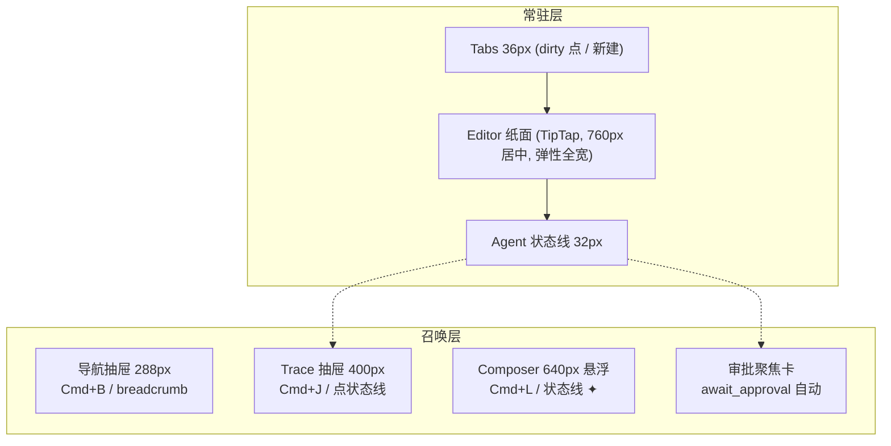

# design/01 — 主界面:纸面 + 召唤式表面

> 原型:`design/prototypes/01-main-layout.html` · 上游:[plan/07 UI 布局](../plan/07-ui-layout.md)(2026-06-11 写作优先修订,ADR-01/04) · [plan/03 编辑器分层](../plan/03-editor-layer.md) · [spec/05 实体高亮](../spec/05-entity-highlight.md)

设计立场:默认界面只有三层常驻——Tabs、纸面、agent 状态线。其余一切(导航、对话、trace、审批、调试)是召唤式表面,`Esc` 即走。注意力法则见 [plan/07 §注意力法则](../plan/07-ui-layout.md#注意力法则)。

## 布局骨架

推开式抽屉用 `react-resizable-panels`(纸面让位不被遮挡);Composer 与审批卡是悬浮层。尺寸与快捷键见 [plan/07 §区块尺寸](../plan/07-ui-layout.md#区块尺寸--可调整)。

## 视觉分层(双主题)

| 区域 | 表面 | 说明 |
|---|---|---|
| 窗口底 / Tabs / 状态线 | `--bg-app` | 安静的背景层,弱化存在感 |
| Editor | `--bg-surface` | 唯一"纸面",左右留白 ≥48px |
| 导航抽屉 / Trace 抽屉 | `--bg-sunken` | 工具区下沉,与纸面拉开层次 |
| Composer / 审批卡 / hover 卡 | `--bg-raised` + `--shadow-lg` | 悬浮层;深色主题用更亮一档表面色而非加白蒙层 |

## Tabs

- 高 36px;活动 tab:`--bg-surface` 底 + 顶部 2px accent 条;非活动:透明底 + hover `--bg-hover`
- dirty 状态:文件名右侧 6px 圆点(`--accent`),即保存状态的唯一常驻信号;hover 时变关闭 ×
- 预览模式(单击打开):标签名*斜体*,被下一次单击复用;双击转永久
- 拖拽 tab 至编辑区右半 → split view(Goto Definition 的右栏打开走同一机制)
- 中键关闭 / `Cmd+W` / `Cmd+Shift+T`,完整见 [spec/12 §Tabs 上下文](../spec/12-shortcuts.md#tabs-上下文-顶部标签栏)

## 导航抽屉(类目列 + FileTree)

- 默认收起。召出:`Cmd+B`、点击 breadcrumb 路径段(直达对应类目)、`Cmd+1~5`
- 左缘 48px 类目图标列(原 ActivityBar 并入):图标 24px 线性,选中态左缘 2px accent 条 + 图标 `--text-primary`;高频项直出(大纲 / 角色 / 世界观 / 章节 / 查询),低频折叠进「更多设定」;底部固定 📚 新手指引与 ⚙ Settings
- 文件树行高 28px,缩进 12px/级;活动文件 `--bg-active` + accent 左条;dirty 圆点同 Tabs
- `_` 前缀派生文件默认隐藏;Developer Mode 显示并标 `badge-neutral「派生」`,仍 read-only([spec/13 §Section 8](../spec/13-settings.md#section-8-developer-mode--全局))
- 非文件类目的树区形态:**查询面板** = 查询输入 + 四类型 chip(entity-at / relations / mentions / semantic)+ 结果行(等宽);**已学偏好** = learnings 列表(权重徽标 + 条目文字),编辑入口在 Settings §风格定制
- 底部固定入口直接跳转:📚 新手指引 → Onboarding([design/05](./05-onboarding.md)),⚙ → SettingsDialog([design/04](./04-settings.md));`Cmd+1~5` 切类目,抽屉收起时先自动展开
- 空态(新项目无章节):树区居中衬线短句 +「让 AI 起草第一章」按钮 → 召出 Composer 并预填
- 抽屉打开不抢焦点;再次 `Cmd+B` 或 `Esc`(焦点在抽屉内时)收回

## Editor

- 正文 16px / 行距 1.8 / 段距 0.8em;首行不缩进(网文导出习惯);最大行宽 760px 居中
- 顶部细行(28px,`--bg-app`):breadcrumb `章节 / 第 12 章 · 雨夜来客.md`(路径段可点 → 导航抽屉)+ 右侧实时字数(全章 + 选区)
- **实体高亮**:1.5px 下划线,颜色按 category(角色蓝 / 地点绿 / 物品橙 / 组织紫);hover 100ms 出卡片(头像缩写 + canonical 名 + 别名 + 80 字摘要 +「打开 →」),移开 200ms 消失;点击右侧 split 打开,`Cmd+Click` 全屏;F12/Shift+F12/F2 见 [spec/12 §Editor 上下文](../spec/12-shortcuts.md#editor-上下文-tiptap-焦点内)
- **concept violation**:红色虚线下划线 + hover 卡红色语义(「⛔ 此世界不存在」+ 建议改写);汇总信号 = 状态线 ⚠ 计数(点击跳段)+ 滚动条 marker;**不做常驻段落 gutter 图标**(降噪,见 [spec/05 §Concept Violation](../spec/05-entity-highlight.md#concept-violation-实时提示-w7-w9-落地))
- **框选浮动条**:选区上方 8px 浮出「✦ 让 AI 修改 (Cmd+K)」「查询」;选区折行时贴选区首行
- 无底部状态栏:mode 徽标在状态线与 Composer;token 用量在 Trace 抽屉头部与 Settings §数据管理

## Agent 状态线

AI 过程的唯一常驻出口。32px,`--bg-app` 底 + 顶部 1px `--border`,内容 12px:

| 态 | 左侧 | 右侧 | 点击 |
|---|---|---|---|
| 空闲 | 项目名 · mode 徽标(discuss 灰 / plan 蓝 / write 绿)· ⚠ n(如有 violation) | ✦ 对话按钮 | ⚠ 跳段;✦ 召出 Composer |
| 运行中 | agent 色点(脉冲)+ 一句话「Writer 正在生成 diff · 12s」+ 长任务进度 `3/5 · 毒舌读者` | 「取消」ghost 钮 | 展开 Trace 抽屉 |
| 待审批 | 整线升起 `--accent-subtle` 底:「1 个修改待审批 · 查看」 | — | 弹审批聚焦卡 |
| 错误 | `--danger`:「连接失败 · 去 Settings 检查 key」 | — | 直达 Settings §API Keys |

- 同屏只显示一句话:多 agent 并行时取最新事件,完整并行视图在 Trace 抽屉
- 运行中 → 待审批的切换用 200ms 底色过渡,不弹跳

## Trace 抽屉(原 ThinkingPanel)

- 右侧推开式 400px;召出:`Cmd+J` / 点状态线运行态
- 头部:本 turn 成本与 token 用量 · 「复制 trace」「折叠全部」
- 按 agent 分块:块头 = agent 色点 + 名称 + 耗时;reasoning 默认**一句摘要**,Developer Mode 展开全文
- 工具调用行:`readSetting('characters/lin.md') → 1234 字`,可展开完整 JSON;等宽字体
- 流式期间块头右侧脉冲圆点(`--agent-*` 色);完成后变灰勾

## Composer(召唤式对话输入)

- 召出:`Cmd+L` / 状态线 ✦ / 空态按钮。底部居中 640px 悬浮卡(`--bg-raised` + `--shadow-lg` + `--radius-xl`),距底 24px
- 结构:mode 三段 toggle(选中段 `--bg-surface` 底 + 600 字重 + mode 色文字)→ textarea(多行,`@` 引用,`Cmd+↑/↓` 翻历史)→ 提示行(Tab 切模式 · Cmd+Enter 发送 · Esc 收回)
- `Tab` 循环 mode(IME composition 不抢键);切换 toast「已切到 plan 模式」
- 发送后自动收回,进度与取消移交状态线;右上角 pin 钮可改为常驻(写入本地偏好)
- `await_approval`:召出即整卡灰显 + tooltip「完成或取消上方审批后才能继续输入」;mode toggle 同步锁定
- 恢复 banner(仅 in-flight turn):卡顶细条「继续审 / 取消本次对话」

## 审批聚焦卡

- `await_approval` 时自动浮出:纸面中央偏下,560px,`--bg-overlay` 轻遮罩(纸面仍隐约可见,不全黑)
- 卡片内容与交互完全复用 [design/02](./02-approval-cascade.md);`Y/N/E` 快捷键直达
- 关闭(暂不处理)→ 卡收回,状态线保持「待审批」升起态;`Esc` 等同关闭不等同拒绝

## 状态矩阵

| 状态 | 表现 |
|---|---|
| 项目加载中 | 纸面骨架屏(段落灰条);状态线「正在打开项目…」 |
| 无打开文件 | 纸面空态:衬线「从左侧打开一章,或让 AI 开始」+ 快捷键速查卡 +「✦ 让 AI 起草」按钮 |
| 流式生成中 | 状态线运行态;Trace 抽屉若开启则滚动;Composer 若未 pin 已收回 |
| await_approval | 审批聚焦卡浮出;状态线升起;Composer 锁定 |
| 断网 / API key 失效 | 状态线错误态 + toast;Composer 顶部条「连接失败,去 Settings 检查 key」 |

## 主题切换细节

- 三表面在两主题中保持同样的明度顺序:sunken < app < surface — 保证"纸面最亮/最突出"心智不变
- 实体下划线与 agent 色在深色主题整体提亮一档(见 [00-design-tokens](./00-design-tokens.md#领域色open-novel-特有))
- 主题切换动画:背景/文字 200ms 过渡;编辑器内容不闪烁(只变 CSS 变量)

## 开放问题

- 类目图标列最终取舍(直出/折叠)按 plan/07 约定 W6 实测后调
- split view 与 Trace 抽屉的宽度争抢策略:原型按"split 优先压缩 Editor,不动抽屉"演示,实测后定
- Composer 默认 pin 与否、状态线一句话的信息密度(是否带进度数字)→ W6 用真实任务实测
- 02-06 号原型与文档仍按旧五区语境写作,待下一轮同步(见 TODO)
