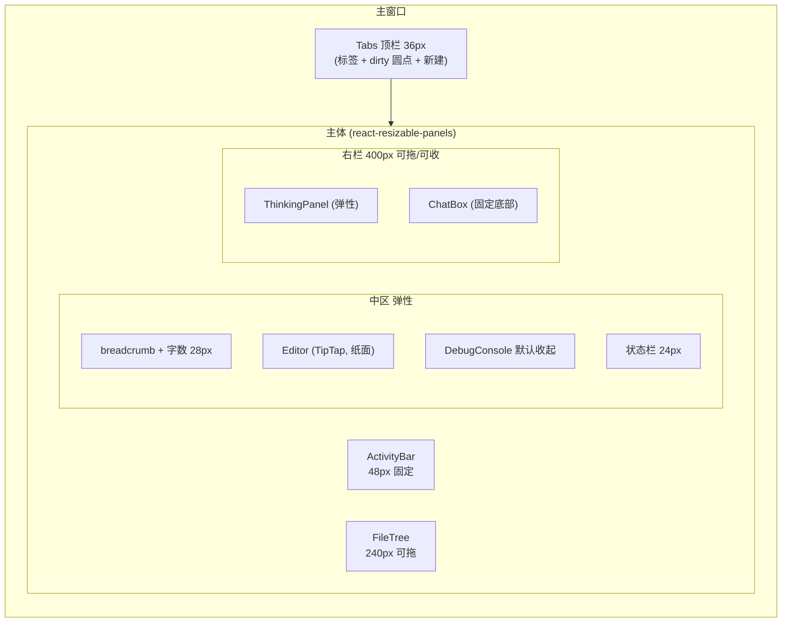
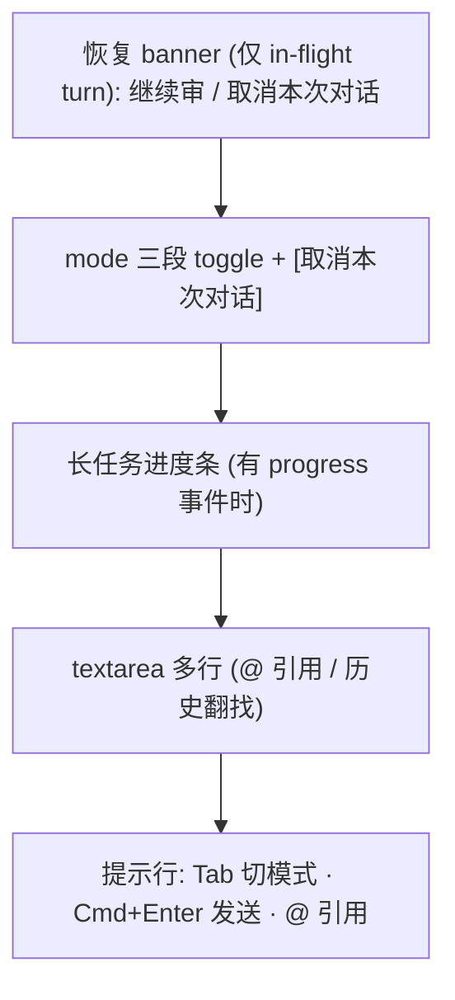

# design/01 — 主界面五区布局

> 原型:`design/prototypes/01-main-layout.html` · 上游:[plan/07 UI 布局](../plan/07-ui-layout.md) · [plan/03 编辑器分层](../plan/03-editor-layer.md) · [spec/05 实体高亮](../spec/05-entity-highlight.md)

## 布局骨架

尺寸与折叠快捷键沿用 [plan/07 §区块尺寸](../plan/07-ui-layout.md#区块尺寸--可调整):FileTree `Cmd+B`、右栏 `Cmd+J`、Console `` Cmd+` ``。

## 视觉分层(双主题)

| 区域 | 表面 | 说明 |
|---|---|---|
| ActivityBar + FileTree + 右栏 | `--bg-sunken` | 工具区下沉,与纸面拉开层次 |
| Editor | `--bg-surface` | 唯一"纸面",浅色为纯白、深色为 `#30302E`,左右留白 ≥48px |
| Tabs / 状态栏 | `--bg-app` | 与窗口底同色,弱化存在感 |
| 浮层(hover 卡 / 浮动按钮) | `--bg-raised` + `--shadow-md` | 深色主题用更亮一档的表面色而非加白蒙层 |

## Tabs

- 高 36px;活动 tab:`--bg-surface` 底 + 顶部 2px accent 条;非活动:透明底 + hover `--bg-hover`
- dirty 状态:文件名右侧 6px 圆点(`--accent`);hover 时变关闭 ×
- 预览模式(单击打开):标签名*斜体*,被下一次单击复用;双击转永久
- 拖拽 tab 至编辑区右半 → split view(Goto Definition 的右栏打开走同一机制)
- 中键关闭 / `Cmd+W` 关闭 / `Cmd+Shift+T` 重开,完整见 [spec/12 §Tabs 上下文](../spec/12-shortcuts.md#tabs-上下文-顶部标签栏)

## ActivityBar + FileTree

- 图标 24px 线性风格,选中态:左侧 2px accent 竖条 + 图标变 `--text-primary`;未选中 `--text-secondary`
- 高频项直出:大纲 / 角色 / 世界观 / 章节 / 查询 / 偏好;低频折叠进"更多设定"([plan/07 §ActivityBar 项目](../plan/07-ui-layout.md#activitybar-项目));底部固定 📚 新手指引与 ⚙ Settings
- FileTree 行高 28px,缩进 12px/级;活动文件 `--bg-active` + accent 左条;dirty 文件名旁同款圆点
- `_` 前缀派生文件默认隐藏;Developer Mode 开启后显示并标 `badge-neutral「派生」`,仍 read-only([spec/13 §Section 8](../spec/13-settings.md#section-8-developer-mode--全局))
- 空态(新项目无章节):树区居中衬线短句 +「让 AI 起草第一章」按钮 → 聚焦 ChatBox 并预填

## Editor

- 正文 16px / 行距 1.8 / 段距 0.8em;首行不缩进(网文导出习惯);最大行宽 760px 居中
- breadcrumb:`章节 / 第 12 章 · 雨夜来客.md`,右侧实时字数(全章 + 当前选区)
- **实体高亮**:1.5px 下划线,颜色按 category(角色蓝 / 地点绿 / 物品橙 / 组织紫);hover 100ms 出卡片(头像缩写 + canonical 名 + 别名 + 80 字摘要 +「打开 →」),移开 200ms 消失;点击右栏 split 打开,`Cmd+Click` 全屏,F12/Shift+F12/F2 见 [spec/12 §Editor 上下文](../spec/12-shortcuts.md#editor-上下文-tiptap-焦点内)
- **concept violation**:红色虚线下划线 + 段落左缘 ⚠;hover 卡片红色语义(「⛔ 此世界不存在」+ 建议改写),见 [spec/05 §Concept Violation](../spec/05-entity-highlight.md#concept-violation-实时提示-w7-w9-落地)
- **框选浮动条**:选区上方 8px 浮出「✦ 让 AI 修改 (Cmd+K)」「查询」;选区折行时贴选区首行
- 状态栏:项目名 · mode 徽标(discuss 灰 / plan 蓝 / write 橙)· 本月 token 用量 · 最近保存时间;violation 计数(红色,点击跳段落)

## ThinkingPanel

- 按 agent 分块:块头 = agent 色点 + 名称 + 耗时;reasoning 默认**一句摘要**,Developer Mode 展开全文
- 工具调用行:`readSetting('characters/lin.md') → 1234 字`,可展开完整 JSON;等宽字体
- 流式期间块头右侧脉冲圆点(`--agent-*` 色);完成后变灰勾
- 顶部右侧:「复制 trace」「折叠全部」;面板可整体收起(`Cmd+J` 与右栏一致)

## ChatBox

- mode toggle:三段控件,选中段 `--bg-surface` 底 + 600 字重 + mode 色文字;`Tab` 循环 / `Shift+Tab` 反向(IME composition 时不抢键);切换瞬间 toast「已切到 plan 模式」
- `await_approval`:整个输入区 disabled 灰显,tooltip「完成或取消上方审批后才能继续输入」;mode toggle 同步锁定
- 发送 `Cmd+Enter`;流式中发送钮变「取消 (Esc)」;`Cmd+↑/↓` 翻历史(仅空输入框)
- 进度条:细 4px,accent 填充 + 右侧文字「3/5 · 毒舌读者 · 4.5s」;取消保留已完成 persona([plan/07 §长任务进度条](../plan/07-ui-layout.md#长任务进度条))

## DebugConsole

- 默认收起为 28px 条(`Logs · Network · Errors` 计数);`` Cmd+` `` 展开至 240px,可拖
- Network 行:模型 · token in/out · 成本估算 · 耗时;Errors 行可展开 stack;Developer Mode 下默认展开

## 状态矩阵

| 状态 | 表现 |
|---|---|
| 项目加载中 | 编辑区骨架屏(段落灰条),FileTree shimmer |
| 无打开文件 | 编辑区空态:衬线「从左侧打开一章,或让 AI 开始」+ 快捷键速查卡 |
| 流式生成中 | ThinkingPanel 滚动,ChatBox 发送钮 → 取消,状态栏 mode 徽标脉冲 |
| await_approval | ChatBox 锁定;审批卡浮于 ThinkingPanel 区(见 [design/02](./02-approval-cascade.md)) |
| 断网 / API key 失效 | 状态栏红点 + toast,ChatBox 顶部条「连接失败,去 Settings 检查 key」 |

## 主题切换细节

- 三表面(app/sunken/surface)在两主题中保持同样的明度顺序:sunken < app < surface(浅色)与 sunken < app < surface(深色,数值反向)— 保证"纸面最亮/最突出"心智不变
- 实体下划线与 agent 色在深色主题整体提亮一档(见 [00-design-tokens](./00-design-tokens.md#领域色open-novel-特有)),避免暗底上发闷
- 主题切换动画:背景/文字 200ms 过渡;编辑器内容不闪烁(只变 CSS 变量)

## 开放问题

- ActivityBar 最终取舍(哪些直出/哪些进"更多")按 plan/07 约定 W6 实测后调
- split view 与右栏 Panel 的宽度争抢策略:原型按"split 优先压缩 Editor,不动右栏"演示,实测后定
