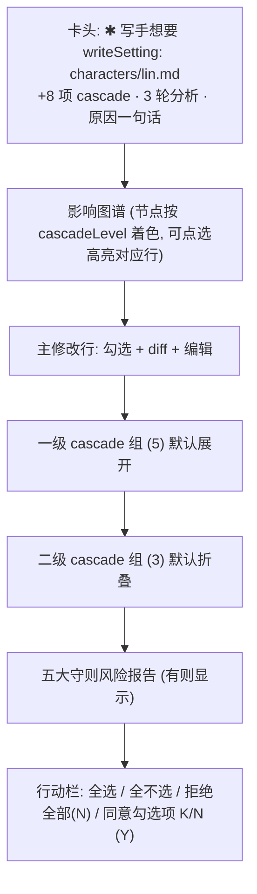

# design/02 — ApprovalCard 审批与 Cascade

> 原型:`design/prototypes/02-approval-cascade.html` · 上游:[plan/07 协作与三模式](../plan/07-collaboration-and-modes.md) · [plan/08 审批与连带修改](../plan/08-approval-and-cascade.md) · [spec/S04 Turn 编排](../spec/S04-turn-orchestration.md) · [spec/S12 创作质量](../spec/S12-creative-engine.md)

整个 ChangeSet(主修改 + 1~3 级 cascade)在**一张卡**里一次审完;这是产品最重的交互,层级必须一眼可读:**发生了什么 → 波及多大 → 有什么风险 → 我怎么决定**。

## 信息架构

## 卡片定位与出现

- 出现在主界面的召唤式审批层:状态点进入待审批态,纸面中央浮出 540-600px 审批卡,背景使用轻遮罩,纸面仍隐约可见;这一路径服从 [design/01 §审批聚焦卡](./01-main-layout.md#审批聚焦卡)
- 大批量 ChangeSet 可把卡片加宽到 600px 并允许内部滚动,但不改成右侧常驻旁注;跨文档变更的完整裁决只在审批层处理
- 入场:160ms 淡入 + 8px 上移;同时输入条进入 disabled 态(见 [design/01 §输入条](./01-main-layout.md#输入条召唤式))
- 多审批排队:卡头右上 `badge-accent「还有 N 条待审」`,`Cmd+]` / `Cmd+[` 切换;一次只显示一张(按 createdAt)
- `×` / `Esc` = 暂不处理:卡片收回,状态点保持待审批,输入条仍锁定;拒绝必须走行动栏的必填反馈
- 取消入口不放在审批卡内常驻。运行态取消跟随状态点;跨进程恢复或返回待审批时,输入条恢复 banner 提供“继续审 / 取消本次对话”入口。全局 cancel plan 与 forward-only 修正语义以 [spec/S04](../spec/S04-turn-orchestration.md) 为准

## ChangeRow(每条变更行)

| 元素 | 规则 |
|---|---|
| 勾选框 | high/medium 置信默认勾,low 默认不勾;主修改默认勾 |
| 标题 | `outline.md § a3f2c8d1`(文件 + anchor 短 id,等宽) |
| 置信徽标 | 高=success / 中=warning / 低=neutral,**文字 + 色**双信号 |
| 原因 | 一行次要文字,溢出省略,hover 全文 |
| diff | 行级:删除行 `--diff-del-*`、新增行 `--diff-add-*`,等宽 12.5px;默认显示 ±3 行上下文,可展开 |
| 编辑 | 「编辑」进入 inline textarea(预填 proposedText),保存即把该条标记为 `edited`(徽标提示),纳入 approve payload 的 `edits{}` |

不勾选 = **搁置**:不落盘,后续一致性守护者 会再发现([plan/08 §勾选语义](../plan/08-approval-and-cascade.md#勾选语义))。原型中未勾行整体降透明度 0.55,使"将落盘集合"一眼可辨。

## Cascade 分组

- 按 cascadeLevel 1/2/3 分组折叠;组头:`一级 cascade(5)` + 组内已勾计数 + 展开箭头
- 一级默认展开;二三级默认折叠(组头露出已勾计数即可)
- 影响图谱与行联动:hover 图谱节点 → 对应行高亮;反之亦然
- 大批量(>20 项)时组内虚拟滚动,组头加「只看未勾 / 只看低置信」过滤([spec/S04](../spec/S04-turn-orchestration.md))

## 五大守则风险报告

渲染规则源自 [spec/S04 Turn 编排](../spec/S04-turn-orchestration.md):

| 等级 | 视觉 | 行为 |
|---|---|---|
| 阻断级 | 左侧 2px danger 线 + danger 文本 + 极浅底 | **同意按钮完全禁用**,只能拒绝或修改;文案指引先解决承诺、事实或守则冲突 |
| 确认级 | 左侧 2px warning 线 + 极浅底 | 必须勾「我已阅读上述风险,明知风险仍通过」才解锁同意 |
| 提示级 | 细下划线 / 弱提示行 | 提示,不阻塞 |

每条风险可点击 → 跳对应章节段(anchor 跳转,与实体跳转同机制)。write 模式章节类工具时,此区域上方再嵌 ReaderPanel 章节风险报告(见 [design/03](./03-reader-panel.md))。

## 对照审批

审批中查看上下文不关闭审批,也不把中央卡片留在正文上方挡住阅读。点击风险、ChangeRow 路径或「跳对应章节段」时进入对照审批:

- 审批卡折叠为底部审定条,显示审批摘要、已勾选计数、风险状态和「返回审批卡」。底部条不遮挡当前段落,不承载完整 diff。
- 主纸面打开命中章节段;原审批卡的完整内容保留在待审状态,不会因为跳转而丢失勾选、编辑草稿或拒绝反馈草稿。
- 对照阅读期间只允许只读跳转、搜索和 Trace 查看;任何会改变作品的动作仍被待审锁拦住。
- 点击「返回审批卡」、状态点待审批文案或底部条本身,回到完整 ApprovalCard,并恢复先前滚动位置和勾选状态。
- 若从 ReaderPanel 风险行进入,底部条追加「来自 ReaderPanel」来源 chip;返回后该风险行保持选中。

这一路径与 [design/01 §对照视图](./01-main-layout.md#对照视图) 共用双 pane 心智,但审批主权仍属于 ApprovalCard。

## 行动栏

- 右对齐主次序:`全选` `全不选`(ghost)→ `拒绝全部 (N)`(danger 描边)→ `同意勾选项 7/9 (Y)`(primary)
- 同意按钮 disabled 条件:勾选数 = 0,或存在未确认「确认级」风险,或存在「阻断级」风险
- **拒绝必填反馈**:点拒绝弹 inline 反馈框(textarea + 「为什么拒绝?」占位 + 示例),提交后自动发一条输入条消息驱动 Agent 重做([plan/08 §否决要给理由](../plan/08-approval-and-cascade.md#否决要给理由))
- 键盘(卡片焦点内,[spec/S14](../spec/S14-editor-and-interaction.md)):`Y` 同意 / `N` 展开拒绝反馈 / `E` 编辑后同意 / `Cmd+Shift+A` cascade 全选同意;inline 编辑中 `Esc` 先取消编辑,否则收回卡片并保持 pending。卡片自动出现后的 600ms 忽略 `Y/E/N`;确认级未勾确认或阻断级存在时 `Y` 不生效。

## 状态矩阵

| 状态 | 表现 |
|---|---|
| cascade 分析中(卡未弹) | 状态点显示运行态,Trace 面板记录「影响分析 第 2/3 轮」 |
| 卡片待决 | 输入条锁定;状态点显示待审批;卡片可收回但 pending 不消失 |
| 提交中(resolve 请求) | 行动栏按钮 loading,勾选框锁定;幂等 — 重复点击不重复落盘 |
| 同意完成 | 卡片折叠为一行回执:「已落盘 7/9 项 · 可在审批历史生成修正提案」+ 240ms 渐出 |
| 拒绝完成 | 卡片折叠为回执「已拒绝,反馈已发给写手」,新一轮生成开始 |
| 跨进程恢复 | 启动时 hydrate,输入条恢复 banner「有 1 条待审的修改」点击重开卡片 |
| doom-loop 升级 | 卡头替换为 warning 块「写手与一致性守护者 连续 3 轮未收敛」+「采纳当前版 / 全部放弃」([spec/S04](../spec/S04-turn-orchestration.md)) |

## 主题适配

- diff 红绿在两主题各自配浅底深字(见 [00-design-tokens](./00-design-tokens.md#领域色open-novel-特有)),不用纯红纯绿
- 确认级/阻断级只使用左侧细线、弱底和文字色,不做大面积高饱和红
- 影响图谱节点描边色 = cascadeLevel(0 accent / 1 info / 2 warning / 3 neutral),两主题同名 token 自动适配
