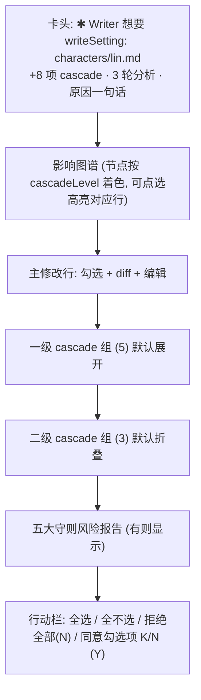

# design/02 — ApprovalCard 审批与 Cascade

> 原型:`design/prototypes/02-approval-cascade.html` · 上游:[plan/05 三模式与审批流](../plan/05-modes-and-approval.md) · [spec/06 审批流](../spec/06-approval-flow.md) · [spec/25 五大守则](../spec/25-cardinal-rules.md)

整个 ChangeSet(主修改 + 1~3 级 cascade)在**一张卡**里一次审完;这是产品最重的交互,层级必须一眼可读:**发生了什么 → 波及多大 → 有什么风险 → 我怎么决定**。

## 信息架构

## 卡片定位与出现

- 出现在右栏 ThinkingPanel 区域顶部,宽度撑满右栏;右栏被收起时自动展开右栏
- 入场:240ms 上浮 + 渐显;同时 ChatBox 进入 disabled 态(见 [design/01](./01-main-layout.md#chatbox))
- 多审批排队:卡头右上 `badge-accent「还有 N 条待审」`,`Cmd+]` / `Cmd+[` 切换;一次只显示一张(按 createdAt)
- chat 顶部常驻 **[取消本次对话]**,直到 turn 终态;已有落盘 action 时按钮文案带计数「取消并回退 2 项」([spec/06 §Turn 取消语义](../spec/06-approval-flow.md#turn-取消语义-chat-box-顶部-取消本次对话-按钮))

## ChangeRow(每条变更行)

| 元素 | 规则 |
|---|---|
| 勾选框 | high/medium 置信默认勾,low 默认不勾;主修改默认勾 |
| 标题 | `outline.md § a3f2c8d1`(文件 + anchor 短 id,等宽) |
| 置信徽标 | 高=success / 中=warning / 低=neutral,**文字 + 色**双信号 |
| 原因 | 一行次要文字,溢出省略,hover 全文 |
| diff | 行级:删除行 `--diff-del-*`、新增行 `--diff-add-*`,等宽 12.5px;默认显示 ±3 行上下文,可展开 |
| 编辑 | 「编辑」进入 inline textarea(预填 proposedText),保存即把该条标记为 `edited`(徽标提示),纳入 approve payload 的 `edits{}` |

不勾选 = **搁置**:不落盘,后续 Validator 会再发现([plan/05 §Cascade 审批](../plan/05-modes-and-approval.md#cascade-审批整批审))。原型中未勾行整体降透明度 0.55,使"将落盘集合"一眼可辨。

## Cascade 分组

- 按 cascadeLevel 1/2/3 分组折叠;组头:`一级 cascade(5)` + 组内已勾计数 + 展开箭头
- 一级默认展开;二三级默认折叠(组头露出已勾计数即可)
- 影响图谱与行联动:hover 图谱节点 → 对应行高亮;反之亦然
- 大批量(>20 项)时组内虚拟滚动,组头加「只看未勾 / 只看低置信」过滤([spec/06 §Cascade 大批量审](../spec/06-approval-flow.md#cascade-大批量审-新增))

## 五大守则风险报告

渲染规则源自 [spec/06 §ApprovalCard 组件](../spec/06-approval-flow.md#approvalcard-组件-整批审w9-升级):

| 等级 | 视觉 | 行为 |
|---|---|---|
| blocking | danger 实底色块 | **同意按钮完全禁用**,只能拒绝;文案指引先解决 promise / 调 deadline |
| critical | danger 浅底块 | 必须勾「我已阅读上述风险,明知违反仍通过」才解锁同意 |
| major | warning 浅底块 | 提示,不阻塞 |
| warn | 橙色弱提示行 | 提示,不阻塞 |

每条风险可点击 → 跳对应章节段(anchor 跳转,与实体跳转同机制)。write 模式章节类工具时,此区域上方再嵌 ReaderPanel 章节风险报告(见 [design/03](./03-reader-panel.md))。

## 行动栏

- 右对齐主次序:`全选` `全不选`(ghost)→ `拒绝全部 (N)`(danger 描边)→ `同意勾选项 7/9 (Y)`(primary)
- 同意按钮 disabled 条件:勾选数 = 0,或存在未确认 critical,或存在 blocking
- **拒绝必填反馈**:点拒绝弹 inline 反馈框(textarea + 「为什么拒绝?」占位 + 示例),提交后自动发一条 ChatBox 消息驱动 Agent 重做([plan/05 §拒绝反馈环](../plan/05-modes-and-approval.md#拒绝反馈环))
- 键盘(卡片焦点内,[spec/12 §ApprovalCard 上下文](../spec/12-shortcuts.md#approvalcard-上下文-浮层焦点内)):`Y` 同意 / `N` 拒绝 / `E` 编辑后同意 / `Cmd+Shift+A` cascade 全选同意;`Esc` 不关卡(无悬挂超时,永远 pending),只取消 inline 编辑

## 状态矩阵

| 状态 | 表现 |
|---|---|
| cascade 分析中(卡未弹) | ChatBox 进度条「影响分析 第 2/3 轮」;ThinkingPanel 滚动 |
| 卡片待决 | ChatBox 锁定;状态栏 mode 徽标旁 ⏸「待审批」 |
| 提交中(resolve 请求) | 行动栏按钮 loading,勾选框锁定;幂等 — 重复点击不重复落盘 |
| 同意完成 | 卡片折叠为一行回执:「已落盘 7/9 项 · 撤销入口在 审批历史」+ 240ms 渐出 |
| 拒绝完成 | 卡片折叠为回执「已拒绝,反馈已发给 Writer」,新一轮生成开始 |
| 跨进程恢复 | 启动时 hydrate,chat 顶部 banner「有 1 条待审的修改」点击重开卡片 |
| doom-loop 升级 | 卡头替换为 warning 块「Writer 与 Validator 连续 3 轮未收敛」+「采纳当前版 / 全部放弃」([spec/06 §doom-loop](../spec/06-approval-flow.md#validator-writer-doom-loop-检测-借鉴-opencode-processorts351-374)) |

## 主题适配

- diff 红绿在两主题各自配浅底深字(见 [00-design-tokens](./00-design-tokens.md#领域色open-novel-特有)),不用纯红纯绿
- critical/blocking 色块深色主题用 `--danger-subtle`(暗红底)+ `--danger` 文字,不做大面积高饱和红
- 影响图谱节点描边色 = cascadeLevel(0 accent / 1 info / 2 warning / 3 neutral),两主题同名 token 自动适配
