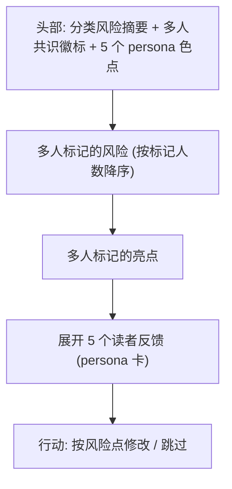

# design/03 — ReaderPanel 章节风险报告

> 原型:`design/prototypes/03-reader-panel.html` · 上游:[plan/09 叙事诊断与读者预演](../plan/09-narrative-and-reader.md) · [spec/S12 创作质量](../spec/S12-creative-engine.md)

5 个 persona(追更党 / 逻辑控 / 情感党 / 毒舌读者 / 潜水大佬)并行读一章,聚合成一份**发布前风险预演报告**。报告可嵌入写作审批卡,也可从命令面板独立触发后以 ReaderPanel 报告面板打开。

独立入口有两类:「运行 ReaderPanel」针对当前章节或选区发起预演;「打开最近 ReaderPanel 报告」只打开已有报告。若当前没有可读章节、章节过短或没有最近报告,入口展示空态和恢复动作,不伪造报告。

## 报告信息架构

## 头部

- **分类风险摘要**:不用 0-100 总分,改为「可发布 / 小修 / 重做建议 / 证据不足」四类状态;状态旁列出最主要的 1-2 个风险类别
- **共识徽标**:显示「3/5 人标记节奏风险」「4/5 人认为钩子有效」这类多人共识,不显示排名或预测分
- persona 色点行:5 个 12px 圆点(成功=实心 `reader_panel` 色系,失败=空心),hover 显示 persona 名与状态

## 风险 / 亮点行

| 元素 | 规则 |
|---|---|
| 计数徽标 | 「3/5 标」,≥3 人标记 = danger/success 强调,2 人 = 弱化 |
| 类型 chip | 风险:毒点 / 坑 / 突兀 / AI 味(danger 系);亮点:爽点 / 钩子 / 亮点(success 系) |
| 描述 | 一行原因 + 段落定位「第 5-7 段」,点击跳编辑器对应段(anchor 同款跳转) |
| severity | 风险行左缘 2px 条:high=danger / mid=warning / low=neutral |

排序:标记人数 desc → severity desc。各最多直出 4 行,更多收进「全部 N 条」。

## Persona 反馈卡(展开区)

- 折叠头:「展开 5 个读者反馈」+ 各 persona 缩略 sentiment(↑+62 / ↓-35)
- 每卡:persona 名 + 一句人设(如「毒舌读者 · 专挑 AI 味」)、分类信号(情绪倾向 / 追更意愿 / 弃书风险高低,不用总分)、`naturalLanguageReaction` 全文(像真实读者评论,引用排版:左缘 3px persona 色条 + 衬线斜体)
- highlights / warnings 以 chip 列表附在评论下,点击同样跳段
- 自定义 persona 卡右上角 `badge-neutral「自定义」`;编辑入口跳 Settings §读者仿真器

## 进行态(长任务)

- 触发后状态点旁显示进度:「ReaderPanel · 3/5 · 毒舌读者 · 4.5s」([plan/07 §长任务体验](../plan/07-collaboration-and-modes.md#长任务体验))
- 报告区先以骨架卡占位,每个 persona 完成即点亮其色点并填入缩略 sentiment
- 取消:已完成 persona 保留;<3 成功 → 头部显示 `insufficient`,不出分类建议,提供「补跑失败的 2 个」按钮

## 状态矩阵

| 状态 | 表现 |
|---|---|
| 全部成功 | 完整报告 |
| 部分失败(≥3 成功) | 正常聚合;失败 persona 色点空心 + tooltip 错误摘要 + 单个重跑 |
| <3 成功 | `insufficient` 徽标,只列已完成反馈,无分类建议 |
| 章节过短(<800 字) | 空态:「章节太短,读者还没进入状态」+ 继续写作引导 |
| 嵌在 ApprovalCard 内 | 报告作为卡内一个 section,行动钮「按风险点修改」= 拒绝 + 预填反馈 |

「按风险点修改」预填内容 = 已勾选风险行的 reason 列表,进入拒绝反馈环([design/02 §行动栏](./02-approval-cascade.md#行动栏))。

## 主题适配

- 留存环底环用 `--border`,深色下不发灰;数值与徽标用语义色 token 自动适配
- persona 评论引用块底色 `--bg-sunken`,深色主题下与卡面层次保持(sunken 比 surface 暗)
- 风险/亮点 chip 全部「浅底 + 深字」配对,禁止实底高饱和大色块
