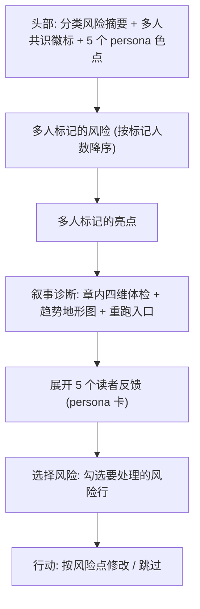

# design/03 — ReaderPanel 章节风险报告

> 原型:`design/prototypes/03-reader-panel.html` · 上游:[plan/09 叙事诊断与读者预演](../plan/09-narrative-and-reader.md) · [spec/S12 创作质量](../spec/S12-creative-engine.md)

5 个 persona(追更党 / 逻辑控 / 情感党 / 毒舌读者 / 潜水大佬)并行读一章,聚合成一份**发布前风险预演报告**。报告可嵌入写作审批卡,也可从命令面板独立触发后以 ReaderPanel 报告面板打开。

独立入口有两类:「运行 ReaderPanel」针对当前章节或选区发起预演;「打开最近 ReaderPanel 报告」只打开已有报告。若当前没有可读章节、章节过短或没有最近报告,入口展示空态和恢复动作,不伪造报告。

## 报告信息架构

## 头部

- **分类风险摘要**:不用 0-100 总分,也不输出发布结论;改为「风险低 / 需留意 / 风险集中 / 证据不足」四类信号;状态旁列出最主要的 1-2 个风险类别
- **共识徽标**:显示「3/5 人标记节奏风险」「4/5 人认为钩子有效」这类多人共识,不显示排名或预测分
- persona 色点行:5 个 12px 圆点(成功=实心,失败=空心),每个点内放首字/短码(追/逻/情/毒/潜)作为非颜色识别;hover 显示 persona 名与状态
- persona 近邻色:5 个读者使用同一低饱和邻近色带,只表示“读者来源”,不表示情绪好坏或风险等级;风险/亮点仍由 danger/success/warning chip 表达

## 风险 / 亮点行

| 元素 | 规则 |
|---|---|
| 计数徽标 | 「3/5 标」,≥3 人标记 = danger/success 强调,2 人 = 弱化 |
| 类型 chip | 风险:毒点 / 坑 / 突兀 / AI 味(danger 系);亮点:爽点 / 钩子 / 亮点(success 系) |
| 描述 | 一行原因 + 段落定位「第 5-7 段」,点击跳编辑器对应段(anchor 同款跳转) |
| severity | 风险行左缘 2px 条:high=danger / mid=warning / low=neutral |
| 选择框 | 只出现在风险行;默认勾选 ≥3 人标记或 high severity 的风险,亮点不可勾选 |

排序:标记人数 desc → severity desc。各最多直出 4 行,更多收进「全部 N 条」。

## 叙事诊断区块

叙事诊断是 ReaderPanel 报告里的结构化体检层,用于回答「这一章在爽点、情绪、因果和悬念上哪里变弱」。它不替代 5 个 persona 的真实读者反应,也不输出发布结论;它给出可见证据、历史对照和可重跑入口,供作者决定是否修改。

### 章内四维体检

| 维度 | 可见内容 | 操作 |
|---|---|---|
| 爽点密度 | 标出本章爽点峰值、空窗段和过密段,用「充足 / 偏稀 / 过密 / 证据不足」描述 | 点击段落定位到编辑器;可只重跑爽点维度 |
| 情绪推进 | 显示情绪从铺垫到爆发再到回落的曲线,点名断崖或无效拉扯 | 点击异常点定位相关段落;可只重跑情绪维度 |
| 因果链 | 列出关键动作是否有前置原因和后续结果,缺口写成人能读懂的句子 | 对单个缺口发起修改提案,或只重跑因果维度 |
| 悬念钩子 | 检查章尾钩子、伏笔承接和下章牵引是否成立 | 点击钩子节点定位章末;可只重跑悬念维度 |

四维体检不使用 0-100 总分。每维只展示状态、最强证据、最弱证据和 1 个默认建议,避免把诊断伪装成机器评分。

### 趋势地形图 / 历史快照

- 趋势地形图横向展示最近章节,纵向压缩为四个维度的带状地形;高点表示该维度证据更密,低谷表示章内空窗或读者感知下降。
- 当前章节用竖线标记;hover 或点击某章显示当时四维状态、主要异常和保存时间。
- 历史快照默认保留最近一次通过审批前诊断、最近一次手动诊断和最近一次重跑结果;快照只做对照,不覆盖当前报告。
- 当旧章被重跑后,地形图新增一个快照点并标注「重跑」,作者可以对比「旧快照」和「新诊断」,但不自动改写历史结论。

### 旧章重跑与单维度重跑

- 「重跑本章诊断」重新生成四维体检、趋势点和快照,保留旧快照作为对照。
- 「旧章重跑」入口出现在历史快照和地形图 tooltip 里,用于对任意旧章按当前 BeatAnalyzer 规则重新诊断。
- 每个维度行都有「只重跑此维度」入口;重跑时其他维度保持原结果,状态标注为「部分刷新」。
- 重跑中的维度显示细粒度进行态,完成后只替换该维度的证据、建议和地形图对应带状点。

### inconclusive / 需人工判断态

诊断无法得出可靠判断时,该维度显示 `inconclusive` 或「需人工判断」,而不是给出弱证据结论。常见原因包括章节过短、上下文缺失、旧章被大幅改写、伏笔依赖未纳入当前项目记忆、模型输出互相冲突。

表现规则:

- 单维度 inconclusive:该维度显示灰色状态、原因、人工确认入口和「只重跑此维度」按钮;其他维度照常展示。
- 多维度 inconclusive:诊断区头部显示「需人工判断」,趋势地形图弱化当前章节高低判断,只保留历史快照。
- 若 BeatAnalyzer 判断需要人工裁决,行动栏提供「标记为接受当前节奏」和「记录为待改问题」两个出口;系统不自动创建修改任务。

## Persona 反馈卡(展开区)

- 折叠头:「展开 5 个读者反馈」+ 各 persona 缩略 sentiment(↑+62 / ↓-35)
- 每卡:persona 名 + 一句人设(如「毒舌读者 · 专挑 AI 味」)、分类信号(情绪倾向 / 追更意愿 / 弃书风险高低,不用总分)、`naturalLanguageReaction` 全文(像真实读者评论,引用排版:左缘 3px persona 色条 + 衬线斜体)
- persona 首字 badge 与卡片左缘色条保持一致,用于跨 header、折叠头、卡片和趋势图快速对上同一个读者;颜色不能单独承载状态
- highlights / warnings 以 chip 列表附在评论下,点击同样跳段
- 自定义 persona 卡右上角 `badge-neutral「自定义」`;编辑入口跳 Settings §读者仿真器

## 进行态(长任务)

- 触发后状态点旁显示进度:「ReaderPanel · 3/5 · 毒舌读者 · 4.5s」([plan/07 §长任务体验](../plan/07-collaboration-and-modes.md#长任务体验))
- 报告区先以骨架卡占位,每个 persona 完成即点亮其色点并填入缩略 sentiment
- 取消:已完成 persona 保留;<3 成功 → 头部显示 `insufficient`,不出分类建议,提供「补跑失败的 2 个」按钮

## 状态矩阵

| 状态 | 表现 |
|---|---|
| 全部成功 | 完整报告 |
| 部分失败(≥3 成功) | 正常聚合;失败 persona 色点空心 + tooltip 错误摘要 + 单个重跑 |
| <3 成功 | `insufficient` 徽标,只列已完成反馈,无分类建议 |
| 章节过短(<800 字) | 空态:「章节太短,读者还没进入状态」+ 继续写作引导 |
| 嵌在 ApprovalCard 内 | 报告作为卡内一个 section,行动钮「按风险点修改」= 将已勾风险转入拒绝反馈 |

「按风险点修改」有两条出路:

- 嵌在 ApprovalCard 内:已勾风险行的 reason、段落位置和 persona 共识转入拒绝反馈框,提交后进入拒绝反馈环([design/02 §行动栏](./02-approval-cascade.md#行动栏))。
- 独立 ReaderPanel 报告面板:已勾风险行转成润色清单预填项,发起一次 Humanizer 修改提案;每个预填项保留来源段落,生成结果仍需审定。

未勾风险只保留在报告里,不会进入反馈或润色清单。若没有勾选风险,「按风险点修改」禁用。

## 主题适配

- 风险摘要徽标用 `--border` 和语义色 token 自动适配,不使用留存环、分数环或预测图形
- persona 评论引用块底色 `--bg-sunken`,深色主题下与卡面层次保持(sunken 比 surface 暗)
- 风险/亮点 chip 全部「浅底 + 深字」配对,禁止实底高饱和大色块
