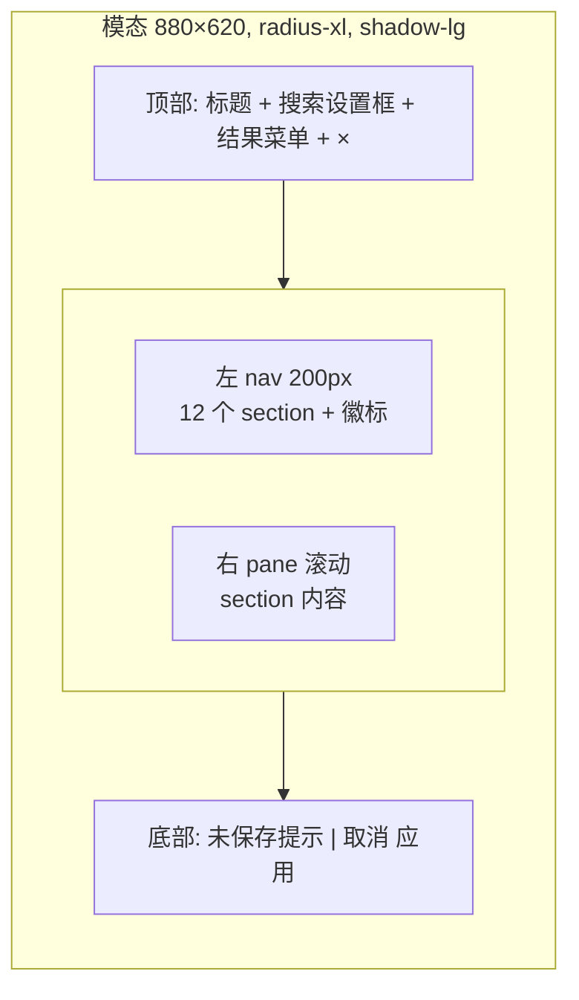

# design/04 — SettingsDialog

> 原型:`design/prototypes/04-settings.html` · 上游:[spec/S15 Settings 与 Onboarding](../spec/S15-settings-and-onboarding.md)(字段与路由契约以 spec 为准,本文只定交互与视觉)

## 结构

- 遮罩 `--bg-overlay`,点击遮罩 = 取消(有 dirty 时先弹「放弃未保存修改?」)
- `Cmd+,` 打开;`Esc` 关闭(同上 dirty 拦截);Focus Trap 圈在弹窗内

## 左 nav 与作用域徽标

| Section | 徽标 |
|---|---|
| 1 Workspace + 项目 | 🌐+📂 |
| 2 API Keys + 用量 | 🌐 |
| 3 Agents | 🔄 |
| 4 ReaderPanel + Persona | 📂 |
| 5 Rules | 📂 |
| 6 Memory | 📂 |
| 7 快捷键 | 🌐 |
| 8 风格定制 | 📂 |
| 9 外部研究 | 🌐(非目标说明,整项灰显 + 「不提供」徽标) |
| 10 数据管理 | 🌐+📂 |
| 11 Developer Mode | 🌐 |
| 12 关于 | 🌐 |

- nav 行:图标 + 名称 + 右侧徽标;选中态 `--bg-active` + accent 左条;dirty section 名称旁 accent 圆点
- 徽标语义在右 pane 顶部重复一次并配说明条:「📂 项目级 — 仅作用于〈重生互联网〉」,混合(🔄)section 在每个可覆盖字段旁显示「全局默认 / 项目覆盖中」切换
- 搜索:fuzzy 匹配 section 名、字段 label、说明文案、Agent 名和 persona 名。输入后保留 nav 结构,搜索框下方弹出最多 6 条结果;点击或按 `Enter` 跳到首条结果,激活对应 section,滚动到字段,并用 accent 边框高亮 2s。空查询回到当前 section,`Esc` 清空搜索;无结果显示「无匹配设置」,不隐藏设置项。

## 关键 section 交互样例

- **Workspace + 项目**:workspace 路径只在通过写权限检查后保存;提供「更换 workspace」「新建项目」入口。更换路径会先列出受影响项目数量和当前 pending approval。
- **API Keys**:masked 输入 + 显隐 toggle +「测试连接」(loading → ✓ 已验证 success / ✗ 失败 danger + 原因);用量指标展示(本月 token 消耗、prompt cache 命中率等只读指标,等宽数字)
- **Agents**:按 canonical role id 展示 7 个角色。每行包含启用开关、干预强度、模型档位、用量占比和「下轮生效」说明;`router` 不可关闭,`validator` 的阻断级一致性不可关闭,`reflector` 关闭只停止新学习并链接到 Memory。项目覆盖开启时该行右侧出现「覆盖中 · 还原」。
- **ReaderPanel + Persona**:ReaderPanel 提供 persona 勾选(爽文读者 / 老书虫 / 平台编辑 / 逻辑洁癖 / 付费追更)、评审深度、报告长度、章末自动评审开关;Assistant Persona 提供语气、详略、主动列选项、提醒强度和称呼输入。该区明确只改变协作表达和读者评审视角,不改变写盘权限、守则阈值或项目事实。
- **Rules**:五大守则按「提示级 / 确认级 / 阻断级」展示阈值与提示方式;用户可降低提示频率、调解释口径、关闭非阻断提示,但阻断级风险仍必须进入审批或拦截。每个规则显示最近一次触发样例和「恢复默认」。
- **Memory**:顶部 Reflector 总开关;经验列表展示文本、来源 turn、作用范围、注入状态、权重 slider、关闭和删除。冲突候选以对照卡展示旧经验 / 新经验 / 来源,用户可选「采用新」「保留旧」「两条都不用」;未确认候选不注入 context。清空经验是危险操作,需选择范围并二次确认。
- **快捷键**:表格(命令 / 默认键 / 当前键 / 重绑按钮);重绑进入捕获态「按下新组合键…」,冲突即时红字提示并禁止保存;`Esc` 退出捕获(不可绑 Esc,[spec/S14](../spec/S14-editor-and-interaction.md))
- **数据管理**:全局区(workspace 路径 / trace 清理 / 本月用量)+ 项目区(改名 / 归档 / 删除);归档只把项目移出日常列表并保持可恢复,不触发自动清除;**危险区域**独立 danger 描边卡,删除/清空/重置走「输入指定字样」二次确认([spec/S15](../spec/S15-settings-and-onboarding.md)),确认按钮在字样完全匹配前 disabled
- **外部研究**:灰显说明本产品不内置联网研究、素材搜索或自动采集;作者可手动把外部材料放入工作区
- **Developer Mode**:单 toggle + 影响清单(派生文件可见 / Debug 面板默认展开 / Trace 全文 / ChangeSet JSON 入口等);开启时 toast「Developer Mode 已开启 (Cmd+Shift+D)」

## Dirty 状态与底部条

- 每 section 独立 dirty;底部左侧汇总:「2 个 section 未保存:API Keys、风格定制」(点击跳转)
- `应用`:仅在有 dirty 时可用,primary;成功后 toast「设置已保存」,失败逐 section 报错不整体回滚

## 状态矩阵

| 状态 | 表现 |
|---|---|
| 首启无 key 被引导打开 | 直接定位 Section 2,顶部 info 条「填入 DeepSeek API Key 后开始」 |
| 搜索命中 ReaderPanel persona | 结果菜单显示「ReaderPanel + Persona / 付费追更 persona」,回车后跳转并高亮 persona 勾选组 |
| 测试连接中 | 按钮 loading,输入锁定 |
| 运行中 turn 修改 Agents | dirty 可保存,右侧说明「下轮生效」;当前 turn 不被静默替换 |
| Memory 冲突候选 | 候选卡进入待确认区,未确认前不注入 context |
| Rules 阻断级被尝试关闭 | switch 复位 + danger inline「阻断级风险不能静默落盘」 |
| 项目归档/删除完成 | 对话框关闭 + toast;若删的是当前项目,回到项目选择页 |

## 主题适配

- 弹窗表面 `--bg-raised`;nav 用 `--bg-sunken` 与右 pane 区分,两主题层次顺序一致
- 危险区域深色主题:`--danger-subtle` 暗红底 + `--danger` 描边,避免大红块刺眼
- Settings 本身提供外观设置(浅色/深色/跟随系统,存全局 settings.json),原型在 Section 8 风格定制顶部以「外观」字段组演示(标注 🌐 全局徽标,切换即时生效);字段归口见 [spec/M14](../spec/M14-settings-and-developer-mode.md) 与 [spec/S15](../spec/S15-settings-and-onboarding.md)
