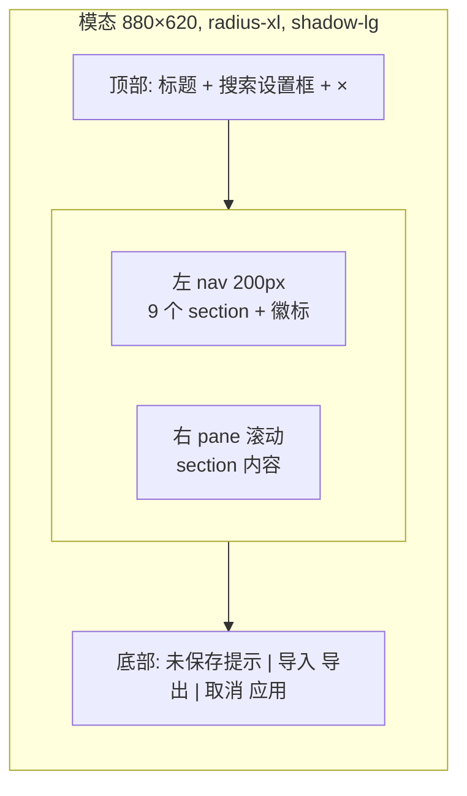

# design/04 — SettingsDialog

> 原型:`design/prototypes/04-settings.html` · 上游:[spec/S15 Settings 与 Onboarding](../spec/S15-settings-and-onboarding.md)(字段与路由契约以 spec 为准,本文只定交互与视觉)

## 结构

- 遮罩 `--bg-overlay`,点击遮罩 = 取消(有 dirty 时先弹「放弃未保存修改?」)
- `Cmd+,` 打开;`Esc` 关闭(同上 dirty 拦截);Focus Trap 圈在弹窗内

## 左 nav 与作用域徽标

| Section | 徽标 |
|---|---|
| 1 API Keys + 预算 | 🌐 |
| 2 模型分配 | 🔄 |
| 3 快捷键 | 🌐 |
| 4 风格定制 | 📂 |
| 5 读者仿真器 + 叙事引擎 | 📂 |
| 6 联网 | 🌐(二期,整项灰显 + 「二期」徽标) |
| 7 数据管理 | 🌐+📂 |
| 8 Developer Mode | 🌐 |
| 9 关于 | 🌐 |

- nav 行:图标 + 名称 + 右侧徽标;选中态 `--bg-active` + accent 左条;dirty section 名称旁 accent 圆点
- 徽标语义在右 pane 顶部重复一次并配说明条:「📂 项目级 — 仅作用于〈重生互联网〉」,混合(🔄)section 在每个可覆盖字段旁显示「全局默认 / 项目覆盖中」切换
- 搜索:fuzzy 匹配 section 名 + 字段 label,结果直接跳转并高亮目标字段 2s

## 关键 section 交互样例

- **API Keys**:masked 输入 + 显隐 toggle +「测试连接」(loading → ✓ 已验证 success / ✗ 失败 danger + 原因);月度预算数字输入 + 当月用量进度条(超 80% warning,超 100% danger + 「已触顶,LLM 调用暂停」说明)
- **模型分配**:每 Agent 一行,`Pro / Flash` 下拉;项目覆盖开启时该行右侧出现「覆盖中 · 还原」
- **快捷键**:表格(命令 / 默认键 / 当前键 / 重绑按钮);重绑进入捕获态「按下新组合键…」,冲突即时红字提示并禁止保存;`Esc` 退出捕获(不可绑 Esc,[spec/S14](../spec/S14-editor-and-interaction.md))
- **数据管理**:全局区(workspace 路径 / trace 清理 / 本月用量)+ 项目区(改名 / 归档 / 导出 zip / 删除);**危险区域**独立 danger 描边卡,删除/清空/重置走「输入指定字样」二次确认([spec/S15](../spec/S15-settings-and-onboarding.md)),确认按钮在字样完全匹配前 disabled
- **Developer Mode**:单 toggle + 影响清单(派生文件可见 / Debug 面板默认展开 / Trace 全文 / ChangeSet JSON 入口等);开启时 toast「Developer Mode 已开启 (Cmd+Shift+D)」

## Dirty 状态与底部条

- 每 section 独立 dirty;底部左侧汇总:「2 个 section 未保存:API Keys、风格定制」(点击跳转)
- `应用`:仅在有 dirty 时可用,primary;成功后 toast「设置已保存」,失败逐 section 报错不整体回滚
- `导出 / 导入`:整体设置 json;导入前弹 diff 预览(新增/覆盖项列表)再确认

## 状态矩阵

| 状态 | 表现 |
|---|---|
| 首启无 key 被引导打开 | 直接定位 Section 1,顶部 info 条「填入 DeepSeek API Key 后开始」 |
| 测试连接中 | 按钮 loading,输入锁定 |
| 预算触顶 | Section 1 顶部 danger 条;状态点同步错误态(见 [design/01 §状态点](./01-main-layout.md#状态点常驻与-trace-面板召唤)) |
| 项目归档/删除完成 | 对话框关闭 + toast;若删的是当前项目,回到项目选择页 |
| 导入 json 校验失败 | danger 条列出非法字段,不应用任何变更 |

## 主题适配

- 弹窗表面 `--bg-raised`;nav 用 `--bg-sunken` 与右 pane 区分,两主题层次顺序一致
- 危险区域深色主题:`--danger-subtle` 暗红底 + `--danger` 描边,避免大红块刺眼
- Settings 本身提供外观设置(浅色/深色/跟随系统,存全局 settings.json),原型在 Section 4 风格定制顶部以「外观」字段组演示(标注 🌐 全局徽标,切换即时生效);产品中的字段落点(归 Section 4 全局组或独立小节)回写 spec/M04 时定
