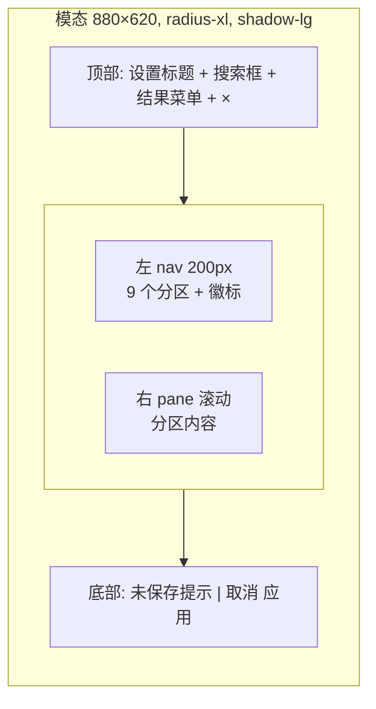

# design/04 — 设置面板

> 原型:`design/prototypes/04-settings.html` · 上游:[spec/M14 Settings](../spec/M14-settings.md)、[spec/M18 Developer Mode](../spec/M18-developer-mode.md)(字段与路由契约以 spec 为准,本文只定交互与视觉)

设置面板只管理当前项目内的创作体验和全局凭据/外观/快捷键。它不管理项目库、项目路径、创建/归档/删除项目,也不提供数据管理页面或背后功能。每次应用启动先进入项目选择/创建页;主界面左上角提供返回项目选择入口。

作者可见 UI 使用中文主标签,不直接暴露 Settings / Workspace / API Keys / Agents / ReaderPanel / Persona / Rules / Memory / context / proposal / dark mode 等英文标签。必要的技术文件名、spec 名称和内部诊断只出现在开发构建的只读说明里。

## 结构

- 遮罩 `--bg-overlay`,点击遮罩 = 取消(有 dirty 时先弹「放弃未保存修改?」)
- `Cmd+,` 打开;`Esc` 关闭(同上 dirty 拦截);Focus Trap 圈在弹窗内
- 搜索匹配分区名、字段 label、说明文案、AI 角色名和读者类型。输入后保留 nav 结构,搜索框下方弹出最多 6 条结果;点击或按 `Enter` 跳到首条结果,激活对应分区,滚动到字段,并用 accent 边框高亮 2s。空查询回到当前分区,`Esc` 清空搜索;无结果显示「无匹配设置」,不隐藏设置项。

## 左 nav 与作用域徽标

| 分区 | 徽标 | 职责 |
|---|---|---|
| 1 连接凭据 | 🌐 | 模型服务凭据与连接测试 |
| 2 外观 | 🌐 | 跟随系统 / 浅色 / 深色、高对比、主题 token 行为 |
| 3 AI 角色 | 🔄 | 七个角色的档位、频率、权重、按需触发配置 |
| 4 读者预演 | 📂 | 模拟读者类型、评审深度、报告长度、章末频率 |
| 5 助理语气 | 📂 | 助理称呼、详略、主动提醒和列选项习惯 |
| 6 创作守则 | 📂 | 五大守则只读展示和必要说明 |
| 7 记忆 | 📂 | 经验可见、权重 0-5、来源和删除 |
| 8 快捷键 | 🌐 | 快捷键查看与重绑 |
| 9 关于 | 🌐 | 版本、文档入口和隐私边界 |

- nav 行:图标 + 名称 + 右侧徽标;选中态 `--bg-active` + accent 左条;dirty section 名称旁 accent 圆点
- 徽标语义在右 pane 顶部重复一次并配说明条:「📂 当前作品 — 仅作用于〈重生互联网〉」,混合(🔄)section 在每个可覆盖字段旁显示「全局默认 / 当前作品覆盖中」切换
- 不显示「数据管理」「项目库」「开发模式」分区。开发构建可在「关于」里显示只读构建标记,但真实用户包没有可开启的 Developer Mode toggle。

## 关键分区交互样例

- **连接凭据**:masked 输入 + 显隐 toggle +「测试连接」(loading → ✓ 已验证 success / ✗ 失败 danger + 原因);用量指标展示(本月消耗、缓存命中率、上下文峰值等只读指标,等宽数字)。字段对作者显示为「连接凭据」,不显示 API Keys。
- **外观**:独立分区,包含跟随系统 / 浅色 / 深色三段控件、提高对比度、字号密度预览和主题说明。设计 token 中的高对比与主题归这里,不混入「风格偏好」。切换即时生效;命令面板可搜「切换深浅外观」。
- **AI 角色**:按 7 个中文角色展示。角色不支持关闭,只能调档、配置、按需触发或调整频率/权重。每行包含干预强度、模型档位、触发频率、权重和「下轮生效」说明;不出现 checkbox / switch。项目覆盖开启时该行右侧出现「覆盖中 · 还原」。
- **读者预演**:只管理模拟读者评审。默认五类读者(追更党 / 逻辑控 / 情感党 / 毒舌读者 / 潜水大佬),可调评审深度、报告长度、章末自动评审频率和按需运行入口。它不承担助理语气设置。
- **助理语气**:独立分区。提供语气、详略、主动列选项、提醒强度和称呼输入。该区只改变协作表达,不改变写盘权限、守则判断或项目事实。
- **创作守则**:只读展示五大守则、风险等级含义、最近一次触发样例和必要说明。删除阈值编辑、提示方式配置、关闭入口和「恢复默认」按钮。阻断级风险仍必须进入审批或拦截,但这里不提供调整。
- **记忆**:顶部说明「默认注入,不提供逐条注入开关」。经验列表展示文本、来源(普通记录 / 证据摘要)、作用范围、权重 0-5 五档和删除按钮。权重描述:0=仅留档不主动影响;1=低影响,只在高度相关时参考;2=轻度参考;3=常规参考;4=强参考,优先影响表达与选择;5=关键偏好,需要明显违背时解释。删除设置面板常驻冲突候选队列;冲突处理只在相关回合或证据面板中上下文展示。
- **快捷键**:表格(命令 / 默认键 / 当前键 / 重绑按钮);重绑进入捕获态「按下新组合键…」,冲突即时红字提示并禁止保存;`Esc` 退出捕获(不可绑 Esc,[spec/S14](../spec/S13-editor-and-interaction.md))
- **关于**:显示版本、数据只在本机、文档入口和当前构建标记。真实用户包不显示开发模式开关;若是 dev build,只显示「开发构建:诊断信息可见」说明,不可在普通设置里开启。

## Dirty 状态与底部条

- 每个分区独立 dirty;底部左侧汇总:「2 个分区未保存:连接凭据、外观」(点击跳转)
- `应用`:仅在有 dirty 时可用,primary;成功后 toast「设置已保存」,失败逐分区报错不整体回滚

## 状态矩阵

| 状态 | 表现 |
|---|---|
| 首启无凭据被引导打开 | 直接定位「连接凭据」,顶部 info 条「填入连接凭据后开始」 |
| 搜索命中读者预演 | 结果菜单显示「读者预演 / 追更党」,回车后跳转并高亮读者类型 |
| 测试连接中 | 按钮 loading,输入锁定 |
| 运行中 turn 修改 AI 角色 | dirty 可保存,右侧说明「下轮生效」;当前 turn 不被静默替换 |
| 记忆权重设为 0 | 行内说明「仅留档,默认不主动影响后续建议」 |
| 创作守则被搜索命中 | 跳到只读说明,不出现关闭、阈值或恢复默认控件 |
| 项目切换需求 | 关闭设置面板,通过主界面左上「返回项目选择」进入项目选择页 |

## 主题适配

- 弹窗表面 `--bg-raised`;nav 用 `--bg-sunken` 与右 pane 区分,两主题层次顺序一致
- 危险或不可改说明用 `--danger-subtle` 暗底 + `--danger` 描边,避免大红块刺眼
- 外观分区是唯一主题入口;风格偏好只处理写作表达、行距、字号密度等创作体验字段
