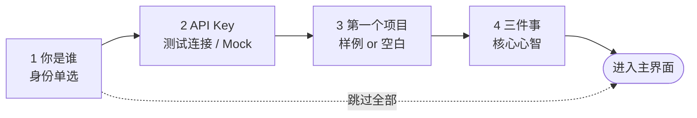

# design/05 — Onboarding 首启引导

> 原型:`design/prototypes/05-onboarding.html` · 上游:[spec/15 首启引导](../spec/15-onboarding.md)

首启 = 品牌时刻:全屏暖纸底 + 居中 560px 卡片,标题用衬线,是整个产品里 Claude Desktop 气质最重的一页。目标 3 分钟进入主界面。

## 向导骨架

- 顶部 4 步进度点(当前 accent 实心,完成小勾,未到空心);步骤间 320ms 横向滑动
- 底部恒定:`上一步`(ghost,step1 隐藏)/ `下一步`(primary)/ 右上角「跳过全部」(tertiary 小字,hover 才升为 secondary — 可跳但不鼓励)
- `Enter` = 下一步,`Esc` 不可关(首启必须走完或显式跳过)

## 各步要点

| 步 | 内容 | 交互细节 |
|---|---|---|
| 1 你是谁 | 标题衬线「欢迎来到 Open Novel」+ 4 张单选卡(番茄老作者 / 想试 AI 写文 / 学生业余 / 直接用) | 单选卡 2×2;仅记录用途说明小字「不影响功能」 |
| 2 API Key | masked 输入 + 「怎么拿 key」info 卡(platform.deepseek.com / 成本预估 / 仅存本地)+ 测试连接 | 测试通过才亮「下一步」;「跳过 — 用 Mock 模式」次级链接,选择后全程黄色「Mock 模式」角标 |
| 3 第一个项目 | 推荐卡「加载样例项目〈重生互联网〉」(badge-accent「推荐 · 5 分钟看懂全流程」,列出含 3 角色 / 第 1 章 / 5 条审批历史)vs 空白表单(项目名 / 流派下拉 / 风格描述 / 故事种子 textarea) | 二选一卡片;选空白时表单就地展开,项目名必填 |
| 4 三件事 | 三张横卡:① 三种模式(Tab 循环)② AI 不会偷偷改文件(审批卡示意)③ 改设定会扫全部章节(cascade 示意) | 每卡配 24px 线性插图;CTA「明白了,开始写吧」primary 大按钮 |

## 渐进式 Tooltip(进入主界面后)

一次性气泡:`--bg-raised` + `--shadow-md` + accent 左条,指向目标控件,「知道了」关闭即写入 `seenTips`,不重复弹([spec/15 §主界面渐进式 Tooltip](../spec/15-onboarding.md#主界面渐进式-tooltip) 五条触发表)。同屏最多 1 条,排队不叠加。重置入口:Settings §数据管理。

## 状态矩阵

| 状态 | 表现 |
|---|---|
| 测试连接失败 | 输入框 danger 描边 + 原因(401 / 网络)+ 「重试」;不阻塞「跳过用 Mock」 |
| 样例解压中 | 推荐卡按钮 loading「正在准备样例…」 |
| 已有 settings 但无 key | 不进向导,直接弹 SettingsDialog §API Keys(见 [design/04](./04-settings.md#状态矩阵)) |
| 有 key 但 workspaces 空 | 只弹 step3 单步版「创建第一个项目」 |
| 向导中途退出(关窗) | 下次启动从 step1 重来(未写 settings.json 即视为未完成) |

## 主题适配

- 向导跟随系统主题;深色下衬线标题用 `--text-primary` 不降级,插图线稿色用 `--text-secondary`
- Mock 模式角标两主题均为 `--warning-subtle` 底 + `--warning` 字
