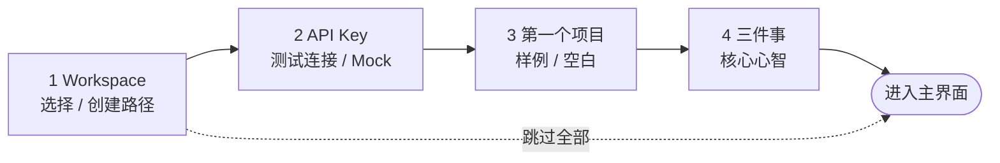

# design/05 — Onboarding 首启引导

> 原型:`design/prototypes/05-onboarding.html` · 上游:[spec/M15 Onboarding 与 New Book](../spec/M15-onboarding-and-new-book.md)

首启 = 品牌时刻:全屏素色底 + 居中 620px 卡片,标题用衬线,是整个产品里书卷气最重的一页。目标 3 分钟进入主界面。首启首先确认 workspace,因为项目事实和权限检查都从这个路径开始。

## 向导骨架

- 顶部 4 步进度点(当前 accent 实心,完成小勾,未到空心);步骤间 320ms 横向滑动
- 底部恒定:`上一步`(ghost,step1 隐藏)/ `下一步`(primary)/ 右上角「跳过全部」(tertiary 小字,hover 才升为 secondary — 可跳但不鼓励)
- `Enter` = 下一步,但只在焦点不在输入控件、非 IME composition、当前步骤校验通过时生效;textarea 内 `Enter` 永远是换行。`Esc` 不可关(首启必须走完或显式跳过)
- 若检测到未完成 onboarding 草稿,首屏顶部出现恢复条:「上次停在第 3 步 · workspace 已验证」,提供「继续」和「重新开始」。继续恢复已通过校验的 workspace/key/mock/project 草稿;重新开始只清 onboarding draft,不删除 workspace 里的项目文件。

## 各步要点

| 步 | 内容 | 交互细节 |
|---|---|---|
| 1 Workspace | 标题衬线「欢迎来到 Open Novel」+ workspace 路径输入 + 3 个快捷选项(默认路径 / 选择文件夹 / 使用最近路径) | 点击「检查权限」后才亮下一步;成功显示可写、剩余空间和现有项目数量;不可写显示 danger 原因和「换一个文件夹」。本步可附带「你是谁」小型单选,但不阻塞路径校验。 |
| 2 API Key | masked 输入 + 「怎么拿 key」info 卡(platform.deepseek.com / 仅存本地)+ 测试连接 | 测试通过才亮「下一步」;「跳过 — 用 Mock 模式」次级链接,选择后全程黄色「Mock 模式」角标 |
| 3 第一个项目 | 两分支:推荐卡「加载样例项目〈重生互联网〉」(badge-accent「推荐 · 5 分钟看懂全流程」),空白表单(项目名 / 流派下拉 / 风格描述 / 故事种子 textarea) | 两选一卡片;选空白时表单就地展开,项目名必填。 |
| 4 三件事 | 三张横卡:① 三种模式(Tab 循环)② AI 不会偷偷改文件(就地审定 / 审批卡示意)③ 改设定会扫全部章节(cascade 示意) | 每卡配 24px 线性插图;CTA「明白了,开始写吧」primary 大按钮 |

## 渐进式 Tooltip(进入主界面后)

一次性气泡:`--bg-raised` + `--shadow-md` + accent 左条,指向目标控件,「知道了」关闭即写入 `seenTips`,不重复弹([spec/M15](../spec/M15-onboarding-and-new-book.md))。同屏最多 1 条,排队不叠加。重置入口:Settings §数据管理。

## 状态矩阵

| 状态 | 表现 |
|---|---|
| workspace 可写 | Step 1 显示 success「可写 · 已发现 2 个项目」,下一步可用 |
| workspace 不可写 | Step 1 danger 条展示权限或空间原因,不创建目录、不写 settings,下一步 disabled |
| 测试连接失败 | 输入框 danger 描边 + 原因(401 / 网络)+ 「重试」;不阻塞「跳过用 Mock」 |
| 样例解压中 | 推荐卡按钮 loading「正在准备样例…」 |
| 已有 settings 但无 key | 不进向导,直接弹 SettingsDialog §API Keys(见 [design/04](./04-settings.md#状态矩阵)) |
| 有 key 但 workspaces 空 | 只弹 step3 单步版「创建第一个项目」 |
| 向导中途退出(关窗) | 下次启动显示恢复条;已通过的 workspace/key/mock 草稿可继续,未完成项目分支不落盘 |

## 主题适配

- 向导跟随系统主题;深色下衬线标题用 `--text-primary` 不降级,插图线稿色用 `--text-secondary`
- Mock 模式角标两主题均为 `--warning-subtle` 底 + `--warning` 字
