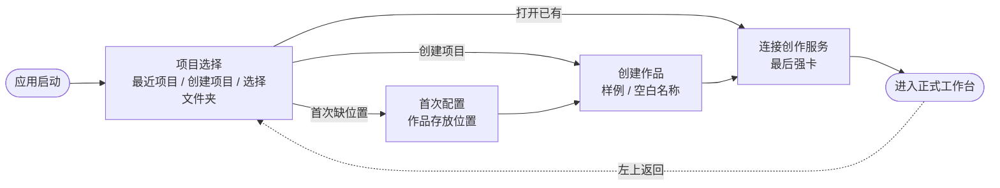

# design/05 — 启动项目选择与首次配置

> 原型:`design/prototypes/05-onboarding.html` · 上游:[spec/M15 Onboarding 与 New Book](../spec/M15-onboarding-and-new-book.md)

每次启动先进入项目选择/创建页,而不是直接进入最近项目或设置面板。目标是让作者明确知道当前打开哪本书,并避免 Settings 承担 Workspace/项目管理职责。主界面左上角始终可返回项目选择。

首次使用时,项目选择页会串起必要配置:选择作品存放位置、创建或打开第一个项目,最后连接创作服务。后续启动只显示项目选择页;连接凭据缺失或失效时,打开目标作品后必须先完成连接创作服务,才能进入正式工作台。

## 启动骨架

- 项目选择页使用全屏素色底 + 居中 760px 容器,标题用衬线,是整个产品里书卷气最重的一页
- 顶部显示「选择作品」,下方列最近项目;每个项目行显示书名、路径尾段、最近修改、未完成审批数量
- 主 CTA 是「创建新作品」,次 CTA 是「打开本地文件夹」。首次无项目时默认展开创建项目卡
- 后续启动不弹设置面板,也不把项目创建/路径切换放入设置面板

## 首次配置步骤

| 步 | 内容 | 交互细节 |
|---|---|---|
| 1 存放位置 | 标题衬线「欢迎来到 Open Novel」+ 路径输入 + 3 个快捷选项(默认路径 / 选择文件夹 / 使用最近路径) | 点击「检查权限」后才亮下一步;成功显示可写、剩余空间和现有项目数量;不可写显示 danger 原因和「换一个文件夹」。 |
| 2 创建作品 | 两分支:推荐卡「加载样例作品〈重生互联网〉」(badge-accent「推荐 · 5 分钟看懂全流程」),空白表单只填作品名 | 两选一卡片;选空白时只展开「作品名」输入,必填。流派、风格和故事种子不在启动向导里询问,进入工作台后用讨论模式聊出来。 |
| 3 连接创作服务 | masked 输入 + 「怎么拿凭据」info 卡(服务商控制台 / 仅存本机)+ 测试连接 | 测试通过才亮「进入工作台」。这是进入正式工作台前的最后强卡,不提供跳过或演示模式绕过。 |

- 顶部 3 步进度点只在首次配置/创建项目流程中出现(当前 accent 实心,完成小勾,未到空心);步骤间 320ms 横向滑动
- 底部恒定:`上一步`(ghost,step1 隐藏)/ `下一步`(primary)。连接创作服务是最后一步强卡;连接成功前不能进入正式工作台,也不提供「跳过全部直接进主界面」。
- `Enter` = 下一步,但只在焦点不在输入控件、非 IME composition、当前步骤校验通过时生效;textarea 内 `Enter` 永远是换行。`Esc` 不关闭启动页。
- 若检测到未完成创建项目草稿,项目选择页顶部出现恢复条:「上次停在创建作品 · 存放位置已验证」,提供「继续」和「重新开始」。继续恢复已通过校验的位置和作品名草稿;重新开始只清本次草稿,不删除已有项目文件。

## 渐进式提示(进入主界面后)

一次性气泡:`--bg-raised` + `--shadow-md` + accent 左条,指向目标控件,「知道了」关闭即写入 `seenTips`,不重复弹([spec/M15](../spec/M15-onboarding-and-new-book.md))。同屏最多 1 条,排队不叠加。三种协作姿态、AI 不会偷偷改文件、改设定会扫全书等说明进入主界面后渐进提示,不挡在连接创作服务之前。提示回看入口放在「关于」分区,不再指向设置面板的数据管理或重置功能。

## 状态矩阵

| 状态 | 表现 |
|---|---|
| 有最近项目 | 启动页列出最近项目,默认高亮上次打开的项目;`Enter` 打开高亮项目并进入连接创作服务强卡 |
| 没有项目 | 启动页直接展开「创建新作品」卡,仍可选择本地文件夹 |
| 存放位置可写 | Step 1 显示 success「可写 · 已发现 2 个项目」,下一步可用 |
| 存放位置不可写 | Step 1 danger 条展示权限或空间原因,不创建目录、不写设置,下一步 disabled |
| 空白作品 | 只要求作品名;流派、风格描述、故事种子都不出现在启动页 |
| 测试连接失败 | 输入框 danger 描边 + 原因(401 / 网络)+「重试」;进入工作台按钮保持 disabled |
| 样例解压中 | 推荐卡按钮 loading「正在准备样例…」 |
| 已有项目但无凭据 | 可以选择项目,但目标作品进入工作台前必须先完成连接创作服务 |
| 向导中途退出(关窗) | 下次启动显示恢复条;已通过的存放位置和作品名草稿可继续,未完成项目分支不落盘 |

## 主题适配

- 启动页跟随系统主题;深色下衬线标题用 `--text-primary` 不降级,插图线稿色用 `--text-secondary`
- 连接创作服务失败提示两主题均使用 `--warning-subtle` 底 + `--warning` 字,但不作为可跳过入口
