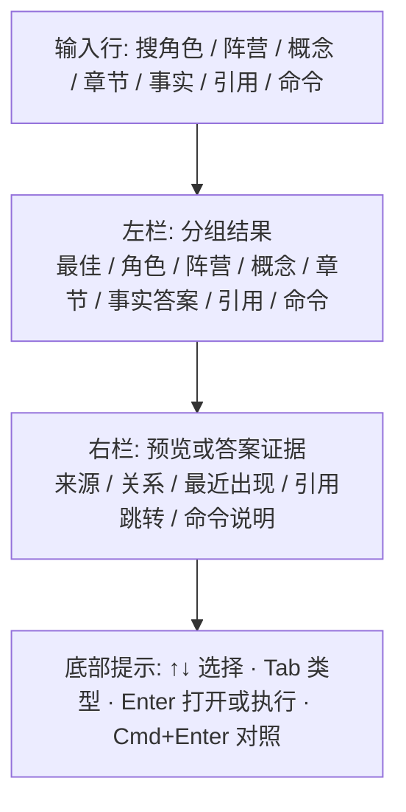
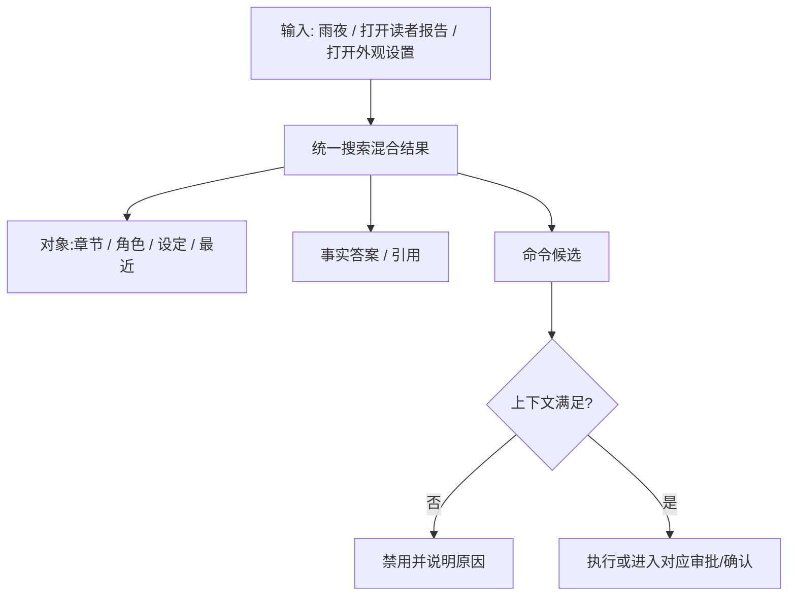
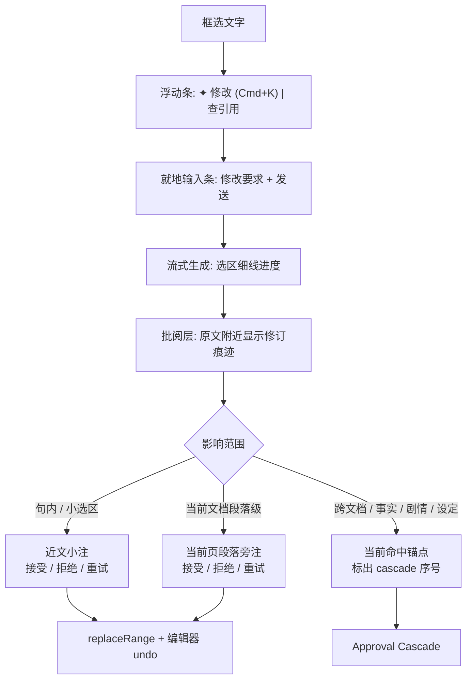

# design/06 — 统一搜索与快捷交互

> 原型:`design/prototypes/06-command-palette.html` · 上游:[spec/S14 编辑器与交互](../spec/S13-editor-and-interaction.md)(命令清单 / 上下文优先级 / IME 闸门以 spec 为准) · [spec/M01 Universal Search](../spec/M01-universal-search.md) · [spec/M02 Command Routing](../spec/M02-command-palette-and-quick-open.md)

本篇收口四个轻浮层交互:统一搜索、@内容引用、框选 AI 改写(Cmd+K)、toast。作者侧只有统一搜索一个顶层搜索/打开/命令入口;不提供独立命令面板、`Cmd+P` 快速打开或 `F1` 命令面板。作者界面不显示文件路径、扩展名或英文主标签。

## 统一搜索(Shift+Shift)

- 行结构:名称或答案摘要 + 类型徽标 + 来源状态 + 一行说明;精确命中优先,低置信语义命中进入「可能相关」并降权。
- hover/focus preview 不只是 tooltip:角色显示阵营/状态/关系/最近出现;阵营显示成员/敌对;概念显示规则/代价/风险;章节显示 snippet;事实答案显示证据摘要和引用跳转;命令显示作用、风险和当前是否可执行。
- `Shift+Shift` 打开/关闭;`Esc` 关闭但不取消 turn;IME composition、模态 focus trap、文本拖拽中不触发。
- `Enter` 打开结果或执行当前可执行命令,`Cmd+Enter` 对章节/角色/设定结果执行对照打开。危险动作只作为入口,必须进入确认或整批审批。
- 作者侧顶层入口只有这个放大镜式入口。事实答案、引用查看、选区查询、最近对象、打开章节和命令候选都作为结果类型或上下文动作进入统一搜索。
- 原型和真实用户包不得出现「全局搜索」和「查询」两个入口,也不得出现独立命令面板 / 快速打开浮层。

## 命令与打开结果

- 打开章节、角色、设定、大纲和最近项都作为对象结果;不使用 `Cmd+P`。
- 命令候选按「打开面板」「运行读者预演」「切换姿态」「设置」等中文分类展示,但分类不是第二层入口。
- `when` 为 false 的命令不出现,或在结果行中禁用并说明原因。
- 审批类命令只能打开待审审批卡或跳到指定连带修改项;不提供「全部同意」直写入口。
- 读者预演命令包含「运行读者预演」和「打开最近读者报告」两类:前者要求当前有可读章节或选区,执行后进入 turn 并显示运行态;后者只打开最近报告,报告缺失时展示空态和运行入口。
- 输入条也可以承接自然语言命令,例如“打开最近读者报告”或“切到规划姿态”。解析后仍走同一套上下文、风险和审批规则。

## @内容引用(输入条内)

- 输入 `@` 100ms 后在光标下方弹 popover(不抢 `@` 字符;IME composition 中不弹)。
- 源:角色、章节、设定卡和大纲,fuzzy;行 = 类目色点 + 名称 + 类型说明,不展示路径。
- `↑↓` 选,`Enter` 确认 → textarea 中 `@xxx` 替换为 mention chip(accent-subtle 底圆角块,含 ×);`Esc` 取消保留字面 `@xxx`。
- chip 发送时由系统转为内部引用契约;作者只看到 `@角色名` 或 `@章节名`([spec/S14](../spec/S13-editor-and-interaction.md))。

## 框选 AI 改写(Cmd+K)

- inline 输入条吸附选区下方:`✦` accent 图标 + 单行输入(占位「怎么改这段?例:语气更克制」)+ 发送;`Esc` 收起。
- 生成期间只保留细线进度与弱化选区,不弹大卡、不遮正文;结果默认进入批阅层。
- 句内、小选区和表达润色用近文小注:细下划线、淡底色、删除线 / 新增线足够表达差异;操作贴在标记附近,接受后才 `replaceRange`。
- 当前文档的段落级问题可以在纸面右缘出现旁注,但它只服务当前页当前段,不承载跨文档裁决。
- 跨文档、跨章节、事实、剧情、设定、关系变更必须升级到整批审批([design/02](./02-approval-cascade.md));当前页仍在命中位置留下轻量锚点或序号 chip,点击打开对应连带修改项。
- 「查引用」分支:选中文字打开统一搜索并预填,结果以「事实答案 / 引用」分组展示,不动正文。

## Toast

- 位置:右上方,距窗口上/右各 24px;同屏最多 3 条堆叠,4s 自动消退,hover 暂停。主界面、读者预演和统一搜索原型共用这一 placement。
- 类型:默认(无图标)/ success ✓ / warning ⚠ / danger ✗;模式切换 toast 带 mode 色点:「已切到规划姿态」。
- 带操作的 toast 只提供查看或前向修正入口,例如「已落盘 7 项 · 查看回执」或「部分失败 · 生成修正提案」;不提供 4 秒内即时撤销,撤销必须进入新的审定动作。
- toast 入场只允许一次 120ms 淡入 + 4px 上移;没有循环动画。进行态反馈使用静态骨架或进度条,不使用闪烁骨架。

## 键盘速查(本篇涉及)

| 键 | 上下文 | 行为 |
|---|---|---|
| `Shift+Shift` | 全局(IME / focus trap 中禁用) | 统一搜索 |
| `Cmd+L` | 全局(IME / focus trap 中禁用) | 输入条 |
| `@` | 输入条 | 内容引用 popover(字面键) |
| `Cmd+K` | Editor 有选区 | inline 改写输入条 |
| `↑↓` / `Enter` / `Esc` | 浮层内 | 选择 / 打开或执行 / 关闭(Esc 硬约束不可重绑) |

## 主题适配

- 浮层在深色主题用 `--bg-raised`(比卡面再亮一档)保证“浮”感;阴影加深由 token 自动处理。
- fuzzy 命中字符:浅色 accent-text、深色 accent-text(已提亮),不用纯 accent 以保对比度。
- mention chip / 虚线选区框深浅主题均走 accent 系 token。
