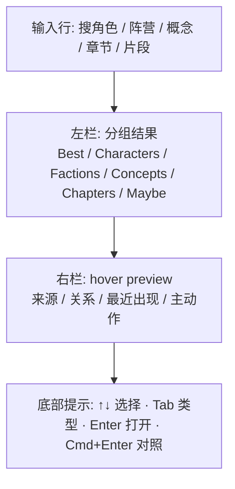
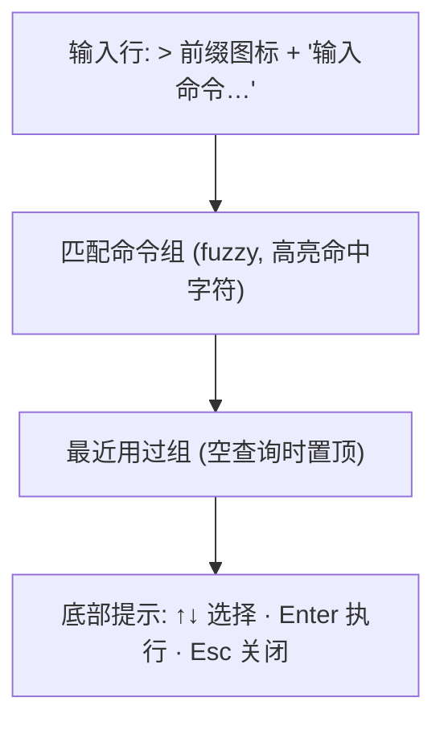

# design/06 — 命令面板与快捷交互

> 原型:`design/prototypes/06-command-palette.html` · 上游:[spec/S14 编辑器与交互](../spec/S14-editor-and-interaction.md)(命令清单 / 上下文优先级 / IME 闸门以 spec 为准) · [spec/M01 Universal Search](../spec/M01-universal-search.md)

本篇收口六个"轻浮层"交互:Universal Search、命令面板、快速打开文件、@文件引用、框选 AI 改写(Cmd+K)、toast。它们共享同一套浮层视觉:`--bg-raised` + `--radius-lg` + `--shadow-lg`,顶部 1/4 处垂直定位,`Esc` 关闭,Focus Trap。

## Universal Search(Shift+Shift)

- 行结构:名称 + 类型徽标 + 来源状态 + 一行摘要;精确命中优先,低置信语义命中进入 Maybe Related 并降权
- hover/focus preview 不只是 tooltip:角色显示阵营/状态/关系/最近出现;阵营显示成员/敌对;概念显示规则/代价/风险;章节显示 snippet
- `Shift+Shift` 打开/关闭;`Esc` 关闭但不取消 turn;IME composition、模态 focus trap、文本拖拽中不触发
- `Enter` 打开,`Cmd+Enter` 对照打开,危险动作(如全项目改名)只作为入口,必须进入 Approval Cascade
- 与相邻入口分工:`Cmd+P` 只打开文件,`Cmd+Shift+P` 执行命令,`Cmd+E` 问事实;完整行为见 [spec/M01](../spec/M01-universal-search.md)

## 命令面板(Cmd+Shift+P / F1)

- 行结构:命令名(命中字符 accent 加粗)+ 右侧 kbd 键帽(有绑定时);category 作前缀「视图: 切换 dark mode」
- `when` 为 false 的命令不出现(如「审批: 打开待审审批卡」仅有 cascade 待审时可见)
- 选中行 `--bg-active` + accent 左条;`↑↓` 循环,`Enter` 执行并关闭,执行后记入「最近用过」
- 空结果:「没有匹配的命令」+ 次行「试试 设置 / 章节 / 导出」
- 危险命令(project.delete 等)行尾 danger 点;执行仍走各自确认闸,面板不直接执行危险动作
- 审批类命令只能打开待审审批卡或跳到指定 cascade 项;命令面板不提供「全部同意」直写入口。若未来保留快捷全同意,也必须先展示完整审批卡并通过二次确认;存在确认级 / 阻断级风险时该快捷动作禁用
- ReaderPanel 命令包含「运行 ReaderPanel」和「打开最近 ReaderPanel 报告」两类:前者要求当前有可读章节或选区,执行后进入 turn 并显示运行态;后者只打开最近报告,报告缺失时展示空态和运行入口

## 快速打开文件(Cmd+P)

- 同壳不同源:搜章节 / 设定文件名 + 路径;行 = 类目图标 + 文件名 + 次要路径
- `Enter` 在当前纸面打开,`Cmd+Enter` 以对照视图打开(与章节轨 / 库面板「最近」心智一致,[design/01 §章节轨](./01-main-layout.md#章节轨常驻44px))
- 输入 `>` 前缀即转命令面板(VSCode 习惯)

## @文件引用(输入条内)

- 输入 `@` 100ms 后在光标下方弹 popover(不抢 `@` 字符;IME composition 中不弹)
- 源:实体 + 章节 + 设定文件,fuzzy;行 = 类目色点 + 名称 + 路径
- `↑↓` 选,`Enter` 确认 → textarea 中 `@xxx` 替换为 mention chip(accent-subtle 底圆角块,含 ×);`Esc` 取消保留字面 `@xxx`
- chip 在发送 prompt 时展开为 `[@角色名](mention://char_xxx)` 契约形态([spec/S14](../spec/S14-editor-and-interaction.md))

## 框选 AI 改写(Cmd+K)

- inline 输入条吸附选区下方:`✦` accent 图标 + 单行输入(占位「怎么改这段?例:语气更克制」)+ 发送;`Esc` 收起
- 生成期间只保留细线进度与弱化选区,不弹大卡、不遮正文;结果默认进入批阅层
- 句内、小选区和表达润色用近文小注:细下划线、淡底色、删除线 / 新增线足够表达差异;操作贴在标记附近,接受后才 `replaceRange`
- 当前文档的段落级问题可以在纸面右缘出现旁注,但它只服务当前页当前段,不承载跨文档裁决
- 跨文档、跨章节、事实、剧情、设定、关系变更必须升级到 Approval Cascade([design/02](./02-approval-cascade.md));当前页仍在命中位置留下轻量锚点或序号 chip,点击打开对应 cascade 项
- 「查询」分支:选中文字直接发 queryFacts,结果在右栏查询面板展示,不动正文

## Toast

- 位置:右栏左缘上方(不遮编辑器正文);同屏最多 3 条堆叠,4s 自动消退,hover 暂停
- 类型:默认(无图标)/ success ✓ / warning ⚠ / danger ✗;模式切换 toast 带 mode 色点:「已切到 plan 模式」
- 带操作的 toast 只提供查看或前向修正入口,例如「已落盘 7 项 · 查看回执」或「部分失败 · 生成修正提案」;不提供 4 秒内即时撤销,撤销必须进入新的审定动作

## 键盘速查(本篇涉及)

| 键 | 上下文 | 行为 |
|---|---|---|
| `Cmd+Shift+P` / `F1` | 全局 | 命令面板 |
| `Cmd+P` | 全局 | 快速打开;输入 `>` 转命令 |
| `Shift+Shift` | 全局(IME / focus trap 中禁用) | Universal Search |
| `@` | 输入条 | 文件引用 popover(字面键) |
| `Cmd+K` | Editor 有选区 | inline 改写输入条 |
| `↑↓` / `Enter` / `Esc` | 浮层内 | 选择 / 执行 / 关闭(Esc 硬约束不可重绑) |

## 主题适配

- 浮层在深色主题用 `--bg-raised`(比卡面再亮一档)保证"浮"感;阴影加深由 token 自动处理
- fuzzy 命中字符:浅色 accent-text、深色 accent-text(已提亮),不用纯 accent 以保对比度
- mention chip / 虚线选区框深浅主题均走 accent 系 token
