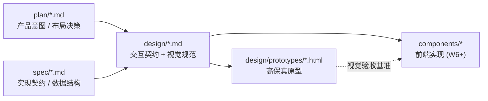

# design/ — 界面设计(交互 · 原型 · UI 样例)

本目录承载 Open Novel 的界面设计产物:每个核心界面一份 **Markdown 交互设计文档** + 一份 **HTML 高保真原型**。文档定义交互契约(状态、键盘、主题),原型给出可在浏览器里直接体验的视觉样例。

> 仓库规则:`design/prototypes/` 是仓库中**唯一允许 `.html` 的目录**(高保真原型,不是文档站)。Markdown 文档之间互链仍只指向 `.md`;引用原型时写文件路径(如 `design/prototypes/01-main-layout.html`),不做超链接。原型页之间允许互链。

## 怎么看原型

1. 浏览器直接打开 `design/prototypes/index.html`(原型总入口),或任一单页
2. 每页右上角可切换 **浅色 / 深色** 主题;首次进入跟随系统外观
3. 原型内可点的交互(模式切换、勾选、步骤导航等)均为前端演示,不连后端

## 设计原则

1. **嫩叶 · 素纸视觉语言**:素色中性底(背景不带色彩倾向)、嫩叶绿唯一 accent、低反差书卷气(正文对比度收在 7:1–9:1)、大圆角、轻阴影、中文衬线点缀 — 详见 [00-design-tokens](./00-design-tokens.md)
2. **双主题是一等公民**:所有颜色走 token,light/dark 同步设计、同步验收
3. **纸面唯一主角(写作优先)**:默认界面只有章节轨、纸面、状态点三样;库、对话、trace、调试全部召唤式出现,用完即走。IDE 只保留肌肉记忆(快捷键 / 多章 / 对照 / Goto Definition),不保留常驻外观(布局契约见 [design/01](./01-main-layout.md),2026-06-11 修订)
4. **克制是审美底线**:发丝线分界、留白分层;不引入文化符号装饰;唯一循环动效是状态点运行态呼吸,其余只有 120/200ms 淡入与小位移(动效全集见 [01-main-layout §动效清单](./01-main-layout.md#动效清单全集))
4. **审批是核心仪式**:ApprovalCard 是产品里最重的交互,信息层级(主修改 → cascade 分级 → 守则风险 → 行动)必须一眼可读
5. **设计文档先于实现**:组件状态、键盘、空/错态在 md 里定义清楚,前端实现照此验收

## 文档导航

| 文档 | 内容 | 原型 |
|---|---|---|
| [00-design-tokens](./00-design-tokens.md) | 色彩 / 字体 / 圆角 / 动效 token,双主题机制 | `prototypes/tokens.css` |
| [01-main-layout](./01-main-layout.md) | 主界面:章节轨 · 纸面 · 状态点(库 / Trace / 输入条 / 审批聚焦卡召唤式) | `prototypes/01-main-layout.html` |
| [02-approval-cascade](./02-approval-cascade.md) | ApprovalCard 整批审:diff、cascade 分级勾选、守则风险、拒绝反馈 | `prototypes/02-approval-cascade.html` |
| [03-reader-panel](./03-reader-panel.md) | ReaderPanel 章节风险报告:留存预测、5 persona 反馈 | `prototypes/03-reader-panel.html` |
| [04-settings](./04-settings.md) | SettingsDialog:9 section、全局/项目分层、危险操作 | `prototypes/04-settings.html` |
| [05-onboarding](./05-onboarding.md) | 首启引导 4 步向导 + 渐进式 tooltip | `prototypes/05-onboarding.html` |
| [06-command-palette](./06-command-palette.md) | Universal Search、命令面板、Cmd+P、@文件引用、框选 AI 改写、toast | `prototypes/06-command-palette.html` |

## 与 plan / spec 的关系

- 交互行为以 plan/spec 为准(本目录不重复定义协议与 schema,只引用);核心能力如 Universal Search / Trace / Approval / ReaderPanel 直接引用对应根层 spec
- 视觉与组件状态以本目录为准;实现期发现冲突,回写本目录并记 `CHANGELOG.md`
- 原型中的文案、数据均为样例,以 [spec/03 Agent Runtime](../spec/03-agent-runtime.md) 与真实数据为准

## 交付与验收(Claude Code 落地流程)

本目录即开发交付物,coding agent 按以下顺序消费,无需额外设计稿:

1. **先读 [00-design-tokens](./00-design-tokens.md)**:`prototypes/tokens.css` 原样进入 `app/globals.css`,按 00 中「实现对接」章节完成 `@custom-variant` 与 shadcn 变量映射(注意 shadcn `--accent` ≠ 品牌色)
2. **按界面读 01~06 文档**:每篇都给出布局结构、组件状态(含空/错/加载态)、键盘与主题行为,即组件验收标准;协议与数据结构跟随文中 spec 链接
3. **打开对应原型页对照实现**:原型是视觉验收基准——布局层级、间距、圆角、双主题观感以原型为准;文案与数据是样例,不照抄

实现侧验收清单(每个界面 PR 必查):

- 双主题逐屏与原型对照,light/dark 都不允许硬编码 hex(可用 `rg "#[0-9A-Fa-f]{6}" --glob '!globals.css'` 做 CI 检查)
- 文字对比度落在 00 规定区间(正文 7:1–9:1、次要 4.5:1–5.5:1、占位 ≥3:1、accent 按钮字 ≥4.5:1)
- 全部浮层 `Esc` 可关、模态 Focus Trap、焦点环用 `--focus-ring`([spec/10](../spec/10-editor-and-interaction.md))
- `prefers-reduced-motion` 下动效降级
- 实现与设计冲突时:回写本目录文档 + 记 `CHANGELOG.md`,不允许实现侧静默偏离
