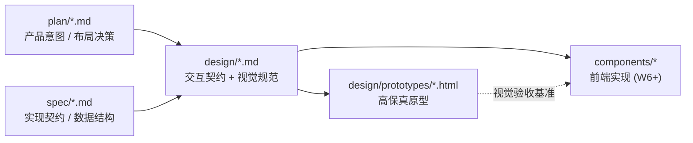

# design/ — 界面设计(交互 · 原型 · UI 样例)

本目录承载 Open Novel 的界面设计产物:每个核心界面一份 **Markdown 交互设计文档** + 一份 **HTML 高保真原型**。文档定义交互契约(状态、键盘、主题),原型给出可在浏览器里直接体验的视觉样例。

> 仓库规则:`design/prototypes/` 是仓库中**唯一允许 `.html` 的目录**(高保真原型,不是文档站)。Markdown 文档之间互链仍只指向 `.md`;引用原型时写文件路径(如 `design/prototypes/01-main-layout.html`),不做超链接。原型页之间允许互链。

## 怎么看原型

1. 浏览器直接打开 `design/prototypes/index.html`(原型总入口),或任一单页
2. 每页右上角可切换 **浅色 / 深色** 主题;首次进入跟随系统外观
3. 原型内可点的交互(模式切换、勾选、步骤导航等)均为前端演示,不连后端

## 设计原则

1. **Claude Desktop 风格**:暖纸色底、低饱和中性灰、陶土橙唯一 accent、大圆角、轻阴影、衬线标题点缀 — 详见 [00-design-tokens](./00-design-tokens.md)
2. **双主题是一等公民**:所有颜色走 token,light/dark 同步设计、同步验收
3. **IDE 心智不破坏**:布局、快捷键、Goto Definition 等沿用 VSCode 范式([plan/07](../plan/07-ui-layout.md) ADR-01),视觉上去工具感、加纸感
4. **审批是核心仪式**:ApprovalCard 是产品里最重的交互,信息层级(主修改 → cascade 分级 → 守则风险 → 行动)必须一眼可读
5. **设计文档先于实现**:组件状态、键盘、空/错态在 md 里定义清楚,前端实现照此验收

## 文档导航

| 文档 | 内容 | 原型 |
|---|---|---|
| [00-design-tokens](./00-design-tokens.md) | 色彩 / 字体 / 圆角 / 动效 token,双主题机制 | `prototypes/tokens.css` |
| [01-main-layout](./01-main-layout.md) | 主界面五区布局:Tabs / ActivityBar / FileTree / Editor / 右栏 | `prototypes/01-main-layout.html` |
| [02-approval-cascade](./02-approval-cascade.md) | ApprovalCard 整批审:diff、cascade 分级勾选、守则风险、拒绝反馈 | `prototypes/02-approval-cascade.html` |
| [03-reader-panel](./03-reader-panel.md) | ReaderPanel 章节风险报告:留存预测、5 persona 反馈 | `prototypes/03-reader-panel.html` |
| [04-settings](./04-settings.md) | SettingsDialog:9 section、全局/项目分层、危险操作 | `prototypes/04-settings.html` |
| [05-onboarding](./05-onboarding.md) | 首启引导 4 步向导 + 渐进式 tooltip | `prototypes/05-onboarding.html` |
| [06-command-palette](./06-command-palette.md) | 命令面板、Cmd+P、@文件引用、框选 AI 改写、toast | `prototypes/06-command-palette.html` |

## 与 plan / spec 的关系

- 交互行为以 plan/spec 为准(本目录不重复定义协议与 schema,只引用)
- 视觉与组件状态以本目录为准;实现期发现冲突,回写本目录并记 `CHANGELOG.md`
- 原型中的文案、数据均为样例,以 [spec/03 prompts](../spec/03-prompts.md) 与真实数据为准
