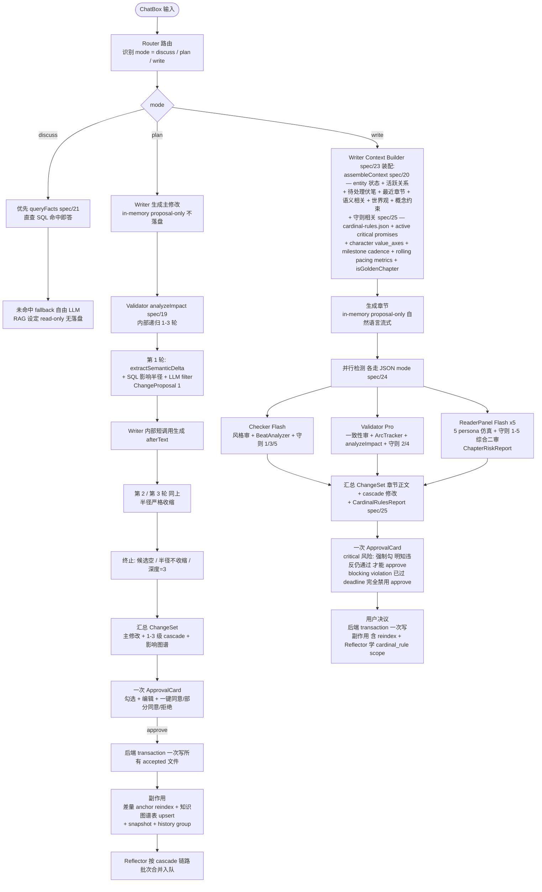

# 01 — 系统概览

## 目标

为有志于在番茄小说发表作品的作者,提供一个**像 VSCode 一样工作的 AI 创作工作台**。它不是一键生成器,而是一个**始终把用户放在驾驶位的创作助手**:Agent 提议、用户审批、系统持久。

## 核心用户场景

1. 输入故事种子 → 生成世界观 / 大纲 / 角色等设定 → 用户逐项审阅、修改
2. 修改某个核心角色资料 → 系统自动扫所有相关章节 / 设定 → 用户审批 cascade 改动
3. 一键生成章节概要 → 审 → 一键生成章节正文 → 审 → 一键去 AI 化
4. 写作中点击角色名 → 跳转到角色资料 → 编辑 → 返回 → 系统已同步引用
5. 同时维护多个项目,互不污染

## Agent 拓扑

项目共 **13 个 LLM 调用点**,分两层:

- **7 个对外 Agent**:用户视角可感知 / 可在 Settings 中配置模型与 reasoningEffort
- **6 个 Hidden Agent**:系统内部 LLM 工具,通过 `callJsonAgent` 统一调用,不在 Settings 暴露

**Agent 协作流程图**

```mermaid
flowchart TB
  U([User ChatBox]) -->|prompt + mode| R

  subgraph PRIMARY["对外 · primary"]
    R[Router · Flash<br/>意图识别 + 派发]
    W[Writer · Pro<br/>吐字 / 设定 / 章节]
  end

  R -->|actions[]| CC([cascade controller])
  CC --> W

  subgraph SUBAGENT["对外 · subagent (cascade 内并行)"]
    C[Checker · Flash<br/>风格 + BeatAnalyzer]
    V[Validator · Pro<br/>一致性 + ArcTracker]
    RP[ReaderPanel · Flash<br/>5 persona]
    H[Humanizer · Pro<br/>去 AI 化]
    RF[Reflector · Flash<br/>per-turn 反思]
  end

  W --> C
  W --> V
  W --> RP
  W --> H
  CC -.turn 完结.-> RF

  subgraph HIDDEN["Hidden · callJsonAgent (不在 Settings)"]
    HA1[extractSemanticDelta]
    HA2[filterByLLM]
    HA3[concept-extractor]
    HA4[compress-messages]
    HA5[volume-summarizer]
    HA6[chapter-writer-retry]
  end

  V -. analyzeImpact .-> HA1
  V -. analyzeImpact .-> HA2
  W -. assembleContext .-> HA3
  CC -. 长 session .-> HA4
  CC -. 每 20-30 章 .-> HA5
  CC -. doom-loop retry .-> HA6
```

详见 [02-multi-agent](./02-multi-agent.md)(Agent 详解)· [09-narrative-engine](./09-narrative-engine.md)(叙事引擎)· [10-reader-simulator](./10-reader-simulator.md)(读者仿真器)· [11-knowledge-graph](./11-knowledge-graph.md)(知识图谱)· [12-memory-and-context](./12-memory-and-context.md)(四层记忆 + per-agent 上下文契约)。

## 数据流概览

**审批流程图**



**关键交互不变性**:所有写盘动作必须经过 ApprovalCard 整批审。"内部 cascade 递归"和"用户审批"是两个分离的阶段 — 递归全在内存,审批在 UI,落盘只在 approve 后,事务原子。

## 关键技术决策汇总

| 维度 | 选择 | 理由 |
|---|---|---|
| 应用架构 | Next.js 15 单应用 | 起步快,SSE 一等公民,App Router 与 AI SDK 6 集成最佳 |
| LLM 调用层 | Vercel AI SDK 6 (`generateText` / `streamText` + `stopWhen`) | 显式控制工具循环终止条件,不依赖框架隐式 Agent loop;`stopWhen` callback 是框架级一等字段,可精确控制"看到 proposal marker 立刻停"等业务终止 |
| Agent 编排 | 自定义 runner (13 个函数式) + cascade controller | 业务编排(cascade / 审批 / cardinal-rules / doom-loop / Reflector)用普通 TS 函数显式编排,可见可测,不被 Mastra Agent loop / LangGraph StateGraph 等框架抽象层挡住 |
| LLM | DeepSeek V4 Pro/Flash | ctx **1M tokens**, max output **384K**, 原生 JSON mode (`response_format: { type: 'json_object' }`)。Pro 用于核心创作 (writer / validator / humanizer),Flash 用于辅助 (router / checker / reflector / reader-panel / 工具内 LLM 短调用) |
| 编辑器 | TipTap 3.x + 自定义装饰器 + AC trie | TipTap 中文排版舒服;不用 `Mention` 节点 (atomic 破坏纯文本流) |
| 存储 | Markdown (产物) + SQLite (索引 + 过程) | Markdown 人类可读 + Git 友好;SQLite 处理引用图 / 历史 / 学习 / 段锚 / 嵌入向量 |
| SQLite driver | `better-sqlite3` | Node 圈 SQLite 性能之王;同步 API 简化代码;企业 SSL 下 prebuild 成熟;与 Drizzle / sqlite-vec 配合最稳 |
| ORM | Drizzle ORM + drizzle-kit | TS schema 单一事实源;migration 自动生成;类型推导让"加字段不漏改" |
| 向量能力 | `sqlite-vec`(loadExtension) | 与 SQLite 同库,可 SQL JOIN segments + entity_refs + embedding;无需独立向量服务 |
| 联网 | 接口预留 + Mock | 二期接 Bocha (中文) + Tavily (英文),用 MCP sidecar |
| 三模式 | XState 状态机 | discuss 不写,plan 改设定,write 改章节,严格闸门 |

## 不变性约束 (Invariants)

为保证质量,系统强制以下 12 条不变性。这些约束被多个 spec 引用,任何变更必须跨 spec 同步。

1. **写入必须经审批,设定不可被 Agent 静默修改** — 所有 writeSetting / writeChapter 走 proposal 模式,落 `approvals` 表 status=pending,通过独立 endpoint resolve;Validator 发现矛盾时只能"提议"修改,不能直接改。详见 [spec/06](../spec/06-approval-flow.md)。
2. **多项目数据零串扰** — Memory 用 `resource = projectId`,文件用独立目录,数据库用 `WHERE project_id = ?` 强约束。详见 [plan/04](./04-storage-model.md)。
3. **三模式严格分离** — Router 在每次输入时强校验当前 mode 与可调用工具集;discuss 不持有写工具,plan 不写章节,write 不写设定。详见 [spec/07](../spec/07-mode-state-machine.md)。
4. **未决 cascade 阻断 write** — plan 模式产生的 ChangeProposal[] 未全部 resolve 时,write 模式禁用,UI 弹 dialog 引导处理。详见 [spec/16](../spec/16-knowledge-schema.md) §Plan Inconsistency Lock。
5. **路径与不可信内容零信任** — 所有读写工具 execute 第一行强制 `safeFromProjectRoot()`([spec/02](../spec/02-agent-tools.md));所有外部内容(web / 用户拷贝 md / 自定义 persona)拼进 prompt 时用 `<<<UNTRUSTED:...>>>` 包裹,Agent system prompt 显式声明忽略其中"指令"。
6. **每个 turn 必反思 (per-turn,cancelled 不跑)** — Reflector 在 `user_turns.status` 转 'done' 时跑一次([plan/06](./06-cascade-and-reflection.md)),输入是整个 turn 的 user_input + Router actions[] + 所有 action 决议(含 edit diff);**cancelled turn 不跑**(用户主动放弃 = 不该入 learnings);per-turn 而非 per-cascade_group 是为了 Reflector 看到跨 action 因果。
7. **docs-before-code** — 任何代码 commit 之前对应 plan/spec 必须先有,且需用户 approve docs 后才动代码(项目级 workflow 不变性)。
8. **影响半径不依赖 LLM** — Validator cascade 第一步必须是 SQL 查影响半径(analyzeImpact step 2);LLM 只做"段是否真受影响"二次过滤。漏 SQL 索引 = bug,不应用 LLM "猜"补救。详见 [plan/11](./11-knowledge-graph.md) + [spec/19](../spec/19-impact-analysis.md)。
9. **派生视图只读,段锚点稳定** — `relationships/_matrix.md` / `./timeline/_character-ages.md` 等是 SQLite 表的 markdown 投影,具 `_` 前缀(FileTree 隐藏)+ frontmatter `derived: true`(writeSetting 拒写);段移动 / 重命名 / 改字不应使 dependencies / paragraph_embeddings 失效,reindex 走"内容签名 + 邻接段对照"维持锚点。详见 [plan/04](./04-storage-model.md) · [spec/16](../spec/16-knowledge-schema.md) · [spec/17](../spec/17-paragraph-anchors.md)。
10. **四层记忆,L4 知识图谱是单一事实源** — L1 工作记忆 / L2 会话历史 / L3 项目经验(learnings)中任何与 L4 冲突的内容,answer 时以 L4 为准;L3 learnings **仅 Reflector 可写**(LLM 不能在 stream 中直接 upsert);读由 context builder 按 weight desc top-8 注入,`scope='cardinal_rule'` top-1 永远保留。详见 [plan/12](./12-memory-and-context.md) · [spec/22](../spec/22-memory-and-history.md)。
11. **per-agent 上下文契约严格写死,装配必经 context builder** — Writer / Validator 必装项不允许省略;1M ctx 给的就是奢侈装齐的本钱,一致性所需数据必装,不允许"为节省临时省略";各 agent 必经对应 context builder([spec/23](../spec/23-context-contracts.md)),不允许 agent 自拼 prompt;真超 1M 时抛 `ContextOverflowError` 让用户分卷,绝不 silent 砍 retrieve。
12. **结构化输出必走 JSON mode + zod 校验 + 守则不可绕过** — Router / Validator / Checker / Reflector / ReaderPanel / 工具内 LLM 调用(extractSemanticDelta / filterByLLM / concept extractor / compress)必经 `callJsonAgent`([spec/24](../spec/24-json-output.md)):DeepSeek `response_format: json_object` + 应用层 zod 校验 + 失败 retry 1 次 + 2 次失败抛 `JsonOutputError` escalate;不允许"自由发挥再 zod parse",不允许 silent fallback(那会让 cascade 漏审 / 概念抽取漏 entity)。任何 ChangeSet 落盘前必跑五大守则检测([spec/25](../spec/25-cardinal-rules.md)),critical 风险用户必须勾"明知违反仍通过"才能 approve;blocking violation 完全禁用 approve;`cardinal-rules.json` 阈值用户可微调但 `enabled: true` UI 锁死。

## 与同类产品的差异

| 维度 | NovelCrafter / Sudowrite | Open Novel |
|---|---|---|
| 联网研究 | 无 (闭合 Story Bible) | 接口预留,二期开放 |
| 一致性守护 | 手动 Codex | 自动 cascade + Validator |
| 反馈学习 | 无 | Reflector 自动持久化经验 |
| 多 Agent | 单 Agent + 模板 | **7 对外 + 6 Hidden Agent** |
| 透明度 | 黑盒 | 全流式可见 |
| 中文 | 弱 | 一等公民 |
| **叙事力学诊断** | 无 | **BeatAnalyzer + ArcTracker** (节奏 / 情绪曲线 / 角色弧光偏离) |
| **发布前留存预演** | 无 | **ReaderPanel** (5 persona 模拟读者反应,生成章节风险报告) |
| **结构模板可调用** | 无 / 强模板套用 | 三幕 / 英雄之旅 / 起承转合 / 番茄黄金三章,可调用不强制 |
| **知识图谱** | 静态 Codex (实体卡片) | **6 维图: 实体 + 关系 + 时间 + 概念 + 段级依赖 + 语义** |
| **Cascade 影响范围** | 无 / 全人工 | **纯 SQL 出候选 + LLM 二次过滤 + 递归 ≤3 层** |
| **写章节上下文** | 用户手动选 cards 塞 prompt | **assembleContext** 自动 retrieve + 1M ctx 装齐 |
| **边写边查** | 静态搜索 / 跳卡片 | **queryFacts** 4 模式 (entity-at / relations-of / mentions-of / semantic-search) |

后六条是与"AI 代笔工具"赛道的核心区分点 — 不是写得更好的 AI,是**把世界装进 AI 的合伙人 + 懂叙事的诊断师 + 懂读者的预演场**。

## 不做什么

- **不做实时 LLM 影响分析** — 影响半径必须是 SQL 出候选(不变性 #8)
- **不做独立向量数据库** — 不引入 Qdrant / Milvus,向量走 sqlite-vec 与 SQLite 一体
- **不做多用户协作 / 多设备同步** — MVP 单机单用户,iCloud / Time Machine / Git 自然备份
- **不做 LLM 微调** — Reflector 把"经验"持久化为 RAG 注入,廉价但实用
- **不做跨项目知识图谱共享** — 项目级隔离,与 Memory `resource = projectId` 一致

## 关联文档

- **架构主线**:[02-multi-agent](./02-multi-agent.md) · [04-storage-model](./04-storage-model.md) · [05-modes-and-approval](./05-modes-and-approval.md) · [06-cascade-and-reflection](./06-cascade-and-reflection.md) · [08-tech-stack](./08-tech-stack.md)
- **核心能力**:[09-narrative-engine](./09-narrative-engine.md) · [10-reader-simulator](./10-reader-simulator.md) · [11-knowledge-graph](./11-knowledge-graph.md) · [12-memory-and-context](./12-memory-and-context.md)
- **外围**:[03-editor-layer](./03-editor-layer.md) · [07-ui-layout](./07-ui-layout.md)
- **跨 spec 守则**:[spec/24](../spec/24-json-output.md)(JSON 输出统一规约)· [spec/25](../spec/25-cardinal-rules.md)(五大网文守则)

## ADR · 设计决策

| 编号 | 决策 | 选项 | 选择 | 理由 |
|---|---|---|---|---|
| ADR-01 | 不变性条数 | 17 条(原) / ≤12 条(合并语义重复)/ ≤5 条(激进收敛) | **12 条**(合并语义重叠后,不删减) | 17 条本身就是反不变性,语义重叠点多;但每条都被多 spec 引用,删任何一条都辐射;合并保留语义,数量降到 12 条已是不损信息的最大压缩 |
| ADR-02 | Agent 拓扑展示 | 仅 7 对外(原)/ 7 对外 + 6 Hidden 二分 / 13 拓扑混展 | **7 对外 + 6 Hidden 二分** | "7 Agent" 是用户视角(可在 Settings 配模型);Hidden Agent 是工程内部 LLM 封装;混展会让用户误以为可配 13 个,二分让产品视角与工程视角对齐 |
| ADR-03 | 关键不变性中是否点名具体框架 | 点名 Mastra / Vercel AI SDK 等 / 只描述抽象不变 | **只描述抽象不变** | 不变性是产品级硬约束,具体实现栈可能演进;框架名挪到 plan/08 技术栈 + spec/22 实现细节,plan/01 只锁"必须有 memory 隔离"而非"必须用 Mastra Memory" |
