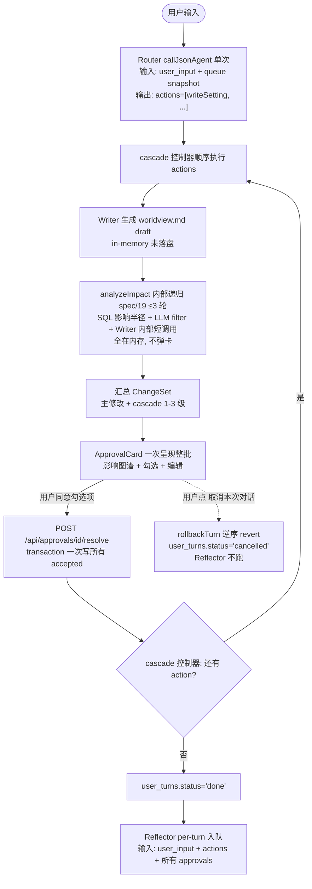
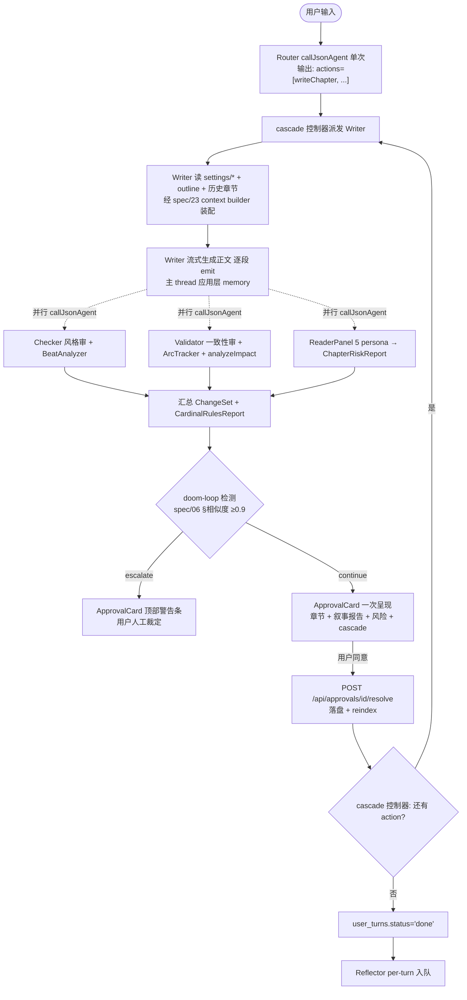

# 02 — 多 Agent 拓扑

## Agent 总体结构

项目共 **13 个 LLM 调用点**,分两层:

- **7 个对外 Agent**(用户视角看到、可在 Settings 中独立配置模型与 reasoningEffort)
- **6 个 Hidden Agent**(系统内部统一封装的 LLM 调用,不在 Settings 中暴露;用 [callJsonAgent](../spec/24-json-output.md) 统一调用)

## 7 个对外 Agent

| Agent | 模型 · reasoningEffort | mode | 主职 | 输出形态 | 可调用工具 | 需审批? |
|---|---|---|---|---|---|---|
| **Router** | Flash · default | primary | 模式分流 + 意图识别 + 子 Agent 编排 | JSON | (派发其他 Agent) | 否 |
| **Writer** (吐字) | Pro · max | primary | 生成正文 / 章节概要 / 设定文档 | NL 流式 | readSetting · readChapter · listSettings · writeSetting✓ · writeChapter✓ · applyTemplate · webSearch (mock) | 是 (写操作) |
| **Checker** (章内审阅) | Flash · default | subagent | 风格 / 流畅 / 章内节奏 + BeatAnalyzer + 守则 1/3/5 检测 | JSON | readChapter · listSettings · analyzeNarrative · checkPacing | 否 (只读) |
| **Validator** (跨章一致性) | Pro · max | subagent | 事实矛盾 + cascade 影响 + ArcTracker + 守则 2/4 检测 | JSON | readSetting · listSettings · readChapter · searchEntities · trackArc · analyzeImpact · checkPromise | 否 (只读,提议变更经 Writer 落盘) |
| **Reflector** (反思) | Flash · default | subagent | 从用户审批 / 拒绝中提炼经验 | JSON | readApprovalHistory · recordLearning | 否 |
| **Humanizer** (去 AI 化) | Pro · max | subagent | 长句拆 + 口语化 + 节奏调整 | NL 流式 | readChapter · writeChapter✓ | 是 |
| **ReaderPanel** (读者仿真) | Flash · default | subagent | 5 persona 并行模拟 + 守则 1-5 综合评分 | JSON | readChapter · simulateReaders | 否 (非闸门信号) |

✓ 标记的工具走 proposal 模式([spec/06](../spec/06-approval-flow.md)),不直接落盘。

### mode 分类

- **`primary`**:直接面对用户输入入口的 Agent(Router 接 UI 路由 / Writer 接生成请求)
- **`subagent`**:由 cascade 流程内部触发,不直接对用户的 Agent(Checker / Validator / Humanizer / ReaderPanel / Reflector);走 [spec/02](../spec/02-agent-tools.md) §subagent 派发协议,续跑同一 threadId 让应用层 memory 模块保持上下文连续
- 显式分类后 UI 路由 / 权限 / Memory 隔离规则更整齐(例如 subagent 默认不能调用 needsApproval 工具)

### reasoningEffort 混合分档(Pro=max + Flash=default)

- **Pro 系 (Writer / Validator / Humanizer) → `max`**:输出长(Writer 单章 5K-10K / Humanizer 整章重写 / Validator cascade 报告)+ 质量优先(创作核心 / 一致性核心),max effort 是正确投入
- **Flash 系 (Router / Checker / Reflector / ReaderPanel) → `default`**:输出短(路由 JSON / 章内分析 JSON / 短摘要 / 单 persona 反应),关键诉求是低成本快反应。Flash 上 max 抹平成本优势,同价位用 Pro 反而更划算
- 禁止 fallback 到旧型号(`deepseek-chat` / `-reasoner` / `-r1` / `-v3`)— 没有 reasoning effort 参数,行为差异会让 cardinal-rules 检测精度劣化(见 [spec/00 §C](../spec/00-version-audit.md) 模型选型守约)

### Writer 单一 Agent 同时写正文 / 设定的风格分流

Writer 在 plan 模式写 worldview.md / character.md(说明文 + frontmatter),在 write 模式写小说正文(文学体),两种文体差异大。**风险缓解**:per-agent context builder([spec/23](../spec/23-context-contracts.md))在每次调用前明确注入"你现在是 plan 模式 / write 模式"+ 对应文体范例,system prompt 头部 stable header 段([spec/03](../spec/03-prompts.md))含模式区分指令。保留单 Writer + 模式注入区分;若实测出现"用写设定的腔调写小说"或反之,拆为 SettingsAuthor + ChapterWriter 两个 primary。

## 6 个 Hidden Agent

统一通过 [`callJsonAgent`](../spec/24-json-output.md)(底层 `generateText` + `response_format: json_object`)调用,不挂 Memory thread,不在 Settings 暴露;模型由各调用方传入(通常用 Flash)。

| Hidden Agent | 用途 | 调用方 | 关联 spec |
|---|---|---|---|
| **extractSemanticDelta** | 从 frontmatter / 正文 diff 抽语义 delta(用于 cascade) | analyzeImpact | [spec/19](../spec/19-impact-analysis.md) step 1 |
| **filterByLLM** | 对 SQL 出的候选段做"是否真受影响" 二次过滤 | analyzeImpact | [spec/19](../spec/19-impact-analysis.md) step 3 |
| **compress-messages** | 把老 messages 摘要为锚定文本(用户主动开启时跑) | spec/22 compressOldMessages | [spec/22](../spec/22-memory-and-history.md) |
| **volume-summarizer** | 每 20-30 章 / 接近 700K token 时生成卷级锚定摘要 | onApprovalResolved hook | [spec/22](../spec/22-memory-and-history.md) |
| **concept-extractor** | 从 worldview / rules 文本中抽概念(taboo / invariant / capability) | reindex worker | [spec/16](../spec/16-knowledge-schema.md) §概念抽取 |
| **chapter-writer-retry** | doom-loop 检测前 Writer 重生成的 isolated 调用(续 thread,带拒绝理由) | cascade controller | [spec/06](../spec/06-approval-flow.md) §doom-loop |

Hidden Agent 与对外 Agent 共用同一套[应用层 memory 模块](../spec/22-memory-and-history.md)做日志记录(`llm_calls` 表),但 **不**挂 `messages` 表 — 它们是一次性分析,历史由 spec/23 context builder 每次重装,挂 thread 反而污染主线滑窗。

## 路由策略 (Router 行为)

> **[info]** ⚠ Router 是 **一次性意图解析器** — 单 user turn 内只调一次 `callJsonAgent`([spec/24](../spec/24-json-output.md)),输出一个有序 `actions[]`,然后退出。后续 actions 的执行由 cascade 控制器顺序派发,不再回到 Router 决策。

Router 的 system prompt 包含:

1. **当前模式约束**:discuss / plan / write — 决定 `actions[].kind` 的合法集合
2. **当前项目上下文**:项目名、流派、Agent 性格、风格偏好
3. **当前队列 snapshot**(cascade 控制器在调用前注入):pending ApprovalCard + queued actions;Router 据此判定新输入是"插队 / 排队 / 取消 / 继续审批"
4. **学习经验注入**:从 `learnings` 表取 top-N(按 weight + recency,scope ∈ Router 适用)

Router 输出(走 JSON mode,zod schema 见 [spec/24 §Router actions](../spec/24-json-output.md)):

```jsonc
{
  "actions": [
    { "kind": "writeSetting", "target": "characters/lin.md", "intent": "把主角改成女生" },
    { "kind": "writeChapter", "chapterIndex": 3, "intent": "开头" },
    { "kind": "analyzeChapterPacing", "chapterIndex": 2 }
  ]
}
```

**action.kind 枚举**(与 spec/24 一致):

- `writeSetting` / `writeChapter` — 派发 Writer + 进 cascade pipeline
- `analyzeChapterPacing` / `analyzeArc` — 派发 hidden agent 只读分析,无审批
- `queryFacts` — 直查 SQL([spec/21](../spec/21-fact-query.md)),无 LLM 创造
- `discussFreeForm` — 自由对话,无落盘(discuss 模式 fallback)
- `cancelTurn` — 用户表达"取消" → cascade 控制器走 rollbackTurn([spec/06 §Turn 取消语义](../spec/06-approval-flow.md))

**意图分类示例**:

- "你觉得主角应该长什么样" → actions=[`discussFreeForm`]
- "把主角改成女生" → actions=[`writeSetting`]
- "写第三章开头,顺便看第二章节奏" → actions=[`writeChapter`, `analyzeChapterPacing`]
- "等下,先别写第三章了"(队列 snapshot 显示 `writeChapter` 在 queued)→ actions=[`cancelTurn`]

**关键不变性**:

- Router 单 user turn 内只调一次,cascade 跑完**不**回 Router 再决策(避免开放推理循环)
- cascade 内部"发现还得改别的"是 `analyzeImpact` 内部递归(spec/19 ≤3 轮),不是新 Router 调用
- 用户在 ApprovalCard 之间再敲新 prompt = 新 user turn = 新 Router 调用,queue snapshot 含上一 turn 的 pending state

## Agent 协作流程

### Plan 模式 (生成 / 修改设定)

**审批流程图**



### Write 模式 (生成章节正文)

**审批流程图**



各自动触发的开关均在 SettingsDialog → Section 5(读者仿真器 + 叙事引擎),用户可关闭节省成本。注意 ReaderPanel 是**非闸门**输出 — 信号挂在 ApprovalCard 内,作者可参考可忽略。

### Discuss 模式

只读。Router 出 `actions=[discussFreeForm]`,可调 readSetting / readChapter / searchEntities / queryFacts,**不**调任何 write* 工具。turn 完成后 **Reflector 不跑** — discuss 模式无 approve/reject 决议信号,无 learning 可提炼。

## 多项目隔离 (Memory)

> **[info]** 四层记忆模型(L1 工作记忆 / L2 会话记忆 / L3 项目记忆 / L4 知识图谱)与 per-agent 上下文契约见 [plan/12](./12-memory-and-context.md);应用层 memory 模块落地见 [spec/22](../spec/22-memory-and-history.md);per-agent context builder 见 [spec/23](../spec/23-context-contracts.md)。本节只列 Memory 多项目隔离要点。

thread 与 resource 命名规则:

```
thread id   = `proj:${projectId}:session:${sessionId}`
resource id = `${projectId}`
```

所有 LLM 调用必经 **memory access guard**(应用层 wrapper,在 [spec/22](../spec/22-memory-and-history.md) 实现):

```ts
// lib/agents/memory-guard.ts
export async function fetchRecent({ threadId, resource, limit }: FetchOpts) {
  if (!threadId || !resource) throw new Error('threadId + resource is required')
  if (!threadId.startsWith(`proj:${resource}:`)) {
    throw new Error('thread/resource projectId mismatch')
  }
  return await db.select().from(messages)
    .where(and(eq(messages.threadId, threadId), eq(messages.resource, resource)))
    .orderBy(desc(messages.createdAt)).limit(limit)
}
```

`resource = projectId` 确保跨项目零串扰;`thread` 切会话,旧对话可恢复;guard 函数防御性二次校验。每次 Agent stream 启动前先调对应 [per-agent context builder (spec/23)](../spec/23-context-contracts.md) — 由它装配 system / learnings / L4 retrieve / messages,并标记 `jsonMode`。**不允许 Agent 自拼 prompt**([plan/01 不变性 #11](./01-overview.md))。

## 五大守则检测分工

(spec/25 详见)

| 守则 | 主检测 | 二审 |
|---|---|---|
| 1. 黄金三章 | ArcTracker (在 Validator) | ReaderPanel |
| 2. 人设崩坏 | Validator (characterIntegrityCheck) | ReaderPanel |
| 3. 节奏崩盘 | BeatAnalyzer + ArcTracker | — |
| 4. 期待感兑现 | Validator (promiseAccountabilityCheck) | ReaderPanel |
| 5. 金手指依赖 | BeatAnalyzer + ArcTracker | ReaderPanel |

各检测器输出汇成 `CardinalRulesReport`([spec/25 §风险报告输出](../spec/25-cardinal-rules.md))进 ApprovalCard。叙事引擎拆给两个 Agent:BeatAnalyzer 是章内分析 → 归 Checker;ArcTracker 是跨章性格偏离 → 归 Validator。两者实现共置于 [plan/09](./09-narrative-engine.md);ReaderPanel 详见 [plan/10](./10-reader-simulator.md)。

## 风格 / 性格定制

每个项目 `project.json`:

```json
{
  "id": "...",
  "name": "重生互联网",
  "genre": "都市重生",
  "style": "幽默轻松,节奏快,短句多",
  "agentPersonality": "毒舌助理,会主动指出剧情漏洞",
  "exampleCorpus": [".../范文1.md", ".../范文2.md"]
}
```

Router 在每次调用前把这些字段拼进所有下游 Agent 的 system prompt,确保风格一致。

## 模型选择策略

V4-Pro vs V4-Flash 是**输出长度上限**和**单价档**的差异(两者 ctx 都 1M)。配合 reasoningEffort 形成 **`v4-flash + default`**(低成本短反应)/ **`v4-pro + max`**(高质量长输出)二档:

- **`v4-pro + reasoningEffort: max`**:Writer / Validator / Humanizer — 创作核心 + 一致性核心;长输出 + 深度推理同时需要
- **`v4-flash + reasoningEffort: default`**:Router / Checker / Reflector / ReaderPanel — 短输出;上 max 抹平 Flash 成本优势

通过 `process.env.DEEPSEEK_API_KEY` 直连 + 模型名 `deepseek-v4-pro` / `deepseek-v4-flash`。用户在 Settings UI 里可单独覆盖每个 Agent 的模型 + reasoningEffort,但**不暴露 fallback 到 V3 / 旧版**。

## ReaderPanel 成本控制

ReaderPanel 每章跑 5 个(+ N 自定义)persona,潜在 token 开销不小。控制策略:

- 全部走 Flash 模型(单价低)
- 用户可在 SettingsDialog → "读者仿真器" tab 整体禁用
- 自定义 persona 单独开关 + weight 调节
- 章节 > 5K 字时只取关键段(前 1000 字 + 后 800 字 + 中段冲突点),不全文喂入

## 关联文档

- **上游**:[plan/01](./01-overview.md) 系统概览
- **能力详解**:[plan/09](./09-narrative-engine.md) 叙事引擎 · [plan/10](./10-reader-simulator.md) 读者仿真器 · [plan/11](./11-knowledge-graph.md) 知识图谱 · [plan/12](./12-memory-and-context.md) 记忆与上下文
- **核心 spec**:[spec/02](../spec/02-agent-tools.md) 工具签名 · [spec/06](../spec/06-approval-flow.md) 审批流 · [spec/19](../spec/19-impact-analysis.md) 影响分析 · [spec/22](../spec/22-memory-and-history.md) Memory · [spec/23](../spec/23-context-contracts.md) Context · [spec/24](../spec/24-json-output.md) JSON 输出 · [spec/25](../spec/25-cardinal-rules.md) 守则

## ADR · 设计决策

| 编号 | 决策 | 选项 | 选择 | 理由 |
|---|---|---|---|---|
| ADR-01 | Agent 展示方式 | 仅 7 对外 / 7 + 6 二分 / 13 拓扑混展 | **7 对外 + 6 Hidden 二分** | 7 是用户视角(可在 Settings 配模型),Hidden 是工程内部 LLM 封装;混展会让用户误以为可配 13 个 |
| ADR-02 | Router 调用模式 | 一次性意图解析 / Agent-as-tool 多轮派发 / 多轮 ReAct | **一次性意图解析** | 避免开放推理循环;cascade 内部"发现还得改别的"是 analyzeImpact 递归,不是新 Router 调用;用户在 ApprovalCard 之间再敲新 prompt = 新 turn = 新 Router 调用 |
| ADR-03 | Writer 是否拆分(写设定 vs 写正文) | 单 Writer + 模式注入 / 拆 SettingsAuthor + ChapterWriter | **单 Writer + 模式注入** | 风险:写设定的腔调误用到小说正文;缓解:context builder 注入文体范例 + system prompt 强调当前模式;若实测出现误用再拆 |
| ADR-04 | Hidden Agent 是否挂 Memory thread | 挂主 thread / 不挂 / 各自独立 thread | **不挂** | Hidden Agent 是一次性分析,历史由 spec/23 context builder 每次重装;挂主 thread 反而污染 lastMessages 滑窗 |
