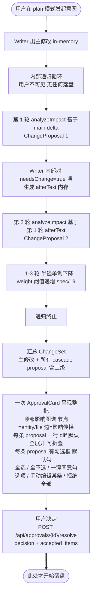

# 04 — 存储模型

## 目标

- **内容人类可读**:设定与正文必须是 markdown,可编辑可 diff 可备份
- **索引 / 历史 / 学习独立**:SQLite 管引用图、变更历史、反馈经验,**用户不感知**
- **多项目无串扰**:每个项目一个目录 + 独立 `index.db` + 独立 `session_history.db`
- **存放在用户目录**:不污染代码仓库,iCloud / Time Machine 友好
- **产物 vs 过程严格分库**:用户产物走 Markdown(可见可编辑可 Git 跟踪);运行时过程数据走 SQLite(开发者调试用)。两者数据库分开,避免写入并发冲突且语义清晰

## 存储位置

**数据结构图**

```mermaid
flowchart LR
  ROOT["~/.open-novel/"]
  ROOT --> RT["runtime.db<br/>跨项目会话存储"]
  ROOT --> ST["settings.json<br/>API keys + 用户偏好"]
  ROOT --> SN[".snapshots/<br/>设定快照"]
  ROOT --> WS["workspaces/"]
  WS --> P1["proj_重生互联网_a3f2/"]
  WS --> PN["proj_末世修仙_b7c1/ ..."]

  P1 --> PJ["project.json"]
  P1 --> SET["settings/"]
  P1 --> CHS["chapters/"]
  P1 --> IDX["index.db<br/>知识图谱 + 实体索引"]
  P1 --> SHD["session_history.db<br/>LLM 调用日志等过程数据"]
  P1 --> TR["trace/<br/>2026-04-29-session-abc.jsonl"]

  CHS --> CH1["001-重生那一夜/<br/>outline.md + draft.md + meta.json"]

  subgraph SETTINGS["settings/"]
    direction TB
    SET_WV["worldview/<br/>_index + geography + history + politics<br/>+ economy + technology + culture + religion + rules"]
    SET_OL["outline/<br/>_index + master + volumes/ + chapter-outlines/_registry"]
    SET_BE["beats.md 节拍设计"]
    SET_CH["characters/<br/>lin.md + wang.md ..."]
    SET_FA["factions/ 阵营<br/>_index + donghai-group + chaoting"]
    SET_OR["organizations/ 公司/门派/公会/政府<br/>_index + {id}.md"]
    SET_LO["locations/<br/>_index + regions/ + cities/ + buildings/ + landmarks/"]
    SET_IT["items/ 重要物品/法宝/信物<br/>_index + {id}.md"]
    SET_EV["events/ 历史事件 + 关键事件<br/>_index + {id}.md"]
    SET_TL["timeline/<br/>_index + era + story-clock + _character-ages 派生"]
    SET_RE["relationships/<br/>_index + _matrix 派生 + notes/{id}"]
    SET_SL["story-lines/<br/>_index + main + subplots/{id}"]
    SET_FO["foreshadowing/ 预埋伏笔<br/>_index + {id}.md"]
    SET_CA["chapter-arcs/ 按弧划分<br/>_index + {id}.md"]
    SET_PS["power-system/ 玄幻/修仙/系统流<br/>_index + overview + tiers + techniques + artifacts"]
    SET_GL["glossary/ 术语/黑话<br/>_index 单文件"]
    SET_TB["taboos.md 绝对不能写"]
    SET_TH["themes.md 主题/核心矛盾/价值观"]
    SET_RP["reader-promises.md 已对读者立的旗"]
  end

  SET --> SETTINGS
```



### 目录设计要点

1. **`_` 前缀文件 = 系统索引 / 派生**,FileTree 默认隐藏所有 `_*` 文件([spec/13](../spec/13-settings.md) §Developer Mode 可切换可见)。命中条件:文件名或目录名以 `_` 开头(e.g. `_index.md` / `_matrix.md` / `_character-ages.md` / `_registry`)。**派生文件必须 `_` 前缀**。
2. **每个目录有 `_index.md`** — 给 LLM 快速读"这个目录里有什么 + 一句话摘要",不必扫整个目录:

   ```yaml
   ---
   id: index_worldview_a3f2
   type: index
   for_directory: worldview
   ---
   # 世界观索引

   ## 子文件 (8 个)
   - geography.md — 地理总论 (200 字摘要)
   - history.md — 历史脉络 (200 字摘要)
   - ...
   ```
3. **派生文件**(`relationships/_matrix.md` / `./timeline/_character-ages.md`)是 SQLite 表的 markdown 投影,同时具备:
   - `_` 前缀:FileTree 隐藏
   - frontmatter `derived: true`:writeSetting 拒写([spec/16](../spec/16-knowledge-schema.md) §派生文件守卫) 派生文件 = 用户既不需看也不能改的纯计算产物,reindex 时自动重生成。
4. **空目录的处理** — 若用户项目流派不需要某目录(都市流不需要 power-system/),目录仍创建,`_index.md` 写一行"此目录适用于玄幻 / 修仙 / 系统流,本项目暂未使用"。空目录不影响 reindex,不影响 token(assembleContext 不会把空目录塞 prompt)。
5. **用户扩展点 vs 派生点** — `relationships/_matrix.md` 派生(用户不可见),用户想加私人恩怨详情写在 `relationships/notes/{id}.md`(普通文件,FileTree 可见),这些 notes 不参与派生只供 Writer assembleContext 时取用。

## Markdown frontmatter 规范

每个内容文件用 YAML frontmatter 携带元数据。详细 schema 见 [spec/01-storage-schema](../spec/01-storage-schema.md) 与 [spec/16-knowledge-schema](../spec/16-knowledge-schema.md);本节只给关键示例。

### 角色(`characters/X.md`)

```yaml
---
id: char_lin_a3f2
type: character
canonical_name: 林川
aliases: ["川哥", "林总"]
gender: male
age: 28
role: protagonist
reader_promises:                          # 读者承诺,违反 = critical (spec/25 守则 2)
  - "杀伐果断,不会对队友下手"
  - "重情义,会为队友报仇"
taboos:                                   # 角色禁忌,违反 = critical
  - "不会对老人下手"
  - "不会出卖兄弟"
arc:                                      # 角色弧光 (ArcTracker 跟踪)
  start: 软弱
  end: 杀伐果断
  trajectory: ['受辱', '觉醒', '复仇', '掌权']
value_axes:                               # 行为价值观基线,偏离 > 0.4 = critical
  对敌:                                   # 0=最仁慈, 1=最狠辣
    baseline: 0.85
    range: [0.7, 1.0]
  对友:
    baseline: 0.90
    range: [0.75, 1.0]
intelligence_axis:                        # 智力基线 (假智谋检测用)
  baseline: 0.85                          # 0=笨, 1=极聪明
  iq_range: [0.7, 1.0]
created_at: 2026-04-29T10:00:00+08:00
updated_at: 2026-04-29T11:30:00+08:00
source: writer-agent
---

# 林川

## 性格
...
```

### 章节(`chapters/001-XX/draft.md`)

```yaml
---
id: ch_001
type: chapter
chapter_index: 1                          # 派生 (从 order 字段)
order: 1
title: 重生那一夜
word_count: 3247
status: draft                             # draft | reviewed | published
pov: [林溪]                                # POV 角色 list (按出场顺序)
pov_breakdown:                            # 派生 (Validator 扫段后填,主角段比例)
  林溪: 0.78
  王伟: 0.22
hook_type: 冲突                           # 1-3 章必填: 悬念 / 冲突 / 爽点 / 钩子 / 谜团
named_characters:                         # 派生 (本章命名角色出场名单)
  - 林溪
  - 王伟
  - 老板
setting_description_ratio: 0.18           # 派生 (设定/环境描写占比)
main_line: true                           # true=主线 / false=支线
progress_milestone: null                  # null 或: 突破 / 夺宝 / 打脸 / 复仇 / 升级 / 觉醒 / 解谜
pov_protagonist_ratio: 1.0                # 派生 (主角 POV 段比例)
agency_breakdown:                         # 派生 (主角能动性占比, BeatAnalyzer 标段后聚合)
  active_decision: 0.45                   # 主动决策
  passive_receive: 0.20                   # 被动接收
  system_reward: 0.10                     # 系统奖励
  wisdom_choice: 0.15                     # 智慧抉择
  struggle: 0.10                          # 挣扎抗争
referenced_entities:
  - char_lin_a3f2
  - place_beijing_2010
created_at: ...
updated_at: ...
---

# 第一章 重生那一夜

林川猛地从床上坐起来...
```

### 五大守则项目级配置(`cardinal-rules.json`)

项目级硬约束配置,`enabled: true` 锁死,只能微调阈值。详见 [spec/25-cardinal-rules](../spec/25-cardinal-rules.md)。

## 数据库总览(per-project)

| 数据库 | 路径 | 内容 | 谁读谁写 |
|---|---|---|---|
| `runtime.db` | `~/.open-novel/runtime.db` | 跨项目会话 messages(thread / resource 隔离) | 应用层 memory 模块 |
| `index.db` | `{projectId}/index.db` | 实体索引 + 知识图谱 + 段锚 + paragraph_embeddings(vec0 virtual table)+ approvals + history + learnings + 派生视图源 | 主流程读写;reindex worker 批量更新 |
| `session_history.db` | `{projectId}/session_history.db` | LLM 调用日志 / json retries / chapter tool runs / doom-loop 事件 / prompt cache stats(开发者调试用) | 异步写入,失败不阻塞主流程 |

核心表(详细 schema 见 [spec/01](../spec/01-storage-schema.md) + [spec/16](../spec/16-knowledge-schema.md)):

**基础表(spec/01)**:

- `entities` · `entity_refs` · `backlinks` · `history` · `learnings` · `user_turns` · `approvals` · `traces` · `narrative_metrics`

**知识图谱表(spec/16-18)**:

- `entity_relations` · `entity_timeline` · `concepts` + `concept_refs` · `dependencies` · `paragraph_anchors` · `paragraph_embeddings`(`vec0` virtual table)· `setting_snapshots` · `cascade_audits` · `reindex_failures` · `narrative_feedback` · `entity_match_feedback` · `volume_summaries`

**过程数据表([spec/27 §session_history.db](../spec/27-session-history.md),过程库)**:

- `llm_calls` · `json_retries` · `chapter_tool_runs` · `doom_loop_events` · `prompt_cache_stats`

## 存储栈选型

| 层 | 选型 | 备注 |
|---|---|---|
| SQLite driver | `better-sqlite3` | 同步 API;Node 圈最成熟;prebuild 跨平台稳 |
| ORM | `drizzle-orm` + `drizzle-kit` | TS schema 单一事实源;migration 自动生成 |
| 向量 | `sqlite-vec` | `loadExtension` 加载;`vec0` virtual table + `MATCH` 操作符;与普通表 JOIN |
| journal mode | WAL | 启动时 `db.pragma('journal_mode = WAL')`;多 reader 一个 writer |

详见 [plan/08 §Drizzle + better-sqlite3 + sqlite-vec 集成](./08-tech-stack.md)。

## 不进 SQLite 的内容

| 数据 | 存储 | 理由 |
|---|---|---|
| chapter.md / character.md / outline.md / worldview.md / cardinal-rules.json | Markdown 文件 | 用户产物,FileTree 可见,git 跟踪 |
| settings/* 全树 | Markdown 文件 | 同上 |
| `volume_summaries`(卷级摘要内容) | `index.db` 产物索引一侧 | 给 LLM 检索用的产物;长期生命周期 |
| messages(应用层 memory 模块) | `~/.open-novel/runtime.db` | 跨项目共享但 resource 隔离 |
| `_tool_cache/{toolCallId}.json` truncated 原始输出 | 散文件 | 体积大,prune 时清理,不进数据库 |

## 连接池(better-sqlite3 + LRU)

每个项目独立 `index.db` + `session_history.db`;`runtime.db` 跨项目共享。每个项目同时打开两个 db connection。

策略:

- **LRU 缓存项目级 connection**:同时活跃 ≤ 3 个项目;切项目时显式 close 最旧项目的两个 connection
- **runtime.db single connection**:全局 1 个,常驻
- **WAL mode**:启动时一次性 `db.pragma('journal_mode = WAL')`;多 reader 一个 writer 避免写锁竞争
- **dev hot-reload**:用 `globalThis.__openNovelDb` 缓存,模仿 Prisma 的 Next.js dev 范式
- **删项目前必须先 close**,再 fs.rm

具体实现细节(LRU 限额、connection 生命周期)在 W3 spike 验证后回写 [spec/01](../spec/01-storage-schema.md) 与 [spec/27](../spec/27-session-history.md)。当前估算 LRU(3) 是上限,实测可能需要调整。

## 修改提交全链路(含审批前内部 cascade 递归)

> **[info]** ⚠ **关键交互模型**:`writeSetting` / `writeChapter` 是 **proposal-only** 工具(见 [spec/06](../spec/06-approval-flow.md)),**不直接落盘**。从用户输入到磁盘改变,中间隔着完整的 cascade 内部递归 + 用户审批两道闸:

**审批流程图**



## 审批通过后的副作用

每次 ApprovalCard 整批 approve 通过后,后端 `POST /api/approvals/{id}/resolve` 在一个 SQLite transaction 内:

1. 按 transaction 一次写所有 `accepted_items` 文件(主修改 + 勾选的 cascade proposal)
2. 重新解析每个文件 frontmatter,upsert 到 `entities` 表
3. 触发 worker 异步 **差量** reindex(见 [spec/17](../spec/17-paragraph-anchors.md) §差量 reindex):
   - 段级 anchor diff(unchanged / modified / rewritten / deleted / added)
   - 仅 dirty 段重扫 entity_refs / concept_refs
   - 仅 dirty 段重算 paragraph_embeddings(见 [spec/18](../spec/18-embeddings.md))
4. **frontmatter delta 同步知识图谱表**:
   - `relations` 字段变化 → upsert 到 `entity_relations`(source='frontmatter')
   - `initial_state` 变化 → upsert 到 `entity_timeline`
   - 派生文件(`_matrix.md` / `_character-ages.md`)重生成
5. **若主修改属于 P0 设定文件**(`worldview/*` / `characters/*` / `outline/master.md`):自动 setting snapshot([spec/16](../spec/16-knowledge-schema.md) §Snapshot)
6. 写一组 `history` 记录(整批用同一个 `cascade_group_id`,便于"回退某次审批"还原整批)
7. Reflector 按 cascade 链路批次合并入队(见 [plan/06](./06-cascade-and-reflection.md) §Reflector 触发时机)

**事务原子性**:步骤 1 在一个 transaction 内,任一文件写盘失败 → 全部 rollback;reindex 副作用入队但 worker 是异步串行,不影响主 transaction。

## 单 tab 假设

> **[info]** 本应用按**单用户单 tab**设计 — 不做多 tab 协调 / Web Locks / "后到 tab 只读" 等机制。用户若开第二 tab 是 OS 行为不是 app 行为,共享同一 Node 进程的内存状态,行为以最后一次写入为准(last-write-wins),不额外提示。简化的代价是:用户必须自律不开第二 tab 同时改同一项目。**多 tab 协作 / 多用户协作不在本期范围**(见 [plan/12](./12-memory-and-context.md) §不解决)。

## 外部编辑器同步

> **[info]** 用户在 VSCode / iA Writer 直接改了 `characters/lin.md` — 应用不知道;TipTap 仍显示旧内容,审批的 before-state 错位 → diff 出错。

策略:**chokidar 文件 watcher**(Node 端,在 `/api/watch` Route Handler 内挂)+ SSE push 到前端。

```ts
// app/api/watch/route.ts (long-lived SSE)
export const runtime = 'nodejs'

export async function GET(req: Request) {
  const projectId = new URL(req.url).searchParams.get('projectId')!
  const watcher = chokidar.watch(getProjectDir(projectId) + '/**/*.md', {
    ignoreInitial: true, atomic: true,
  })
  const stream = new ReadableStream({
    start(controller) {
      watcher.on('change', (path) => {
        controller.enqueue(`event: fs:changed\ndata: ${JSON.stringify({ path })}\n\n`)
      })
    },
  })
  req.signal.addEventListener('abort', () => watcher.close())
  return new Response(stream, { headers: { 'content-type': 'text/event-stream' } })
}
```

前端:

- 收到 fs:changed 后,如果该文件在某个 Tab 打开 + 用户没有未保存编辑 → 静默 reload
- 用户有未保存编辑 → 弹冲突 dialog:"[文件名] 被外部修改。要 [使用磁盘版本] / [保留我的修改] / [手动 merge]"
- 如果该文件在审批流的 before-state 中 → 该审批 invalidate(status='stale'),提示用户重做

## 备份策略

- 用户数据完全在 `~/.open-novel/`,iCloud / Time Machine 自然备份
- 提供"Export Project"按钮:打包成 zip(`projectId.zip`),**含所有 .md + index.db**。`narrative_metrics / reader_reports / approvals / learnings` 是花了 LLM 钱跑出来的数据,丢了等于丢钱;`entity_refs / backlinks` 这种纯派生表在导入后由 worker 重建
- 提供"Import Project"按钮:解压后,若 projectId 冲突自动生成新 id;worker 后台重建 entity_refs / backlinks
- 详细 UI flow 见 [spec/13-settings](../spec/13-settings.md) §项目生命周期 UI flow

## 数据隔离保证

1. **文件层**:每个项目独立目录,操作以 `projectId` 为前缀,绝不跨项目读写
2. **数据库层**:`index.db` / `session_history.db` 在项目目录内,不存在跨库查询
3. **Memory 层**:应用层 memory 模块按 `resource = projectId` 校验 thread 名前缀,跨项目零串扰(详见 [spec/22](../spec/22-memory-and-history.md))
4. **校验**:所有 storage 函数签名第一个参数是 `projectId`,内部 assert 路径前缀([spec/02 §safeFromProjectRoot](../spec/02-agent-tools.md))

## 不做什么

- **不做云同步 / 多设备** — 单机本地优先;未来如需多设备走 iCloud / Git 路径,不引入数据库级 sync
- **不做多用户协作** — 单 tab / 单进程;无 Yjs 等 CRDT
- **不做独立向量数据库** — 向量与 SQLite 同库(sqlite-vec),不引入 Qdrant / Milvus
- **不做 ORM 之外的数据访问** — 所有 SQL 走 Drizzle,统一类型推导

## 关联文档

- **上游**:[plan/01](./01-overview.md) 系统概览 §存储 · [plan/08](./08-tech-stack.md) 技术栈
- **核心 spec**:[spec/01](../spec/01-storage-schema.md) 存储 schema · [spec/16](../spec/16-knowledge-schema.md) 知识图谱 schema · [spec/17](../spec/17-paragraph-anchors.md) 段锚 · [spec/18](../spec/18-embeddings.md) embeddings · [spec/22](../spec/22-memory-and-history.md) memory
- **知识图谱主线**:[plan/11](./11-knowledge-graph.md)

## ADR · 设计决策

| 编号 | 决策 | 选项 | 选择 | 理由 |
|---|---|---|---|---|
| ADR-01 | 产物 vs 过程数据是否分库 | 合并到 index.db / **拆为 index.db + session_history.db** | **拆为两库** | 产物索引面向 LLM 检索 + 用户文件浏览,过程数据面向开发者调试 + 性能监控;混合会让备份策略 / 写入并发 / schema migration 都更难;两库各自独立 schema 演进 |
| ADR-02 | 连接池策略 | 每项目 keep-alive / **LRU(3) 项目级 connection** / 单 connection 全局共享 | **LRU(3)** | 单机本地工具,FD 不紧张但要避免 hot-reload 泄漏;具体数字 W3 spike 后调整(原 LibSQL LRU(3) 结论错误,实际需重算"项目数 × 数据库文件数") |
| ADR-03 | 外部编辑器冲突处理 | Web Locks / chokidar watcher + 冲突 dialog / 忽略 | **chokidar + 冲突 dialog** | 单 tab 假设下不需要 Web Locks;chokidar 已经在 Node 生态成熟;冲突 dialog 把决策交给用户,避免 silent overwrite |
