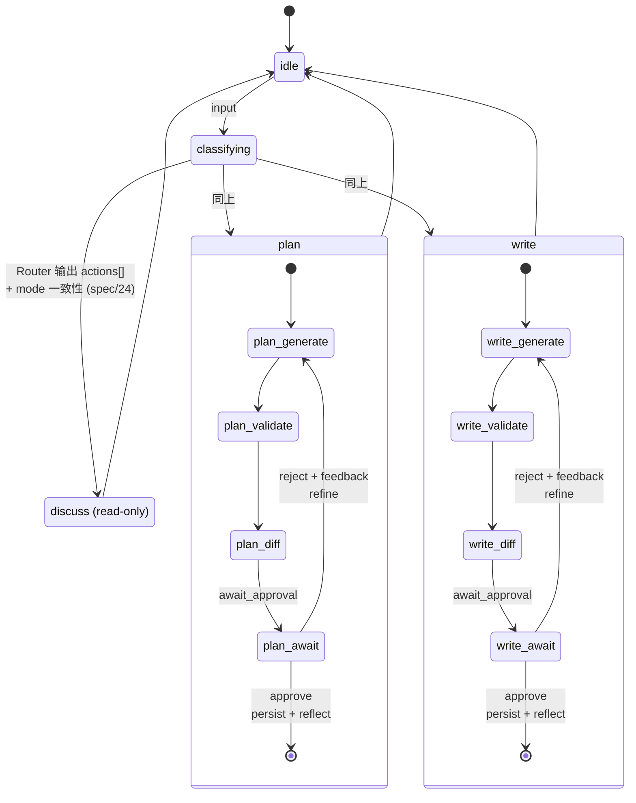
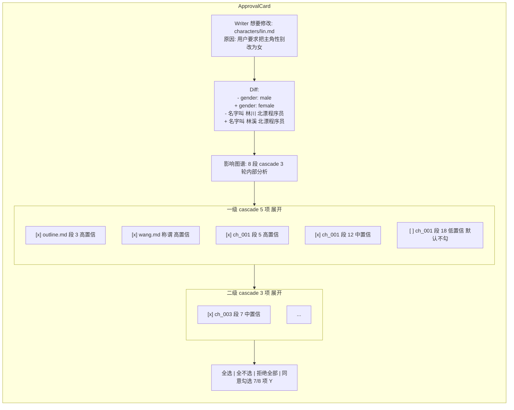
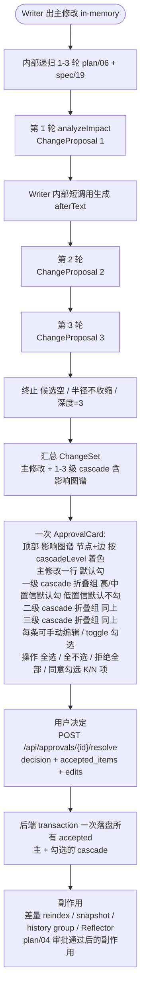

# 05 — 三模式与审批流

## 三种工作模式

模式是**对 Agent 行为的硬约束**,不是 UI 装饰。

| 模式 | 用户场景 | Agent 可读 | Agent 可写 | 典型工具 |
|---|---|---|---|---|
| **Discuss** | 检索 / 对话 / 不确定 | 设定 + 章节 + 历史 | 无 | readSetting, readChapter, searchEntities, webSearch |
| **Plan** | 改设定 | 设定 + 章节(参考) | 设定(审批后) | + writeSetting(gated) |
| **Write** | 写章节 | 设定 + 章节 + 历史 | 章节(审批后) | + writeChapter(gated) |

**模式间不可通过 LLM 自行切换**,必须用户显式触发。切换路径有两种,效果完全一致:

1. **点击** ChatBox 顶部的 `[Discuss] [Plan] [Write]` toggle
2. **键盘** 在 ChatBox textarea 焦点内按 `Tab`(循环正向)或 `Shift+Tab`(反向)

Tab 切模式是与主流 LLM chat 工具(ChatGPT / Claude.ai / Cursor)一致的预期心智 — Tab 不再插入字面 tab 字符。详见 [spec/12](../spec/12-shortcuts.md) §ChatBox 上下文。

模式切换在 `await_approval` 状态下被状态机阻止 — Tab 与点击都不生效,UI 显示 toast:"完成审批后才能切模式"。`await_approval` 下接受新 `USER_INPUT` 也被阻止 — ChatBox textarea 显示 disabled 灰显 + tooltip "完成或取消上方审批后才能继续输入"。详见 [spec/07](../spec/07-mode-state-machine.md) §USER_INPUT 处理。

## 状态机(XState)

**审批流程图**



## 审批闸门(Human-in-the-Loop)

> **[info]** **proposal + 独立 endpoint 模式**:工具执行时不真正写盘,而是把 proposal 落 `approvals` 表(status=pending)立即返回;Agent loop 看到 proposal marker 后由 `stopWhen` 拦截自然结束 stream;用户审批通过独立 endpoint `POST /api/approvals/{id}/resolve` 真正落盘。审批悬挂不依赖 stream 长连接。详见 [spec/06](../spec/06-approval-flow.md)。

```ts
export const writeSettingProposal = tool({
  description: '提议写一个设定文件 (用户审批后才会落盘)',
  inputSchema: z.object({ path: z.string(), content: z.string(), reason: z.string() }),
  execute: async (input, ctx) => {
    safeFromProjectRoot(ctx.projectId, `settings/${input.path}`)   // 路径越权防御
    const approvalId = await db.approvals.insert({ tool_call_id: ctx.toolCallId, /* ... */ status: 'pending' })
    return { kind: 'proposal', approvalId, ...input }
  },
})
```

流程:

1. Writer 调 writeSettingProposal → execute **内部跑 cascade 递归 ≤3 轮**([spec/19](../spec/19-impact-analysis.md))→ 落整批 ChangeSet 到 approvals 表(一行)→ 返回 `{ kind: 'proposal', approvalId, changeSet }`
2. Agent loop 的 `stopWhen` callback 检测 `result.kind === 'proposal'` 立刻 stop,stream 自然结束(不依赖 LLM 看 prompt 自觉停)
3. 客户端 `onToolCall` 拦截 result,push 到 `useApprovals` store,UI 渲染 `<ApprovalCard>`(整批 ChangeSet,含影响图谱 + 1-3 级 cascade 勾选)
4. 用户点"同意勾选项"→ `POST /api/approvals/{id}/resolve { decision: 'approved', accepted_items: [...], edits: {...} }`,后端 transaction 一次写所有 accepted + 落 history group + 入队 reindex
5. 用户点"拒绝全部 + 反馈"→ `POST /api/approvals/{id}/resolve { decision: 'rejected', feedback }` → 自动发一条 ChatBox 消息让 Agent 重做
6. **无悬挂超时** — turn 永远 pending 直到用户显式 approve / reject / 点 \[取消本次对话\]([spec/06](../spec/06-approval-flow.md) §Turn 取消语义)

**Turn 取消 + 中断恢复**:浏览器关闭时若有 in-flight turn,启动时 `useApprovals.hydrate()` 按 `user_turns.status IN ('running','awaiting_approval')` 拉回所有 in-flight turn 与其 pending approvals,chat box 顶部 banner 列出"继续审"或"取消本次对话"。每个 approval 幂等(status 检查 + transaction 原子性)— 重复点同意不重复落盘;用户点 [取消本次对话] 走 `rollbackTurn` 整 turn revert。

## ApprovalCard UI 形态

**审批流程图**



## Cascade 审批(整批审)

> **[info]** ⚠ **关键交互模型**:cascade 递归在审批**前**的内部循环里完成,用户只看一次最终汇总的 ChangeSet。落盘是后端 transaction 一次写所有勾选项 — 不"主变更落盘 + cascade 各项再 ApprovalCard"。

**审批流程图**



**不勾选某条 cascade 的语义**:该 proposal 被显式**搁置**,系统记录但不落盘。后续如果作者写到那段,Validator 会在再下一次 cascade 中重新发现并提议。

**全部勾不勾选 + reject 全部**:拒绝整个 ChangeSet,主修改也不落,等于这次修改没发生过。

## 拒绝反馈环

ApprovalCard 拒绝时**强制要求填反馈**:

- 输入框:"为什么拒绝?"
- 例:"改性别后语气还是男性化的,口吻没调整"
- Agent 拿到反馈后重新生成,带着拒绝理由进 system prompt

## Reflector 在闭环中的位置

每次审批完成(无论是 approve 还是 reject)— 但 Reflector 是 **per-turn 触发**(在 turn done 时跑一次,不是 per-approval),详见 [plan/06 §Reflector 触发时机](./06-cascade-and-reflection.md)。

## 审批历史可回溯

`approvals` 表保留所有决定。Settings → "审批历史"面板:

- 时间倒序列出所有审批
- 可以"回退某次审批"(按 `cascade_group_id` 批量逆向)
- 可以"导出审批日志"帮助调试 prompt

## 关联文档

- **上游**:[plan/01](./01-overview.md) 不变性 #1 / #3 · [plan/06](./06-cascade-and-reflection.md) cascade
- **核心 spec**:[spec/06](../spec/06-approval-flow.md) 审批流 · [spec/07](../spec/07-mode-state-machine.md) 状态机 · [spec/19](../spec/19-impact-analysis.md) analyzeImpact

## ADR · 设计决策

| 编号 | 决策 | 选项 | 选择 | 理由 |
|---|---|---|---|---|
| ADR-01 | 审批挂起方式 | stream 长连接挂 / **独立 endpoint + DB 状态** / Vercel HITL cookbook(addToolResult 回灌) | **独立 endpoint** | 用户审批可能拖分钟级,stream 早超时;独立 endpoint 幂等(status 检查),浏览器重连不重复落盘;与 Agent loop 解耦 |
| ADR-02 | cascade 审批粒度 | 整批 1 次审 / 主修改先审再各级 cascade 各 1 次审 | **整批 1 次审** | 用户审 1 次 vs 审 N 次;落盘前可见全貌可发现"二级 cascade 把另一个角色搞崩";transaction 原子避免半落地 |
| ADR-03 | Agent loop 终止方式 | prompt 嘱咐 LLM 看到 proposal 自觉停 / **stopWhen callback 显式拦截** | **stopWhen callback** | prompt 嘱咐脆弱(LLM 可能多说话 / 又调工具);stopWhen 是 AI SDK 6 一等字段,框架级显式控制 |
| ADR-04 | 无悬挂超时 | 24h auto-expired / **永远 pending 直到显式决议** | **永远 pending** | 用户审批可能跨日(去做饭 / 睡觉);auto-expired 会让"我以为还能审"的用户损失工作;turn 持久化在 DB 不依赖 stream |
