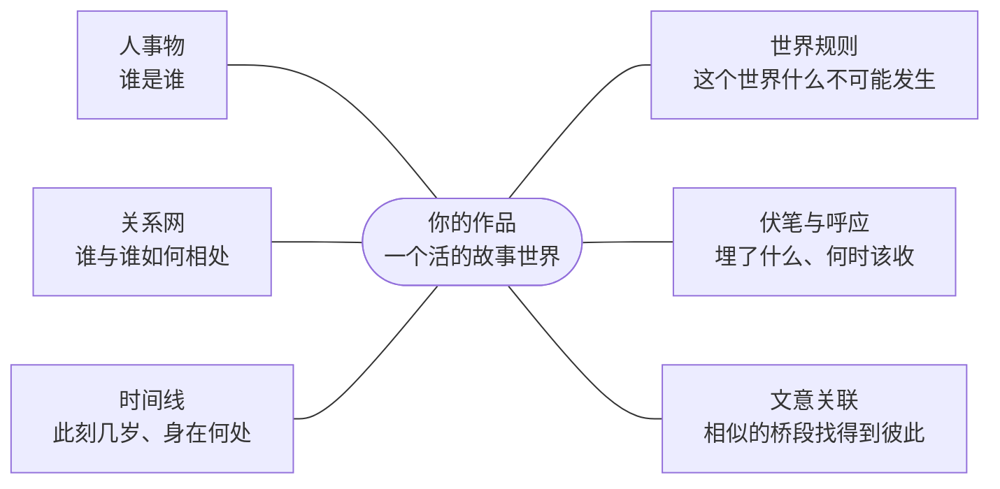

# 05 — 故事世界与一致性

**你此刻的问题**:写到第 50 章,AI 还记得第 3 章吗?改了一个设定,它真知道哪里要跟着改吗?

**产品的回答**:把整本书维护成一个活的故事世界——设定与正文、明写的事实与暗埋的关联都装在里面;AI 的每一次起草、检查与回答,都站在这个世界之上,而不是凭对前文的模糊印象。

## 一致性 > 一切

读者弃书最快的方式,是读到一处前后矛盾:死掉的人重新开口、改过的年龄悄悄回潮——出戏只要一瞬间,而读者往往比你更早发现裂缝。所以一致性在这个产品里压倒一切(见 [02 — 产品原则](./02-principles.md) 原则五),落成两条不讲条件的承诺:

**材料必装齐。** 生成与审查所需的一致性材料必须装齐;真装不下时,系统明确告诉你该分卷了,绝不悄悄省略一部分蒙混过去(R9,见 [03 — 守则与红线](./03-guardrails.md))。

**事实以故事世界为准。** 对话里聊过的、记忆里存过的,凡与故事世界冲突,一律以故事世界为准(R8)。世界只有一个版本,所有 AI 角色对齐同一份事实。

## 故事世界的六个维度

故事世界从六个维度装下你的作品;少任何一维,都有一类崩坏无人看守:

**人事物。** 角色、地点、道具、组织——这本书里谁是谁、什么是什么。没有它,两个都叫"老张"的配角会被混成一个人,张冠李戴的描写没人拦得住。

**关系网。** 师徒、敌友、上下级,以及它们随剧情的演变。没有它,你把林川的师父从张三改成李四,所有写过师徒互动的章节没有人知道要跟着改。

**时间线。** 角色的年龄、所在地与状态随章节推移。没有它,你把"林川 28 岁"改成 26,第 50 章那句"五年后"算出来的年龄就全错了。

**世界规则。** "此世界没有手机"这类不指向任何具体人物的约束。没有它,规则改了,前文所有掏出手机的段落静默失效,没有谁会被点名。

**伏笔与呼应。** 哪一段埋下了怀表、哪一章要把它收回——埋设与回收之间的显式关联。没有它,你删掉埋怀表的那一段,十章后的回收就成了无源之水,伏笔静默断裂。

**文意关联。** 相似的桥段、相近的台词找得到彼此。没有它,"林川以前对女上司说过什么类似的话"无从问起,桥段开始自我重复也无人提醒。

六维不是六个功能,是同一个世界的六个看守面:写手备料、一致性守护者找矛盾、你随手提问,面对的都是它。

## 设定体系

故事世界的输入是你的设定体系,它覆盖一部长篇网文用得上的全部维度:世界观、大纲、节拍设计、角色、阵营、组织、地点、道具、事件、时间线、关系、故事线、伏笔、章节弧线、力量体系、术语、禁忌、主题、读者承诺。

流派用不到的维度安静占位、不打扰:都市文用不上力量体系,它就不出现在你面前;哪天你真开一本修仙,它原地就位。设定体系不考你"会不会建档",只在你需要某一维时保证它在。

## 开书

开一本新书时,作者不需要先面对一张空白设定表。你可以只给一句故事种子,系统把它拆成一组可审定的起点:题材方向、主角、核心矛盾、世界规则、前三章钩子、读者承诺和第一批角色关系。每一项都停在你面前,由你通过、否决,或改后通过;只有被你审定的内容才进入故事世界。

开书不是一次性生成整本书,而是把"从一个念头到第一份可写世界"这段最容易卡住的路铺平。系统给出的是可修改的脚手架,不是替作者宣布世界已经成立。

首次使用时,样例项目承担同一个目的:不让作者先学习界面再理解产品。打开样例,你能直接看到一个已经有角色、章节、伏笔和审批痕迹的故事世界,并在真实材料上体验查询、改名、连带修改和审定。

## 资料卡

设定体系里,两类资料卡承担最重的守护职责:

- **角色卡**:本名与别名;弧光——起点、终点与中途轨迹;读者承诺;角色禁忌;价值观基线;智力基线。
- **章节卡**:钩子类型(前三章必填);主线或支线;进度里程碑;视角角色;预期弧光。每一项都可随写作修订。

这些要素不是归档作业:它们直接喂给守则检测与弧光追踪(见 [03 — 守则与红线](./03-guardrails.md)、[09 — 叙事诊断与读者预演](./09-narrative-and-reader.md))——你填得越准,守护就越准。

## 写前自动备料

写第 50 章,动笔之前写手已经知道:林川此刻多大、人在哪里、和谁敌对;哪条伏笔到了该收的窗口;上一章结在哪个钩子上;这个世界禁止什么。你不需要动笔前手动挑资料、一份份塞给 AI——备料是动笔前的默认动作,不是你的功课。

同类工具把这件事留给作者:每写一章前自己挑资料卡塞给 AI,挑漏了,它就半瞎着写。Open Novel 的立场是:记得住一百万字,本来就该是系统的本分。

## 边写边查

故事世界不只在幕后供 AI 使用,它随时答你的话:

- **随点随跳**:正文里点一个角色名,直接跳到他的资料;悬停即见摘要卡,不必离开稿面。
- **引用回链**:打开任何一份资料,看到"这个角色被哪些章节引用",一条条带着原文片段,点击即达。
- **全项目改名**:角色改名一次,全书每一处引用一起改,整批走审批(见 [08 — 审批与连带修改](./08-approval-and-cascade.md))——不存在改了资料、漏了正文的中间态。
- **框选修改**:框选一段正文,直接提要求;小处表达修改贴着原文给前后对照,由你就地确认;牵动设定、事实或多处章节时再进入整批审定。
- **即问即答**:四类问题随口问——林川第 50 章时是什么状态?他和王小芳的关系怎么一路变过来?他对女上司说过什么类似的台词?哪些段落提到过怀表?答案直接来自故事世界,不经创作模型杜撰。

## 世界治理

一个活的世界需要打理,但打理它的不该是你:

- **派生资料系统维护。** 关系矩阵、全角色年龄一览这类由事实推出来的资料,系统自动维护,你不必也不能手改(R7)——它们永远与事实一致,不会被一次顺手的编辑改坏。
- **私人笔记归你。** 你想在派生资料之外补充备忘——某段恩怨的细节、只有你知道的暗线——写在你自己的笔记里,系统不碰。
- **重大改动自动留底。** 核心设定的每次重大改动都保留历史依据;想恢复到某个旧状态时,系统生成新的恢复提案让你审定。
- **设定体检。** 孤儿设定、断裂的伏笔、失效的关联,系统定期体检并提醒你;体检给的是信号,处置由你决定(见 [02 — 产品原则](./02-principles.md) 原则三)。

## 约束

三条边界,划清世界与你的分工:

1. **系统不替你写设定。** "建议给林川加一个师父"这样的提议可以有,落笔的永远是你——世界记录你的决定,不替你做决定。
2. **关系需显式声明才被守护。** 正文里随口写到的"林川的师父",不会被自动收进关系网——系统不替你断言修辞是不是事实;你显式声明过的关系,才进入守护范围。
3. **未决连带修改阻断写作(R4)。** 世界里还有没改一致的地方时,不能继续写正文——先把世界改一致,再继续讲故事。
