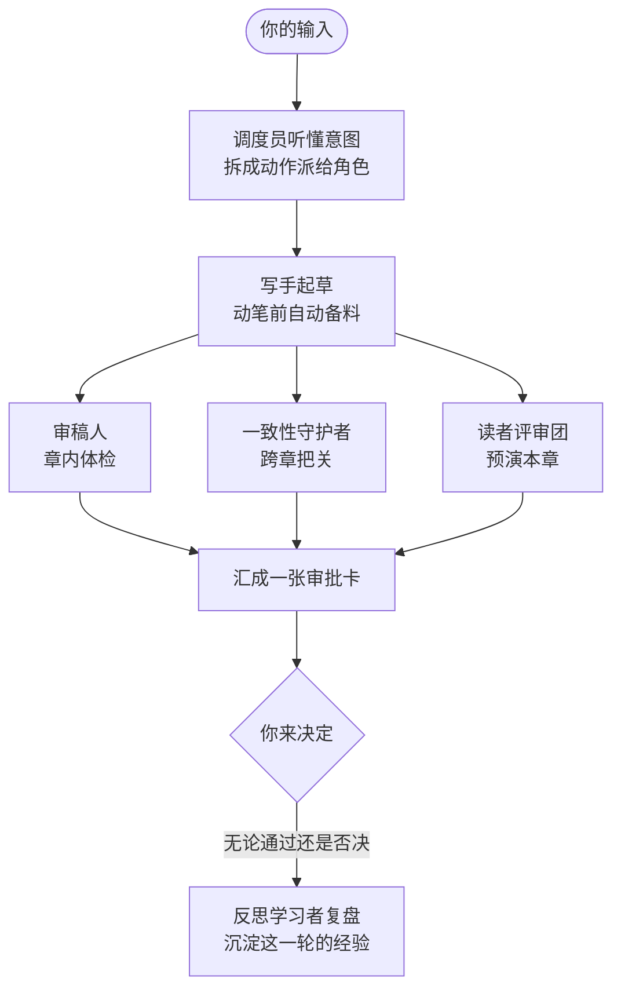

# 06 — AI 角色团队

**你此刻的问题**:一个人写长篇,写手之外还有策划、设定管理员、校对、编辑、读者代表五六个工种压在身上;AI 帮手却往往只是一个什么都干、什么都不精的聊天框。

**产品的回答**:把 AI 组织成一个分工明确的编辑部——七个角色各守一摊、互相校验,把写手之外的工种接走,把写手的位置完整地留给你。

## 一个编辑部,不是一个全能 AI

全能 AI 像一位什么都答应的万事通:请它看节奏,它顺手把你的文风也"优化"了;请它写正文,它对三十章前埋下的伏笔一无所知;出了错,你不知道是哪一步、凭什么出的错。Open Novel 不养万事通,养编辑部:每个角色只看自己专业的那一面,把一件事看到底;角色之间互相校验——写手起草的稿子,要过审稿人、一致性守护者、读者评审团三双眼睛,才到你面前。

分工比全能强,强在三处:

- **专业视角不稀释**。盯章内节奏的不管跨章事实,盯跨章事实的不管文风,每双眼睛只看一层,才看得深。全能 AI 的"都顾",落到一百万字上就是都顾不好。
- **可独立调配**。每个角色独立设档、独立开关:高成本的能力可以整个关掉,轻量的保持常开;省钱关掉的是整个角色,而不是让留下的角色偷工减料(见 [02 — 产品原则](./02-principles.md) 原则七)。
- **过程可归因**。每条建议、每处预警都署名:哪个角色、看了什么材料、依据什么得出,随时可回看(见 [02 — 产品原则](./02-principles.md) 原则二)。

## 七个角色

每个角色用同样的三问介绍:管什么、什么时候出场、给你什么。

### 调度员

- **职责一句**:听懂你一句话里的多个意图,拆成具体动作,派给合适的角色。
- **什么时候出场**:你每输入一句话,它出场一次;派完即退,不再插手执行。
- **给你什么**:你不必学"指挥 AI 的话术"——"把主角改成女生,顺便看看第二章节奏"一句说完,两件事各自找到该干的人。

### 写手

- **职责一句**:正文、章节概要、设定文档的起草者,全团队唯一动笔的角色。
- **什么时候出场**:任何要产出文字的动作——写正文、拟概要、起草设定——都由它执行。
- **给你什么**:动笔前自动备齐本章所需的设定、前情与待回收伏笔(见 [05 — 故事世界与一致性](./05-story-world.md));交到你面前的永远是提案,不是既成事实。

### 审稿人

- **职责一句**:章内体检——风格、流畅度、章内节奏,承担叙事力学诊断的章内部分。
- **什么时候出场**:写手每出一章稿随即审一遍;诊断在章节完成后批量给出,不在你写到一半时插话。
- **给你什么**:一份章内诊断(见 [09 — 叙事诊断与读者预演](./09-narrative-and-reader.md)):哪段拖了、哪句不顺、钩子立没立住,标记在稿上,听不听由你。

### 一致性守护者

- **职责一句**:跨章把关——事实矛盾、改动的连锁影响、角色弧光偏离。
- **什么时候出场**:每次落稿之前;以及你改动任何设定时,把波及的章节与设定一次找全(见 [08 — 审批与连带修改](./08-approval-and-cascade.md)、[05 — 故事世界与一致性](./05-story-world.md))。
- **给你什么**:矛盾在进入正文之前被拦下——死掉的人不会复活,改过的年龄不会回潮,偏离的角色弧光被点名(见 [09 — 叙事诊断与读者预演](./09-narrative-and-reader.md))。

### 读者评审团

- **职责一句**:多位口味各异的虚拟读者并行预演本章,各自给出真实反应。
- **什么时候出场**:章节完成之后、发布之前。
- **给你什么**:一份弃书风险报告(见 [09 — 叙事诊断与读者预演](./09-narrative-and-reader.md)):谁在哪一段想弃书、为什么——在真实读者流失之前先看到;多人共标的风险比单人标记更值得认真对待,采不采纳由你。

### 润色师

- **职责一句**:去 AI 化——把长句、套话、AI 腔抹成你的文风。
- **什么时候出场**:只在你召唤时出场;不调用就不出场、不产生消耗。
- **给你什么**:经得起读者细看的成稿。每一处修改都给前后对照,小处表达贴着正文由你确认,越过表达层的改动进入整批审定;不会借润色之名偷改你的意思。

### 反思学习者

- **职责一句**:每轮交互后复盘你的决定——采纳了什么、否决了什么、改了哪里——沉淀为经验。
- **什么时候出场**:每轮交互结束后默默出场;你主动取消的交互不复盘(R5,见 [03 — 守则与红线](./03-guardrails.md))。
- **给你什么**:你的每轮取舍变成一条条明白话经验(如"偏好短句""改设定时在意称谓"),自动用进之后的生成;经验逐条可看、可调轻重、可删(见 [10 — 记忆与成长](./10-memory-and-learning.md))。它是全团队唯一有权沉淀经验的角色(R8),别的角色不能擅自"替你总结你"。

## 协作流水线

一轮典型的写作协作长这样:

"三路并行审"的意思是:三双眼睛同时开工、互不等待,各看自己专业的那一面——章内、跨章、读者反应,谁也不替谁背书。"一张审批卡"的意思是:三路审查的结论连同稿件本身汇成一次完整呈现,你做一次决定,而不是被零碎弹窗追着确认;审批卡的结构与连带修改如何展开,见 [08 — 审批与连带修改](./08-approval-and-cascade.md)。润色师不在每轮流水线里,按需召唤;这条流水线是写作姿态下的完整形态,讨论与规划姿态只动用其中一部分,见 [07 — 协作与三模式](./07-collaboration-and-modes.md)。

## 你的控制权

一支团队听谁的,决定它是帮手还是负担。四个旋钮——档位、开关、用量、性格文风——都在你手里;本节的可关矩阵是全部文档中"什么能关、什么不能关"的唯一出处,其他各篇一律引用此处。

**档位按角色可调。** 高成本能力优先给核心创作与一致性把关,轻量能力优先给调度、提示、预演和复盘。每个角色的用量档位都可单独调整,但省钱的方式是调低或关闭明确能力,不是让保留的能力偷工减料(见 [02 — 产品原则](./02-principles.md) 原则七)。

**可关矩阵。** 哪些角色能关、关到什么程度,以下表为准:

| 角色 | 能否关闭 | 说明 |
|---|---|---|
| 调度员 | 不可关 | 主链路:它停了,你的话就没人听懂、没人派活。 |
| 写手 | 不可关 | 主链路:唯一动笔的角色,关它等于关掉创作本身。 |
| 审稿人 | 部分可调 | 守则检测部分永不可关(R10,见 [03 — 守则与红线](./03-guardrails.md));其余诊断可调灵敏度。 |
| 一致性守护者 | 部分可调 | 守则检测部分永不可关(R10);其余一致性诊断可调灵敏度。 |
| 读者评审团 | 可整体关 | 每位虚拟读者也可单独开关、调整发言权重。 |
| 润色师 | 按需调用 | 不调用即不产生任何消耗;调用与否每次由你决定。 |
| 反思学习者 | 可关 | 关闭后不再学习新经验;已沉淀的经验继续生效。 |

**用量随时可见。** 每一轮花了多少、花在哪个角色身上,点开状态点即可回看;累计用量在设置中常驻可查。看不见的消耗不存在(见 [02 — 产品原则](./02-principles.md) 原则七)。

**性格与文风项目级可定制。** 助手性格(如"毒舌助理,会主动指出剧情漏洞")、作品流派、文风偏好、范文参考,都按项目设定:定一次,全团队对齐;换一本书,互不渗漏(R2)。
