# 06 — Cascade 一致性与反馈学习

## Cascade 一致性

### 问题

用户的核心痛点之一:**"改了一个角色资料,后面写出来的章节自相矛盾"**。例如把主角性别从男改女后,后续章节里仍然用"兄弟"、"小子"等男性化称谓。

### 解决方案:内部递归 cascade + 整批审批

> **[info]** ⚠ **关键交互模型**:writeSetting / writeChapter **不直接落盘**(proposal-only,见 [spec/06](../spec/06-approval-flow.md))。Cascade 递归全部在审批前的内部循环里完成,用户只看到一次最终汇总的 ChangeSet。

**审批流程图**

```mermaid
flowchart TD
  U([用户发起修改意图<br/>例: 把林川性别改成女性]) --> W0[Writer 生成主修改<br/>in-memory 未落盘]
  W0 --> LOOP{{内部递归循环<br/>用户不可见}}
  LOOP --> R1[第 1 轮 analyzeImpact<br/>基于 main delta]
  R1 --> S1["step 1: extractSemanticDelta<br/>frontmatter/正文 diff 结构化 delta"]
  S1 --> S2["step 2: computeImpactRadius 纯 SQL<br/>entity_refs/concept_refs (w=100)<br/>关系上下游 1 跳 (w=50-90)<br/>dependencies 锚点 (w=70)<br/>timeline 区间 (w=80)<br/>embeddings topK (w=cos×100)"]
  S2 --> S3["step 3: filterByLLM<br/>Pro 批 5 段过滤 ChangeProposal[1]"]
  S3 --> WS[Writer 内部短调用<br/>对每条 needsChange=true 生成 afterText<br/>内存未落盘]
  WS --> R2["第 2 轮 analyzeImpact<br/>基于 afterText 新 delta<br/>SQL 半径严格收缩 (阈值 30 60)"]
  R2 --> R3["第 3 轮 若仍有候选<br/>weight 阈值 60 90"]
  R3 --> TERM{终止条件<br/>候选空 / 半径不收缩 / 深度=3}
  TERM --> SET[汇总 ChangeSet<br/>主修改 + 所有 cascade proposal 含二级]
  SET --> AC["一次 ApprovalCard 呈现整批<br/>顶部影响图谱 节点=entity/file/concept<br/>每条 proposal 一行 diff 默认展开<br/>每条 proposal 勾选框 默认勾<br/>全选 / 全不选 / 一键同意 / 手动编辑 / 拒绝全部"]
  AC --> DEC["用户决定<br/>POST /api/approvals/{id}/resolve"]
  DEC --> TX[后端 transaction<br/>一次写所有 accepted 文件 主+cascade]
  TX --> SIDE[触发副作用<br/>差量 reindex / snapshot / history group / Reflector 入队]
```



### Validator + analyzeImpact 的关键约束

- **不现场 LLM 推影响范围** — analyzeImpact step 2 的 SQL 已覆盖,LLM 只做二次判断
- **递归全部在审批前完成** — 用户审之前所有"二级 / 三级 cascade"已被算出并合入同一 ChangeSet
- **绝不静默修改文件** — 任何文件变更必须经过整批 ApprovalCard 用户勾选
- **每条 proposal 必须含**:`anchorId`, `targetFile`, `needsChange`, `proposedText`(needsChange=true 时), `reason`, `confidence`, `cascadeLevel`(1=主 / 2=一级 / 3=二级)
- **不确定时 confidence='low'**,UI 用黄色警告 + 默认不勾选
- **needsChange=false 也必须给 reason**(审计需要,展示在影响图谱中作为"已分析但无需改动")

### 性能策略

- SQL 影响半径 < 100ms(5K 段规模)
- LLM 二次过滤每批 5 段 ~3-5s
- **内部递归 ≤ 3 轮典型耗时 15-45s** — UI 在 Writer 出主修改后立刻显示进度("正在分析影响范围... 第 1 轮 / 第 2 轮 / 第 3 轮"),作者可看到内部进度但不能干预,直到 ChangeSet 出来

## Reflector 反馈学习(简化版)

### 设计动机

用户希望系统**越用越懂自己**。直接微调模型代价过高(DeepSeek 暂未开放微调),但我们可以把"经验"持久化为结构化数据,**自动注入到后续生成的 system prompt**,实现廉价但实用的"learning"。

**MVP 阶段范围**:保留核心闭环(per-turn LLM 提炼 + weight 自然衰减 + context builder 注入 top-8 + cardinal_rule scope top-1 保留);砍掉 hit_count 跟踪 / archive 软删 / 学习面板 / 跨进程 hydrate / 命中加权,后续二期补。

### Reflector 触发时机(per-turn 批次)

触发条件:**`user_turns.status` 从 'running' / 'awaiting_approval' 转入终态 'done' 时入队**([spec/01](../spec/01-storage-schema.md) §user_turns)。每 turn **跑一次** Reflector,输入是整个 turn 的:

- 用户原话(`user_turns.user_input`)
- Router 解析的 `actions[]`(`user_turns.router_actions`)
- 每个 action 的决议(`approvals` 表 WHERE turn_id=X,含 approve / reject / edited + accepted_items + feedback)

**为什么 per-turn 而非 per-cascade_group**:单 turn 内的多个 action 之间有**因果关联**。例:action[0] 改主角性别接受 12/15 cascade,action[1] Writer 写章节用了新性别 + 漏改称谓 → 用户 reject → 这串经验只有跨 action 看完整 turn 才能提炼出 "gender cascade 用户在意称谓不在意 X"。逐 cascade_group 跑 Reflector 看不到这层因果。

**cancelled turn 不跑 Reflector**:`user_turns.status='cancelled'` 表示用户主动放弃整 turn([spec/06 §Turn 取消语义](../spec/06-approval-flow.md)),含义是"这次试错本身就不该参考",入 learnings 反而误导后续生成。cancelled turn 进 `history` 留 trace(Settings → 审批历史可查),但不进 Reflector 训练数据。

### Reflector 输入 / 输出

输入:

```json
{
  "context": {
    "agent": "writer",
    "mode": "write",
    "input": "...原始 prompt + 上下文...",
    "output": "...Agent 生成的内容...",
    "user_decision": "edited",
    "user_final_content": "...用户改后的内容...",
    "feedback_text": "短句太长,改短了"
  }
}
```

输出 — 走 [JSON mode](../spec/24-json-output.md),zod schema 见 spec/24 §Reflector 经验提炼:

```json
{
  "learnings": [
    {
      "insight": "用户偏好≤25字短句,生成时多用句号少用逗号",
      "evidence": "本次将12处长句拆成短句",
      "scope": "style",
      "applicableAgents": ["writer", "humanizer"],
      "suggestedWeight": 1.5
    }
  ],
  "turnId": "turn_01HX..."
}
```

scope 枚举值(与 spec/24 一致):`style`, `narrative`, `pacing`, `voice`, `worldview`, `character`, `consistency`, `relations`, `cardinal_rule`, `intent`, `mode`。

### `learnings` 表 schema

> **[info]** **Schema 主权 (Wave 4)**: 完整 `CREATE TABLE learnings` 见 [spec/01 §learnings](../spec/01-storage-schema.md#learnings)。本节原"简化版" CREATE 已删 (与 spec/01 重复)。

本计划阶段约束:简化版**不带** `hit_count` / `last_hit_at` / 归档表(`learnings_archive`)等加权与软删字段 — 二期视实际需求再加 (具体见 plan/06 §不做什么)。spec/01 §learnings 已含 `hit_count` / `last_hit_at` 字段, MVP 阶段这些字段保留默认值 0 / NULL, 不参与衰减计算。

### 注入策略

> **[info]** 注入由 [spec/23 §learnings 注入](../spec/23-context-contracts.md) 的 per-agent context builder 统一做,所有 Agent 共享同一逻辑。

每次 Agent stream 启动前(经 context builder):

1. 按当前 Agent 的 scope 集合查(见 [spec/23 §agentScopes](../spec/23-context-contracts.md))
2. `WHERE weight >= 0.2`(低于 0.2 视为已失效)
3. 按 `weight desc` 排序,取 **top-8**(不是为省 token,是为模型注意力 — 注入 30 条经验反而稀释主任务)
4. **`scope='cardinal_rule'` top-1 永远保留**(无论 weight 排序如何;[spec/25](../spec/25-cardinal-rules.md) 五大守则学习不可被一般经验挤掉)
5. 拼接为 system prompt section:
   ```
   ## 用户偏好与项目经验 (Reflector 沉淀)
   以下经验来自历次审批反馈,优先级由高到低。**遇到冲突时这些经验优先于通用风格**。

   - 用户偏好≤25字短句,生成时多用句号少用逗号  (置信度 1.50)
   - 对话场景中尽量少用'地'字补语                 (置信度 1.20, 守则)
   ...
   ```

### weight 调整(简化版)

| 触发 | 调整 | 说明 |
|---|---|---|
| 初始入库 | weight = 1.0(或 Reflector suggestedWeight) | Reflector 写入时 |
| 30 天衰减 | × 0.95 | 自然衰减(后台 cron 跑) |
| weight < 0.2 | 不注入(但保留在表中) | 简化版不归档,直接软过滤 |

简化版砍掉的(二期补):

- 命中加权 +0.5(需要 hit 追踪 + 关联 approvals)
- 拒绝降权 -0.3(同上)
- archive 归档表 + 30 天可恢复
- SettingsDialog 学习偏好面板(用户手动 +/-/删)— 详 [spec/13 §学习偏好面板](../spec/13-settings.md#学习偏好面板) deprecation stub
- 跨进程 hydrate(启动时按 projectId 加载 top-K)

**`scope='cardinal_rule'` 例外**:这类 learning **不参与衰减**,只能用户在 SettingsDialog 显式调整守则阈值时同步移除([spec/25](../spec/25-cardinal-rules.md))。

## 与 LLM 微调的对比

| 维度 | RAG 经验注入(本方案) | 模型微调 |
|---|---|---|
| 启动成本 | 0 | 数据收集 + 训练 + 部署 |
| 增量学习 | 即时 | 需重新训练 |
| 可解释 | 全可见 | 黑盒 |
| 准确度 | 中(受 prompt 长度限制) | 高 |
| 适合场景 | 起步 + 长尾 | 风格固化期 |

当前方案足够。后续如发现某些经验高度重复且稳定,可以 export 成数据集为微调做准备。

## 不做什么

- **MVP 不做 hit_count 跟踪** — 加权依赖 prompt_traces 关联,实施复杂度大,二期补
- **MVP 不做学习偏好面板** — 用户暂时无法手动 +/-/删 / promote / 软删恢复;若 learnings 误学,只能等 30 天衰减
- **不做跨项目 learnings 共享** — 避免一个项目的特殊偏好污染其他风格不同的项目
- **不做模型微调** — RAG 注入足够,见上表

## 关联文档

- **上游**:[plan/01](./01-overview.md) 不变性 #6 / #10 · [plan/02](./02-multi-agent.md) §Reflector Agent · [plan/11](./11-knowledge-graph.md) 知识图谱
- **核心 spec**:[spec/19](../spec/19-impact-analysis.md) analyzeImpact · [spec/06](../spec/06-approval-flow.md) 审批流(含 Turn 取消语义 / doom-loop)· [spec/22](../spec/22-memory-and-history.md) memory · [spec/23](../spec/23-context-contracts.md) 上下文契约 · [spec/24](../spec/24-json-output.md) Reflector JSON schema
- **下游**:[spec/01](../spec/01-storage-schema.md) learnings 表 · [spec/25](../spec/25-cardinal-rules.md) cardinal_rule scope

## ADR · 设计决策

| 编号 | 决策 | 选项 | 选择 | 理由 |
|---|---|---|---|---|
| ADR-01 | Reflector MVP 简化范围 | 完整版(hit 追踪 + 加权 + archive + 面板) / **简化版(只衰减 + 注入)** / 完全砍 | **简化版** | 用户决策"不砍掉,但简单做";保留产品价值核心闭环(LLM 提炼 + 注入 + cardinal_rule 保护),砍运维复杂度(hit 追踪需要 prompt_traces / archive 表 / UI 面板)。误学只能等衰减,可接受 |
| ADR-02 | cascade 递归位置 | 审批后多次落盘 / **审批前内部递归整批审** / 现场 LLM 推 | **审批前内部递归整批审** | 用户审 1 次 vs 审 N 次;落盘前可见全貌可发现"二级 cascade 把另一个角色搞崩";transaction 原子避免半落地 |
| ADR-03 | 影响半径计算方式 | LLM 现场推 / **SQL 出候选 + LLM 二次过滤** / 全文喂 LLM | **SQL 出候选 + LLM 二次过滤** | LLM 现场推漏检率高(测试结果详见 progress/005);SQL 覆盖关系上下游 / 时间区间 / 概念引用 / 段级 embedding 五维;LLM 只做"是否真受影响"的二元判断 |
| ADR-04 | per-turn vs per-cascade-group 触发 | per-cascade-group(细粒度)/ **per-turn(粗粒度)** / per-approval(最细) | **per-turn** | 单 turn 内多 action 之间有因果关联,粗粒度才能提炼出跨 action 经验(例:gender cascade + write chapter 漏改称谓 = "gender cascade 用户在意称谓") |
