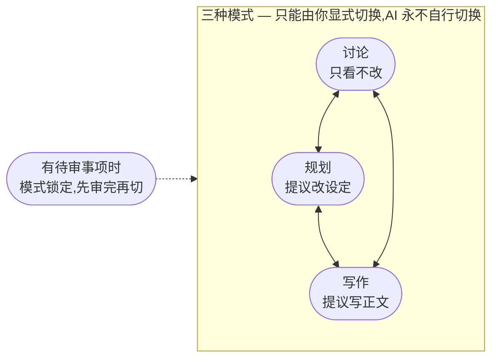

# 07 — 协作与三模式

**你此刻的问题**:跟一个会写字的 AI 共事,最怕两件事——它擅自动了你的稿子,和你不知道它此刻正在干什么。

**产品的回答**:一套铁三角协作契约——AI 只提议,你来审批,系统持久记账——加上三种界限分明的工作模式,让"它现在能动什么、正在干什么"在任何时刻一目了然。

## 铁三角:提议 → 审批 → 持久

所有协作都遵循同一条母规则,它分三步:

**提议。** AI 无论多聪明、备料多齐,它的产出永远停在提案这一步:一段正文、一处设定修改、一批连带改动,都以提案的形态摆到你面前,不落一笔。提案可以无限完整——附上依据、诊断与影响——但完整的上限是"备得多齐",不是"替你确认"。

**审批。** 每一个落笔的决定由你做出:通过、否决、改后通过(R1,见 [03 — 守则与红线](./03-guardrails.md))。否决时说出理由,AI 带着你的理由重做——这一来一回不是流程负担,是你调教这支团队的方式。

**持久。** 你通过之后,系统才把结果持久写入作品,并把这次决定记录在案:改了什么、依据什么、你怎么裁定的,事后随时可查;你的裁定本身也被沉淀为经验,让系统越用越懂你(见 [10 — 记忆与成长](./10-memory-and-learning.md))。

这条契约不分模式、不分角色、没有例外:润色师的一处措辞润色与写手的一整章正文,过的是同一道闸门;再小的改动也不存在"小到不用审"的后门。

三步缺一不可,顺序不可颠倒。接下来的三种模式不是三套新规则,只是这条母规则在不同场景下的细化——它们调整的只有一件事:AI 在当下被允许提议改什么。

## 三种工作模式

和 AI 共事的每一刻,你都处在三种模式之一:只聊不写的**讨论**、只动设定的**规划**、产出正文的**写作**。模式回答的是权限问题,不是界面装饰——它划定 AI 此刻的手能伸到哪里:

| 模式 | 你的场景 | AI 能看 | AI 能改 |
|---|---|---|---|
| **讨论** | 检索、对话、拿不准先聊聊 | 全部 | 改不了任何东西 |
| **规划** | 搭世界观、改设定 | 全部 | 提议修改设定(经你审批);不碰正文 |
| **写作** | 产出正文 | 全部 | 提议正文与连带改动(经你审批);不碰设定 |

三种模式眼界相同、权限不同:看,永远看得全——讨论时也能查任何一章,写作时也能引任何一条设定;改,各守一界——讨论一笔不动,规划不碰正文,写作不碰设定。界限分明带来的是确定感:你永远不必担心"聊着聊着它把稿子改了"。

**讨论,是想清楚之前的安全区。** 问"你觉得主角应该长什么样",查"林川上次见王小芳是哪一章",把一个拿不准的剧情走向先聊透——全程没有任何东西会被写入,聊得再深也不在作品上留痕。没有审批卡,因为没有什么需要审。

**规划,动世界、不动故事。** 搭世界观、立角色、修改设定都在这里发生:写手起草设定提案,一致性守护者把改动波及的设定与章节一次找全,汇成审批卡等你裁定。正文在这个模式下纹丝不动。

**写作,产出正文的完整阵型。** [06 — AI 角色团队](./06-agent-team.md) 那条"写手起草、三路并行审、汇成一张审批卡"的流水线,就是写作模式的完整形态;讨论与规划只动用其中一部分,写作全员到齐。设定在这个模式下不被改动——写到一半发现设定本身要动,AI 会提醒你切到规划处理,而不是越界代劳。

把动设定与动正文分进两个模式,不是分类洁癖:一处核心设定的改动波及面动辄几十处,若与正文产出搅在同一股劲里,你很快分不清哪一笔是创作、哪一笔是补救。一界管一事,每一次审批都只有一种心智负担。

模式切换守三条规则:

1. **只能由你显式切换。** AI 永不自行切换模式(R3,见 [03 — 守则与红线](./03-guardrails.md))。它最多提醒你"这件事要切到规划才能做",切不切、什么时候切,永远是你的动作。
2. **有待审事项时模式锁定。** 审批卡停在你面前时,先把决定做完,再换姿态;锁定的完整语义见 [08 — 审批与连带修改](./08-approval-and-cascade.md)。
3. **切换即时生效、有明确反馈。** 切换没有过渡态,落下即生效;界面当即告诉你已身处哪个模式,你不必猜、也不必试。

三种模式连起来是一天创作的自然节律:拿不准,先在讨论里聊透;聊出了结论,切到规划把世界改一致;世界稳了,切到写作产正文。模式不是流程枷锁,顺序由你定,随时可以折返。

## 一次输入,多个动作

你的一句话可以装下多个意图。"写第三章开头,顺便看看第二章节奏"——调度员(见 [06 — AI 角色团队](./06-agent-team.md))听懂这是两件事,拆成"写第三章开头"与"诊断第二章节奏"两个动作,按你说的顺序排好,逐个交给该干活的角色执行;顺嘴一提的第二件事不会因为只是顺嘴一提就被忘掉。你不必把任务掰碎了一条条下达,也不必学任何指挥句式。

动作排队执行的过程中,主动权始终在你,三种处置随时可用:

- **插队**:新输入优先。临时想起更要紧的事,直接说,它排到队伍最前面。
- **取消**:点名撤掉排队中的某个动作——"等下,先别写第三章了"——系统听得懂这是反悔而不是一项新任务,把那个动作撤下,其余照常。
- **不动**:什么都不说,队列按序一个个跑完。

队列本身也不是暗箱:排着哪些动作、正在跑哪一个,状态点上看得见;撤掉哪个、谁先谁后,你说了算。

队列同样受当前模式约束:讨论模式下的一句话,排不出一个"改设定"的动作——AI 会告诉你这件事需要切到规划,而不是悄悄替你越界。

排队、插队与取消的用户语义以本节为唯一出处,其他各篇一律引用此处。本节只管审批卡出现之前的队列:一旦某个动作的成果以审批卡的形态停在你面前,此后的一切——包括输入为何锁定、新输入怎么处理——见 [08 — 审批与连带修改](./08-approval-and-cascade.md)。

## 长任务体验

写一整章、预演一章的读者反应、把一次设定改动的连锁影响找全,都不是一眨眼的事。等待本身不可怕,不可接受的是不明不白地等。四条承诺:

1. **进度逐步可见。** 长任务不是一个转圈的黑盒:状态点旁随时一句话告诉你谁在干什么、到了哪一步——"一致性守护者正在分析影响范围""读者评审团读到第三位"。
2. **随时可取消。** 取消入口就在进度旁边,任何时刻一步可达,不用翻菜单、不用等它告一段落。
3. **取消不白花钱。** 取消时已完成的部分保留:预演进行到一半喊停,已读完的那几位虚拟读者的反应照样可看。你为已发生的工作付了钱,成果就归你。
4. **绝不死循环。** 你否决之后,AI 带着你的否决理由重做;如果反复重做的结果仍与被否决的版本高度相似,系统不会继续闷头重试,而是主动停下、升级,把分歧原样摆到你面前,由你裁定下一步——绝不在暗地里烧钱空转。

四条承诺对所有长任务一视同仁:写正文、找连锁影响、跑读者预演、去 AI 化,等待的体验是同一套。合成一句话:等待可以发生,失控不行。

## 透明工作台

AI 干活的全程,默认只占用你一句话的注意力:全部活动收敛为状态点旁的一行字。但收起的只是呈现层级,不是信息本身——全量的推理过程、每一次动作、每一笔用量,随时可以召唤回看;觉得哪一步不对,整段过程可以原样复制下来发回给 AI 当反馈,让它确切知道自己错在哪一步。

回看到的也不是一锅粥:每一步都署名——哪个角色、看了什么材料、依据什么得出,与 [06 — AI 角色团队](./06-agent-team.md) 的"过程可归因"是同一件事的两面。

过程细节是信任的备查证据,不是要求你时刻必读的内容:平时安静,要查就在。这与"透明非黑盒"互为印证,见 [02 — 产品原则](./02-principles.md) 原则二。
