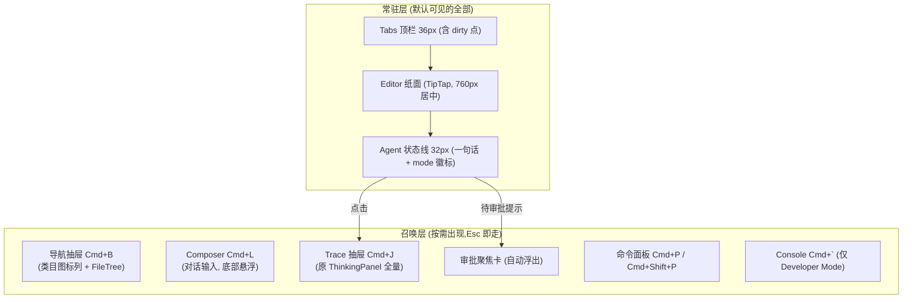
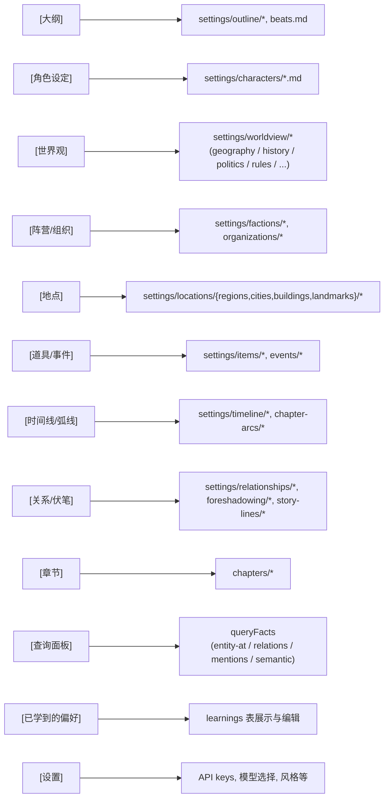
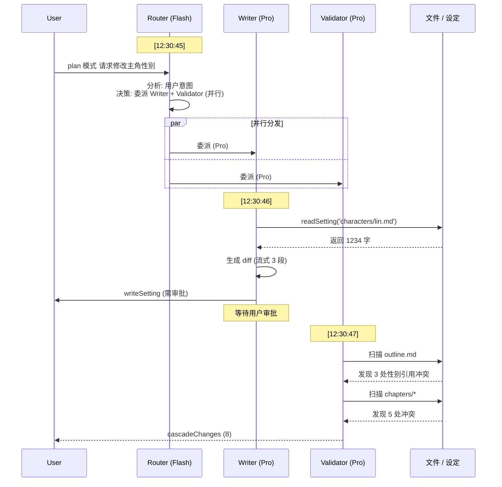

# 07 — UI 布局

## 目标

写作优先:**IDE 的能力,纸面的外观**。打开应用,默认界面只有正文纸面和一条 agent 状态线;文件导航、对话输入、思考过程、调试信息全部是「召唤式」表面,用完即走。IDE 范式保留在肌肉记忆层(快捷键、多文件、split view、Goto Definition),不保留在常驻外观层。

> **[info]** 2026-06-11 修订:此前目标为「仿 VSCode 的 IDE 形态,把小说创作等同于代码编辑」。用户在高保真原型上实测后判定五区常驻信息过载(太挤、难以使用),设计思想改为本节所述。决策记录见下方 ADR-01 / ADR-04,界面契约见 [design/01](../design/01-main-layout.md)。

### 注意力法则

1. **纸面是唯一主角**:任何时刻常驻屏幕的层 ≤ 3 —— Tabs、纸面、状态线
2. **AI 过程默认一行**:agent 活动收敛为状态线一句话;trace、工具调用、成本、日志都在召唤之后才出现
3. **打断只为审批**:唯一允许主动浮到纸面之上的是审批聚焦卡(信任仪式);其余一切等待召唤

## 布局总览

| 表面 | 组件 | 默认 | 召唤方式 |
|---|---|---|---|
| Tabs | `<Tabs>` | 常驻(弱化) | — |
| Editor | `<Editor>` | 常驻,唯一纸面 | — |
| Agent 状态线 | `<AgentStatusLine>` | 常驻 32px | 点击展开 Trace 抽屉 |
| 导航抽屉 | `<NavDrawer>`(类目列 + `<FileTree>`) | 收起 | `Cmd+B` / 点击 breadcrumb 路径段,推开式 |
| Composer | `<Composer>`(原 ChatBox) | 隐藏 | `Cmd+L` / 状态线 ✦ 按钮,底部居中悬浮 |
| Trace 抽屉 | `<TracePanel>`(原 ThinkingPanel) | 收起 | `Cmd+J` / 点状态线,右侧推开式 |
| 审批聚焦卡 | `<ApprovalCard>` | 仅 `await_approval` 时 | 自动浮出([design/02](../design/02-approval-cascade.md)) |
| DebugConsole | `<DebugConsole>` | 不存在 | Developer Mode 下 `` Cmd+` `` 浮出 |

FileTree **默认隐藏所有 `_` 前缀文件 / 目录**(`_index.md` / `_matrix.md` / `_registry` 等系统索引与派生文件),[spec/13](../spec/13-settings.md) §Developer Mode 切换可见。

## 区块尺寸 / 可调整

使用 `react-resizable-panels` 实现拖拽(仅对推开式抽屉生效):

- Tabs:36px 常驻;Editor:弹性全宽,纸面最大 760px 居中
- Agent 状态线:32px 常驻底部
- 导航抽屉:288px(48px 类目图标列 + 240px 文件树),可拖宽;推开纸面不遮挡
- Trace 抽屉:默认 400px,可拖宽;推开式
- Composer:底部居中悬浮 640px,不参与拖拽;`Esc` 收回
- Console:Developer Mode 专属,240px 底部浮出,可拖

## 导航抽屉(类目 + FileTree)

抽屉左缘是类目图标列(原 ActivityBar 并入),右侧为对应文件树;切换类目,文件树随之切换:

**Settings 配置图**

> **[info]** 实际 UI 不必每个目录一个类目项 — 高频项(角色 / 世界观 / 章节)优先,其他折叠到"更多设定"二级菜单。具体取舍 W6 实测后调。日常跳转的主路径是 `Cmd+P` 模糊打开与正文内 Goto Definition,抽屉是浏览路径而非必经路径。

## Tabs 行为

- 双击文件 → 在新 Tab 永久打开(单击是预览模式,会被下一次单击覆盖)
- 拖拽 Tab 到编辑区右半 → 触发 split view(用于 Goto Definition)
- 中键关闭;Cmd+W 关闭当前;Cmd+Shift+T 重开最近关闭
- 保存状态用 tab 上的 dirty 圆点表达(原状态栏「最近保存时间」取消,详情进 Trace 抽屉头部)

## Editor 区域

- 主体:TipTap 渲染当前 Tab 文件;顶部细行:breadcrumb(路径段可点,点击即在对应类目打开导航抽屉)+ 实时字数
- 实体高亮:字下划线 + 颜色按 category 区分(角色蓝 / 地点绿 / 物品橙);hover 出实体卡
- concept violation:红色虚线下划线;**汇总信号走状态线计数(⚠ n,点击跳段)与滚动条 marker,不再做常驻段落 gutter 图标**
- 框选时浮动按钮:"让 AI 修改 (Cmd+K)" / "查询"
- 原底部状态栏取消:mode 徽标并入状态线与 Composer;token 用量进 Trace 抽屉头部与 Settings §数据管理用量页

## Agent 状态线(常驻)与 Trace 抽屉(召唤)

状态线是 AI 过程的唯一常驻出口,四态:

| 态 | 内容 | 行为 |
|---|---|---|
| 空闲 | 项目名 · mode 徽标 · ⚠ violation 计数(如有)· 右端 ✦ | 点 ✦ 召出 Composer |
| 运行中 | agent 色点脉冲 + 一句话(如「Writer 正在生成 diff · 12s」)+ 长任务进度 `3/5 · 毒舌读者` + 取消 | 点击展开 Trace 抽屉 |
| 待审批 | accent 底升起:「1 个修改待审批 · 查看」 | 点击弹审批聚焦卡 |
| 错误 | danger 色:「连接失败 · 去 Settings 检查 key」 | 点击直达 Settings §API Keys |

Trace 抽屉 = 原 ThinkingPanel 全量能力:per-agent 分块、工具调用行(可展开 JSON)、复制 trace、本 turn 成本;reasoning 默认一句摘要,Developer Mode 展开全文。实时流式渲染所有 SSE 事件:

**Agent 协作流程图**

## Composer(召唤式对话输入,原 ChatBox)

- `Cmd+L` 或状态线 ✦ 召出:底部居中 640px 悬浮卡,`Esc` 收回;可 pin 为常驻(记忆该选择)
- 顶部 mode 切换 toggle:`[Discuss] [Plan] [Write]`(互斥单选)
- **键盘切换**:焦点在 textarea 内按 `Tab` 循环 / `Shift+Tab` 反向(覆盖 textarea 默认插入 tab 字符行为,与 ChatGPT/Claude/Cursor 一致;**IME composition 活跃时不抢键**,详见 [spec/12](../spec/12-shortcuts.md) §IME 闸门)
- 切换瞬间 toast 反馈"已切到 plan 模式"
- 输入框:多行,支持 `@文件名` 引用(详见 [spec/12](../spec/12-shortcuts.md) §@文件名引用);`Cmd+↑/↓` 翻历史(仅空输入框);"重新生成 / 重新生成上一段"
- 发送 `Cmd+Enter` 后 composer 自动收回,进度与取消转入状态线(progress 事件协议见 [spec/04](../spec/04-streaming-protocol.md) §长任务进度协议;取消保留已完成 persona,按 [spec/11](../spec/11-reader-personas.md) §聚合算法)
- **`await_approval` 状态下召出即灰显锁定**(tooltip「完成或取消审批后才能继续」),必须先处理审批聚焦卡

## DebugConsole(Developer Mode 专属)

普通用户界面中不存在。Developer Mode 开启后 `` Cmd+` `` 浮出,三个 tab:

1. **Logs**:所有日志(可过滤 level)
2. **Network**:所有 LLM 请求(含 token 用量、成本估算)
3. **Errors**:异常 + stack

## Settings Dialog(⚙)

模态弹窗,8 个 section,**全局(🌐)与项目级(📂)严格分层**:

1. 🔑 **API Keys**(🌐)
2. 🤖 **模型分配**(🔄 全局默认 + 项目覆盖)
3. ⌨️ **快捷键**(🌐)
4. 🎨 **风格定制**(📂)
5. 👥 **读者仿真器**(📂)
6. 🌐 **联网**(🌐,当前灰显)
7. 💾 **数据管理**(🌐 + 📂)
8. ℹ️ **关于**

每个 section 顶部明确标徽标(🌐/📂/🔄),独立 dirty state,顶部 banner 提示哪些未保存。导入导出整体设置 json,跨设备迁移友好。完整字段、UI mock、API 路由设计详见 [spec/13](../spec/13-settings.md)。

## 主题

- 浅色 / 深色(跟随系统)
- 字体:默认 PingFang SC + JetBrains Mono(代码区)
- 行距:段落 1.8,代码 1.5
- 字号:Editor 16px(可调)

## 快捷键

完整 Registry(40+ 条快捷键 + 5 个上下文 + 用户重绑 + 冲突检测)详见 [spec/12](../spec/12-shortcuts.md)。最常用速览:

| 快捷键 | 上下文 | 功能 |
|---|---|---|
| `Tab` | Composer | **切换 Agent 模式(discuss/plan/write 循环)** |
| `Cmd+Enter` | Composer | 发送 |
| `Cmd+L` | 全局 | 召出 / 聚焦 Composer(新增,spec/12 待补 `chat.focusComposer`) |
| `Cmd+Shift+P` / `F1` | 全局 | 命令面板(fuzzy 搜所有命令) |
| `Cmd+P` | 全局 | 快速打开文件 |
| `Cmd+,` | 全局 | 打开 Settings |
| `Cmd+B` / `Cmd+J` / ``Cmd+` `` | 全局 | 导航抽屉 / Trace 抽屉 / Console(仅 Dev) |
| `Cmd+1`~`5` | 全局 | 切导航抽屉类目(抽屉收起时先展开) |
| `F12` | Editor | Goto Definition |
| `Cmd+K` | Editor | 框选时唤起 AI inline 改写 |
| `Y` / `N` / `E` | Approval | 同意 / 拒绝 / 编辑后同意 |
| `Esc` | 全局 | 关闭最顶层浮层(硬约束,不可改) |

## 初次启动流程

1. 检测 `~/.open-novel/` 是否存在 → 不存在则创建
2. 检测 `settings.json` 是否存在 → 不存在则进入 OnboardingWizard(4 步,详见 [spec/15](../spec/15-onboarding.md))
3. 已有 settings 但无 key → 弹 SettingsDialog Section 1
4. 已有 key 但 workspaces 空 → 弹"创建第一个项目"对话框(含 [加载样例项目] 选项)
5. 进入主界面,默认 Discuss 模式
6. 首次出现某些状态时弹一次性 tooltip(Tab 切模式 / 审批卡 / cascade 警告 / ReaderPanel 报告)
7. 导航抽屉底部 [📚] 入口可重看新手指引

## 关联文档

- **上游**:[plan/01](./01-overview.md) 系统概览 · [plan/03](./03-editor-layer.md) 编辑器分层 · [plan/05](./05-modes-and-approval.md) 三模式
- **核心 spec**:[spec/12](../spec/12-shortcuts.md) 快捷键 · [spec/13](../spec/13-settings.md) Settings · [spec/15](../spec/15-onboarding.md) Onboarding

## ADR · 设计决策

| 编号 | 决策 | 选项 | 选择 | 理由 |
|---|---|---|---|---|
| ADR-01 | UI 范式 | VSCode 五区常驻 / Notion 单页 / Word 传统 / 纸面 + 召唤式 IDE | **纸面 + 召唤式 IDE**(2026-06-11 修订;原选 VSCode 五区常驻) | 五区常驻在高保真原型实测中信息过载——作者的主任务是写作,不是观测 AI;保留 IDE 的肌肉(快捷键 / 多文件 / split / Goto Definition),把常驻外观降为「纸面 + 状态线」,其余表面召唤式出现 |
| ADR-02 | Tab 键功能 | 插入 tab 字符(默认) / **切换 mode** | **切换 mode** | 与 ChatGPT / Claude / Cursor 一致心智;Markdown 写作不需要硬 tab;IME composition 期间不抢键避免破坏中文输入 |
| ADR-03 | `_` 前缀文件默认隐藏 | 显示 / **FileTree 默认隐藏** | **FileTree 默认隐藏** | `_index.md` 等是给 LLM 看的元数据,用户不需要 + 不应该编辑;Developer Mode 切换可见([spec/13](../spec/13-settings.md)) |
| ADR-04 | Agent 可观测性深度 | 常驻 ThinkingPanel / **状态线一行 + trace 召唤** | **状态线一行 + trace 召唤** | 过程细节是信任的备查证据,不是时刻必读的内容;一行摘要 + 待审批升级提示覆盖绝大多数时刻;Developer Mode 才默认展开全量 trace |
