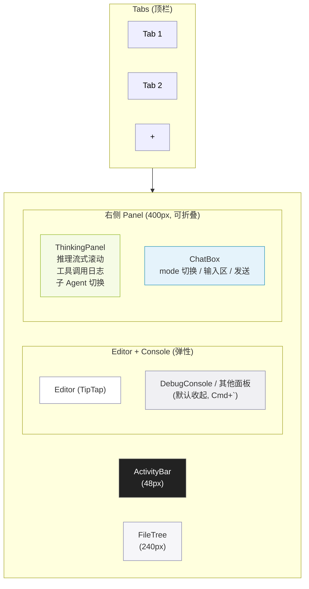
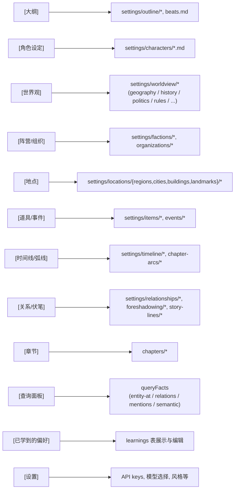
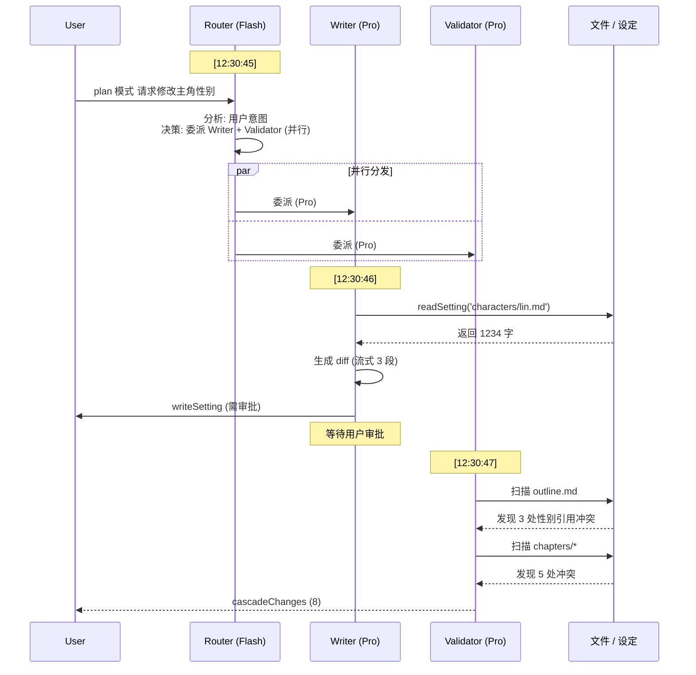
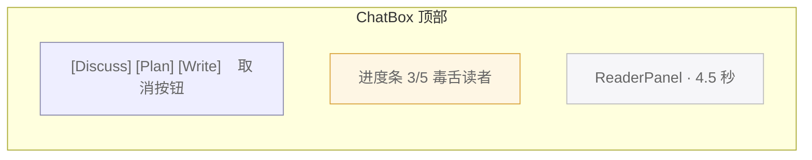

# 07 — UI 布局

## 目标

仿 VSCode 的 IDE 形态,把"小说创作"等同于"代码编辑",让作者用熟悉的范式工作。

## 五区布局

**流程图 · Tabs (顶栏**

| 区域 | 组件 | 主要功能 |
|---|---|---|
| **Tabs** | `<Tabs>` | 标签页(per-file),拖拽排序,dirty 标识 |
| **ActivityBar** | `<ActivityBar>` | 大纲 / 角色 / 章节 / 搜索 / 设定 等图标导航 |
| **FileTree** | `<FileTree>` | 当前 ActivityBar 选中类目下的文件树;**默认隐藏所有 `_` 前缀文件 / 目录**(`_index.md` / `_matrix.md` / `_character-ages.md` / `_registry` 等系统索引与派生文件),[spec/13](../spec/13-settings.md) §Developer Mode 切换可见 |
| **Editor** | `<Editor>` | TipTap 主编辑区,带实体高亮、框选 AI 修改 |
| **DebugConsole** | `<DebugConsole>` | Agent 调用栈、工具结果、错误信息 |
| **ThinkingPanel** | `<ThinkingPanel>` | LLM 思考过程实时流式展示 |
| **ChatBox** | `<ChatBox>` | 与 Agent 对话入口,mode 切换 |

## 区块尺寸 / 可调整

使用 `react-resizable-panels` 实现拖拽:

- Activity Bar:固定 48px
- FileTree:默认 240px,可拖宽
- Editor + Console:弹性,Console 默认收起(Cmd+`)
- 右侧 Panel:默认 400px,可拖宽,可整体收起

## ActivityBar 项目

**Settings 配置图**

> **[info]** 实际 UI 不必每个目录一个 ActivityBar 项 — 高频项(角色 / 世界观 / 章节)优先,其他可折叠到"更多设定"二级菜单。具体取舍 W6 实测后调。

切换 ActivityBar 时,FileTree 内容随之切换。

## Tabs 行为

- 双击文件 → 在新 Tab 永久打开(单击是预览模式,会被下一次单击覆盖)
- 拖拽 Tab 到右栏 → 触发 split view(用于 Goto Definition)
- 中键关闭
- Cmd+W 关闭当前
- Cmd+Shift+T 重开最近关闭

## Editor 区域

- 主体:TipTap 渲染当前 Tab 文件
- 顶部:breadcrumb(当前文件路径)+ word_count 实时显示
- 实体高亮:字下划线 + 颜色按 category 区分(角色蓝 / 地点绿 / 物品橙)
- 框选时浮动按钮:"让 AI 修改" / "查询"
- 状态栏(底部):项目名 / 当前 mode / token 用量 / 最近一次保存时间

## ThinkingPanel

实时流式渲染所有 SSE 事件:

**Agent 协作流程图**

- 折叠 / 展开
- 每个 Agent 一种主题色
- 工具调用展开后显示完整 JSON
- "复制"按钮可复制本次 trace 用于调试

## ChatBox

- 顶部 mode 切换 toggle:`[Discuss] [Plan] [Write]`(互斥单选)
- **键盘切换**:焦点在 textarea 内按 `Tab` 循环 / `Shift+Tab` 反向(覆盖 textarea 默认插入 tab 字符行为,与 ChatGPT/Claude/Cursor 一致;**IME composition 活跃时不抢键**,详见 [spec/12](../spec/12-shortcuts.md) §IME 闸门)
- 切换瞬间 toast 反馈"已切到 plan 模式"+ 三键 toggle UI 高亮飞过
- 输入框:多行,支持 `@文件名` 引用(详见 [spec/12](../spec/12-shortcuts.md) §@文件名引用)
- 发送按钮(`Cmd+Enter`)+ 取消按钮(流式时变取消,`Esc`)
- 历史(`Cmd+↑` / `Cmd+↓` 翻历史输入,仅文本框为空时)
- "重新生成" / "重新生成上一段"
- **`await_approval` 状态下 disabled**(灰显 + tooltip),用户必须先审批或取消才能继续

### 长任务进度条

ChatBox 顶部 mode toggle 下方,**当 server 推 progress 事件时**显示一条进度条:

**流程图 · ChatBox 顶部**

- 取消按钮直接 stop() — 已完成的 persona 反应保留(按 [spec/11](../spec/11-reader-personas.md) §聚合算法的 ≥3 成功才出 recommendation)
- progress 事件协议见 [spec/04](../spec/04-streaming-protocol.md) §长任务进度协议

完整快捷键映射详见 [spec/12](../spec/12-shortcuts.md)。命令面板详见 spec/12 §命令面板与 CommandRegistry。

## DebugConsole(Bottom Panel)

默认收起,Cmd+` 展开。三个 tab:

1. **Logs**:所有日志(可过滤 level)
2. **Network**:所有 LLM 请求(含 token 用量、成本估算)
3. **Errors**:异常 + stack

开发期实用,用户期可隐藏。

## Settings Dialog(⚙)

模态弹窗,8 个 section,**全局(🌐)与项目级(📂)严格分层**:

1. 🔑 **API Keys**(🌐)
2. 🤖 **模型分配**(🔄 全局默认 + 项目覆盖)
3. ⌨️ **快捷键**(🌐)
4. 🎨 **风格定制**(📂)
5. 👥 **读者仿真器**(📂)
6. 🌐 **联网**(🌐,当前灰显)
7. 💾 **数据管理**(🌐 + 📂)
8. ℹ️ **关于**

每个 section 顶部明确标徽标(🌐/📂/🔄),独立 dirty state,顶部 banner 提示哪些未保存。导入导出整体设置 json,跨设备迁移友好。完整字段、UI mock、API 路由设计详见 [spec/13](../spec/13-settings.md)。

## 主题

- 浅色 / 深色(跟随系统)
- 字体:默认 PingFang SC + JetBrains Mono(代码区)
- 行距:段落 1.8,代码 1.5
- 字号:Editor 16px(可调)

## 快捷键

完整 Registry(40+ 条快捷键 + 5 个上下文 + 用户重绑 + 冲突检测)详见 [spec/12](../spec/12-shortcuts.md)。最常用速览:

| 快捷键 | 上下文 | 功能 |
|---|---|---|
| `Tab` | ChatBox | **切换 Agent 模式(discuss/plan/write 循环)** |
| `Cmd+Enter` | ChatBox | 发送 |
| `Cmd+Shift+P` / `F1` | 全局 | 命令面板(fuzzy 搜所有命令) |
| `Cmd+P` | 全局 | 快速打开文件 |
| `Cmd+,` | 全局 | 打开 Settings |
| `Cmd+B` / `Cmd+J` / ``Cmd+` `` | 全局 | 折叠 FileTree / 右侧 Panel / Console |
| `Cmd+1`~`5` | 全局 | 切 ActivityBar 项 |
| `F12` | Editor | Goto Definition |
| `Cmd+K` | Editor | 框选时唤起 AI inline 改写 |
| `Y` / `N` / `E` | Approval | 同意 / 拒绝 / 编辑后同意 |
| `Esc` | 全局 | 关闭最顶层浮层(硬约束,不可改) |

## 初次启动流程

1. 检测 `~/.open-novel/` 是否存在 → 不存在则创建
2. 检测 `settings.json` 是否存在 → 不存在则进入 OnboardingWizard(4 步,详见 [spec/15](../spec/15-onboarding.md))
3. 已有 settings 但无 key → 弹 SettingsDialog Section 1
4. 已有 key 但 workspaces 空 → 弹"创建第一个项目"对话框(含 [加载样例项目] 选项)
5. 进入主界面,默认 Discuss 模式
6. 首次出现某些状态时弹一次性 tooltip(Tab 切模式 / 审批卡 / cascade 警告 / ReaderPanel 报告)
7. ActivityBar [📚] 入口可重看新手指引

## 关联文档

- **上游**:[plan/01](./01-overview.md) 系统概览 · [plan/03](./03-editor-layer.md) 编辑器分层 · [plan/05](./05-modes-and-approval.md) 三模式
- **核心 spec**:[spec/12](../spec/12-shortcuts.md) 快捷键 · [spec/13](../spec/13-settings.md) Settings · [spec/15](../spec/15-onboarding.md) Onboarding

## ADR · 设计决策

| 编号 | 决策 | 选项 | 选择 | 理由 |
|---|---|---|---|---|
| ADR-01 | UI 范式 | VSCode 五区 / Notion 单页 / Word 传统 | **VSCode 五区** | 目标作者群熟悉代码 IDE;ThinkingPanel + ChatBox 与 Editor 并列契合"AI 助手在侧"心智;长篇写作需要 FileTree 跳转 |
| ADR-02 | Tab 键功能 | 插入 tab 字符(默认) / **切换 mode** | **切换 mode** | 与 ChatGPT / Claude / Cursor 一致心智;Markdown 写作不需要硬 tab;IME composition 期间不抢键避免破坏中文输入 |
| ADR-03 | `_` 前缀文件默认隐藏 | 显示 / **FileTree 默认隐藏** | **FileTree 默认隐藏** | `_index.md` 等是给 LLM 看的元数据,用户不需要 + 不应该编辑;Developer Mode 切换可见([spec/13](../spec/13-settings.md)) |
