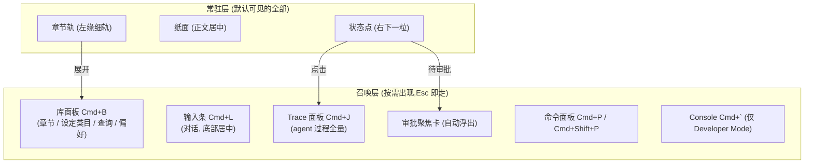
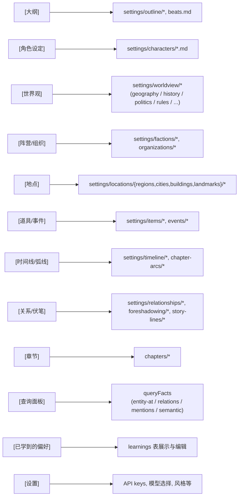
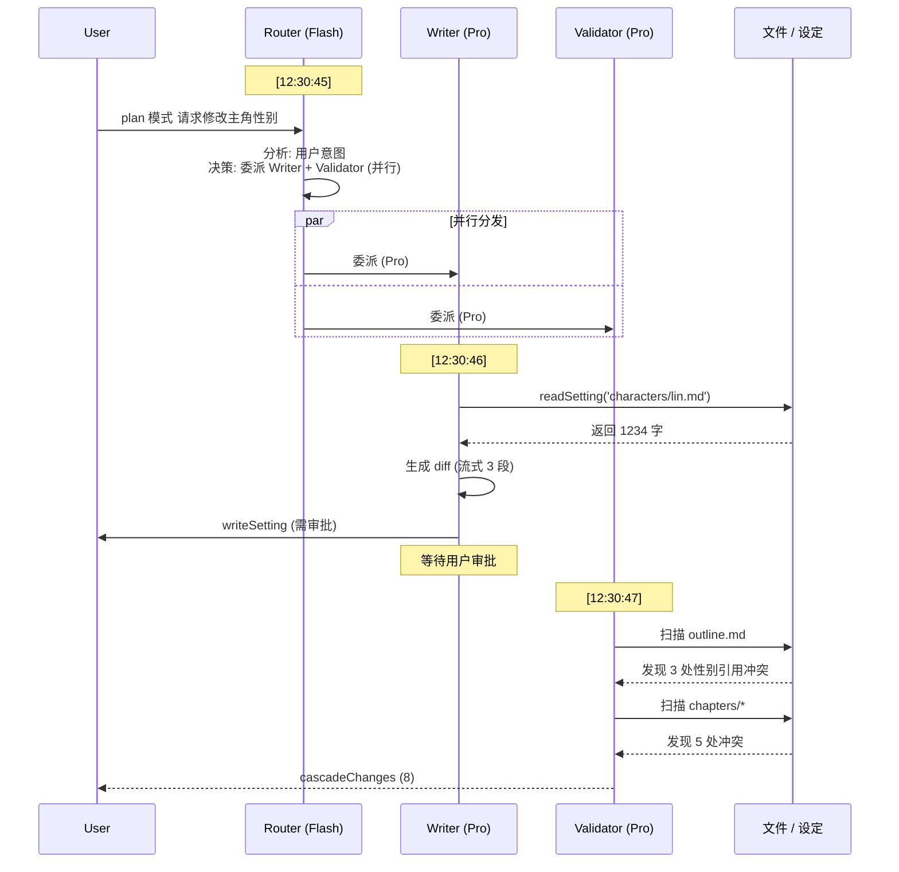

# 07 — UI 布局

## 目标

写作优先,气质是**简约、素雅、克制**:屏幕上常驻的只有三样——左缘一道章节轨、正文纸面、右下一粒状态点。没有标签页栏、没有工具面板、没有状态条;库(章节与设定导航)、对话输入、思考过程、调试信息全部是「召唤式」表面,用完即走。IDE 范式保留在肌肉记忆层(快捷键、多章打开、对照视图、Goto Definition),不保留在常驻外观层。装饰性动画为零:唯一允许的循环动效是状态点在运行中的缓慢呼吸。

> **[info]** 2026-06-11 修订(两步):先由「仿 VSCode 五区」改为「纸面 + 召唤式表面」(用户实测原型判定五区常驻过载);随后用户要求进一步摆脱 VSCode 形似、保持简约高级素雅克制,顶部 Tabs 取消、由章节轨替代,状态线收为状态点。决策见 ADR-01 / ADR-04 / ADR-05,界面契约见 [design/01](../design/01-main-layout.md)。

### 注意力法则

1. **纸面是唯一主角**:任何时刻常驻屏幕的层 ≤ 3 —— 章节轨、纸面、状态点
2. **AI 过程默认一句话**:agent 活动收敛为状态点旁的一句话;trace、工具调用、成本、日志都在召唤之后才出现
3. **打断只为审批**:唯一允许主动浮到纸面之上的是审批聚焦卡(信任仪式);其余一切等待召唤

## 布局总览

| 表面 | 默认 | 召唤方式 |
|---|---|---|
| 章节轨(各章入口 + 当前章标记 + 未保存点) | 常驻左缘,极细 | — |
| 纸面(正文) | 常驻,唯一亮面 | — |
| 状态点(AI 存在,一句话在旁浮现) | 常驻右下一粒 | 点击展开 Trace 面板 / 审批卡 |
| 库面板(章节 / 角色 / 世界观 / 大纲 / 查询 / 偏好) | 收起 | `Cmd+B` / 点章节轨顶部,推开式 |
| 输入条(对话,原 ChatBox) | 隐藏 | `Cmd+L` / 状态点旁 ✦,底部居中 |
| Trace 面板(原 ThinkingPanel) | 收起 | `Cmd+J` / 点状态点,右侧推开式 |
| 审批聚焦卡 | 仅 `await_approval` 时 | 自动浮出([design/02](../design/02-approval-cascade.md)) |
| DebugConsole | 不存在 | Developer Mode 下 `` Cmd+` `` 浮出 |

FileTree **默认隐藏所有 `_` 前缀文件 / 目录**(`_index.md` / `_matrix.md` / `_registry` 等系统索引与派生文件),[spec/13](../spec/13-settings.md) §Developer Mode 切换可见。

## 区块尺寸 / 可调整

使用 `react-resizable-panels` 实现拖拽(仅对推开式面板生效):

- 章节轨:44px 常驻左缘;纸面:弹性全宽,正文最大 720px 居中,无任何顶部常驻行
- 状态点:右下角,不占行;一句话与进度在点旁浮现
- 库面板:320px,可拖宽;推开纸面不遮挡
- Trace 面板:默认 380px,可拖宽;推开式
- 输入条:底部居中悬浮 600px,不参与拖拽;`Esc` 收回
- Console:Developer Mode 专属,240px 底部浮出,可拖

## 库面板(章节与设定导航)

`Cmd+B` 或点章节轨顶部展开;类目以纯文字横排(章节 / 角色 / 世界观 / 大纲),切换类目,列表随之切换。库面板只承载「能打开的东西」;**查询是独立的一键浮层**(`Cmd+E` 召出 / 同键收回,框选「查询」直达,四查询类型 `Tab` 互换);**已学偏好在 Settings §风格定制**查看与编辑,Reflector 新沉淀时在 Trace 面板内联提示:

**Settings 配置图**

> **[info]** 实际 UI 不必每个目录一个类目项 — 高频项(角色 / 世界观 / 章节)优先,其他折叠到"更多设定"二级菜单。具体取舍 W6 实测后调。日常跳转的主路径是 `Cmd+P` 模糊打开与正文内 Goto Definition,库面板是浏览路径而非必经路径。

## 章节轨与多章打开(替代 Tabs)

- 章节轨常驻显示当前卷各章入口:当前章有明确标记,未保存的章带一粒小点(保存状态的唯一常驻信号;最近保存时间进 Trace 面板头部)
- 「单击预览 / 双击常驻」心智迁移到库面板;`Cmd+W` 关闭当前章 / `Cmd+Shift+T` 重开最近关闭,语义不变
- 对照视图(原 split view):从库面板或章节轨把另一章拖到纸面右半,两纸并排;Goto Definition 的右侧打开走同一机制

## 纸面

- 正文居中,章题在纸内(衬线);顶部没有任何常驻行
- 字数、保存状态、violation 计数以微标静置于纸面左下角(低存在感,hover 才提高对比;点 ⚠ 跳段)
- 实体高亮:字下划线 + 颜色按 category 区分(角色蓝 / 地点绿 / 物品橙);hover 在纸面右缘浮出旁注(实体摘要 + 打开入口),不遮正文
- concept violation:红色虚线下划线;汇总信号 = 左下 ⚠ 微标 + 滚动条 marker,不做常驻段落 gutter 图标
- 框选时浮动按钮:"让 AI 修改 (Cmd+K)" / "查询"
- mode 徽标在输入条与状态点旁文中;token 用量进 Trace 面板头部与 Settings §数据管理用量页

## 状态点(Agent 状态)与 Trace 面板(召唤)

状态点是 AI 过程的唯一常驻出口:一粒 8px 的点,一句话在点旁浮现,四态:

| 态 | 点 | 旁文 | 点击 |
|---|---|---|---|
| 空闲 | 中性弱色 | 无;hover 浮现「✦ 对话 Cmd+L」 | 召出输入条 |
| 运行中 | accent 色,缓慢呼吸(全应用唯一循环动效) | 「Writer 正在生成 diff · 12s」+ 进度 `3/5 · 毒舌读者` + 取消 | 展开 Trace 面板 |
| 待审批 | accent 色,静止 | 「1 个修改待审批 — 查看」 | 弹审批聚焦卡 |
| 错误 | danger 色 | 「连接失败 · 去 Settings 检查 key」 | 直达 Settings §API Keys |

Trace 面板 = 原 ThinkingPanel 全量能力:per-agent 分块、工具调用行(可展开 JSON)、复制 trace、本 turn 成本;reasoning 默认一句摘要,Developer Mode 展开全文。实时流式渲染所有 SSE 事件:

**Agent 协作流程图**

## 输入条(召唤式对话,原 ChatBox)

- `Cmd+L` 或状态点旁 ✦ 召出:底部居中 600px 悬浮条,`Esc` 收回;可 pin 为常驻(记忆该选择)
- 顶部 mode 切换 toggle:`[Discuss] [Plan] [Write]`(互斥单选)
- **键盘切换**:焦点在 textarea 内按 `Tab` 循环 / `Shift+Tab` 反向(覆盖 textarea 默认插入 tab 字符行为,与 ChatGPT/Claude/Cursor 一致;**IME composition 活跃时不抢键**,详见 [spec/12](../spec/12-shortcuts.md) §IME 闸门)
- 切换瞬间 toast 反馈"已切到 plan 模式"
- 输入框:多行,支持 `@文件名` 引用(详见 [spec/12](../spec/12-shortcuts.md) §@文件名引用);`Cmd+↑/↓` 翻历史(仅空输入框);"重新生成 / 重新生成上一段"
- 发送 `Cmd+Enter` 后输入条自动收回,进度与取消转入状态点旁文(progress 事件协议见 [spec/04](../spec/04-streaming-protocol.md) §长任务进度协议;取消保留已完成 persona,按 [spec/11](../spec/11-reader-personas.md) §聚合算法)
- **`await_approval` 状态下召出即灰显锁定**(tooltip「完成或取消审批后才能继续」),必须先处理审批聚焦卡

## DebugConsole(Developer Mode 专属)

普通用户界面中不存在。Developer Mode 开启后 `` Cmd+` `` 浮出,三个 tab:

1. **Logs**:所有日志(可过滤 level)
2. **Network**:所有 LLM 请求(含 token 用量、成本估算)
3. **Errors**:异常 + stack

## Settings Dialog(⚙)

模态弹窗,8 个 section,**全局(🌐)与项目级(📂)严格分层**:

1. 🔑 **API Keys**(🌐)
2. 🤖 **模型分配**(🔄 全局默认 + 项目覆盖)
3. ⌨️ **快捷键**(🌐)
4. 🎨 **风格定制**(📂)
5. 👥 **读者仿真器**(📂)
6. 🌐 **联网**(🌐,当前灰显)
7. 💾 **数据管理**(🌐 + 📂)
8. ℹ️ **关于**

每个 section 顶部明确标徽标(🌐/📂/🔄),独立 dirty state,顶部 banner 提示哪些未保存。导入导出整体设置 json,跨设备迁移友好。完整字段、UI mock、API 路由设计详见 [spec/13](../spec/13-settings.md)。

## 主题

- 浅色 / 深色(跟随系统)
- 字体:默认 PingFang SC + JetBrains Mono(代码区)
- 行距:段落 1.8,代码 1.5
- 字号:Editor 16px(可调)

## 快捷键

完整 Registry(40+ 条快捷键 + 5 个上下文 + 用户重绑 + 冲突检测)详见 [spec/12](../spec/12-shortcuts.md)。最常用速览:

| 快捷键 | 上下文 | 功能 |
|---|---|---|
| `Tab` | 输入条 | **切换 Agent 模式(discuss/plan/write 循环)** |
| `Cmd+Enter` | 输入条 | 发送 |
| `Cmd+L` | 全局 | 召出 / 聚焦输入条(新增,spec/12 待补 `chat.focusComposer`) |
| `Cmd+Shift+P` / `F1` | 全局 | 命令面板(fuzzy 搜所有命令) |
| `Cmd+P` | 全局 | 快速打开文件 |
| `Cmd+,` | 全局 | 打开 Settings |
| `Cmd+B` / `Cmd+J` / ``Cmd+` `` | 全局 | 库面板 / Trace 面板 / Console(仅 Dev) |
| `Cmd+E` | 全局 | 查询浮层(同键收回;新增,spec/12 待补 `query.open`) |
| `Cmd+1`~`4` | 全局 | 切库面板类目(面板收起时先展开) |
| `F12` | Editor | Goto Definition |
| `Cmd+K` | Editor | 框选时唤起 AI inline 改写 |
| `Y` / `N` / `E` | Approval | 同意 / 拒绝 / 编辑后同意 |
| `Esc` | 全局 | 关闭最顶层浮层(硬约束,不可改) |

## 初次启动流程

1. 检测 `~/.open-novel/` 是否存在 → 不存在则创建
2. 检测 `settings.json` 是否存在 → 不存在则进入 OnboardingWizard(4 步,详见 [spec/15](../spec/15-onboarding.md))
3. 已有 settings 但无 key → 弹 SettingsDialog Section 1
4. 已有 key 但 workspaces 空 → 弹"创建第一个项目"对话框(含 [加载样例项目] 选项)
5. 进入主界面,默认 Discuss 模式
6. 首次出现某些状态时弹一次性 tooltip(Tab 切模式 / 审批卡 / cascade 警告 / ReaderPanel 报告)
7. 库面板底部 [📚] 入口可重看新手指引

## 关联文档

- **上游**:[plan/01](./01-overview.md) 系统概览 · [plan/03](./03-editor-layer.md) 编辑器分层 · [plan/05](./05-modes-and-approval.md) 三模式
- **核心 spec**:[spec/12](../spec/12-shortcuts.md) 快捷键 · [spec/13](../spec/13-settings.md) Settings · [spec/15](../spec/15-onboarding.md) Onboarding

## ADR · 设计决策

| 编号 | 决策 | 选项 | 选择 | 理由 |
|---|---|---|---|---|
| ADR-01 | UI 范式 | VSCode 五区常驻 / Notion 单页 / Word 传统 / 纸面 + 召唤式 IDE | **纸面 + 召唤式 IDE**(2026-06-11 修订;原选 VSCode 五区常驻) | 五区常驻在高保真原型实测中信息过载——作者的主任务是写作,不是观测 AI;保留 IDE 的肌肉(快捷键 / 多文件 / split / Goto Definition),把常驻外观降为「纸面 + 状态线」,其余表面召唤式出现;常驻三样的最终形态(章节轨 / 纸面 / 状态点)见 ADR-05 |
| ADR-02 | Tab 键功能 | 插入 tab 字符(默认) / **切换 mode** | **切换 mode** | 与 ChatGPT / Claude / Cursor 一致心智;Markdown 写作不需要硬 tab;IME composition 期间不抢键避免破坏中文输入 |
| ADR-03 | `_` 前缀文件默认隐藏 | 显示 / **FileTree 默认隐藏** | **FileTree 默认隐藏** | `_index.md` 等是给 LLM 看的元数据,用户不需要 + 不应该编辑;Developer Mode 切换可见([spec/13](../spec/13-settings.md)) |
| ADR-04 | Agent 可观测性深度 | 常驻 ThinkingPanel / **状态点一句话 + trace 召唤** | **状态点一句话 + trace 召唤** | 过程细节是信任的备查证据,不是时刻必读的内容;一句摘要 + 待审批升级提示覆盖绝大多数时刻;Developer Mode 才默认展开全量 trace |
| ADR-05 | 多章打开的承载 | 顶部 Tabs 栏 / **章节轨 + 库面板「最近」+ Cmd+P** | **章节轨 + 最近 + Cmd+P** | Tabs 是代码 IDE 的残留形态;章节是一本书的线性结构,左缘细轨同时回答「我在哪一章」与「去哪一章」,并让顶部整条 chrome 消失;关闭/重开语义保留在快捷键层。视觉基调同步约束:简约素雅克制,不引入文化符号装饰,唯一循环动效是状态点运行态呼吸 |
