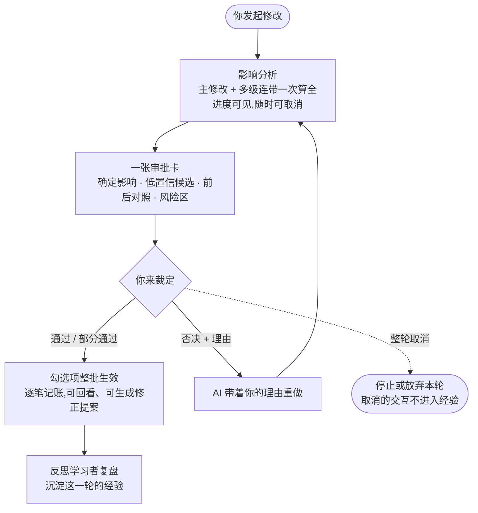

# 08 — 审批与连带修改

**你此刻的问题**:改了一处核心设定,后面几十章怎么办?一处处翻、一条条确认,还是赌它不出事?

**产品的回答**:确定性影响在呈现之前先列完整,低置信候选单独标出来;一张审批卡一次看全、一次审完。你的每个裁定都被记账,随时可回看、可生成修正或恢复提案。

## 设计核心:先找确定影响,再标低置信候选

把主角性别从男改女,改的从来不只是一行设定:后文的称谓、外貌描写、人物互动全要跟着变;漏掉一处"兄弟"或"小子",读者立刻出戏。最磨人的不是改这一处,而是不知道还剩哪些处——长篇作者对"动核心设定"的恐惧,大半来自这种看不见底的连锁。

Open Novel 的回答是一条铁规矩:**系统先把确定性影响集合列完整,再把拿不准的语义影响标成低置信候选。**连锁影响可达多级——改了 A 牵出 B,改 B 又牵出 C——系统沿着可解释的影响链追到尽头;没有足够证据的段落不会被包装成确定结论,而是单独交给你判断。把波及范围一次摆清的正是一致性守护者(见 [06 — AI 角色团队](./06-agent-team.md));你看到的是确定项、候选项和依据,不是挤牙膏式的逐条弹窗。

多级是什么意思?性别一改,某章里的"他"要变成"她"——这是第一级确定影响;那一段改完之后,下一段里王小芳调侃主角的玩笑话可能接不上——这是第二级候选。系统不在第一级停手,也不把"可能"冒充"确定",而是把两类结果分别摆出来。

为什么整批审,而不是逐条审:

**全貌才看得见结构性风险。**逐条看,每一条都局部合理;摆在一起,你才可能发现"第二级连带把另一个角色改崩了"——单看那一条完全说得通,放进全貌里才知道它动了不该动的人。

**一次决策的心智成本远低于 N 次打断。**几十条改动逐条弹窗,审到后面只剩疲劳点击,那不是审批,是消磨;一张卡一次审完,你的注意力花在判断上,不是花在点确认上。

**必须一起生效的内容要么同组生效,要么同组不生效。**整批裁定杜绝"改了一半的世界":主修改和维持一致性所必需的连带项不能拆开;低置信候选可以搁置,但会留下待处理提醒。

确定性影响由系统按 R6 列出(见 [03 — 守则与红线](./03-guardrails.md)):可解释、可审计,同样的改动应得到同样的确定列表。疑似语义影响可以作为低置信候选出现,但不能被默认当成已确认事实。

把影响找全不是一眨眼的事,但等待不是黑盒:谁在分析、进行到哪,全程进度可见、随时可取消——与 [07 — 协作与三模式](./07-collaboration-and-modes.md) 的长任务体验是同一套承诺。

## 开始前先说明代价

全书级连带修改启动前,系统先给一张执行预览:会看哪些范围、预计分成几批、哪些批次需要你中途确认、为什么不能一次处理、当前证据是否足够。你不需要猜它会跑多久,也不会在不知情的情况下把一个巨大任务扔进后台。

如果范围过大或证据不足,系统不会假装已经准备好。它会给出可选路径:缩小范围、分批处理、先跑一批验证、或等待必要证据补齐。每一批都保留取消点和回看记录;取消后已发生什么、未发生什么都会写清楚。

## 审批卡

审批卡是整批修改停在你面前的形态,也是"写入必经审定"(R1)在连带修改场景里的可见样子。一张审批卡从上到下四个区,**本节是审批卡结构的唯一出处**:

**① 影响图谱。**这次改动波及了谁:哪些角色、哪些设定、哪些章节,影响沿什么路径一层层传开,一眼看清传播全貌。图谱与下方条目联动,点到谁,就看到谁。

**② 主修改与逐条连带修改的前后对照。**每条改动都给出改前改后的对照与一句理由,按置信度默认勾选:高、中置信默认勾上;低置信黄色提示、默认不勾——系统拿不准的,不替你做主。

**③ "已分析但无需改动"的条目。**它们也被列出,并附上"为什么不用改"的理由。这些条目证明系统看过了,而不是漏了——你审的不只是改动本身,还有系统的覆盖面。

**④ 守则风险区与读者预演区。**这次改动触碰的守则风险与模拟读者的反应在这里呈现;风险报告的内容见 [09 — 叙事诊断与读者预演](./09-narrative-and-reader.md),确认级与阻断级的通过语义见 [03 — 守则与红线](./03-guardrails.md)。

四个区合成一次阅读:发生了什么、波及多大、有什么风险、我怎么决定——自上而下读完,你需要的判断材料一样不缺。

同一时刻可能有多张审批卡在等你,但你一次只面对一张:审完一张,下一张再来,先后一目了然,不会几张卡叠在一起抢你的注意力。

## 勾选语义

勾与不勾,含义只有三条,没有暗门:

**不勾某条 = 显式搁置。**该条不落盘;之后你写到相关内容时,系统会重新发现并再次提议——搁置不会变成遗忘,你只是把这个决定推迟到更合适的时机。

**全部拒绝 = 作品不改变。**主修改连同全部连带一并不落盘,故事世界保持你发起修改之前的样子;但这次裁定和理由仍进入历史,方便你以后知道为什么没采纳。

**任一条目都可手动编辑后通过。**AI 的提案是底稿,不是终稿;你改完的版本才是落进作品的版本,这次"改后通过"同样被完整记账。

三条合起来:落盘的唯一通道是你的勾选,搁置不丢失,拒绝不改作品但保留裁定历史,编辑不设限。

所以部分通过不是妥协,而是常态:高置信的先落定,拿不准的搁置等重逢——这套语义本来就是为"先把有把握的改了"而设计的。

但部分通过有一条底线:必须一起生效的内容,不能被拆开。主修改和维持世界一致所必需的连带修改是一组共同决定;如果你不接受其中必要的一条,这组就不能落进作品。系统会把它明确标成"必须一起处理",而不是让你在不知情的情况下改出半个世界。

可以搁置的是独立的、低置信的、不会让当前世界立刻变坏的条目。搁置后它不会消失,会作为待处理事项出现在本轮回执、后续提醒和再次校验里。若搁置内容触碰 R4 所保护的一致性红线,系统会先阻止继续写正文,直到你接受、修改或明确拒绝并说明理由。

## 否决要给理由

否决必须附上理由。"改性别后语气还是男性化的"——就这样一句话,AI 带着它重做,下一版直奔你真正的不满;同一句话还会进入经验沉淀(见 [10 — 记忆与成长](./10-memory-and-learning.md)),下次类似的修改从一开始就避开这个坑。

这不是表单负担。含糊的"不行,重来"换来的只能是另一次盲猜;一句具体的理由,是你能给这支团队的最高效的一句指导——说一次,受益的是之后的每一章。

理由也不会把你拖进拉锯:如果 AI 带着理由重做的结果仍与被否决的版本高度相似,系统不会闷头重试,而是停下来把分歧摆到你面前——"绝不死循环"的完整承诺见 [07 — 协作与三模式](./07-collaboration-and-modes.md)。

## 审批的可靠性

审批是这个产品最重的一次交互,它必须可靠到让你敢把决定留到明天。五条承诺:

1. **永不过期。**审批可以跨夜、跨周末——去做饭、去睡觉、出门三天,回来接着审。不存在"超时自动作废",更不存在"超时视为同意"。
2. **关闭应用重开,原样恢复。**所有待审事项一条不丢地回到你面前,审到一半的勾选状态也还在。
3. **确认两次等于确认一次。**同一审批重复确认不会重复落盘——手抖、卡顿后的再点一下,都不会把你的书改两遍。
4. **待审期间写入锁定,只读放行。**审批卡停在你面前时,所有会写入作品、生成新提案或改变模式权限的动作都暂时锁住:继续写正文、改设定、批量重命名、接受新的跨文档改写、切到会产生写入的模式,都要先处理眼前审批。查询、搜索、打开文档、查看 Trace、围绕当前审批继续讨论可以照常进行,但这些只读结果必须明确基于当前待审状态,不能生成新的审批卡、改动当前审批卡或改变落盘结果(审批卡出现之前的排队语义见 [07 — 协作与三模式](./07-collaboration-and-modes.md))。这也是 R4 的体验面:世界没改一致之前,不继续写正文。
5. **整轮可取消。**随时可以说"算了,这轮不要了"——如果还没有改动作品,系统直接停止并告诉你已经完成了什么、还剩什么;如果已经有待审或已生效影响,系统先说明影响范围并让你确认下一步。你主动取消的交互不进入经验(R5)——你放弃的东西,不该成为系统对你的认知。

五条指向同一个体验:审批等你,而不是你赶审批。

## 审批历史

每一次审批都进入历史,按依据可回看:改了什么、依据什么、你当时怎么裁定的,事后任何时候都查得到。"上个月是不是动过她的年龄?当时为什么通过?"——翻一下历史,答案连同当时的对照与理由一起回来。

在历史之上,一件事随时可做:

**生成按批修正或恢复提案。**想撤掉某次审批的结果时,系统不会抹掉旧历史,而是把当时的主修改与全部连带影响作为一个整体,生成新的反向修改或恢复提案——不会出现"主修改改回去了、连带还留着"的残局。新的裁定同样被记入历史,可追溯、可继续修正。

## 一次修改的完整旅程

把以上各节连成一条线,就是一次修改从念头到落定的全程:

旅程的每一站,主动权都在你手里:分析可取消,条目可搁置,否决有去向,生效后可继续生成修正提案。
