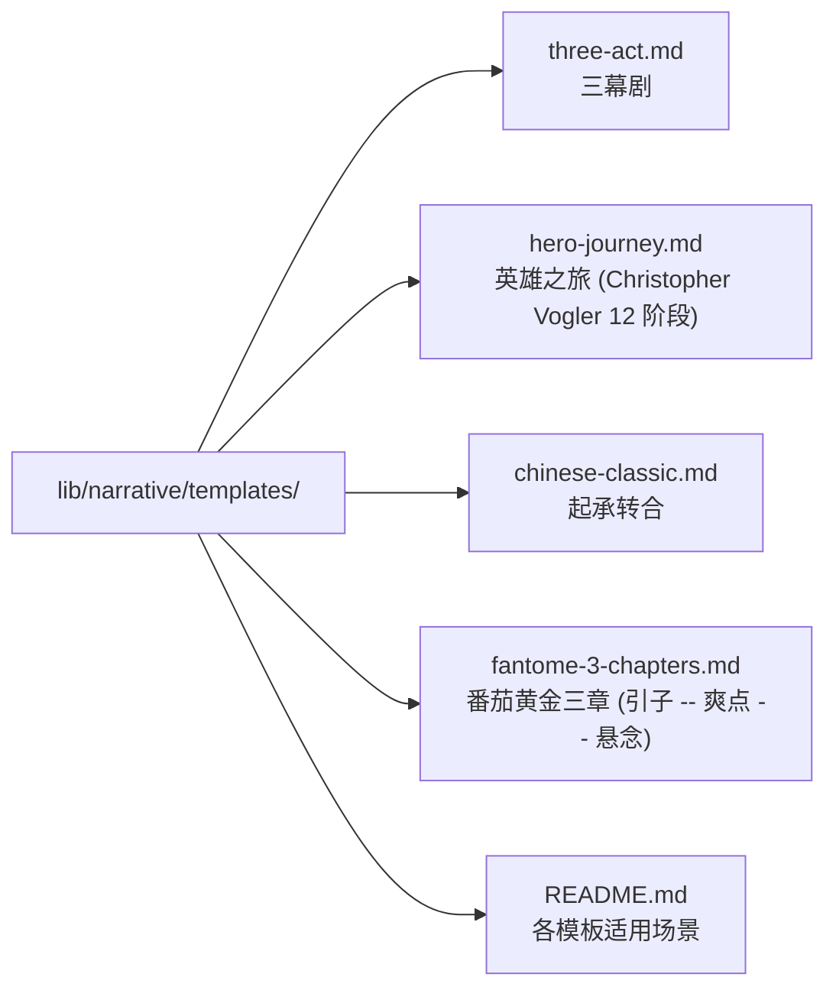

# 09 — 叙事引擎

> **[info]** 把"看叙事力学"的能力下沉到两个 Agent:**BeatAnalyzer 章内分析 → Checker**、**ArcTracker 跨章弧光 → Validator**;再加一个供 Writer 取用的**结构模板库**。本文档定义这三个模块的边界、数据契约与触发策略。

## 为什么要有它

主流 AI 写作工具(Sudowrite / NovelCrafter / 国内同类)都把 Agent 卡在"文字生成器"这层。但**网文的真正胜负不在文笔,在节奏与结构**:

- 番茄读者的弃书曲线集中在前 3000 字("黄金三章")与每章末尾 30% 区间
- 网文的"爽点频率"是流量留存的命脉 — 平均 1500-2500 字一个高潮节点
- 角色弧光崩坏(e.g. 隐忍主角第 50 章突然圣母)是高分书翻车的头号原因

要把这些上升为系统能力,Checker 必须能输出**结构化的叙事指标**,而不仅仅是"这段文笔流畅与否"的自然语言点评。

## 归属与边界

| 能力 | 归属 Agent | 模型 + reasoningEffort | 触发面 | 输入规模 |
|---|---|---|---|---|
| **BeatAnalyzer** | Checker | Flash + default | 章节落盘后(runOnSave) | 单章 |
| **ArcTracker** | Validator | Pro + max | 新章节落盘(runOnNewChapter)+ 周期性(triggerEveryNChapters) | 跨章 + character.md |
| **结构模板库** | Writer(调用方) | —(静态文件) | Writer 在大纲生成时显式 applyTemplate | — |

ArcTracker 划归 Validator 的原因:

1. **抽象层次对齐** — Validator 主职是"跨章 / 跨设定的一致性",ArcTracker 的"性格偏离"是软一致性,与事实矛盾同源
2. **模型档对齐** — Validator 用 Pro+max(深度推理 + 长输出),ArcTracker 跨章弧光分析需要同款配置;BeatAnalyzer 章内分析输出短走 Flash+default 即可
3. **非闸门语义对齐** — Validator 不直接落盘,所有变更经 Writer + needsApproval;ArcTracker 也只产报告供作者参考

## 三个能力模块

### 模块 A:BeatAnalyzer(节拍分析器)

**输入**:一章(或一段)已生成正文 **输出**:结构化的"叙事力学指标"

```ts
type BeatReport = {
  // 情绪曲线: 每段一个情绪强度值 (-1.0 ~ +1.0)
  emotionCurve: { from: number; to: number; valence: number; arousal: number }[]

  // 冲突密度: 每千字冲突点数,以及冲突类型分布
  conflictDensity: number           // events per 1k chars
  conflictTypes: Record<'内心' | '人际' | '环境' | '阶层' | '设定', number>

  // 节奏张弛: 段落长度方差 / 对话比例 / 描写比例
  pacing: {
    avgSentenceLength: number
    dialogueRatio: number           // 0..1
    descriptionRatio: number        // 0..1
    transitionDensity: number       // 段落间过渡密度
  }

  // 关键节点
  hooks: { position: number; kind: 'opener' | 'cliffhanger' | 'mid-spike'; strength: number }[]

  // 总评
  rhythmScore: number               // 0..100,总体节奏分
  flagsForAuthor: string[]          // 自然语言提示,e.g. "前 800 字过密集对话,缺场景定位"
}
```

### 模块 B:ArcTracker(角色弧光追踪器)

**输入**:角色 id + 该角色已出现的所有章节 **输出**:该角色的成长轨迹与偏离检测

```ts
type ArcReport = {
  characterId: string
  expectedArc: string               // 来自 character.md 的 frontmatter 或用户标注

  // 已观测到的转变点
  observedShifts: {
    chapter: string
    position: number
    kind: 'belief' | 'relationship' | 'capability' | 'goal'
    summary: string
  }[]

  // 偏离评分
  deviation: {
    score: number                   // 0..100,0 = 完全符合,100 = 完全偏离
    reason: string
    examples: { chapter: string; snippet: string }[]
  }
}
```

ArcTracker 由 Validator 持有(与 Validator 的事实矛盾检测同属"跨章一致性"语义),但它输出的是**软偏离**而非**硬矛盾** — 不闸门、不进 cascade,只**提示**作者:你的隐忍主角在第 12 章给同事顶嘴,与第 1 章设定的"逆来顺受"性格存在偏离。是否合理?交回作者判断。

### 模块 C:结构模板库

放在 `lib/narrative/templates/` 的可显式调用结构模板:

**流程图 · lib/narrative/templates**



每个模板用 markdown 描述结构 + 关键节拍 + 范例。Writer 在生成大纲时可调用 `applyTemplate(templateName)`,将模板嵌入 prompt context。

**强制度**:模板**完全可选**。用户没指定时 Writer 按其自由风格 + project.style 生成。模板是工具不是镣铐。

## Agent 集成

### Checker → CheckerReport

> **[info]** 走 [JSON mode](../spec/24-json-output.md),zod schema 见 spec/24 §Checker / BeatAnalyzer 输出。

```ts
type CheckerReport = {
  critique: string                  // 自然语言点评 (风格 / 流畅度 / 章内节奏)
  beats: BeatReport                 // BeatAnalyzer 输出 (含 pacingScore / hookStrength / issues)
  cardinalRulesContribution: {       // 守则 1/3/5 检测贡献 (见 spec/25)
    goldenChapters: GoldenChaptersFinding | null    // 守则 1
    pacing: PacingFinding | null                    // 守则 3
    protagonistAgency: AgencyFinding | null         // 守则 5
  }
}
```

Checker 全部输出**非闸门** — 不挂载 needsApproval,只供作者参考。但其守则相关 findings 会被 Validator 汇成 `CardinalRulesReport` 进 ApprovalCard 风险区。

### Validator → ValidatorReport

> **[info]** 走 [JSON mode](../spec/24-json-output.md),zod schema 见 spec/24 §Validator 一致性审 输出。

```ts
type ValidatorReport = {
  contradictions: ContradictionItem[]              // 事实矛盾
  cascadeProposals: CascadeChange[]                // cascade 修改提议
  arcs: ArcReport[]                                 // ArcTracker 跨章输出
  cardinalRulesContribution: {                      // 守则 1/2/4 检测贡献
    goldenChapters: GoldenChaptersFinding | null
    characterIntegrity: CharacterIntegrityFinding[]
    promiseAccountability: PromiseFinding[]
  }
  cardinalRulesReport: CardinalRulesReport          // 汇总: Validator + Checker + ReaderPanel + ArcTracker 各自贡献的最终风险报告 (spec/25)
}
```

Validator 的 `contradictions` / `cascadeProposals` 走 `proposeChanges` 工具进 ApprovalCard;`arcs` 是非闸门信号;`cardinalRulesReport` 进 ApprovalCard **风险区**(critical 级强制用户勾"明知违反仍通过",blocking 禁用 approve)。详见 [spec/06 §ApprovalCard](../spec/06-approval-flow.md) + [spec/25 §ApprovalCard 集成](../spec/25-cardinal-rules.md)。

UI 渲染:ThinkingPanel 把 `Checker.critique` 文字段、`Checker.beats` 用图表(情绪曲线 sparkline + 节奏热度)、`Validator.arcs` 用列表分别渲染。作者一眼看清"哪一段拖、哪一个角色崩"。

## 使用场景

1. **大纲阶段**:作者要求"用三幕结构生成大纲"→ Writer 调 `applyTemplate('three-act')` → 出大纲 → Checker(BeatAnalyzer 简化版)检查大纲层节奏分布
2. **章节生成后**:Checker 跑 BeatAnalyzer + Validator 跑 ArcTracker(并行)→ 两份报告挂在章节 metadata,UI 显示"风险点"
3. **审阅旧章节**:作者主动点"分析此章"→ 同上,但允许用户配置只跑某个模块
4. **跨章节趋势**:在"全书概览"面板,聚合所有章节的 BeatReport,画出全书的节奏曲线 / 冲突密度趋势 — 作者可看出"卡文区"或"水章区"

## 数据落地

- **BeatReport / ArcReport** 存在 `index.db.narrative_metrics` 表,带版本号(Checker prompt 升级后老数据保留以便对照)
- **结构模板** 在仓库内(`lib/narrative/templates/`),不进 workspace,跨项目共用
- **角色 expectedArc** 存在 character.md 的 frontmatter(`expected_arc: "..."` 字段),可由用户编辑

## 不做什么

- **不做实时入侵式提示**:写到一半冒出"你节奏不对"会破坏心流。所有 narrative 报告都是**章节完成后**主动跑 / 作者主动触发
- **不做强制结构修正**:即使 BeatReport 给出 rhythmScore=20,系统也不替作者改。**显示风险,不替决策**
- **不做"结构胜过文风"的隐含价值观**:用户写散文式慢节奏作品也合法,模板只是供选用,默认无偏好

## 关联文档

- **上游**:[plan/02](./02-multi-agent.md) §Checker / Validator · [plan/10](./10-reader-simulator.md) 读者仿真器
- **核心 spec**:[spec/02](../spec/02-agent-tools.md) §analyzeNarrative / trackArc / applyTemplate · [spec/10](../spec/10-narrative-engine.md) 叙事引擎实现 · [spec/24](../spec/24-json-output.md) Checker / Validator JSON schema · [spec/25](../spec/25-cardinal-rules.md) 五大守则

## ADR · 设计决策

| 编号 | 决策 | 选项 | 选择 | 理由 |
|---|---|---|---|---|
| ADR-01 | BeatAnalyzer 归属 Agent | 独立 Agent / **归 Checker** / 归 Validator | **归 Checker** | 章内分析 + 短输出 → Flash + default;与 Checker 风格审同周期触发,不必拆 Agent |
| ADR-02 | ArcTracker 归属 Agent | 独立 Agent / 归 Checker / **归 Validator** | **归 Validator** | 跨章弧光 = 软一致性,与事实矛盾同源;需要 Pro + max 深度推理;与 Validator 模型档对齐 |
| ADR-03 | 模板强制度 | 强制套用 / **完全可选** / 默认开启 | **完全可选** | 用户写散文式慢节奏作品也合法;模板是工具不是镣铐;默认无偏好 |
| ADR-04 | 报告触发时机 | 实时入侵 / **章节完成后批量** / 仅用户主动 | **章节完成后批量** | 实时提示破坏心流;完成后批量在 ApprovalCard 风险区呈现,作者可选择性查看 |
