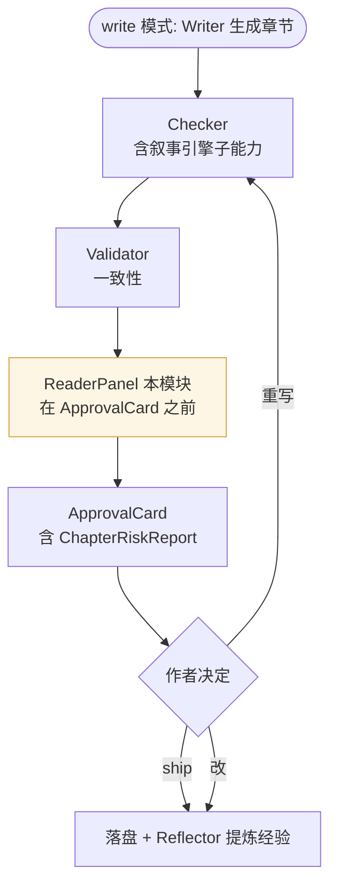
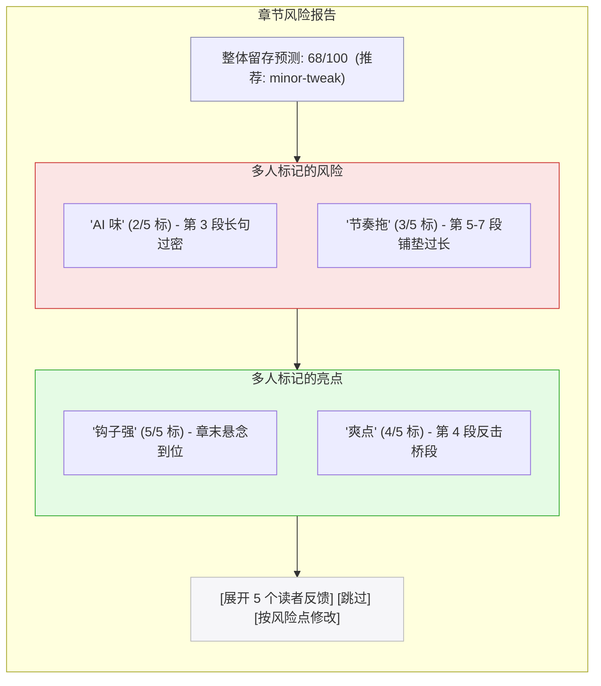

# 10 — 读者仿真器 (ReaderPanel)

> **[info]** 把番茄读者的"弃书 / 追更"决策模型化,在每章发布前给作者一份风险报告。**这是 7 个对外 Agent 里真正贴近番茄留存战的那一个。**

## 为什么要有它

番茄的核心游戏不是"写得好",是"留得住"。平台算法对**首章 30 秒留存、中章追更率、章末停留时间**异常敏感。但作者写自己作品时几乎无法客观自评 — 自己写的逻辑自己看顺,坑自己挖自己看不见,毒点自己习以为常。

读者仿真器解决的就是**视角缺失**问题:内置一组多元化的虚拟读者 persona,每章生成后并行跑一遍,各自给出反应 + 风险标记。作者在 ApprovalCard 里看到这些信号后再决定是否调整。

不是替代真实读者,是**减少与真实读者首次接触前的信息不对称**。

## 默认 5 个 Personas

每个 persona 是一个**角色化 prompt + 评估维度**:

| Persona | 关注什么 | 弃书触发 | 追更触发 |
|---|---|---|---|
| **追更党** | 节奏、爽点、钩子 | 一章无爽点 / 章末无悬念 | 章末强钩子 + 爽点密度 ≥ 1/2k 字 |
| **逻辑控** | 设定一致性、伏笔、推理链 | 设定矛盾 / 角色行为反人设 | 伏笔回收 / 严谨推理段落 |
| **情感党** | 人物关系、情感张力、共鸣点 | 角色工具人化 / 感情线突兀 | 关系层级推进 / 强共鸣段落 |
| **毒舌读者** | AI 味、老套、文字硬伤 | 长句过密 / "在某种程度上" / 二次元梗烂大街 | 自然口语 / 新鲜表达 |
| **潜水大佬** | 长期吸引力、世界观深度、人物层次 | 世界观薄 / 人物扁平 | 多层次冲突 / 设定彩蛋 |

每个 persona 都有详细 prompt(见 [spec/11](../spec/11-reader-personas.md)),输出走 [JSON mode](../spec/24-json-output.md) 统一 schema:

```ts
type PersonaReaction = {
  personaId: 'veteran_reader' | 'casual_reader' | 'rational_reader' | 'genre_fan' | 'new_reader'

  // 整体反应
  overallSentiment: -100 ~ 100      // -100 = 极度排斥, +100 = 强烈追更
  retentionPrediction: 0 ~ 100      // 看完此章后继续追书的概率
  dropoffRisk: 0 ~ 1                // 弃书风险 (1 = 立刻点右上角)

  // 关键标记
  highlights: { position: number; kind: '爽点' | '钩子' | '亮点'; reason: string }[]
  warnings: { position: number; kind: '毒点' | '坑' | '突兀' | 'AI 味'; severity: 'low'|'mid'|'high'; reason: string }[]

  // 五大守则违反信号 (与 spec/25 对齐)
  cardinalRulesFlags: ('golden_chapters_drift' | 'character_collapse' | 'pacing_stall' | 'promise_betrayal' | 'system_dependency_overflow')[]

  // 自由文字反馈 (像真实读者评论)
  naturalLanguageReaction: string
}
```

5 个 persona 跑完后聚合成 **章节风险报告**(输出 JSON):

```ts
type ChapterRiskReport = {
  chapterId: string
  reactions: PersonaReaction[]
  aggregateRetention: number        // 加权平均
  averageDropoffRisk: number         // 平均弃书风险
  topRisks: { warning; count: number }[]
  topWins: { highlight; count: number }[]
  recommendation: 'ship' | 'minor-tweak' | 'major-rework'

  // 五大守则贡献 (各 persona 的 cardinalRulesFlags 聚合)
  cardinalRulesFindings: {
    goldenChapters: { flagCount: number; personas: string[] }   // 守则 1
    characterIntegrity: { flagCount: number; personas: string[] } // 守则 2
    pacing: { flagCount: number; personas: string[] }            // 守则 3
    promiseAccountability: { flagCount: number; personas: string[] }  // 守则 4
    protagonistAgency: { flagCount: number; personas: string[] }      // 守则 5
  }
}
```

ReaderPanel 是守则 1/2/3/4/5 的**二审 agent**(主检测在 Validator + Checker + ArcTracker 的算法层;ReaderPanel 是从读者主观感受角度看"这章会不会让人弃书")。两层都报警 = 这章风险极大;只一层报警 = 警惕但不阻断。聚合规则在 [spec/25 §ApprovalCard 集成](../spec/25-cardinal-rules.md)。

## 触发时机

**审批流程图**



ReaderPanel 输出**不是闸门**(`needsApproval: false`)。它在 ApprovalCard 里以"读者预演"卡片形式展示,作者可参考可忽略。

## UI 形态

ApprovalCard 增加一栏 **章节风险报告**:

**流程图 · 章节风险报告**



展开后能看到每个 persona 的完整 `naturalLanguageReaction`(像逐条读者评论)。

## 自定义 Persona

用户可以在 SettingsDialog → "读者仿真器"tab 添加自定义 persona:

```yaml
id: my-target-reader
name: "我目标读者群: 25-30 岁男性都市白领"
prompt: |
  你是一个 25-30 岁的男性都市白领,工作日地铁通勤时看番茄...
  关注点: 职场感、励志感、解压感
  弃书点: 主角性格软弱 / 节奏太慢 / 没共鸣
weight: 1.5
```

自定义 persona 跑在默认 5 个之后,权重可调。

## 校准(二期)

**当前阶段**:5 个默认 persona 是基于"番茄热门书读者画像 + 网文社区共识"的合成 prompt。**没有真实留存数据校准**。这是限制,要在 UI 上明确告知用户:"这是模拟读者,不是真实预测"。

**二期**:接入真实留存数据后:

- 通过用户作品的实际章节追订 / 弃书 / 评论数据,反向调整 persona prompt 与权重
- 学习个体作者的真实读者画像(e.g. 你的读者更偏情感党 ≠ 标准网文读者画像)
- 引入 reinforcement learning loop:persona 预测 vs 真实表现的 delta 用作 reward

校准 pipeline 设计放在 [spec/11](../spec/11-reader-personas.md) 末尾。

## 数据落地

- **ChapterRiskReport** 存在 `index.db.reader_reports` 表,关联 chapterId + 时间戳 + persona 版本号
- **Custom personas** 存在 `~/.open-novel/workspaces/{projectId}/personas/{id}.yaml`
- **历史 reports** 可在"全书概览"页面回看,作者能看到自己作品的风险曲线随时间的变化

## 不做什么

- **不做实时干预**:不在编辑器里浮动提示"这段毒点高",这种侵入会摧毁创作心流。**所有反馈都是章节完成后的批量报告**
- **不做闸门**:即使 5 个 persona 都给低分,作者仍可一键发布。我们提供信号不替决策
- **不做风险分数排行榜 / gamification**:"你这章 75 分,比你上章好"这种心理诱导会让作者写作偏向 persona 偏好,失去个人风格。报告只显示标记,不显示总分排名
- **不假装是真实预测**:文案里反复出现"模拟读者"、"非真实预测"、"参考用",避免作者过度依赖

## 关联文档

- **上游**:[plan/02](./02-multi-agent.md) §ReaderPanel · [plan/05](./05-modes-and-approval.md) ApprovalCard · [plan/09](./09-narrative-engine.md) 叙事引擎
- **核心 spec**:[spec/01](../spec/01-storage-schema.md) reader_reports 表 · [spec/02](../spec/02-agent-tools.md) simulateReaders · [spec/11](../spec/11-reader-personas.md) ReaderPanel 实现 · [spec/24](../spec/24-json-output.md) PersonaReaction schema · [spec/25](../spec/25-cardinal-rules.md) 五大守则

## ADR · 设计决策

| 编号 | 决策 | 选项 | 选择 | 理由 |
|---|---|---|---|---|
| ADR-01 | ReaderPanel 是否闸门 | 闸门(低分阻断 approve)/ **非闸门(仅报告)** | **非闸门** | 模拟读者非真实预测,设为闸门会让作者过度依赖且失去个人风格;以 ApprovalCard 风险卡片形式呈现,作者可选择忽略 |
| ADR-02 | 5 默认 persona vs 用户自由配置 | 只用户配 / **5 默认 + 用户可加** / 大量内置(20+) | **5 默认 + 用户可加** | 5 个覆盖番茄典型读者画像;用户可加目标群 persona;太多会增 token 成本且边际收益小 |
| ADR-03 | 持久化粒度 | 仅最新 1 次 / **每次章节生成都存** / 用户选择性存 | **每次章节生成都存** | "全书概览"风险曲线需要历史数据;reader_reports 表占用不大;持久化也便于二期校准 |
| ADR-04 | 是否显示总分排名 | 显示分数 + 排名 / **只显示标记不显总分排名** | **只显标记** | gamification 心理诱导让作者写作偏向 persona 偏好,失去个人风格;只标"哪段毒 / 哪段亮"更建设性 |
