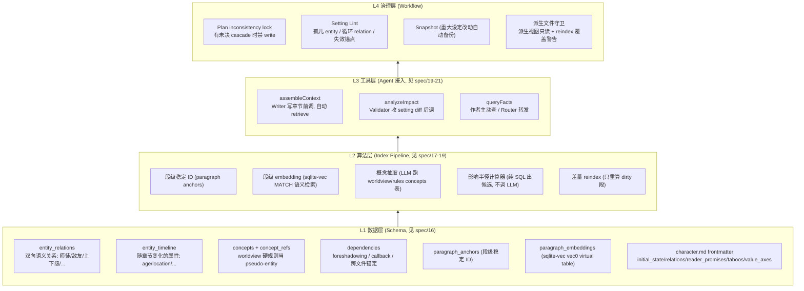
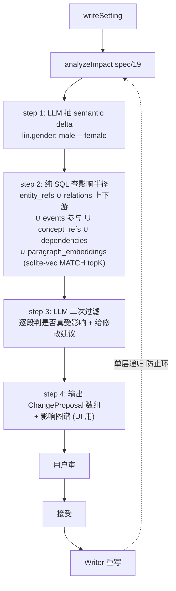
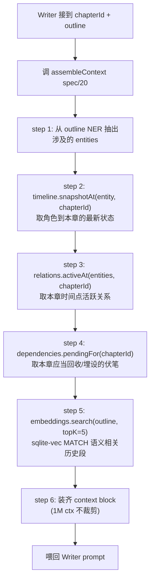
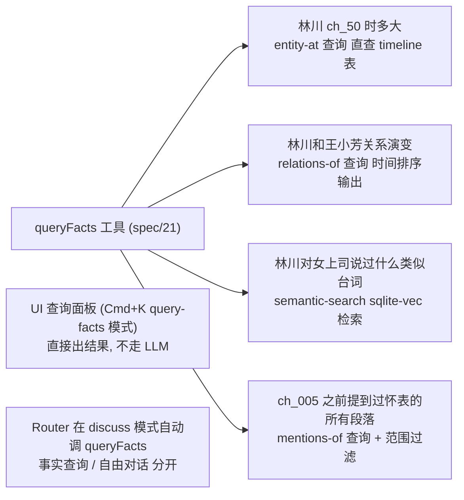

# 11 — 知识图谱

> **[info]** 此文档定义知识图谱层的总体架构。详细 schema / 算法 / 工具签名分散在 spec/16-21,本文档只讲 **Why / What / How 总线**。

## 为什么要有这一层

仅靠"实体属性单字段改动 + 实体显式提及"无法 cover 真实长篇网文场景:

| 场景 | 漏检原因 |
|---|---|
| 改 `worldview/rules.md` 加"此世界没有手机" | "无手机"不是 entity,entity_refs 表里无条目可查;LLM 写章节也不会显式引用 world_main ID |
| 改 `lin.md` 加 `mentor: char_zhang` | 关系类 cascade 需要 entity_relations 表 + character.md frontmatter 含 relations 字段 |
| `foreshadowing/001-pocket-watch.md` 锚定 ch_010 § 5 埋怀表,作者删了 ch_010 第 5 段 | 需要 dependencies 表;foreshadowing 文件与章节段的依赖关系不可表达 → 伏笔静默失效 |
| 核心设定改动,影响在 ch_50 / ch_100 | 默认 ±N 章范围是治标;需要全项目范围 SQL 出候选 |
| 改 `lin.md` 改 `age: 28` → 故事 ch_050 5 年后,林川多大? | 需要 entity_timeline 表 + 按章节查询能力 |
| Writer 写 ch_050"林川和张三第一次合作" | 需要 assembleContext 工具,Writer 不能"半瞎"写 |
| 作者问"林川上次见王小芳是哪一章?" | 需要按角色对查询 + 时间排序 |
| "林川以前对女上司说过什么类似台词?" | 需要段级 embedding + 语义检索 |

**一句话总结**:真实长篇网文需要"实体 + 关系 + 时间 + 概念 + 段级依赖 + 语义"六维图。**不补上这一层,所谓的 cascade 和 RAG 都是表面 demo**。

## 总体架构(4 层)

**Agent 协作流程图**

## 核心数据流

### Cascade(写设定时)

**数据结构图**

**作者改任何 setting,系统能给出完整、确定、毫秒级的候选影响列表**,LLM 仅做"是不是真受影响"的二次判断。

### Context Assembly(写章节时)

**数据结构图**

装齐策略详见 [spec/20](../spec/20-context-assembly.md) + [spec/23](../spec/23-context-contracts.md)。

### 边写边查

**数据结构图**

## 与现有架构的对接

| 现有组件 | 改造点 |
|---|---|
| `entities` 表(spec/01) | 不动,作为根 ID 注册 |
| `entity_refs` 表(spec/01) | 不动,概念维度由新 `concept_refs` 表承载(与 entity_refs 对称) |
| `backlinks` 表(spec/01) | 不动,作为 entity 反向索引 |
| `history` 表(spec/01) | 不动 |
| `learnings` 表(spec/01) | 不动 |
| `approvals` 表(spec/01) | cascade 链路通过 `parent_approval_id` 关联(新字段,见 spec/19) |
| `narrative_metrics` 表(spec/01 + spec/10) | 不动 |
| character.md frontmatter | 升级 — 加 `initial_state` / `relations` / `reader_promises` / `taboos` / `value_axes`,见 spec/16 |
| Validator(plan/02) | execute 内调 analyzeImpact,不再现场 LLM 推 |
| Writer(plan/02) | execute 内调 assembleContext,不再人工塞 referenced_entities |
| Router(plan/02) | discuss 模式优先调 queryFacts,如查不到再调 LLM 自由答 |
| reindex worker(plan/04) | 差量,见 spec/17 |
| AC trie(spec/05) | 同时索引 entity 名 + concept surface_forms,hover 卡区分视觉 |

## 文件系统拓扑

详见 [plan/04 §settings 目录](./04-storage-model.md)。

要点:

- `worldview/` 拆为多个子文件
- `outline/` 拆为多个子文件
- 新增:`factions/` · `organizations/` · `locations/` · `items/` · `events/` · `./timeline/` · `relationships/` · `story-lines/` · `foreshadowing/` · `chapter-arcs/` · `power-system/` · `glossary/` · `taboos.md` · `themes.md` · `reader-promises.md`
- 派生视图:`relationships/_matrix.md` / `./timeline/_character-ages.md`(从 SQLite 表自动生成,`_` 前缀 + `derived: true`,用户既不可见也不可改)

## 不变性引用

本层产生的不变性已合并入 [plan/01 §不变性](./01-overview.md#不变性约束):

- #8 影响半径不依赖 LLM
- #9 派生视图只读 + 段锚点稳定
- #4 未决 cascade 阻断 write

## 不做什么

- **不做实时 LLM 影响分析** — 影响半径必须是 SQL 出候选,LLM 仅二次过滤。任何"现场让 LLM 推这次改动会影响什么"的设计都禁止(慢 + 漏 + 不可解释)
- **不做独立向量数据库** — 段级 embedding 落 SQLite,用 `sqlite-vec` 扩展(loadExtension)+ `vec0` virtual table + `MATCH` 操作符;与普通表 JOIN。不引入 Qdrant / Milvus 等独立服务,详见 [spec/18](../spec/18-embeddings.md)
- **不做"全自动派生设定"** — 派生视图(关系矩阵 / 时间轴)是表的投影,不替作者写设定。"建议给林川加一个师父"这种主动建议留给 Validator / Reflector 的二期能力,不在本层
- **不做"无 schema 自由文本扫描"** — 所有 cascade / context 必须依赖 schema 化字段。自由文本里隐式提到的关系(e.g. 章节正文里写"林川的师父张三")不会被自动归一为 entity_relations 表条目;必须由作者在 character.md 显式声明,或由 Reflector 二期主动建议补全
- **不做跨项目知识图谱共享** — 知识图谱按项目独立,与 memory 的 `resource = projectId` 一致

## 与同类产品的差异

(对照 [plan/01 §与同类产品的差异](./01-overview.md#与同类产品的差异))

| 维度 | NovelCrafter / Sudowrite | Open Novel |
|---|---|---|
| 实体索引 | 静态卡片(Codex) | 动态实体 + 时间轴 + 关系图 |
| Cascade 影响范围 | 无 / 全人工 | 纯 SQL 出候选 + LLM 二次过滤 + 递归 |
| 写章节上下文 | 用户手动选 cards 塞 prompt | assembleContext 自动 retrieve + 1M ctx 装齐 |
| 边写边查 | 静态搜索 / 跳卡片 | queryFacts 4 模式 + sqlite-vec 语义检索 + 时间感知 |
| 伏笔 / 跨文件依赖 | 无 | dependencies 表显式锚定 + lint |
| 概念级一致性 | 无(只懂实体) | concepts 表 + 表面词 NER 索引 |

后四条(assembleContext / queryFacts / dependencies / concepts)是与"AI 代笔工具"赛道的二阶区分点:**NovelCrafter / Sudowrite 是把 AI 装进文字编辑器,Open Novel 是把世界装进 AI**。

## 关联文档

- **上游**:[plan/01](./01-overview.md) 不变性 #4 / #8 / #9 · [plan/02](./02-multi-agent.md) §Validator / Writer / Router · [plan/04](./04-storage-model.md) 存储模型 · [plan/06](./06-cascade-and-reflection.md) cascade
- **核心 spec**:[spec/16](../spec/16-knowledge-schema.md) 知识图谱 schema · [spec/17](../spec/17-paragraph-anchors.md) 段锚 + 差量 reindex · [spec/18](../spec/18-embeddings.md) embeddings(sqlite-vec)· [spec/19](../spec/19-impact-analysis.md) analyzeImpact · [spec/20](../spec/20-context-assembly.md) assembleContext · [spec/21](../spec/21-fact-query.md) queryFacts

## ADR · 设计决策

| 编号 | 决策 | 选项 | 选择 | 理由 |
|---|---|---|---|---|
| ADR-01 | 影响半径算法 | LLM 现场推 / **SQL 出候选 + LLM 二次过滤** / 全文喂 LLM | **SQL 出候选 + LLM 二次过滤** | LLM 现场推漏检率高;SQL 覆盖关系上下游 / 时间区间 / 概念引用 / 段级 embedding 五维;LLM 只做"是否真受影响"二元判断 |
| ADR-02 | 向量索引 | 独立向量 DB(Qdrant / Milvus) / **sqlite-vec + 同库 JOIN** / 无向量(纯关键词) | **sqlite-vec** | 与 SQLite 同库 JOIN segments + entity_refs + embedding;transaction 一致性免费;单机本地无需独立服务 |
| ADR-03 | 派生视图实现 | 实时计算 / **SQLite 表 → markdown 投影 + reindex 重生成** | **reindex 重生成** | 派生文件可供 LLM 读 + 用户偶尔 cat 查看;实时计算性能不可控;`_` 前缀 + `derived: true` 双重守卫 |
| ADR-04 | concepts 抽取触发 | 用户手动 / **worldview / rules 落盘后自动跑 LLM** / 仅审批前临时跑 | **落盘后自动跑(reindex worker)** | 用户手动易遗漏;临时跑会让 cascade 链断;reindex worker 异步跑不阻塞主流程 |
