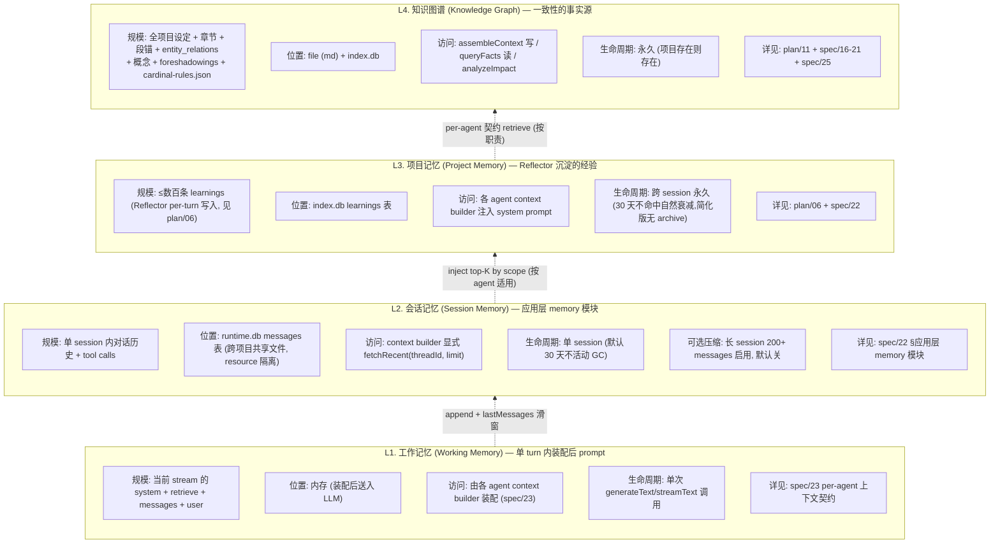
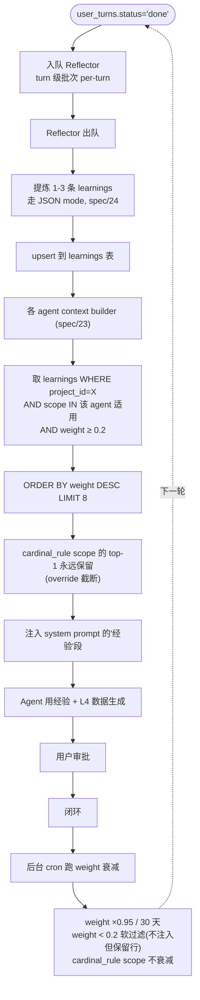

# 12 — Agent 记忆与上下文治理

> **[info]** 这一章补的是"Agent 自身的记忆与每次调用的 prompt 装配",不是"项目数据的知识图谱"(那是 [plan/11](./11-knowledge-graph.md))。两者经常被混为一谈,但是不同层。

## 头等优先级:**一致性 > 一切**

读者最大的弃书原因之一是"读到与前文不一致的内容,瞬间出戏下头"。所以本章的所有设计都围绕一个目标:**让 Agent 在生成 / 审查时,把"一致性所需的上下文"装齐**。

DeepSeek V4(Pro & Flash)的 ctx 是 **1M tokens**(实查见 [spec/00 §C](../spec/00-version-audit.md)),这意味着:

- 普通章节场景下,全设定 + 全相关章节 + 全 entity timeline + 全 relations + 用户范文加起来通常 200K-500K,**远不到 1M**
- 设计骨架:**每个 agent 各自定义"上下文契约"** — 它的职责需要哪些数据,白纸黑字写清楚,该装的必装,不做 token 预算裁剪

## 四层记忆模型

**数据结构图**

**关键不变性**(在 plan/01 不变性 #10 锁定):

- **L4 是单一事实源**:L1-L3 任何与 L4 冲突的内容,answer 时以 L4 为准(例:历史 message 里说"林溪是男的",但 L4 character 已改女,以 L4 为准)
- **L3 写入仅 Reflector**:不允许 LLM 在 stream 中直接 upsert learnings;只有 Reflector 在 `user_turns.status='done'` 时跑一次(per-turn 批次,见 [plan/06](./06-cascade-and-reflection.md))
- **L1 装配契约严格写死**:各 agent 必装项不允许"为节省临时省略" — 1M ctx 给的就是奢侈装齐的本钱

## 应用层 memory 模块

本项目**不依赖任何 Agent 框架的 Memory 抽象**(不用 Mastra Memory / LangChain Memory 等)。自己写薄薄一层 thread / resource CRUD + 一致性校验,~30 行 TS,落地见 [spec/22 §应用层 memory 模块](../spec/22-memory-and-history.md)。

它的职责边界:

- ✅ thread / resource 隔离(`thread = proj:{projectId}:session:{sessionId}`;`resource = projectId`)
- ✅ messageHistory 持久化(`runtime.db` 的 messages 表)
- ✅ 一致性校验(thread 必须以 `proj:{resource}:` 开头)
- ✅ `fetchRecent(threadId, limit=30)` / `append(threadId, messages)` 两个核心函数
- ❌ **不**做 L1 装配(由 spec/23 context builder 完成)
- ❌ **不**管 L3 learnings(那在 index.db,应用层管)
- ❌ **不**管 L4 知识图谱(那是项目 file + index.db)
- ❌ **不**做 semantic recall(默认关;打开后用 sqlite-vec 走 paragraph_embeddings)

## per-agent 上下文契约(核心设计)

每个 agent 都有自己的 context builder,**根据职责定义"必装什么 / 不装什么"** — 详见 [spec/23 §per-agent 上下文契约](../spec/23-context-contracts.md)。

各 agent 装配概览:

| Agent | 关键职责 | 必装数据 |
|---|---|---|
| **Writer(write 模式)** | 生成章节,与 L4 完全一致 | 章节大纲 + 上一章末段 + 全相关 entity 完整状态 + 当前时间点 entity 快照 + 活跃关系 + 待处理伏笔 + 最近 3-5 章原文 + 世界观全文 + 概念约束(taboo / invariant)+ 章节弧光 + 用户范文 + cardinal-rules.json + active critical promises + 涉及角色 value_axes + 距上次 milestone + L3 learnings(style/narrative/worldview/character/cardinal_rule scope) |
| **Validator** | 找当前 ChangeProposal 与 L4 任何冲突 | 主修改 + analyzeImpact 候选半径 + 所有相关 entity 完整 timeline + 所有相关 relations 完整 history + 命中章节全文 + 概念表全部 + 待处理伏笔全部 + 已 resolved 伏笔近 N + 世界观全文 + cardinal-rules.json |
| **Checker** | 风格 / 节奏 / 情绪审查 | 当前章节 + 最近 5-10 章(风格连贯)+ 用户范文 + 章节弧光 + L3 learnings(style/narrative/pacing scope)+ cardinal-rules.json |
| **Humanizer** | 去 AI 化 / 文本改写 | 当前章节 + 用户范文 + 用户口头禅 + project.json style + L3 learnings(style/voice scope)— 不需要 entity / relations |
| **ReaderPanel** | 5 persona 模拟读者反应 | 当前章节 + 5 persona 配置 + 概念约束(taboo)+ cardinal-rules.json + 项目"市场 hits"范文(可选) |
| **Reflector** | 提炼经验 | 这次 ChangeSet 全文 + 用户决议 + 反馈文字 + 已有同 scope learnings(避免重复)— 不读项目数据 |
| **Router** | 意图分类 + 模式校验 | 用户输入 + 当前 mode + 最近 3-5 条 messages — 极简 |

每个 agent 的具体契约(zod schema + retrieve 顺序 + system prompt 模板)在 [spec/23](../spec/23-context-contracts.md) 落实。

**关键约束**:

- 各 agent 必装项**不允许"按 token 预算裁剪"**
- 如果某 agent 的总装配超出 ctx 上限(1M),那是**项目数据真的太大**了 — 应该警报 + 让用户做项目分卷,不是悄悄省略

## L2 历史管理(lastMessages + 可选压缩)

- `lastMessages: 30`(1M ctx 下,plan / write 完整对话历史不被滑窗截断)
- `compressed_messages` 表保留([spec/22](../spec/22-memory-and-history.md) 设计),但**默认 disabled** — 长 session(>200 messages)时由用户手动开启
- `semanticRecall: false`(与 spec/18 embedding 选型耦合)

**不做"自动压缩"是因为**:

- 1M ctx 下,30 条 messages × 平均 500 token = 15K,远不会挤压
- 摘要本身有损,不必要的有损会牺牲一致性
- 真到 200 条以上的极长 session,再用户主动触发,不影响主流程

## 跨进程恢复

| 层 | 恢复机制 |
|---|---|
| L1 工作记忆 | 不恢复(单次 stream 内的纯内存) |
| L2 会话记忆 | 应用层 memory 模块从 `runtime.db` messages 表按 threadId 拉回 |
| L3 项目记忆 | `index.db` learnings 表持久化;**简化版按需 SQL 查,不做启动时主动 hydrate** |
| L4 知识图谱 | `index.db` + file system,按需 retrieve |
| 状态机 | [spec/07](../spec/07-mode-state-machine.md) §持久化恢复(`runtime/session.json` 恢复 mode + pendingApprovals;不恢复 messages — messages 走 L2) |

**协同**:状态机恢复 + L2 messages 恢复要在同一个 thread。详见 [spec/22](../spec/22-memory-and-history.md) §跨进程 hydrate 实操。

## 与已有 spec 的边界 / 引用

- **plan/02 §多项目隔离**:浅初始化 → 引用本章 + spec/22
- **plan/06 §learnings 表 + Reflector**:L3 数据怎么写。本章约束**怎么读**(top-K 注入 + decay)
- **spec/07 §持久化恢复**:状态机 state — 与 L2 messages 的 thread 关联在 spec/22
- **spec/20 assembleContext**:L4 retrieve 的具体实现 — Writer / Validator / Checker / ReaderPanel context builder 都会调它
- **spec/21 queryFacts**:L4 read 工具,与 L1-L3 解耦,Agent 在 stream 中按需调
- **spec/22**:应用层 memory 模块落地(runtime.db schema / thread/resource lifecycle / GC)
- **spec/23**:per-agent 上下文契约具体实现
- **spec/24**:JSON 输出规约 — 决定哪些 agent 输出走 JSON mode
- **spec/25**:五大网文守则 — 决定 Writer / Validator / ReaderPanel 必装的额外数据

## 关键参数(默认值,可在 SettingsDialog 改)

| 参数 | 默认值 | 调节范围 | 说明 |
|---|---|---|---|
| `memory.lastMessages` | 30 | 12 - 60 | 1M ctx 下不需要紧 |
| `memory.semanticRecall` | `false` | bool | 默认关 |
| `memory.compressedMessages.enabled` | `false` | bool | 默认关;长 session > 200 messages 用户主动开 |
| `learnings.topK` | 8 | 4 - 20 | 不是为省 token,是为模型注意力 |
| `learnings.weightFloor` | 0.2 | 0.1 - 0.5 | < floor 不注入 |
| `learnings.weightDecay` | 0.95 / 30 天 | 0.9-1.0 | 老经验衰减率 |
| `learnings.cardinalRuleProtect` | `true` | bool | scope='cardinal_rule' 的 top-1 永远不被砍([spec/25](../spec/25-cardinal-rules.md)) |
| `thread.gcAfterDays` | 30 | 7-90 | 不活动 thread 归档 |

## 与 Reflector 的协同(回扣 plan/06)

Reflector 是 L3 的**唯一写入者**,本章是 L3 的**统一读取规则**:

**流程图 · 各 agent context builder (spec/23)**

**weight 决策(简化版)**:

- 初始 1.0(或 Reflector suggestedWeight)
- 30 天衰减 ×0.95
- weight < 0.2 不注入(简化版不归档,行保留)
- **cardinal_rule scope 例外**:不参与衰减,只能用户在 SettingsDialog 显式调整守则阈值时同步移除

详细 weight 协议简化范围见 [plan/06 §weight 调整(简化版)](./06-cascade-and-reflection.md#weight-调整-简化版)。

## 不解决的问题 / 待办

- **多用户协作**:本架构纯单机单用户,不考虑两人共享 thread
- **跨项目记忆**:不允许。两个项目的 learnings / messages 严格 resource 隔离(合规 + 风格防漏)
- **embedding 选型未定**:[spec/22](../spec/22-memory-and-history.md) §semantic recall 默认关闭,等 [spec/18](../spec/18-embeddings.md) 选型确定后再开
- **超大项目分卷**:极少数项目可能确实超 1M ctx(50万字 + 全设定),需要"分卷加载"策略 — 详见 [plan/11](./11-knowledge-graph.md) §volume_summaries
- **DeepSeek V4 真实 tokenizer 待验证**:1M 是 token 数,本身有估算误差(tiktoken vs 真实 tokenizer)

## 关联文档

- **上游**:[plan/01](./01-overview.md) 不变性 #10 #11 · [plan/02](./02-multi-agent.md) §多项目隔离 · [plan/06](./06-cascade-and-reflection.md) Reflector · [plan/11](./11-knowledge-graph.md) 知识图谱
- **核心 spec**:[spec/22](../spec/22-memory-and-history.md) 应用层 memory · [spec/23](../spec/23-context-contracts.md) 上下文契约 · [spec/20](../spec/20-context-assembly.md) assembleContext · [spec/21](../spec/21-fact-query.md) queryFacts
- **守则关联**:[spec/25](../spec/25-cardinal-rules.md)

## ADR · 设计决策

| 编号 | 决策 | 选项 | 选择 | 理由 |
|---|---|---|---|---|
| ADR-01 | L2 会话记忆实现 | Mastra Memory / LangChain Memory / **自己写 ~30 行** | **自己写** | thread / resource 隔离逻辑极简,30 行 TS 足够;不用 Mastra 避免 1.x 版本风险;接口稳定后未来要换框架成本低 |
| ADR-02 | 是否做 token 预算裁剪 | 裁(节流)/ **不裁(一致性优先)** / 5 级降级 | **不裁,装齐** | DeepSeek V4 1M ctx 给的就是奢侈装齐的本钱;裁掉一致性所需数据 = Writer 看不到关键设定 = 写出矛盾内容 = 用户弃书;真超 1M 时抛 `ContextOverflowError` 让用户分卷 |
| ADR-03 | semanticRecall 默认值 | true(用户体验好)/ **false(等 embedding 选型)** | **false** | 需要 embedding provider 与 paragraph_embeddings 表配套;打开后用 sqlite-vec MATCH 走同一向量索引;[spec/18](../spec/18-embeddings.md) 决策后再开 |
| ADR-04 | 跨进程恢复 L3 是否主动 hydrate | 启动时按 projectId 加载 top-K / **按需 SQL 查** | **按需 SQL 查(简化版)** | 主动 hydrate 需要启动序列协调;按需查 + Drizzle 查询缓存足够;若性能成瓶颈再加 |
