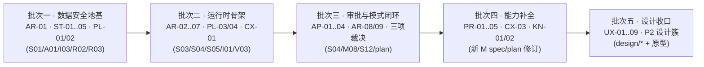

# P009 · 落地前全量架构与设计审计(2026-06-12)

> 目标:在进入实现阶段前,找出现有 plan/spec/design 体系中尚未发现的架构缺陷与设计提升点,并审查交互与视觉是否达到「好用、直观、简洁、高级、克制、优雅」。本档案是审计结果的完整记录;可执行的开放项已按编号回填 [TODO.md](../TODO.md),变更记录见 [CHANGELOG.md](../CHANGELOG.md)。

## 方法与范围

- 第一阶段以 14 个领域并行审计(存储写入、runner 流式、上下文记忆、质量闭环、三模式交互、搜索图谱、审批 recap、平台生命周期、plan 承诺、技术栈、交互文档、主界面视觉、审批/读者原型、设置/引导/面板原型),产出 110 条原始发现;对抗验证因配额中断,仅 11 条完成独立验证。
- 第二阶段在主会话内通读全部 79 份文档(spec 根层 32、platform 11、appendix 10、plan 10、design 8、原型 HTML 8,共约 9000 行),逐条核对引文、驳回不实项、合并重复项,并补充 3 条新发现。
- 与 TODO.md 既有 23 条(TODO-P0-01..03 / P1-01..06 / P2-01..14)逐条去重,本档案不重复记录已知问题。

**结论速览**:文档体系的主权分层(S/M/I/R/A/V)、失败语义写法和产品价值观是扎实的,多数单篇 spec 内部自洽。真正的风险集中在四类:**跨文档接缝**(两篇 spec 各自正确、拼起来矛盾)、**plan 承诺无 spec 承接**、**运行时骨架缺口**(执行宿主、超时、崩溃恢复)、**审批这件「最重交互」的边角语义**。确认结果:P0 × 1,P1 × 41(其中 3 项需用户裁决方向),P2 与提升项 × 26,驳回或降权 × 4。

---

## 一、P0 · 不补就会出数据事故

### AR-01 审批落盘中途 crash 无恢复协议(已对抗验证)

- **证据**:`spec/S14-project-storage.md:64-85` 落盘剧本只定义顺序(校验→写文件→记事实→reindex),无崩溃语义;`S01:127` 称「内部回滚文件或重跑事务」、`S01:129` 又承认「internal recovery 快照缺失」时只能人工处理,而快照何时建、含什么、与 apply 是否同事务,全仓无定义;`spec/S03-turn-orchestration.md:183`「recovery 缺少状态则不重跑」同样悬空。
- **影响**:进程在「写完第 3/7 个文件」或「文件已写、事实库未记」时崩溃,重启后半应用 ChangeSet 会被 S01 冲突规则误判为外部编辑,可能双写或连带误杀其它 pending 审批;多文件 cascade 半应用直接破坏全书一致性且无修复入口。这是 S01 开场承诺「每个事故都有可信收场」中最大的没收场的事故。
- **改法**:在 S01 定义 apply 协议:(1) apply 前在项目事实库事务性写入 apply journal(ChangeSet id、目标文件清单、每文件前像/后像指纹、快照引用);(2) 逐文件临时文件+rename 原子替换;(3) 事实记录与 journal 完成标记在同一 SQLite 事务提交,作为唯一提交点;(4) 启动时扫描未完成 journal,按指纹判定前滚或回滚;(5) 明确审批/turn 状态主权落项目事实库,runtime/session 只是投影。A01 落字段,V01 加 crash 注入测试。

---

## 二、P1 · 运行时与编排(AR)

### AR-02 长任务执行宿主无主权定义(已对抗验证)

`spec/S04-streaming-ui-protocol.md:93` 承诺断线恢复「不重跑 Agent,只恢复订阅」,预设了独立于客户端连接的服务端执行宿主,但没有任何文档定义 runner run 归属哪个执行上下文。Next.js 下最自然的写法(SSE route handler 内跑 model loop)会让刷新/断网杀死 turn,dev 热重载清空内存态,恢复路径整体不成立;进程崩溃后 running turn 如何标记也无人定义。`V03` 只 spike 了 better-sqlite3,没有长流式承载 spike。**改法**:S03(或新增 platform 契约)定义 run execution host——turn 被接受后由进程内后台执行器持有,SSE 仅是只读订阅;进程重启后对持久 running turn 标记 interrupted,不自动重跑;V03 增加承载方式与热重载存活 spike。

### AR-03 取消语义不完备(已对抗验证)

`spec/S02-agent-runner.md:73` 状态机唯一通向 Stopped 的迁移是 `CallingModel --> Stopped`;ToolRequested(含数十秒的二次 LLM 调用)、Validating、Repairing 中取消行为未定义,`S04:160` 取消表也没有「工具执行中」一行。同篇还自相矛盾:`S03:135` 把 cancel 列入 failure 枚举,`S03:79` 又说「Stopped 不是失败」。**改法**:所有非终态可达 Stopped;S03/S09 定义 in-flight tool 取消策略(read/query 立即 abort、二次 LLM 透传 abort、不可中止的等待但弃用结果并记 cancelled);runner result 增加独立 stopped 类型;被取消 step 仍写入 S10 证据。

### AR-04 全链路无超时/心跳/watchdog(已对抗验证)

`S03:89` stop condition 枚举没有时间维度,`S04:177-183` 失败分叉、`S05:110-119` 事件事故表均无 timeout 行。provider 流挂起、工具死等时 turn 永久 Running,且占住 S04「同一项目唯一可写 turn」互斥位,阻塞整个项目;UI 无心跳约定,「慢但活着」与「已经死了」不可区分。**改法**:run envelope 增加首 token / token 间隔 idle timeout、per-tool timeout、per-run wall-clock budget;S05 约定 progress 心跳间隔与「疑似中断」展示;S04 增加 turn deadline 分叉。

### AR-05 I01 缺运行时 provider 失败分类(已对抗验证)

`spec/platform/I01-llm-provider-contract.md:29-37` 失败收场只有 4 行接入期审计项;429 限流、超时、5xx、上下文超限、内容过滤各自是否 transient、退避策略、计入哪个 retry budget、向 S05 上报什么状态全部缺位,而 `S03:114` 要求「自动重试只能修复可证明的 transient」、`S03:120` 把 provider retry budget 归属写成「S03 + I01」——悬空引用。限流是本系统最高频运行时事故。**改法**:I01 补 runtime failure taxonomy(failure_kind × transient 与否 × 退避 × 预算归属 × 用户可见收场),与 S09 failure_kind、A02 failure envelope 对齐;上下文超限单列(非 transient,传导回 S07)。

### AR-06 CancelPlan / ManualRecovery 无状态点投影(已对抗验证)

`S04:70-74,166` 定义 CancelPlan 为阻塞性交互态(必须让用户确认影响范围),ManualRecovery 为需人工处理终局;`S05:50-62` 状态点只有 Idle/Running/AwaitingApproval/Error 四态,`S05:118` 把 cancel requested 写成被动「等待 turn 最终状态」。照 S05 实现,带 pending ChangeSet 的取消会双方互等、永久「正在取消」。**改法**:S05 增加「需要决定」投影统一覆盖三类阻塞态;A03 补 cancel plan ready / manual recovery required 事件;取消处理改两段式。

### AR-07 持久 turn 状态无库归属

`spec/S00-system-contract.md:85-89` 把「持久 turn 状态」列为主权层,但 `spec/S01-runtime-state.md:38-43` 三库职责表没有它的归属行(runtime.db 只写「跨项目会话恢复状态」)。pending approval、active turn 若落全局 runtime.db,会与「审批后事实在项目库」「项目包导出可带走全部状态」冲突。**改法**:S02 三库表补「持久 turn 状态」行,明确落项目事实库(随项目迁移),runtime.db 只存跨项目恢复指针;A01 落表归属。

### AR-08 动作队列与多审批卡无 spec 承接

`plan/07-collaboration-and-modes.md:61-73` 定义了队列、插队、点名取消单个动作;`plan/08:41` 承诺「同一时刻可能有多张审批卡,一次只面对一张,审完下一张再来」;design/02 也画了 `Cmd+]` 队列切换。但 `S04` 状态机是单 turn 单 AwaitingApproval,事务信封虽有 action queue 字段,队列的暂停/插队/点名取消语义、多 pending ChangeSet 的并存与排序规则零承接。**改法**:S04 定义 action queue 子状态机(排队/执行中/被点名取消/因审批暂停)与多 pending approval 的队列语义;A02/A03 落对象与事件。

### AR-09 否决重做闭环与防死循环无机制

`plan/08:101-102` 与 `plan/07:82` 承诺:否决+理由→AI 重做→「反复重做结果仍与被否决版本高度相似时主动停下升级」。spec 侧:`S03:114` retry budget 明确只管 transient/contract failure 且「不能把失败包装成新的无限 turn」;M08 仅有「拒绝转为重做输入」半句。理由如何注入重做上下文、重做算不算新 turn、谁计算「高度相似」、几轮触发升级——全部缺位,而 design/02 状态矩阵已经在引用「连续 3 轮未收敛」。**改法**:S04 定义 rejection-redo loop(理由进入 context package 的不可裁层、重做轮计数、相似度判定主权与升级收场),S12/S07 配合,V01 加用例。

---

## 三、P1 · 审批与质量闭环(AP)

### AP-01 「修改后接受」不重跑内容级复核

`S04:132`「编辑后接受:以用户编辑版替代 proposal,新内容仍需满足 group preconditions」——preconditions 只是文件版本/锚点/索引健康度(`S04:106-119`),用户编辑后的内容**不再经过** S12 守则/一致性复核,也不触发同组 cascade 重算。配合 `S12:38`「阻断级未解决前不能落盘」却没有「解决」的判定语义(编辑后谁复检?),EditedAccepted 成为质量门禁旁路:可整组落盘自相矛盾的修改。**改法**:S04/M08 定义编辑后轻量重检(至少同组一致性与守则重跑,diff 范围限编辑项);S12 定义阻断级「解决」语义(重检通过/明确拒绝理由)。

### AP-02 质检与审批的时序无契约

`S12:64`「诊断可以异步,但不能伪装成已完成」;`M06` 流水线却是 Writer→Review→ChangeSet→Approval 串行;`plan/06:67-81` 给了真正意图(三路并行审,汇成一张审批卡=同步点)。spec 没有编码这个汇合点:审批卡何时可开、诊断迟到的风险如何并入已打开的卡、检测失败时风险等级算什么,实现者三种读法。**改法**:S04 在 GeneratingProposal→AwaitingApproval 之间显式定义质检汇合条件(全部完成或显式标记不可用),S12 的「异步」收窄为卡内增量更新语义。

### AP-03 M08 状态机缺 Invalidated,终态词汇与 S04 冲突

`S04:16` 审批生命周期含 invalidated,`S01:105-117` 冲突判定也产生 Invalidated;但 `M08:32-47` 用户侧状态机没有 Invalidated 态(失效审批用户看到什么、能否一键重新生成,无定义),且 M08 是 `ApplyFailed → Closed`、S04 是 `Failed → Recoverable/Terminal`,两套终态词汇会让实现者建两个状态机。**改法**:M08 状态机补 Invalidated(含用户可见收场与重建入口),终态词汇以 S04 为唯一主权、M08 只做投影映射表;A03 补 approval invalidated 事件。

### AP-04 residual obligation 无生命周期主权

`S04:134` 要求 obligation 带来源/原因/阻断级别/下次检查入口,`M08:87` 要求「让作者看得见」,但全仓没有它的状态机(open→resolved/dismissed)、没有全局清单入口(库面板?Settings?)、重逢时如何去重(同一搁置项被 Validator 反复发现会不会重复堆积)。**改法**:S04 定义 obligation 生命周期与去重键;M10 或 M17 承接「当前项目全部未决事项」清单入口;A01/A02 落对象。

### AP-05 待审期间输入锁定三方矛盾(需裁决,见 §八)

---

## 四、P1 · 存储与平台(ST / PL)

### ST-01 appendix 关键定义零落地,跨能力主键无权威出处(已对抗验证)

`spec/appendix/A01-schema-tables.md` 无任何 DDL/字段类型/主键(自述「按需从历史归档抽取」),A02/A03/A05 同为归口索引。其中四个定义是跨能力主键,缺位即系统性返工:**anchor 身份算法**(审批失效、KG、高亮、恢复共用)、**三库表归属与真源/可重建标记**、**ChangeSet/approval schema**、**事件去重键**。角色卡结构化字段(读者承诺/禁忌/价值观基线/弧光,守则二、弧光诊断的输入,见 `plan/05:62-65`)同样无 schema。**改法**:实现前把 anchor、entity/alias/relation/dependency、embedding、ChangeSet/approval/decision、apply journal、file version ledger、lease、watcher cursor、repair job、recap、角色卡/章节卡约十二类对象先行落到 A01/A02,并加「三库归属表」。

### ST-02 项目事实库(真源部分)损坏无收场协议(已对抗验证)

`S01:35` 把审批后事实(含 residual obligations、recovery snapshot)定义为不可从文件重建的真源;`R04:3,67` 明确只管派生索引,R02 只在有备份时有效。事实库 SQLite 损坏/误删/部分恢复时:文件与账本指纹不一致谁赢、pending approval 是否还算数、系统进入什么模式——无文档回答。**改法**:R04(或新 R 契约)定义 facts-degraded 模式:开项目时校验账本完整性;不可用→可读可手编、阻断审批/cascade/学习;两条显式出路(备份恢复账本,或以文件为准重建空账本+审批历史标记丢失)。

### ST-03 外部编辑判定缺持久指纹基线与自写回声识别

`spec/platform/I03-filesystem-and-watcher.md:25-37` 的 cursor/水位/reconcile 设计是好的,但两个关键件缺位:系统自己落盘引发的 watcher 事件如何与外部编辑区分(自写回声);应用关闭期间的外部编辑靠什么发现(需要每文件内容指纹基线,A01 无此字段族)。没有基线,离线外部编辑无法触发 `S01:105-117` 的审批失效。**改法**:S01/I03 定义 per-file content fingerprint ledger(每次已知写入后更新),启动 reconcile 用指纹对账;写入路径携带 write token 以识别回声。

### ST-04 lease 只有行为表,载体与 fencing 缺失

`S01:16-28` 与 `I03:39-47` 定义了 lease 的场景行为,但载体(db 行?锁文件?心跳?)、续约/过期判定、以及 fencing(旧 owner 进程假死后复活,凭什么被拒绝写入)无定义。单机双窗口下 stale lease recovery 若无 fencing token,会出现双写。**改法**:I03 定义 lease 载体与心跳/过期参数族,写入路径强制校验 fencing token;A01 落 lease 表;V01 加双窗口接管与假死复活用例。

### ST-05 备份生成侧无一致性静止点

`spec/platform/R02-backup-restore.md` 定义了四种备份与恢复流,但生成侧没有一致性要求:Manual Backup 若在 Applying 中途执行,文件与项目库在不同瞬间被拷贝,Safety Snapshot 可能捕获半应用状态——恢复这种备份等于恢复一个损坏世界。**改法**:R02 增加备份前置:获取只读一致性点(暂停 apply/等待事务完成),备份 manifest 记录所含文件版本指纹与账本水位,恢复时校验一致性。

### PL-01 缺统一版本模型,导入链路无迁移节点

`spec/platform/R03-migration-and-upgrade.md` 只有抽象流程:schema 版本、索引(embedding 模型)版本、项目包格式版本三种版本号及其迁移顺序未定义;`I04` 导入流程(Validate→Preview→Import→Reindex)没有版本检查与迁移节点,项目包无 manifest/项目身份(同 id 重复导入语义缺失);`R01` 状态机无 Migrating 态,迁移与 lease/pending approval 的前置关系未接;降级方向(旧版应用打开新数据)只有「升级要求」一句。**改法**:R03 定义三版本号与检查顺序、forward-compat 拒开语义;I04 定义 package manifest(格式版本、项目 id、内容清单、指纹);R01 增加 Migrating 态并接入 lease/pending 前置。

### PL-02 API key 存储主权无文档

`spec/S15-settings-and-onboarding.md:24-33` 只说 Model 分区放凭据,`R05:25` 只说诊断包不含 key;key 落在哪(明文 settings.json?系统 keychain?)、文件权限、设置导出(design/04 有「导出设置 json」)是否包含 key、Trace/错误信息的泄露面——全部无契约。原型 05 文案「Key 仅存本地 settings.json」已在替 spec 做决定。**改法**:I05 或 S15 定义凭据存储契约(默认壳层 keychain、纯 Web 形态落本地文件需声明权限与明文风险),设置导出强制剔除凭据,R05/M09 重申遮蔽。

### PL-03 embedding 模型全仓缺位

语义召回是影响分析、Universal Search、跨卷召回的依赖(`S06`、`S07`、`M01`),但 `I01` 能力表没有 embedding 行,`V03:13-25` spike 清单没有 embedding 条目,维度(sqlite-vec 建表必需)、provider(DeepSeek 是否提供?)、成本、降级路径零契约。这是技术栈最大的未决依赖。**改法**:I01 增加 embedding provider 能力行(模型、维度、批量、成本、不可用降级);V03 增加 spike;A01 的 embedding 表字段与所选维度绑定并记录模型版本(与 PL-01 的索引版本联动)。

### PL-04 better-sqlite3 同步调用与流式同进程的阻塞维度未审计

README 技术栈选择同步 API + 单进程承载 SSE;大批量 reindex/向量写入会冻结事件循环,所有进行中的流式响应停顿,前端将按断线恢复误判。`V03:21` 现有 spike 只覆盖「连接稳定」,无阻塞时长维度。**改法**:V03 spike 增加「重 reindex 期间 SSE 心跳延迟」测量;若超阈值,S06 reindex 在 worker 线程或分片让步执行,作为 S01/S06 的实现约束写明。

---

## 五、P1 · 上下文与知识(CX / KN)

### CX-01 token 预算无终局裁决层

`S07:36-39` 在组装 context package 时判「预算内?」,但 prompt packet 是 S08 拼完整层(模板正文+经验+围栏)之后才成形,`S08` 没有任何最终预算校验与超限失败语义;预算数值本身(模型上限、各 Agent 配额)归 I01 还是 S07 也未声明。结果是「S07 说装得下、S08 拼完超限」无人收场。**改法**:S08 增加 packet 终局预算校验(超限退回 S07 走 overflow 决策,不静默截断);I01 声明模型上下文上限的事实主权;A02 在 prompt packet 落 budget 字段。

### CX-02 经验仲裁方向相反、淡化机制缺失(需裁决,见 §八)

### CX-03 分卷主权悬空

`S07:59-71` 把卷/册/章节切片当一等架构(跨卷必装事实、卷摘要带来源版本),但全仓没有定义:卷边界由谁声明(作者文件结构?frontmatter?设置?)、卷摘要由谁生成/何时失效/失效后谁重建(reindex 的一部分?)、`S01` 的文件类型清单里也没有卷对象。**改法**:S01 定义卷作为作者文件结构的显式声明;S06/S07 定义 volume summary 为派生对象(纳入 reindex 与 R04 健康度);A01 落卷与摘要字段。

### KN-01 事实查询与上下文装配缺「故事时点」语义

`M03:20-26` 与 `S07:107-115` 的「角色当前状态」默认全书最新。作者改写第 20 章时,Writer 备料与 fact query 都会拿到第 80 章的状态(剧透式错置);S06 已有 timeline 对象,但查询/装配层没有 as-of-chapter 参数。**改法**:M03/S07 增加 as-of 语义:正文写作与改写默认以目标章节为时点,查询浮层提供「截至第 N 章」切换;S06 timeline 承接按时点取状态。

### KN-02 实体身份治理缺失(合并/拆分/别名确认)

`M10:34`「同名歧义:显示候选和来源,不自动认定」只有展示层;抽取错把两个「老张」并成一个实体、或同一角色被拆成两个实体时,用户没有任何修正工作流(合并/拆分/确认别名),`M08:69` 改名场景也未定义旧名是否保留为历史别名(防止旧章引用断裂)。R04 重建解决不了系统性误并。**改法**:M10(或 S06)定义实体治理动作:确认别名、合并、拆分,均生成可审批的派生修正;改名 cascade 默认把旧名降级为历史别名;A01 落 alias 状态字段。

---

## 六、P1 · 产品承诺覆盖缺口(PR)

### PR-01 守则四的「兑现窗口」无机制承接

`plan/03:46-49`:超期未兑现的关键承诺按**阻断级**——这是五大守则里唯一的阻断级触发,但「兑现窗口」谁声明(作者在伏笔卡设定?系统按章数推断?)、「超期」按什么计算(章节数?字数?),`S06` dependency 对象与 `S12` 期待感检测都没有窗口/期限字段。全产品最强的执行语义建立在未定义概念上。**改法**:plan/05 伏笔资料卡增加兑现窗口字段(作者声明,系统可建议);S06 dependency 落 deadline 语义;S12 定义超期判定与阻断收场;A01/A02 同步。

### PR-02 叙事力学诊断没有能力闭环(README 头牌能力最大覆盖洞)

`plan/09:19-40` 承诺章内四维体检(情绪曲线/冲突密度/节奏张弛/钩子)、全书节奏地形图、诊断留档可回看、旧章主动诊断、单维度重跑——这些是用户可触发、可感知的能力,但 M01-M17 没有对应能力 spec,design/ 没有对应界面(design/03 只是 ReaderPanel),报告对象 schema 只在 A02 列了一个名字。**改法**:新增 M 级 spec(叙事诊断报告的触发、展示、存档、趋势聚合、与审批说明的关系)+ design 文档与原型;BeatAnalyzer 主权归位与 TODO-P2-12 一并处理。

### PR-03 结构模板库零承接

`plan/09:44-55`:四个结构模板可在大纲阶段应用、可对已写章节回照。spec 层无模板对象、无应用/回照流程、无 design;它影响 Writer 上下文与大纲生成,不是纯文案。**改法**:并入 M05(规划模式)或新 M spec,定义模板为只读结构参照(不进入守则评判,呼应 plan/09「不点名不套」),A05 收录模板 prompt 片段。

### PR-04 「留存预测」自相矛盾(需裁决,见 §八)

### PR-05 「数据归你」三项导出承诺无承接

`plan/02:69` 承诺项目连同分析与经验一键导出导入、设置整体导出;`plan/08:89` 承诺审批日志整体导出。`I04` 的项目包没有内容契约(经验/trace/审批历史是否随包,与 PL-01 的 manifest 缺失同源),S15/M14 没有设置导出,M08/M17 没有审批日志导出。**改法**:I04 定义包内容清单(经验默认随包、trace 默认不随包可选);S15 定义设置导出(剔除凭据,见 PL-02);M17 或 M08 定义审批历史导出格式。

---

## 七、P1 · 交互与视觉(UX)

### UX-01 审批聚焦卡自动浮出 + Y/E/N 无焦点守卫

`design/01:124-126` 审批卡 await_approval 时自动浮出(模态遮罩)且 `Y/E/N` 单字母直达;`S14:3` 又规定浮层「不能抢焦点」。卡自动弹出瞬间焦点归属未定义:若取焦点,用户正输入的字符会变成审批指令(Y=落盘);若不取,Y/E/N 不可用。IME 缩小但不消除误触窗口(英文输入/非组合键)。**改法**:design/01+S14 定义:自动浮出不抢焦点,单字母快捷键仅在卡获得焦点后激活,卡出现后 ~500ms 内忽略字母键;`Y` 不可在含阻断级/未确认风险时生效(与 design/02 同步)。

### UX-02 「对照视图」被 ≥5 处引用却零契约

拖章号到纸面右半(`design/01:54`)、Search `Cmd+Enter`(M01)、实体点击「右侧对照打开」(`design/01:93`)、反链跳转(`design/01:178`)、Quick Open(design/06)、M16 Compare View——没有任何文档定义对照视图的布局(分屏比例)、哪侧是「当前纸面」、焦点与命令路由(Cmd+K 作用于哪侧)、关闭方式、章节轨如何表示双开。**改法**:design/01 新增对照视图章节(或独立 design),S14 定义双 pane 下的命令路由与焦点规则。

### UX-03 八个召唤层无并存/互斥契约

库(320px)、Trace(380px)、Activity、Universal Search、查询浮层、输入条、批阅层、审批卡共存规则未定义:库+Trace 双开纸面剩多少(44+320+380 后窄窗纸面 <720px)、Search 可否叠在审批卡上、z-index 在原型里是散值(20/30/40/50/60/65/66/70/99)。**改法**:design/01 增加层级矩阵(每层:推开式/悬浮式、可并存集合、互斥规则、z-index token 化),S14 的 Esc 关闭顺序与之对齐。

### UX-04 审批卡内「跳到对应章节段」与模态遮罩冲突

`design/02:60` 守则风险行、`design/03:31` 风险行都承诺点击跳编辑器对应段,但审批卡是中央模态:跳转后卡关闭(pending 保留)还是悬浮保持(遮罩挡住正文)?审批中查看上下文是核心刚需,这条路径不闭环会把「10 秒读懂一批改动」变成反复开关卡片。**改法**:design/02 定义「对照审批」形态——点跳转后卡收为右侧浮窗或底部条,正文滚动至锚点并高亮,一键回到卡;或卡内嵌上下文预览。

### UX-05 ReaderPanel 独立模式不闭环

四处叠加:`design/03:5`「右栏单独成卡」锚定在已不存在的旧三栏「右栏」;报告 IA 与 `M11:55-63` 主权结构对不上(Payoff Check、人设对照、Revision Suggestions→Discuss 无设计对应),design/03 上游也漏挂 M11;「按风险点修改」依赖的「已勾选风险行」在 IA 里没有勾选控件;独立模式(非审批上下文)下「按风险点修改/跳过」触发什么 turn 未定义;`plan/09:93`「毒舌标记直接变成润色修改清单」的联动同样无承接。**改法**:design/03 重对齐 M11 区块、补勾选机制与独立容器定义;M11 定义 report→action 的两条出路(进入拒绝反馈环 / 发起 Humanizer 任务并预填风险位置)。

### UX-06 命令面板「cascade 全部同意」绕过看全审定

`design/prototypes/06-command-palette.html:197` 与 `design/06:37` 把它做成全局命令(有待审时可见)——不打开卡、不看 diff 即可整批落盘,违反 `S00:221`「不能跳过用户看到并审定这一批具体变更」的精神;design/02 的 `Cmd+Shift+A` 限卡片焦点内,语义不同。**改法**:面板命令降级为「打开待审审批卡」;若保留快捷全同意,必须先弹出卡再要求二次确认,且对含确认级/阻断级风险的批次禁用。

### UX-07 「已落盘 7/9 项 · 撤销」toast 与 forward-only 矛盾

`design/06:82` + 原型 06:4 秒即逝的 toast 提供「撤销」,暗示存在即时撤销;`S04:168`/M17 规定撤销=生成反向 ChangeSet 再审批。实现者照 toast 做会建出 spec 禁止的第二条回退链路,而 4 秒窗口对如此重的动作也是糟糕的交互。**改法**:toast 操作改为「查看回执」或「生成修正提案」,与 design/02 的同意完成回执口径统一。

### UX-08 Onboarding 的 Enter 无 IME/焦点闸门(原型已是可复现 bug)

`design/05:17`「Enter=下一步」;原型 05 的全局 keydown 监听(`05-onboarding.html:234`)不检查 textarea 焦点与 `isComposing`——在「故事种子」多行框里换行、或中文输入法确认候选词,都会直接跳步;step3 项目名标了必填但前进无校验。首启是第一印象,中文产品首屏就会被 IME 误触。**改法**:design/05 补 Enter 闸门(输入控件聚焦与 IME 组合态中不触发;textarea 内 Enter=换行)、step3 必填校验与错误态;原型同步修复。

### UX-09 归档文案「30 天后自动清除」违反 R01

`design/prototypes/04-settings.html:200` 按钮文案「归档(30 天后自动清除)」;`R01:60` 明确「归档保持可恢复」,删除才是破坏性动作。虽然 design/README 声明原型文案是样例,但这条样例陈述的是一个违反平台契约的行为,照抄即数据丢失事故。**改法**:原型与 design/04 改为「归档(可随时恢复)」;若产品确需自动清理,必须走 R01 修订+用户裁决,而不是 UI 文案夹带。

---

## 八、需用户裁决的三个方向

以下三项不是漏写,而是文档之间立场相反,必须先裁决再修文档(已入 TODO,标【裁决】):

1. **待审期间能做什么**(TODO-P1-14):`plan/08:76`「新输入与模式切换都锁住」 vs `S04:150`「只读查询可并行」 vs `S14:83`「Search 可用、仅禁危险动作」。叠加「审批永不过期」,全锁意味着一张过夜的审批卡会锁死整个产品的查询与讨论能力。建议方向:落盘类输入锁定,只读(查询/Search/Discuss)放行——即采纳 S04/S14 口径、收窄 plan/08 措辞;但需要你确认产品立场。
2. **经验冲突仲裁方向**(TODO-P1-24):`plan/10:39`「上个月的口味让位给这个月的」(新替旧) vs `S02:50-58` Reflector 把冲突候选 Dropped(旧压新)。两个方向都有合理性(跟随现在的你 vs 防误学),且 plan 承诺的「一般经验随时间自然淡化」在 spec 层没有任何衰减机制。需要裁决方向后同步 plan/10、S02、M12、A01。
3. **「留存预测」与诚实声明**(TODO-P1-31):`plan/09:75`「本章的留存预测」+ design/03 主题适配里的「留存环」 vs 同篇「诚实声明:模拟,非预测」、`plan/04` 不做真实留存校准、`M11:124` 不做总分/KPI。建议方向:改为「弃读风险信号」类措辞并删掉留存环图形;若你想保留量化预测,需同步修订 M11 反评分边界与诚实声明。

---

## 九、P2 与提升项

P2 = 不阻塞落地但会造成实现混乱或体验折损;标 ⬆ 的是提升设计高度的机会(elevation)。

| # | 发现 | 证据 | 改法/归宿 |
|---|---|---|---|
| Q-1 | S11 六层指标无判定机制(机器/LLM judge/人工),judge 漂移无人治理 | `S11:37-47` | S11 按指标声明判定方式;V02 落 judge 口径 |
| Q-2 | 「阻断合入」无执行载体(无门禁命令/触发点) | `S11:6` `V01` | A06 命令摘要落地时定义本地门禁脚本与触发点 |
| Q-3 | 守则误报无标定回流:作者否决的风险信号不进入阈值校准 | `S12:80-91` | S12 增加误报记录与 Settings 阈值建议联动 ⬆ |
| Q-4 | golden 无模型升级 re-baseline 协议,换模型门禁全红 | `S11` `V02:33` | S11 定义 re-baseline 流程与期望漂移裁决 |
| Q-5 | 质检默认触发策略/增量范围/成本无契约(每次草稿迭代跑多少) | `S12:93-101` | S12 定义增量检测范围与触发档位 |
| R-1 | 事件流无 seq/游标:S03「可恢复事件」与 S05「可丢」措辞冲突,step 内 delta 无去重键(已验证,降 P2:系统已选定有损事件+持久状态模型) | `S03:44` `S05:35` `A03:14` | S03 措辞收窄为「可去重事件」;A03 落 per-turn seq + attempt id 作去重键 |
| R-2 | ⬆ run 内工具结果缓存/repair 重试不重执行,降成本且让 replay 确定(已验证) | `S03:71` `S09:48` | S03/S09 约定 repair 重试保留 transcript、成功工具结果不重执行 |
| K-1 | pending 事实是否出现在搜索/知识面板未点名(S06 事实优先级已隐含「不进派生层」) | `S06:40-48` `M01` `M10` | M01/M10 各加一句「待审批内容不进入派生展示」 |
| K-2 | 全局 runtime.db「最近访问」进搜索源,跨项目隔离未点名强制点 | `M01:70` `S02:40` | M01 声明搜索源严格限当前项目 |
| K-3 | ⬆ 索引落后只有全局横幅,缺单条结果 stale 标记与「刚写内容多快可搜」承诺 | `M01:167` | M01 增加 per-result 来源新鲜度标记 |
| K-4 | repair/reindex job 中断后幂等重入未声明 | `R04:28-39` | R04 声明 job 按水位幂等,半成品索引重入安全 |
| S-1 | ⬆ 无自动滚动备份:长篇在用户零操作下没有安全网(事实库不可重建,见 ST-02) | `R02:7-12` | R02 增加自动滚动备份与保留策略 |
| S-2 | 诊断包未分类正文/经验是否进包,导出前无内容预览 | `R05:17-25` | R05 增加内容分级清单与导出预览确认 |
| P-1 | 双形态键位冲突(新发现):纯 Web 形态下 `Cmd+L` 被浏览器地址栏占用且不可拦截、`Cmd+P`=打印,M01/M02/S14 键位未按形态分层 | `I05:3` `S14:79-83` | I05 增加双形态能力/键位矩阵;S14 为 Web 形态声明替代键位 |
| C-1 | 不可信正文可经 Reflector 经验「洗白」逃逸围栏(experience 层不在 untrusted_sources) | `S08:45-53` `S02:50` | S08 声明经验为偏好材料永不解释为指令;Reflector 提炼时消毒 |
| C-2 | ⬆ 风格回声室:被采纳的 AI 改写回流为「用户风格」依据,无来源分级 | `S13:33-41` | S13 风格来源加权重分级(用户手写 > 用户编辑 > 采纳的 AI 文本) |
| C-3 | XState 落点(client/server)与持久状态机关系未声明 | README `S04:89` | S00 技术路线表声明 XState 仅作 server 侧编排实现,持久格式与库 schema 解耦 |
| C-4 | Aho-Corasick 高亮词典的构建/版本化/失效时机无契约(第三份索引) | README `S06` `I02` | S06 把高亮词典声明为派生索引之一,纳入 reindex 与健康度 |
| C-5 | ⬆ turn 级成本/token/时延预算与 cascade preflight 估算未成一等契约(plan 承诺用量可见) | `S03:117-122` `plan/06:101` | S04/M09 定义 turn 预算与预估披露;A03 落 cost 事件 |
| C-6 | plan/05「设定体检」(孤儿设定/断裂伏笔定期体检)无 spec 承接(新发现) | `plan/05:90` | 并入 PR-02 的叙事诊断闭环或 R04 健康度扩展 |
| C-7 | plan/06「助手性格项目级定制」无 spec 落点(新发现) | `plan/06:103` | S08 role/experience 层或 S15 Style 分区承接 |
| A-1 | 审批卡区③「已分析但无需改动」无 schema/M08 分组对应 | `plan/08:35` `M08:65-72` | A02 ChangeSet 增加 no-change-evidence 项;M08 分组表补一行 |
| A-2 | M04 升级状态机 AwaitUserIntent 无「用户拒绝→回讨论」回边 | `M04:44-55` | M04 状态机补回边 |
| A-3 | 批阅层未决标记无生命周期(重启/关文档/切模式后去向) | `M07:26-38` | M07 定义未决建议的持久与失效规则 |
| D-1 | design/02 状态矩阵缺 M08 的 ApplyFailed/部分失败/锚点失效收场态 | `design/02:69-79` `M08:100-109` | design/02 补三种失败态展示 |
| D-2 | 响应式契约空白:无最小窗口、库+Trace 双开规则、固定浮层(880×620/720px)窄窗降级;原型仅一处 min-width:980px | `design/01:183-185` `design/04:9` | design/00 或 01 定义窗口尺寸档与降级矩阵 |
| D-3 | 状态点「四态」文字 vs 五行表格自相矛盾,原型缺「已停止」态 | `design/01:100-108` 原型01/index | 统一为五态,原型补已停止 |
| D-4 | 可达性:3.3:1 的 tertiary 用于 11px 章号/微标等信息承载文本;状态点 8px 点击目标远低于最小命中区 | `design/00:50` `design/01:50-53,100` | 信息承载文本升 secondary 档;状态点保留 8px 视觉、扩 24px 命中区 |
| D-5 | ⬆ 纸面与窗口底明度差仅 1.04:1(深色 1.10)且无边无影,「纸面唯一主角」层级有失效风险 | `tokens.css:13-14` `design/01:43` | 拉开明度差一档或给纸面极淡描边,两主题同步验收 |
| D-6 | 「提高对比度」开关在 tokens.css 无落点(无高反差变量集) | `design/00:112` `tokens.css` | tokens.css 增加 `[data-contrast="high"]` 变量集 |
| D-7 | 字阶/间距只在文档声明未 token 化,css 自用 12.5px 离阶 | `design/00:98,106` `tokens.css:169` | tokens.css 落 `--text-*`/`--space-*` token 并替换散值 |
| D-8 | 同值色独立字面量定义(info=entity-character=validator 等),两种声明风格混用,必然漂移 | `tokens.css:39-64` | 同值色改 var() 别名,声明语义来源 |
| D-9 | 原型保真度簇:阻断级风险零演示;确认级 ack 误用 danger 红;「提交反馈并拒绝」与「同意」同为 primary 绿;影响图谱 ch_007 孤儿节点/timeline 层级与行分组矛盾/hover 联动未实现;Cmd+P 打开语义 doc(当前纸面/对照)与原型(预览/新 tab)分叉;Settings 搜索 doc(字段级跳转)与原型(仅过滤 nav)分叉 | 原型02:74-93,240-248,139-161 原型06:140 原型04:260 | 按 design 文档逐项修正原型;拒绝提交按钮改 danger 描边 |
| D-10 | Settings 的 dirty/应用-取消事务与即时生效动作(外观/DevMode/测试连接)混在同一对话框,无归属规则;首启 settings.json 写入时机未定义致重入矩阵两行矛盾 | `design/04:55,72` `design/05:38-40` | design/04 声明字段级「事务/即时」归属;design/05 定义完成向导才写 settings.json |
| D-11 | emoji(🌐📂🔄🔑🤖…)当功能图标,与「lucide 一律 currentColor」和克制基调冲突,跨平台渲染不一致 | `design/04:29-37` 原型04 | 换 lucide 线性图标,scope 徽标用文字 chip |
| D-12 | ⬆ persona 视觉识别:5 个 persona 共用一个色 token,色点仅 hover 可辨;风险行「≥3 人 danger、2 人弱化」规则原型未实现 | `design/03:23` `tokens.css:58` 原型03 | 给 persona 一组低饱和近邻色或点内首字;按共识数分档着色 |
| D-13 | ⬆ 大批量同质替换的 diff 不可扫读:行级 diff 无词级高亮、无同模式聚合,全项目改名 50+ 行近似 diff 逐条读 | `design/02:36-48` | ChangeRow 增加词级 inline diff;新增「同模式聚合行」(N 处『川哥→溪姐』直替,一行裁决展开可看) |
| D-14 | ⬆ 中文排版契约缺失:避头尾、标点悬挂、段首缩进、中西文混排无规范,纸面与导出无共同基线 | `design/01:91` `design/00:94` | design/00 增加中文排版章节,作为编辑器与导出共同验收基线 |

## 十、被驳回或降权的发现

诚实记录第一阶段审计中经亲读核实**不成立或需修正**的判断:

1. 「三原型表单控件无共享原语」——不实:`tokens.css:179-253` 已有共享 `.btn/.badge/.card/.toast` 原语;有效残余(emoji 图标、设置搜索分叉)已并入 D-9/D-11。
2. 「pending 事实与搜索关系完全未定义」——S06 事实优先级已隐含「未落盘不进派生层」,降为 K-1 点名类。
3. 「事件流矛盾导致两契约无法同时实现」——夸大:S02「恢复不是重放」与 S05 构成一致设计,系统已选定有损事件模型,降为 R-1 措辞收窄+落去重键。
4. 「质检门禁无法自动化」类发现(Q-1/Q-2)从 P1 降 P2:属开发期流程,不阻塞设计落地。

## 十一、修复批次建议

- 三项【裁决】(§八)建议在批次三之前完成,它们影响 S04/M08/plan 的修订方向。
- P2 表中 Q/R/K/S/P/C/A 簇可随对应批次顺带处理;D 簇集中在批次五。
- 全部条目与 TODO 编号的映射见 [TODO.md](../TODO.md) 本轮新增区(TODO-P0-04、TODO-P1-07..41、TODO-P2-15..22)。
