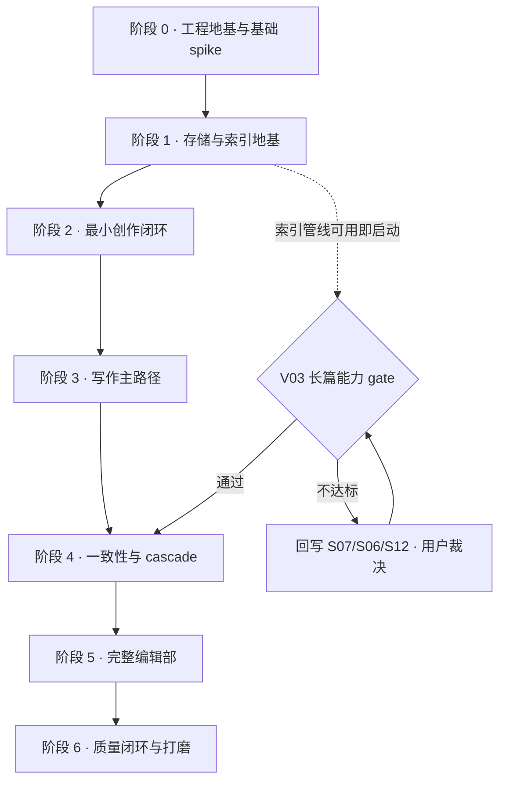

# P010 — 实施计划:从纯文档到可运行应用(2026-06-13)

> **For agentic workers:** REQUIRED SUB-SKILL: Use superpowers:executing-plans (or superpowers:subagent-driven-development) to implement this plan stage-by-stage. Stage tasks use checkbox (`- [ ]`) syntax for tracking.

- **Owner**: jinhuang712
- **日期**: 2026-06-13
- **状态**: 第一版,随实现进度在本文件勾选并记入 [CHANGELOG](../CHANGELOG.md)

---

## 1 · 定位与读法

本文是**实现路径文档**,不是 spec。它不新增、不修改、不解释任何契约;全部行为语义以根层 `spec/Sxx` / `spec/Mxx`、`spec/platform/Ixx|Rxx` 与 appendix `Axx/Vxx` 为唯一主权来源。本文只回答三个问题:**先做什么、做到什么程度算过、卡住了去哪回写**。

读法约定:

- 实现中发现某条契约不成立(接口跑不通、性能不达标、失败语义无法落地),**不在代码里绕过**:先回写对应 spec(必要时经用户裁决),记入 `CHANGELOG.md`,再继续实现。
- 本文允许阶段词(它是 progress 档案,不是 plan)。
- 每个阶段开工前,按 [appendix README「最小接口先行」](../spec/appendix/README.md) 把该阶段涉及的 slice 最小接口补进对应 `A01-A05 / V01-V03`;没有被实现触发的明细不预补。
- docs-before-code 仍然有效:阶段内出现 spec 未覆盖的新行为,先补文档再写代码。

## 2 · 门禁优先原则

[V03](../spec/appendix/V03-external-spikes.md) 明确:**能力成立性 gate 优先于基础设施 spike,更优先于功能开发**。三项 gate 对应 [TODO-P1-43](../TODO.md):

1. **long-form impact recall / precision** — 50-100 万字语料(或等价 fixture)上影响分析链的召回率/精确率;
2. **segmented delta stability** — 分段 delta 抽取的重复运行稳定性;
3. **cascade cost / latency at book scale** — 全书级 cascade 的 context 装配、token 用量与总耗时。

任何一项不达标,「改完连带改」「百万字一致性」的产品承诺即不成立——此时**停止阶段 4 及之后的功能开发**,先回写 [S07](../spec/S07-context-management.md) / [S06](../spec/S06-knowledge-graph.md) / [S12](../spec/S12-creative-engine.md) / [V02](../spec/appendix/V02-golden-cases.md),在「裁判链重设计 / 承诺收窄 / cascade 分批」中经用户裁决后再继续。

排序考量:这三项 gate 需要真实索引管线与真实语料才能测,因此无法放在阶段 0 完成;阶段 0-3 选择的都是即使 gate 失败也不会报废的能力(存储、索引地基、单章创作闭环本身不依赖全书 cascade 成立)。gate 在阶段 1 索引管线可用后即应尽早启动,**最迟在阶段 4 开工前出结果**。

同理,[TODO-P1-22](../TODO.md)(sidecar 内重 reindex 是否冻结 stream 事件投递)在阶段 0 的 `stream during heavy SQLite/reindex` spike 中关闭;超阈值则回写 S06/S05 的隔离约束(worker thread / 独立进程 / 分片让步)后再进阶段 1。

## 3 · 阶段总览与依赖

既定事实基线(已裁决,不在本文重议):桌面壳 = Tauri 多端、应用单实例;执行宿主 = Tauri 管理的 Node sidecar(进程形态待 V03 实查落定);每项目库 = `project.db`(真源)+ `index.db`(派生),该拆分正由并行工作落地到 S01/A01;无导入导出/备份功能;无预算控制(只有用量技术指标);LLM = DeepSeek V4 Pro/Flash 直连;栈 = Next.js 15 + AI SDK 6 + better-sqlite3 + sqlite-vec + TipTap + XState。

---

## 4 · 阶段 0 · 工程地基与 spike

**目标**:把全部「文档说能行但没人跑过」的外部事实变成 V03 证据;搭出最小工程骨架。**对应 V03 全部基础 spike。**

依赖 spec:[S00](../spec/S00-system-contract.md) 审计闸门 · [I01](../spec/platform/I01-llm-provider-contract.md) · [I03](../spec/platform/I03-filesystem-and-watcher.md) · [I05](../spec/platform/I05-desktop-shell-contract.md) · [S03](../spec/S03-agent-runner.md)。必补 appendix:`V03`(每项 spike 的命令/版本/证据)、`A06`(版本能力摘要)。

- [ ] pnpm workspace 骨架:`app/`(Next.js 15 应用)+ `spikes/`(一次性实查代码,不进产品依赖图)落仓
- [ ] Tauri 壳骨架:单实例 lock 与二次启动聚焦、窗口创建/恢复、Node sidecar 进程拉起与生命周期绑定(I05)
- [ ] `better-sqlite3` + `sqlite-vec` + Drizzle 在 sidecar 内实查:native binding(macOS arm64 / Linux x64)、`vec0` CRUD 与普通表 JOIN、WAL 并发写、renderer 热更新期间连接稳定性
- [ ] `stream during heavy SQLite/reindex` spike:重 reindex/批量向量写期间的 stream 心跳延迟与事件投递 → 关闭 **TODO-P1-22**(超阈值先回写 S06/S05)
- [ ] DeepSeek 直连实查:JSON mode、`cache_control` 识别与降级、典型 context package 的 1M ctx token 用量(I01/S08/S07)
- [ ] AI SDK 6 loop spike:`stopWhen` / tool marker / `onStepFinish` / 取消 / 流式事件端到端(S03/S10)
- [ ] embedding provider 实查:模型、维度、批量上限、failure 行为(I01/S06/A01)
- [ ] file watcher 实查:cursor、漏事件、休眠恢复、reconcile scan(I03/R04)
- [ ] desktop host interruption/recovery spike:host crash/restart、in-flight call、apply journal 接管(S03/S05/S01)
- [ ] Tailwind v4 / shadcn token 映射实查(design/00)

**验收口径**:V03 每条 spike 都有「命令 + 版本 + 通过/失败证据 + 路线影响」回写;sidecar 进程形态在 I05/README 落定;无遗留 `needs data` 的阶段 0 范围 spike。

## 5 · 阶段 1 · 存储与索引地基

**目标**:作品事实有可信收场——落盘、崩溃恢复、外部编辑冲突、派生索引全链路可跑。

依赖 spec:[S01](../spec/S01-project-storage.md)(apply journal / light apply / 指纹 / `project.db` + `index.db` 拆分)· [S06](../spec/S06-knowledge-graph.md)(索引管线 / 锚点 / 差量 reindex / Aho-Corasick 词典)· [R04](../spec/platform/R04-index-health-and-repair.md)(健康度与重建)· [I03](../spec/platform/I03-filesystem-and-watcher.md)。必补 appendix:`A01`(表结构/journal 字段/lease)、`A03`(repair/storage 事件)、`V01`。

- [ ] 项目目录与双库初始化:Markdown 产物 + `project.db`(真源)+ `index.db`(派生,可整库重建)
- [ ] apply journal 协议:prepared → file-applied → committed,临时文件 + rename 原子替换,事实记录与 journal 完成标记同事务提交
- [ ] 启动扫描:未完成 journal 按指纹前滚/放弃/人工恢复,不误判为外部编辑
- [ ] light apply 路径:直接编辑落盘、inline accept、committed 后 undo 生成反向 light apply
- [ ] watcher + 外部编辑冲突:作者文件优先,账本标记 lost/invalidated
- [ ] S06 索引管线:实体/锚点抽取、差量 reindex、AC 词典构建、embedding 写入
- [ ] R04 健康度:索引健康指标、降级查询、整库重建入口
- [ ] 长篇 fixture 构建(50-100 万字或等价),供 gate spike 使用

**验收口径**:[V01「Storage / Platform 可靠性验证项」](../spec/appendix/V01-test-matrix.md)全表可跑通过(crash recovery、direct edit light apply、真源损坏 facts-degraded、文件账本冲突等);`index.db` 删除后可全量重建且结果一致。

## 6 · 阶段 2 · 最小创作闭环

**目标**:能开项目、能聊、能查、直接编辑能落盘——第一个用户可感知的端到端环。

依赖 spec:[S03](../spec/S03-agent-runner.md) · [S04](../spec/S04-turn-orchestration.md)(turn 最小态机)· [S05](../spec/S05-streaming-ui-protocol.md) · [S14](../spec/S14-editor-and-interaction.md) · [I02](../spec/platform/I02-editor-adapter-contract.md) · [M04](../spec/M04-discuss-mode.md) · [M03](../spec/M03-fact-query.md) · [M16](../spec/M16-project-library-and-navigation.md) · [R01](../spec/platform/R01-project-lifecycle.md)。必补 appendix:`A02`(结构化输出/query result)、`A03`(turn/stream 事件)、`A04`(只读工具)、`A05`(Discuss prompt)、`V01`。

- [ ] S03 受控 runner:结构化输出、JSON retry、tool loop、doom-loop 防护、取消
- [ ] S04 turn 最小态机(XState):user turn 信封、cancel plan、stopped 收场;暂不含 cascade/审批
- [ ] S05 流式协议:状态点、事件分层、断线恢复最小集
- [ ] 项目库与导航(M16/R01 最小):创建/打开/切换项目,跨项目隔离
- [ ] TipTap 纸面编辑器(S14/I02 最小):章节读写、直接编辑走阶段 1 light apply 落盘
- [ ] Discuss Mode(M04):只聊不写、只读上下文
- [ ] Fact Query(M03):事实查询浮层、来源跳转

**验收口径**:新建项目 → 打开章节直接编辑保存(journal/activity/reindex 可查证)→ Discuss 聊天流式可见可取消 → Fact Query 命中并跳转来源,全程无静默写入。

## 7 · 阶段 3 · 写作主路径

**目标**:写一章端到端——M06 全旅程从备料到落盘。

依赖 spec:[M06](../spec/M06-writing-mode.md) · [S07](../spec/S07-context-management.md)(证据包/备料)· [S08](../spec/S08-prompt-system.md) · [S09](../spec/S09-agent-tooling-boundary.md) · [S12](../spec/S12-creative-engine.md)(三路审查)· [M08](../spec/M08-approval-cascade.md)(单卡审批)· [M17](../spec/M17-turn-recap-and-continuation.md)。必补 appendix:`A02`(ChangeSet/recap/context package)、`A03`(approval/recap 事件)、`A05`(Writer/Validator prompt)、`V01`、`V02`(首批 golden cases)。

- [ ] S07 备料:Agent 证据包装配、overflow 决策、as-of chapter
- [ ] 章节概要生成 → 草稿生成(M06 旅程,DeepSeek Pro/Flash 分档)
- [ ] S12 三路审查:守则/叙事/一致性最小风险信号进入审批解释
- [ ] M08 单卡审批:ChangeSet 单卡接受/修改后接受/拒绝 → 阶段 1 apply 协议落盘 → reindex
- [ ] M17 recap:turn 结束 recap、项目活动时间线 append-only、停止回执
- [ ] S08 prompt 分层与不可信内容围栏接入 runner

**验收口径**:从「写第 N 章」一句话出发,系统产出概要 → 草稿 → 审查风险 → 审批卡;作者审定后正文落盘、索引更新、recap 可读;拒绝/取消/中途崩溃各有 V01 定义的收场。

## 8 · 阶段 4 · 一致性与 cascade

**前置门禁**:V03 三项长篇能力 gate 全部出结果且通过(或回写裁决完成)。**关闭 TODO-P1-43。**

依赖 spec:[S07](../spec/S07-context-management.md)(影响分析裁判链)· [S06](../spec/S06-knowledge-graph.md) · [M08](../spec/M08-approval-cascade.md)(完整 dependency group / residual obligation)· [M05](../spec/M05-planning-mode.md) · [M10](../spec/M10-knowledge-surface.md)(实体治理)· [S04](../spec/S04-turn-orchestration.md)(cascade 泳道)。必补 appendix:`A02`(dependency group/obligation/decision payload)、`V02`(impact/cascade golden)。

- [ ] 执行并回写三项 gate spike(若阶段 1 后已并行启动,此处收口)
- [ ] 影响分析裁判链:规则预筛 → 索引候选 → 锚点/依赖 → LLM 复核,低置信候选可解释
- [ ] M08 完整形态:dependency group、批量审批、部分接受、residual obligation 全局清单
- [ ] M05 规划模式:只动设定/大纲/结构,不碰正文
- [ ] 实体治理(M10/S06):同名歧义、别名确认、合并/拆分
- [ ] cascade 体量控制:preflight 估算、分批与 checkpoint(按 gate 结果落定形态)

**验收口径**:在长篇 fixture 上完成一次「改角色设定 → 全书连带改」:影响范围可解释、一次看全、整批审定、落盘一致;召回/精确指标达到 gate 回写后的承诺口径;V02 对应 golden cases 通过。

## 9 · 阶段 5 · 完整编辑部

**目标**:补齐全部用户可感知能力面。

依赖 spec 与映射:[M11](../spec/M11-reader-panel.md) ReaderPanel · [M07](../spec/M07-inline-rewrite-and-humanizer.md)/[S13](../spec/S13-style-and-humanizer.md) Humanizer · [M12](../spec/M12-memory-learning-management.md)/[S02](../spec/S02-runtime-state.md) Reflector 与经验管理 · [S12](../spec/S12-creative-engine.md) 守则全量 · [M01](../spec/M01-universal-search.md) Universal Search · [M02](../spec/M02-command-palette-and-quick-open.md) 命令面板 · [M13](../spec/M13-agent-team-controls.md) 角色开关 · [M14](../spec/M14-settings.md)/[M18](../spec/M18-developer-mode.md) Settings 与 Developer Mode · [M15](../spec/M15-onboarding-and-new-book.md) Onboarding · [M09](../spec/M09-trace-observability.md) Trace。必补 appendix:`A04`(命令/快捷键全量)、`A05`(persona/Humanizer prompt)、`V01`/`V02`。

- [ ] ReaderPanel(M11):多 persona 并行、inconclusive、报告进入审批解释
- [ ] Humanizer(M07/S13):选区改写、表达层越权判定与升级
- [ ] Reflector 与记忆管理(S02/M12):经验可见、可调、可删
- [ ] 五大守则全量(S12):风险分级、阻断级须作者确认
- [ ] Universal Search(M01)+ 命令面板(M02)+ Trace(M09)
- [ ] 角色开关与档位(M13)、Settings/凭据/危险操作(M14)、Developer Mode(M18)
- [ ] Onboarding 与开书向导(M15)、知识面板补全(M10)

**验收口径**:每个 M 能力按各自 spec 的「用户看见什么结果」逐条验收;V01 对应行覆盖;design/ 对应交互文档的关键路径在真实应用中可走通。

## 10 · 阶段 6 · 质量闭环与打磨

依赖 spec:[S10](../spec/S10-llm-quality-harness.md) · [S11](../spec/S11-evaluation-and-golden-regression.md) · [R03](../spec/platform/R03-migration-and-upgrade.md) · [R05](../spec/platform/R05-diagnostics-and-debug-mode.md) · [I05](../spec/platform/I05-desktop-shell-contract.md) · design 全量。必补 appendix:`V02` 全量 golden、`A06`(打包/迁移说明)。

- [ ] S10 harness:run evidence、failure replay 可用作日常调试
- [ ] S11 golden regression 门禁命令:prompt/context/tool 改动必须过门禁
- [ ] R05 诊断包与 redaction、R03 迁移升级路径
- [ ] design 全量验收:双主题、design tokens、各原型对照走查
- [ ] Tauri 多端打包(macOS / Windows / Linux)、签名、更新失败行为(I05 spike 收口)

**验收口径**:`pnpm test` + golden 门禁命令一键可跑且全绿;三平台安装包可启动并完成 onboarding → 写一章全旅程。

---

## 11 · 风险与未知

| 风险 | 指向 | 影响 |
|---|---|---|
| sidecar 内重 reindex 冻结 stream 投递 | [TODO-P1-22](../TODO.md) · 阶段 0 spike | 超阈值需回写 S06/S05 隔离约束,可能引入 worker thread/独立进程,影响阶段 1 架构 |
| 长篇影响分析召回/精确、delta 稳定性、cascade 成本不达标 | [TODO-P1-43](../TODO.md) · 阶段 4 门禁 | 「改完连带改」承诺收窄或裁判链重设计,阶段 4 范围与排期重排 |
| sidecar 进程形态未落定 | V03 `better-sqlite3 in desktop host` | 阶段 0 出结果前,阶段 1+ 的进程边界代码不定稿 |
| DeepSeek cache/JSON mode 行为与文档假设不符 | V03 · I01 | S08 prompt 分层与成本口径需回写 |
| `project.db` + `index.db` 拆分正由并行工作落地 | S01/A01 | 阶段 1 开工前以落地后的 S01/A01 为准,本文不复述字段 |

## 12 · 工程约定

- 代码落本仓库:产品代码进 `app/` 等目标结构,一次性实查代码进 `spikes/`;spike 结论回写 V03 后 spike 代码可废弃。
- docs-before-code 仍然有效:每阶段开工前按「最小接口先行」补齐 appendix;实现中发现契约缺口先回写 spec/CHANGELOG。
- 每阶段收尾:在本文勾选对应 checkbox、记一条 CHANGELOG、用原生 `git` 提交;阶段验收证据(spike 结果、测试输出)归口 V01/V03,不散落在 progress。
- 本文的阶段划分变化(增删/重排/门禁结果导致的范围调整)以追加小节方式记录,不改写历史判断。
