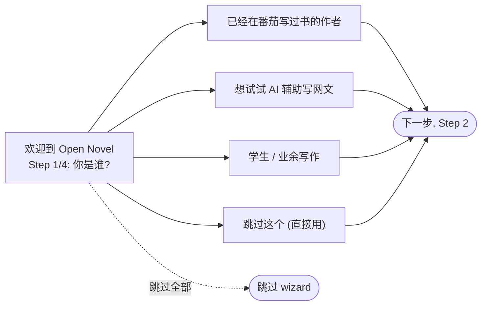
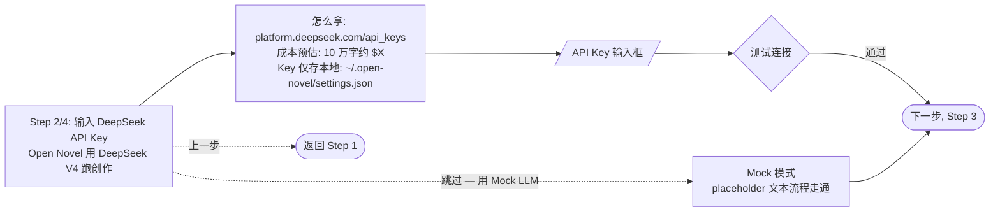
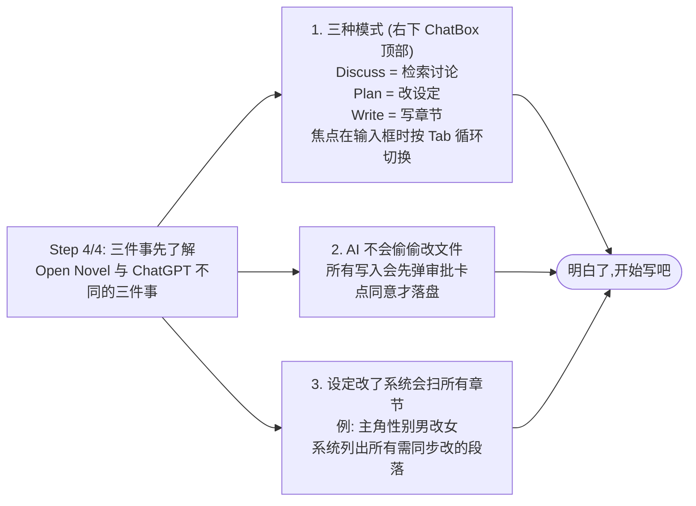
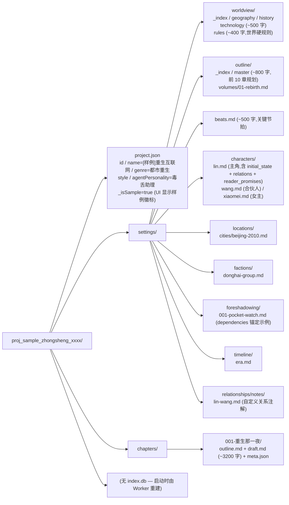
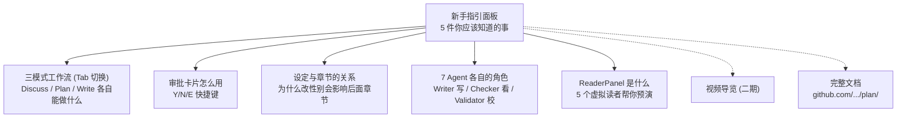

# Spec 15 — 首启引导 (Onboarding)

> **[info]** 文档 audit 发现:README §快速启动只 3 步、旧 UI 布局文档 §初次启动 4 步,**没有真正的 wizard / 样例项目 / 7 Agent + 三模式 + 审批流的图文教程**。新作者用了 30 秒不知道点啥就走了。本文档补齐。

## 设计目标

- **3 分钟内首次产出**: 从启动到看到 AI 生成的第一段世界观,不超过 3 分钟
- **不强迫教程**: 老用户能 skip 全部 onboarding,直奔创建项目
- **概念渐进**: 7 Agent / 三模式 / 审批流 — 这些一上来就抛会吓跑作者。**用到时才解释,不一次性灌**
- **样例项目可一键加载**: 有现成的"重生互联网"样例,跑一遍能看完整产品形态

## 首启流程 (FirstRunFlow)

**Settings 配置图**

```mermaid
flowchart TD
  START([应用启动]) --> CHECK["检测 ~/.open-novel/settings.json"]
  CHECK --> DEC{是否存在?}
  DEC -->|不存在 (首启)| WIZ[进入 OnboardingWizard]
  DEC -->|存在| MAIN[跳过 wizard<br/>直接进主界面]
```

### OnboardingWizard 4 步

**流程图 · 欢迎到 Open Novel / Step 1/4: 你**



(用户身份不影响功能,但用于 telemetry / 后续推荐节奏 — 仅记录。)

**Settings 配置图**



"跳过 — 用 Mock LLM": 进入 Mock 模式 (二期实现),让用户先看 UI 再决定是否买 key。当前 Mock 模式仅返回 placeholder 文本,但流程走通。

**流程图 · 填写表单: / 项目名 / 流派 (下拉: 都市重生 等**

```mermaid
flowchart LR
  S3["Step 3/4: 创建你的第一个项目"]
  S3 --> CHOICE{选项}
  CHOICE -->|"推荐 (5 分钟看完整流程)"| SAMPLE[加载样例项目<br/>"重生互联网"]
  CHOICE --> BLANK[创建空白项目]
  BLANK --> FILL[/"填写表单:<br/>项目名<br/>流派 (下拉: 都市重生 等)<br/>风格描述<br/>故事种子"/]
  FILL --> CREATE([创建并进入])
  SAMPLE --> CREATE
  S3 -. "上一步" .-> PREV([返回 Step 2])
```

加载样例: 把 `lib/onboarding/sample-project.zip` 解压到 `~/.open-novel/workspaces/proj_sample_zhongsheng_xxxx/`,自动选中。样例含:

- 已生成的 worldview.md / outline.md / 3 个 character.md
- 第 1 章已写完 outline + draft (3000 字)
- 历史: 5 条审批记录 + 3 条 learnings (展示反馈学习)

**流程图 · Step 4/4: 三件事先了解 / Open Nove**



## 主界面渐进式 Tooltip

进主界面后,**第一次出现某种状态时**弹一次性 tooltip (用 react-joyride 或自写):

| 触发 | tooltip |
|---|---|
| 首次焦点 ChatBox | "试试按 Tab 切换 plan/write/discuss 模式" |
| 首次出现 ApprovalCard | "AI 想改文件,先看 diff 再决定" |
| 首次出现 cascade 警告 | "Validator 帮你扫了相关章节,看看哪些段需要一起改" |
| 首次切到 plan 模式 | "现在 AI 只会改 settings/,不会动 chapters/" |
| 首次出现 ReaderPanel 报告 | "这是 5 个虚拟读者的反应,可参考可忽略" |

每条 tooltip 持久化到 `~/.open-novel/settings.json` 的 `seenTips: ['firstChatboxFocus', ...]`,不重复弹。

`重置首启提示` 按钮在 SettingsDialog → 数据管理 §危险区域。

## 样例项目 (sample-project.zip)

`lib/onboarding/sample-project.zip` 内容:

**数据结构图**



**审批历史 / learnings 也预填** (重建 sql 时一并 seed):

- 5 条已审批 history (能看 diff)
- 3 条 learnings (能看反馈学习是怎么用的)

## "新手指引"面板 (持续可访问)

ActivityBar 加一个 [📚] 图标 → 打开 GuidancePanel:

**流程图 · 新手指引面板 / 5 件你应该知道的事**



每条展开是一段 markdown,内嵌可执行 demo (e.g. "试试现在按 Tab 切到 plan 模式" 后能高亮 ChatBox)。

## 错误时的 Onboarding 兜底

| 错误 | 友好提示 + 跳到 Onboarding 入口 |
|---|---|
| API key 无效 | "DeepSeek key 似乎有问题,要不要看下怎么拿 key?" → Step 2 |
| 没创建过项目就按 Tab | "ChatBox 在三个模式间切。但你还没有项目,先创建一个?" → Step 3 |
| ChatBox 空发送 | "试试输入 '帮我生成主角设定'" |

## 不做什么

- **不做强制教程视频**: 文字 + 渐进 tooltip 已够;视频留 v1+
- **不做游戏化进度条** ("解锁高级模式" 等): 不是消费产品,作者反感这种
- **不做 onboarding 收集详细问卷**: 单设备 localhost,不收集数据
- **不做"AI 引导对话"** (e.g. Claude Projects 的 "我帮你设置一下"): 那需要更成熟的对话模型,W12+ 再考虑

## 落地里程碑

| 周 | 动作 |
|---|---|
| W3 | OnboardingWizard 骨架 + Step 1-3 |
| W4 | Step 4 + 主界面渐进 tooltip 框架 |
| W5 | Sample project zip + auto-seed (审批 + learnings) |
| W7 | GuidancePanel + 错误兜底跳转 |
| W11 | 整体重审 + 文案打磨 |

## 持久化字段 (写入 ~/.open-novel/settings.json)

```yaml
onboarding:
  completed: true                       # 跑完 wizard
  identity: "tomato-author"              # Step 1 选项
  seenTips: ["firstChatboxFocus", ...]   # 看过的渐进 tooltip
  sampleLoaded: false                    # 是否加载过样例项目
```
