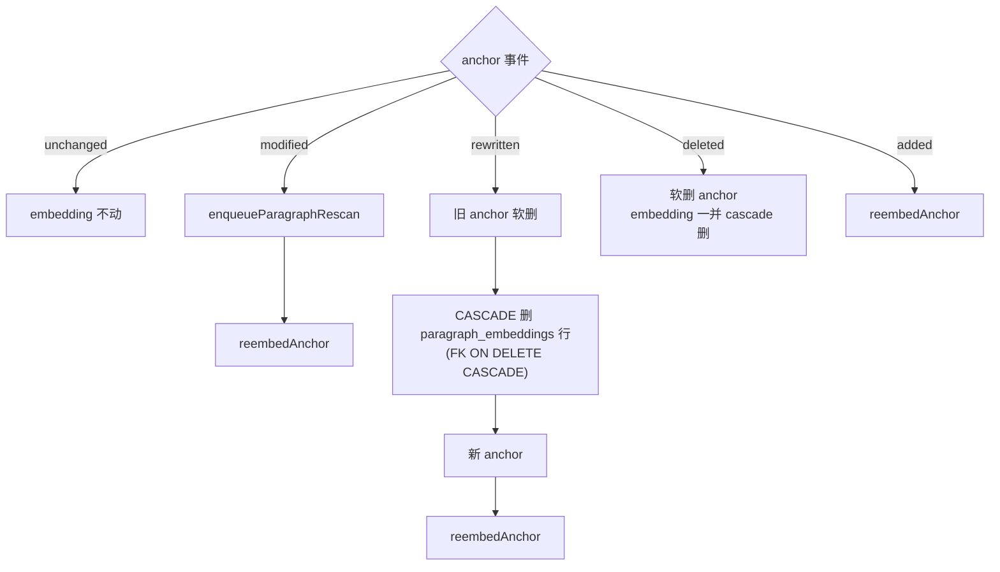

# Spec 18 — 段级 Embedding 与语义检索

> **[info]** 实现知识图谱 L2 算法层第二项(产品面见 [plan/05 — 故事世界与一致性](../../../plan/05-story-world.md))。本文档定义段级向量索引、增量计算、检索 API、模型选型对比。

## 用途

段级 embedding 服务三个核心场景:

1. **`assembleContext` 工具 (spec/20)**:Writer 写章节前,把章节 outline 做 query,从已写章节里 topK 检索"语义相关段",注入 prompt
2. **`queryFacts` 工具 (spec/21) §semantic-search 模式**:作者主动查"林川以前对女上司说过什么类似台词"
3. **`analyzeImpact` 工具 (spec/19) §rewriting candidates**:Validator 拿 setting 改动后,可附带"语义最相关的 N 段"作为补充候选

## paragraph_embeddings 表 (Wave 4 schema 指针)

> **[info]** **Schema 主权 (Wave 4)**: 完整 `CREATE TABLE paragraph_embeddings` (含本 spec 确认的 `norm REAL` 字段 + INDEX) 见 [spec/01 §paragraph_embeddings](./01-storage-schema.md#paragraph-embeddings)。本节确认 schema 的版本已成为 spec/01 主权版。

**字段摘要**: `anchor_id` (PK + FK paragraph_anchors) · `embedding` (BLOB, F32 little-endian, 直接 buffer dump; 读时 `new Float32Array(buffer)` 还原) · `model_name` (bge-m3 / deepseek-v1 / text-embedding-3-small) · `model_dim` (1024 / 1536 / 3072) · `content_hash` (增量更新) · `norm` (预计算 L2 norm, cosine 加速)。

## 选型对比 (锁 BGE-M3 本地)

> **[info]** **决议**: 锁 **BGE-M3 本地**。理由 = 0 边际成本 (重算自由) + 隐私 (创作隐私是网文作者强诉求) + 中文质量第一 (BAAI 出品)。代价: 启动需 Ollama (~600MB 二进制依赖)。Fallback 顺序: DeepSeek embedding (复用 API key) → OpenAI text-embedding-3-small。

| 维度 | BGE-M3 (本地) **← 选定** | DeepSeek Embedding (fallback 1) | OpenAI text-embedding-3-small (fallback 2) |
|---|---|---|---|
| **托管方式** | 本地 (Ollama/llama.cpp/transformers.js) | 云 API | 云 API |
| **维度** | 1024 | 1536 | 1536 (可 reduce) |
| **中文质量** | ⭐⭐⭐⭐⭐ (北京智源 BAAI 出品,中英多语并优) | ⭐⭐⭐⭐ (DeepSeek 自家中文训练数据) | ⭐⭐⭐ (英文导向) |
| **首字 token 时延** | < 100ms (本地 GPU) / ~500ms (CPU M1) | ~200ms (云) | ~150ms (云) |
| **批量速度 (100 段)** | ~3s (M1 CPU) / 0.5s (GPU) | ~2s (依赖网) | ~1.5s |
| **离线可用** | ✅ | ❌ 须连云 | ❌ |
| **成本 (1000 章 × 平均 200 段)** | $0 (一次性下载 ~600MB 模型) | ~$0.5 (按 DeepSeek $0.0002 / 1K tokens) | ~$1 (OpenAI $0.02 / 1M tokens) |
| **集成复杂度** | 中 (需 Ollama / Web 端 ONNX) | 低 (HTTP) | 低 (HTTP) |
| **隐私** | ✅ 本地 | 中 (DeepSeek 服务器) | 中 (OpenAI 服务器) |
| **跨模型一致性** | 自家维护,版本可锁 | DeepSeek 升级版本可能不兼容 (已规划 v4 model 闸门) | OpenAI 历史不兼容 (text-embedding-ada → 3 已断 case) |

### 决议依据

锁 **BGE-M3 本地**, 理由:

1. 0 边际成本 (一次性下载) — 用户"不担心 token"对生成模型有效, 但 embedding 量级高得多 (5 万段 × 200 字 = 1000 万 tokens, 跑一次), 重算自由的价值远大于一次性 ~600MB 安装
2. 隐私 + 离线 — 创作隐私是网文作者强诉求
3. 中文质量第一 (BAAI 出品)

启动 / 装机指引 (W8 实施):

- macOS: `brew install ollama && ollama pull bge-m3`
- Web 端 fallback: transformers.js + ONNX 自动加载 (用户首次启动 ~5min 下载, 后续走浏览器缓存)

W8 spec/00 §J 实查 Ollama 稳定性, 如失败按 §选型对比 fallback 顺序自动降级。

### model 切换迁移

如果中途换 model (e.g. BGE-M3 → 二期换 OpenAI v4):

- `paragraph_embeddings.model_name` 字段使新旧并存可查询
- 切换后入队全量 reindex,逐段重算,旧 model_name 行批量删除
- UI 显示"重建索引中... 67/120 章"

## 接入抽象层

```ts
// lib/embeddings/index.ts
export interface EmbeddingProvider {
  name: string
  dim: number
  embed(texts: string[]): Promise<Float32Array[]>     // 批量,顺序对应
  isAvailable(): Promise<boolean>
}

// 具体实现
export class BgeM3Provider implements EmbeddingProvider { /* Ollama HTTP */ }
export class DeepSeekProvider implements EmbeddingProvider { /* DeepSeek API */ }
export class OpenAIProvider implements EmbeddingProvider { /* OpenAI API */ }

// 选择器
export function getEmbeddingProvider(): EmbeddingProvider {
  const choice = process.env.EMBEDDING_PROVIDER ?? 'bge-m3'
  switch (choice) {
    case 'bge-m3': return new BgeM3Provider()
    case 'deepseek': return new DeepSeekProvider()
    case 'openai': return new OpenAIProvider()
    default: throw new Error(`Unknown provider: ${choice}`)
  }
}
```

具体实现 (Ollama 本地端) 示例:

```ts
// lib/embeddings/bge-m3.ts
export class BgeM3Provider implements EmbeddingProvider {
  name = 'bge-m3'
  dim = 1024
  private url = process.env.OLLAMA_URL ?? 'http://localhost:11434'

  async embed(texts: string[]): Promise<Float32Array[]> {
    const results: Float32Array[] = []
    // Ollama 不原生支持批量,串行调用
    for (const text of texts) {
      const r = await fetch(`${this.url}/api/embeddings`, {
        method: 'POST',
        body: JSON.stringify({ model: 'bge-m3', prompt: text }),
      })
      const data = await r.json() as { embedding: number[] }
      results.push(new Float32Array(data.embedding))
    }
    return results
  }

  async isAvailable() {
    try {
      const r = await fetch(`${this.url}/api/tags`)
      const data = await r.json() as { models: { name: string }[] }
      return data.models.some(m => m.name.includes('bge-m3'))
    } catch { return false }
  }
}
```

启动时检查 `isAvailable()`;不可用时降级到 DeepSeek,再不可用降级到 "embeddings 不工作,语义检索功能 disabled,但其他功能照常"。

## 增量计算

```ts
// lib/embeddings/incremental.ts
export async function reembedAnchor(projectId: string, anchorId: string, text: string) {
  const provider = getEmbeddingProvider()
  if (!await provider.isAvailable()) return  // 降级 silent
  const [embedding] = await provider.embed([text])
  const norm = Math.sqrt(embedding.reduce((s, v) => s + v * v, 0))
  const buf = Buffer.from(embedding.buffer)
  const contentHash = sha256(text)
  await db.execute(`
    INSERT INTO paragraph_embeddings (anchor_id, embedding, model_name, model_dim, content_hash, norm, created_at)
    VALUES (?, ?, ?, ?, ?, ?, ?)
    ON CONFLICT(anchor_id) DO UPDATE SET
      embedding = excluded.embedding,
      model_name = excluded.model_name,
      content_hash = excluded.content_hash,
      norm = excluded.norm,
      created_at = excluded.created_at
  `, anchorId, buf, provider.name, provider.dim, contentHash, norm, now())
}
```

调用入口在 spec/17 §reindex Worker 升级 §applyAnchorDiff 的 `enqueueParagraphRescan` 内。

### 批量优化

reindex 时若有 ≥ 5 段需要重算,合并一次 batch:

```ts
async function reembedBatch(projectId: string, items: { anchorId: string; text: string }[]) {
  const provider = getEmbeddingProvider()
  const embs = await provider.embed(items.map(i => i.text))
  const tx = await db.beginTransaction()
  try {
    for (let i = 0; i < items.length; i++) {
      // 同上 INSERT/UPSERT
    }
    await tx.commit()
  } catch (e) { await tx.rollback(); throw e }
}
```

## 检索 API

### 1. 朴素 SQL (起步)

未上 sqlite-vss / LibSQL vector 时,直接读全部 embeddings 在 JS 层计算 cosine:

```ts
// lib/embeddings/search.ts
export async function semanticSearch(
  projectId: string,
  query: string,
  options: {
    topK?: number
    filterFile?: string                    // glob: 'chapters/0*'
    excludeAnchors?: string[]
  } = {},
): Promise<{ anchorId: string; similarity: number; snippet: string }[]> {
  const { topK = 10, filterFile, excludeAnchors = [] } = options
  const provider = getEmbeddingProvider()
  const [queryEmb] = await provider.embed([query])
  const queryNorm = Math.sqrt(queryEmb.reduce((s, v) => s + v * v, 0))

  // SQL 取所有 embedding (起步阶段简单)
  const rows = await db.execute(`
    SELECT pe.anchor_id, pe.embedding, pe.norm, pa.heading_path, pa.start_offset, pa.end_offset, pa.file_path
    FROM paragraph_embeddings pe
    JOIN paragraph_anchors pa ON pe.anchor_id = pa.anchor_id
    WHERE pa.deleted_at IS NULL
      ${filterFile ? `AND pa.file_path GLOB ?` : ''}
      ${excludeAnchors.length ? `AND pa.anchor_id NOT IN (${excludeAnchors.map(_ => '?').join(',')})` : ''}
  `, ...(filterFile ? [filterFile] : []), ...excludeAnchors)

  // JS 层 cosine + topK heap
  const heap = new MinHeap<{ anchorId: string; similarity: number }>(topK)
  for (const r of rows) {
    const emb = new Float32Array(r.embedding.buffer)
    const dot = dotProduct(queryEmb, emb)
    const cos = dot / (queryNorm * r.norm)
    heap.push({ anchorId: r.anchor_id, similarity: cos })
  }

  // 取 topK + 拉 snippet
  return Promise.all(heap.toArray().sort((a, b) => b.similarity - a.similarity).map(async h => ({
    anchorId: h.anchorId,
    similarity: h.similarity,
    snippet: await fetchAnchorSnippet(projectId, h.anchorId),
  })))
}
```

### 2. 性能阈值

朴素 SQL + JS cosine 在以下规模可接受:

| 段数 | 朴素扫描耗时 (M1 CPU) | 是否升级 |
|---|---|---|
| < 5,000 | < 50ms | OK |
| 5,000 - 20,000 | 50-200ms | 仍可接受 |
| > 20,000 | > 200ms | 升级到 sqlite-vec extension |

起步用朴素扫描;若 Demo 项目突破 20K 段,**升级路径**:

```sql
-- sqlite-vec extension (db.loadExtension(sqliteVec.getLoadablePath()), 见 spec/28 §Drizzle + better-sqlite3 + sqlite-vec 集成)
CREATE VIRTUAL TABLE paragraph_embeddings_vec USING vec0(
  embedding FLOAT[1024]
);
```

**决议 (P0-1 修正)**: 优先 **sqlite-vec** extension (`better-sqlite3 + db.loadExtension(sqliteVec.getLoadablePath())`), 与 better-sqlite3 native bindings 同 process 加载, 不需要 sidecar。失败时降级到朴素 cosine (5K 段以下能跑)。**W3 启动前必跑 Spike 2** (见 TODO.md §1.4) 验证 macOS arm64 / Linux x64 双平台加载 + `vec0` 虚拟表 CRUD + 与普通表 JOIN。Spike 失败回退到 `hnswlib-node` 独立索引(放弃 JOIN)。

### 3. 检索结果鲁棒性

cosine 相似度在中文 + BGE-M3 上的经验阈值:

- ≥ 0.85 = 强相关
- 0.7 ~ 0.85 = 弱相关
- < 0.7 = 噪声

`semanticSearch` 默认丢弃 < 0.6 结果(可配置)。topK 取的是绝对最高,即使全是 < 0.6,也可能返回(由调用方决定是否使用)。

## 与其他系统对接

### 与 entity_refs / concept_refs 双索引互补

embeddings 解决"语义相关"(同义、近义),entity_refs / concept_refs 解决"显式提及"。assembleContext 工具的 retrieve 链路同时用两类索引,合并去重(详见 spec/20)。

### 与 paragraph_anchors 的 lifecycle 联动

**流程图 · enqueueParagraphRescan**



软删 anchor (deleted_at != NULL) 是否保留 embedding?

- 保留 (deleted_at != NULL 时不参与检索,但供"恢复"路径)
- 30 天硬删 anchor 时一并 CASCADE 删 embedding

## 离线 / 降级行为

| provider 不可用 | 行为 |
|---|---|
| 启动时 (e.g. Ollama 没启动) | 后台尝试,主路径不阻塞;UI 状态栏显示"语义索引离线",`assembleContext` 跳过语义部分,`queryFacts` semantic-search 模式 disabled |
| reindex 中途 | 该段 embedding 跳过,落 reindex_failures 记 reason='embedding-unavailable',Worker 后台 retry |
| 检索时不可用 | 返回空数组,调用方按"未命中"处理,不抛错 |

降级语义:**embedding 是"锦上添花",不应使主流程瘫痪**。具体的 entity_refs / concept_refs / dependencies 不依赖 embedding。

## 测试

| 测试 | 类型 | 覆盖 |
|---|---|---|
| `embedding-providers.test.ts` | 集成 | 三 provider 各自 isAvailable + embed 正确;mock 化 LLM 端 |
| `incremental-reembed.test.ts` | 集成 | anchor diff 后 paragraph_embeddings 增量正确 |
| `semantic-search.test.ts` | 集成 | 给 30 段 fixture,query 命中预期 anchor,topK 准确 |
| `embedding-fallback.test.ts` | 集成 | provider 不可用时所有调用方降级,不抛 |
| `embedding-bench.bench.ts` | bench | 5K / 20K 段规模朴素 cosine 耗时;W8 末填表 |

## 已决策项

✅ **embedding 模型选型**: 锁 **BGE-M3 本地**, fallback 1 = DeepSeek, fallback 2 = OpenAI (见 §选型对比 + §决议依据)
✅ **vector 索引路径**: 优先 **sqlite-vec** extension → 朴素 cosine 回退 (P0-1 修正; W3 Spike 2 验证后定稿; 见 §决议条款 实施顺序)
✅ **embedding model 升级时的全量重算成本上限**: 阈值 **1000 段以上必弹 UI 提示**, 显示 "切换 model 将重算 N 段, 预计 X 分钟, 确认?"; 1000 段以下静默重算
