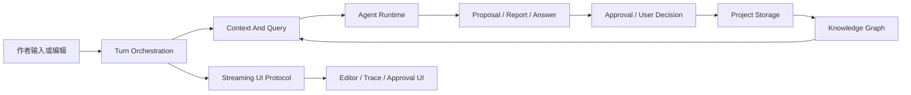

# 00 · System Contract

本文档是 Open Novel 技术体系的入口。读完本篇应能理解系统整体怎么分层、一次创作请求会经过哪些主干能力、哪些事实需要在代码前验证,以及核心 spec 与 appendix 各自承担什么角色。

核心判断:根层 spec 不是目录,也不是规章模板。根层 spec 必须让实现者读完就知道系统如何工作;appendix 只保存不需要主动阅读的机器级明细。

## 系统形态

Open Novel 是本地单机创作工作台。它以一个应用承载前端、后端接口、Agent runner、存储访问、编辑器集成和本地项目管理。系统不把创作流程交给通用 Agent 框架的隐式 memory / workflow,而是用自定义 runner 明确连接模型调用、工具执行、结构化输出、审批挂起、回滚和流式可观测性。

系统的主干链路是:

这条链路有两个不可变约束:

- AI 只产生回答、报告或变更提议;写入作品事实必须经过用户直接编辑或审批路径。
- 一致性所需事实不能被上下文、prompt、事件流或 appendix 隐式裁掉;放不下时显式失败或拆分处理。

## 数据分层

系统数据分为四类,它们不能互相替代:

| 类型 | 作用 | 主权位置 |
|---|---|---|
| 作品事实 | 作者真正拥有的设定、章节、审批后变更 | project storage |
| 派生索引 | 实体、概念、锚点、embedding、反向引用 | knowledge graph |
| 运行时记忆 | thread、message、压缩摘要、经验注入 | runtime state |
| 过程历史 | 模型调用、工具运行、trace、成本、调试事件 | runtime state / streaming |

作品事实永远高于派生索引。派生索引用于查询、上下文装配和 UI 提醒,不能反向覆盖作者文件。过程历史只解释“系统刚刚做过什么”,不能作为项目恢复或作品事实恢复的来源。

## 技术路线

当前实现路线由四个决定组成:

- 单应用本地运行,用户数据在本机 workspace 中管理。
- 模型调用走显式 runner,由系统控制 stop、tool、JSON 校验、retry 和升级失败。
- 作品文件与本地数据库并用:作者可读内容保存在文件系统,高频查询和一致性索引进入本地数据库。
- UI 以写作为主体,Agent 过程通过状态点、Trace、审批卡和查询浮层暴露,不让实现细节占据主界面。

技术路线不是版本锁定表。具体包版本、native binding 组合、构建配置和实查命令属于 appendix 或 TODO;根层只记录它们是否会阻塞主路径。

## 外部事实审计

下列事实会直接影响系统路径,代码前必须实查:

- 模型是否支持所需上下文长度、结构化输出和流式行为。
- runner 所依赖的 stop、tool result、stream callback 是否能端到端工作。
- 本地数据库、向量扩展、native binding 与运行时环境是否兼容。
- 构建工具、server runtime 和本机文件权限是否允许同步写入与本地扩展加载。
- 深浅主题、编辑器、快捷键与本地浏览器行为是否符合 design 契约。

审计失败不能静默改路线。例如结构化输出不可用时,不能把 JSON 契约偷偷降级成自然语言解析;本地扩展不可加载时,不能让知识图谱假装语义检索可用。失败只能进入三类处理:显式阻断、用户确认的降级、或回写 spec/TODO 重新设计。

## Spec 与 Appendix 分工

根层 spec 必须自洽可读。每篇核心 spec 至少说明:

- 解决什么问题。
- 谁拥有主权,谁只是调用者。
- 一次主路径如何流转。
- 哪些对象、状态和失败会影响用户。
- 哪些实现明细后置到 appendix。

appendix 只放读者不需要主动阅读的明细,包括完整表结构、完整 JSON Schema、工具参数全表、prompt 全文、测试矩阵、版本审计和迁移命令。appendix 不能成为旧文档堆场;历史原文归 progress archive。

当一个字段、事件或状态会改变系统行为时,根层 spec 必须点名它的存在。appendix 可以展开字段,但不能独占行为语义。

## 主权地图

| 主权 | 根层文档 | 说明 |
|---|---|---|
| 技术路线与审计闸门 | 本篇 | 不允许未审计事实进入实现主路径 |
| 项目事实与文件落盘 | [01](./01-project-storage.md) | 作者文件、项目事实库、派生索引边界 |
| 会话、经验与过程历史 | [02](./02-runtime-state.md) | runtime.db 与 session_history.db 的职责 |
| 模型调用与工具边界 | [03](./03-agent-runtime.md) | runner、prompt、tool、JSON 输出 |
| turn、cascade、approval、rollback | [04](./04-turn-orchestration.md) | 一次用户输入如何变成可审批结果 |
| 流式事件与 UI 可观测性 | [05](./05-streaming-ui-protocol.md) | 过程如何被前端看见 |
| 知识图谱与派生事实 | [06](./06-knowledge-graph.md) | 实体、概念、锚点、embedding |
| 上下文、影响分析与查询 | [07](./07-context-and-query.md) | Agent 写作和用户查询如何取事实 |
| 创作质量与守则 | [08](./08-creative-engine.md) | 五大守则、叙事诊断、模拟读者 |
| 风格与去 AI 味 | [09](./09-style-and-humanizer.md) | 表达层改写不能越过事实 |
| 编辑器与交互 | [10](./10-editor-and-interaction.md) | 高亮、命令、查询、焦点 |
| 设置与首启 | [11](./11-settings-and-onboarding.md) | 用户可配置和危险操作 |

## 失败语义

系统级失败按来源处理:

- 事实未验证:阻塞实现并写入 TODO 或审计 appendix。
- 能力不满足:回写技术路线,不得让业务层绕行。
- 契约冲突:以主权文档为准,重复定义处改成引用。
- 派生数据失败:作品事实保留,派生能力进入可解释降级。
- 过程事件失败:不把 UI 事件当事实源,从持久 turn 状态恢复。

任何“默认值继续”“忽略失败继续”“用模型猜事实继续”的写法都必须被视为契约冲突,除非根层 spec 明确允许该降级并定义用户可见提示。

## Appendix

- [appendix/README](./appendix/README.md) 定义 active appendix 的范围。
- [appendix/migration-notes](./appendix/migration-notes.md) 记录外部事实审计、版本能力和迁移说明。
- [appendix/testing-matrix](./appendix/testing-matrix.md) 记录实施前验证矩阵。
