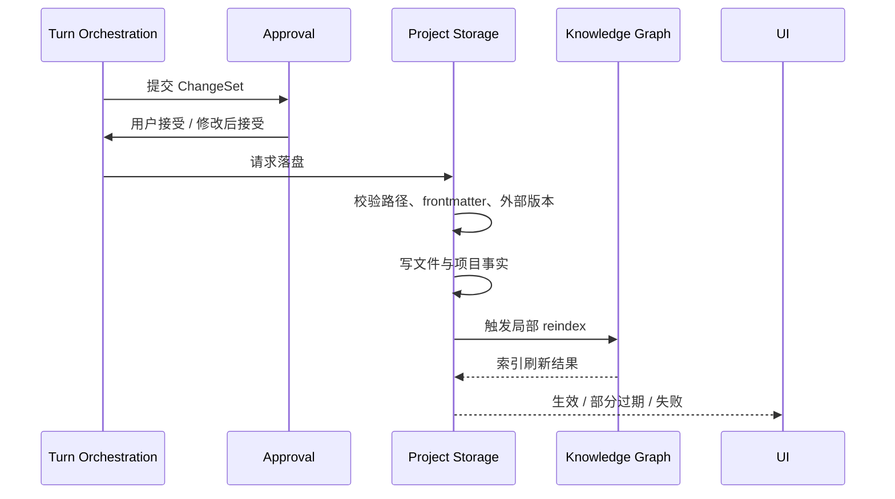

# 01 · Project Storage

本文档定义项目事实如何保存、写入、回滚和重新索引。读完本篇应能理解:哪些内容是作者真正拥有的事实,哪些只是系统派生索引,一次审批通过后如何落盘,外部编辑或索引失败时系统如何保持可解释。

## 要解决的问题

作者写的是长篇小说,项目既要能被人直接带走和审查,又要支持高频一致性查询、连带修改、引用跳转和上下文装配。因此项目存储采用“双层事实”:

- 人类可读文件保存作品事实。
- 本地项目事实库保存可查询索引、审批记录和派生状态。

这不是两套真源。文件和审批后项目事实是主权来源;实体引用、embedding、反向链接和查询缓存只是派生能力。

## 主权对象

Project Storage 拥有:

- workspace 与 project 边界。
- 章节、设定、大纲、角色、世界观等作者文件。
- 文件 frontmatter 的校验与归一化。
- 项目事实库的生命周期。
- 审批落盘记录。
- 派生索引刷新触发点。
- 外部编辑冲突和 rollback 落点。

Project Storage 不拥有 Agent 意图解释,也不决定某个变更是否应该被用户接受。它只在 turn orchestration 已经给出可落盘决定后执行持久化。

## 存储拓扑

一个项目至少包含三类内容:

| 层 | 内容 | 是否真源 |
|---|---|---|
| 项目文件 | 章节正文、设定资料、项目元信息、用户可读产物 | 是 |
| 项目事实库 | 实体、关系、审批、索引状态、派生表 | 部分是,部分派生 |
| 派生缓存 | embedding、反向引用、搜索缓存、临时诊断结果 | 否 |

运行时会话和过程历史不属于项目存储主权。它们分别由 [02](./02-runtime-state.md) 管理,避免一本书的事实和跨项目对话、调试日志混在一起。

## 写入主路径

落盘必须满足三点:

- 路径在项目边界内,不能越权写入 workspace 之外。
- 写入基于审批时看到的前置版本,外部编辑命中时审批失效。
- 文件和数据库状态不能半成功地对用户伪装成已完成。

## 文件与 Frontmatter

作者可读文件是项目可迁移性的基础。文件内容允许被普通编辑器打开;frontmatter 保存系统理解文件所需的最小结构信息,例如身份、类型、派生标记和版本指纹。

frontmatter 校验失败时,系统不能把文件当成可信事实继续生成高风险内容。它可以提示用户修复,也可以把该文件从某些派生能力中临时排除,但必须让用户知道一致性能力不完整。

编码和换行归一化属于存储层责任。归一化不能改变正文语义,也不能在没有审批的情况下改写作品内容。

## 派生索引

派生索引服务四类能力:

- 查询:快速找到实体、概念、段落和引用。
- 上下文:为 Agent 装配写作所需事实。
- 一致性:判断变更影响范围和冲突。
- UI:高亮、旁注、跳转和风险提示。

派生索引由 reindex 维护,不是作者事实。索引过期时,系统应展示“索引过期 / 局部不可用”的状态,而不是让查询或 Agent 继续假装掌握完整事实。

## 外部编辑

用户可以绕过应用直接改项目文件。系统检测到外部变更时:

- 文件事实优先于 pending 审批。
- 命中同一文件或同一锚点范围的审批失效。
- 相关派生索引进入待刷新。
- UI 需要解释哪些待审批内容不再可用。

系统不自动合并外部编辑和 AI 提议,除非用户重新审定。

## 并发与连接

项目存储必须把写入串行化到可解释的顺序。多个 turn、reindex、外部文件 watcher 和设置操作不能同时写出互相覆盖的状态。

数据库连接、WAL、native binding 和热重载连接泄漏属于实施前验证项。根层契约只要求:如果连接或 native binding 异常,写入路径必须阻断,不能落入“文件已改、事实库未改、UI 显示成功”的状态。

## Rollback

rollback 是按已生效变更逆序撤销,不是重新让 Agent 猜一遍。rollback 需要依赖审批前快照、变更摘要和文件版本。如果快照缺失或外部编辑已经改变同一区域,rollback 失败必须显式展示并停止后续动作。

## 失败语义

| 失败 | 系统行为 |
|---|---|
| 文件不可写 | 审批不能标记为已生效 |
| frontmatter 不合法 | 阻断依赖该文件的高风险生成或要求修复 |
| 外部编辑冲突 | 命中审批失效,用户重新审定 |
| 数据库写入失败 | 落盘失败,不得展示成功 |
| reindex 失败 | 作品事实保留,知识图谱标记部分过期 |
| rollback 失败 | 保留错误状态、停止连锁动作、提示人工处理 |

## 用户可见结果

用户看到的是项目文件是否保存、审批是否生效、哪些索引或查询能力暂不可用、哪些待审批内容因外部编辑失效。用户不需要理解表结构,但必须能理解“为什么这次不能继续”。

## Appendix

- [appendix/schema-tables](./appendix/schema-tables.md) 保存文件、frontmatter、项目事实库和迁移字段明细。
- [appendix/migration-notes](./appendix/migration-notes.md) 保存 native binding、连接和迁移审计。
