# Spec 01 — 存储 Schema

## 文件系统约定

> **[info]** **W7 升级**: settings/ 目录大幅拆分,详见 [spec/16 §设定目录契约](./16-knowledge-schema.md#设定目录契约)(产品面见 [plan/05 — 故事世界与一致性](../plan/05-story-world.md))。本节只列顶层结构,详细子目录看 spec/16。

**数据结构图**

```mermaid
flowchart TD
  ROOT(["~/.open-novel/"]) --> RUNTIME["runtime.db<br/>应用层 thread/messages 跨项目会话"]
  ROOT --> GSET["settings.json<br/>全局设置 (API key 等)"]
  ROOT --> SNAP["'.snapshots/{projectId}/{ts}/'<br/>设定快照 (spec/16 §Snapshot)"]
  ROOT --> WS["workspaces/"]
  WS --> PROJ["'{projectId}/'<br/>proj_{slug}_{shortId}"]
  PROJ --> PJSON["project.json"]
  PROJ --> SETTINGS["settings/<br/>详细子目录见 spec/16"]
  PROJ --> CHAPTERS["chapters/"]
  PROJ --> IDB["index.db<br/>SQLite per-project"]
  PROJ --> SHDB["session_history.db<br/>过程日志,见 spec/27"]
  PROJ --> TRACE["trace/<br/>'{YYYY-MM-DD}-{sessionId}.jsonl'"]

  subgraph SET ["settings/ 子目录"]
    direction TB
    S1["worldview/<br/>geography / history / politics / economy<br/>technology / culture / religion / rules"]
    S2["outline/<br/>master + volumes/* + chapter-outlines/_registry"]
    S3["characters/{id}.md"]
    S4["factions/{id}.md"]
    S5["organizations/{id}.md"]
    S6["locations/<br/>regions / cities / buildings / landmarks"]
    S7["items/{id}.md"]
    S8["events/{id}.md"]
    S9["timeline/<br/>era / story-clock / _character-ages.md"]
    S10["relationships/<br/>_matrix.md (派生) + notes/{id}.md"]
    S11["story-lines/<br/>main.md + subplots/{id}.md"]
    S12["foreshadowing/{id}.md"]
    S13["chapter-arcs/{id}.md"]
    S14["power-system/<br/>overview / tiers / techniques / artifacts"]
    S15["glossary/_index.md"]
    S16["beats.md / taboos.md / themes.md<br/>reader-promises.md"]
  end
  SETTINGS -.-> SET

  subgraph CHAP ["chapters/ 子目录"]
    direction TB
    C1["'{NNN-{slug}}/'"]
    C1 --> C2["outline.md"]
    C1 --> C3["draft.md"]
    C1 --> C4["meta.json"]
  end
  CHAPTERS -.-> CHAP
```



文件命名规则:

- `projectId`: 5-32 字符,`/^proj_[a-z0-9-]{1,24}_[a-f0-9]{4}$/`
- 角色 id: `char_{slug}_{shortId}`,e.g. `char_lin_a3f2`
- 地点 id: `place_{slug}_{shortId}`
- 章节目录: `{order:3pad}-{slug}`,e.g. `001-zhongsheng-na-yi-ye`

slug 由 LLM 生成 (不超过 8 个字符的拼音/英文,fallback 到 hash 前 6 位)。

## frontmatter 公共字段

所有 markdown 文件必须有:

```yaml
---
id: <唯一 id>
type: worldview | outline | beats | character | place | chapter
created_at: ISO 8601
updated_at: ISO 8601
source: writer-agent | user-edit | imported
---
```

## 各类型 frontmatter Schema

### project.json (非 markdown,JSON)

```ts
type Project = {
  id: string                          // proj_xxx_yyyy
  name: string                        // 显示名
  slug: string
  genre: string                       // 都市重生 / 末世修仙 / ...
  style: string                       // 自然语言描述,LLM 生成时遵守
  agentPersonality: string            // Agent 性格
  exampleCorpusFiles?: string[]       // 范文路径 (相对于项目根)
  models: {                           // 项目级覆盖, 默认值与分档理由见 spec/13 §模型分配
    router: AgentModelConfig          // 默认 flash + default
    writer: AgentModelConfig          // 默认 pro + max
    checker: AgentModelConfig         // 默认 flash + default
    validator: AgentModelConfig       // 默认 pro + max
    reflector: AgentModelConfig       // 默认 flash + default
    humanizer: AgentModelConfig       // 默认 pro + max
    readerPanel: AgentModelConfig     // 默认 flash + default
  }
  createdAt: string
  updatedAt: string
}

type AgentModelConfig = {
  model: 'flash' | 'pro' | string     // string = 自定义模型 ID (仅 V4 系, 禁 fallback 旧型号, 见 spec/00 §C)
  reasoningEffort?: 'default' | 'max' // 缺省时按分档默认 (Pro=max / Flash=default, 见 spec/13 §模型分配)
}
```

### Character (`settings/characters/{id}.md`)

> **[info]** **W7 升级 (_schemaVersion 1 → 2)**: 加 initial_state / relations / reader_promises / taboos 字段,age 移入 initial_state。完整 zod 见 spec/16 §character.md frontmatter 升级。

```yaml
---
id: char_lin_a3f2
type: character
canonical_name: 林川
aliases: ["川哥", "林总"]
gender: male | female | other | unknown
role: protagonist | support | antagonist | extra
appearance: 短文字描述
personality: 短文字描述
background: 短文字描述
expected_arc: 短文字描述

# === 新增字段 (W7) ===
initial_state:                          # 故事开头的 snapshot,作为 entity_timeline 第一行
  age: 28
  location: place_beijing_2010
  status: alive
  affiliation: org_xxx
  power_level: null
  wealth: middle
  social_rank: commoner
relations:                              # 静态/初始关系,reindex → entity_relations 表 (source='frontmatter')
  - kind: mentor
    target: char_zhang_b1c4
    since: ch_005
    strength: 80
  - kind: enemy
    target: char_wang_c2d3
    strength: 80
reader_promises:                        # 已对读者立的旗 (与 reader-promises.md 双锚)
  - "最终打败王老板"
  - "和林雪有情人终成眷属"
taboos:                                 # 角色级禁区 (Validator lint 用)
  - "绝不主动伤害无辜"
derived: false                          # 派生文件标 true,UI 锁写
_schemaVersion: 2

created_at: 2026-04-29T10:00:00+08:00
updated_at: 2026-04-29T11:30:00+08:00
source: writer-agent
---

# 林川

## 性格
...

## 背景
...
```

### Worldview / Outline / Beats

```yaml
---
id: world_main
type: worldview
title: 2010 年北京互联网圈
created_at: ...
updated_at: ...
source: writer-agent
---

正文...
```

### Chapter Draft (`chapters/{NNN-XX}/draft.md`)

```yaml
---
id: ch_001
type: chapter
order: 1
title: 重生那一夜
word_count: 3247
status: draft | reviewed | published
referenced_entities: ["char_lin_a3f2", "place_beijing_2010"]
created_at: ...
updated_at: ...
source: writer-agent
---

# 第一章 重生那一夜

林川猛地从床上坐起来...
```

## SQLite Schema (`index.db` per-project)

### entities

```sql
CREATE TABLE entities (
  id TEXT PRIMARY KEY,                -- char_lin_a3f2
  canonical_name TEXT NOT NULL,
  aliases TEXT NOT NULL DEFAULT '[]', -- JSON array
  category TEXT NOT NULL,             -- character | place | item | org
  file_path TEXT NOT NULL,            -- relative to project root
  metadata TEXT,                      -- JSON: gender/age/role/...
  created_at TEXT NOT NULL,
  updated_at TEXT NOT NULL
);
CREATE INDEX idx_entities_category ON entities(category);
CREATE INDEX idx_entities_canonical ON entities(canonical_name);
```

### entity_refs (实体在何处被提及)

> **[info]** ⚠ **历史命名修正**: 早期文档草稿里用 `references` — `REFERENCES` 是 SQL 保留字,建表时不加引号会语法错误。统一改为 `entity_refs`。所有 plan/spec 文档中提到此表的位置都已同步。

```sql
CREATE TABLE entity_refs (
  id INTEGER PRIMARY KEY AUTOINCREMENT,
  entity_id TEXT NOT NULL,
  source_file TEXT NOT NULL,          -- chapters/001-XX/draft.md
  position_from INTEGER NOT NULL,     -- 字符 offset
  position_to INTEGER NOT NULL,
  matched_text TEXT NOT NULL,         -- 实际匹配的别名 ("玄德")
  snippet TEXT NOT NULL,              -- 前后 30 字
  created_at TEXT NOT NULL,
  FOREIGN KEY (entity_id) REFERENCES entities(id) ON DELETE CASCADE,
  UNIQUE(entity_id, source_file, position_from)   -- 防重复扫描入库
);
CREATE INDEX idx_refs_entity ON entity_refs(entity_id);
CREATE INDEX idx_refs_source ON entity_refs(source_file);
```

### backlinks (反向索引,在某文件打开时用)

```sql
CREATE TABLE backlinks (
  id INTEGER PRIMARY KEY AUTOINCREMENT,
  target_file TEXT NOT NULL,          -- characters/lin.md (被引用的文件)
  source_file TEXT NOT NULL,          -- chapters/001-XX/draft.md
  source_section TEXT,                -- e.g. "第一章 § 段落 3"
  position_from INTEGER NOT NULL,     -- 与 entity_refs.position_from 对齐
  snippet TEXT NOT NULL,
  created_at TEXT NOT NULL,
  UNIQUE(target_file, source_file, position_from)   -- dedupe 同一位置
);
CREATE INDEX idx_back_target ON backlinks(target_file);
```

UI 显示"被 N 处引用"时按 `source_file` group 计数,而不是 row count。

### history

```sql
CREATE TABLE history (
  id INTEGER PRIMARY KEY AUTOINCREMENT,
  action TEXT NOT NULL,               -- write_setting | write_chapter | rename | delete
  target TEXT NOT NULL,               -- file path
  before BLOB,                        -- gzip 后的二进制 (BLOB,非 TEXT;TEXT 存二进制 SQLite 解码会乱)
  after BLOB,
  encoding TEXT NOT NULL DEFAULT 'gzip-utf8',   -- 解释 BLOB 的编码;后续可加 'plain-utf8'
  reason TEXT,                        -- Agent 提供的理由
  agent TEXT,                         -- writer | humanizer | user-edit
  approval_id INTEGER,                -- 关联 approvals.id
  created_at TEXT NOT NULL
);
CREATE INDEX idx_history_target ON history(target);
```

**写策略**:

- 文件 ≤ 4KB: `encoding='plain-utf8'` (跳过 gzip 开销)
- 文件 > 4KB: `encoding='gzip-utf8'`,落 gzip 后字节流
- index.db 体积超 100MB 时,启动 prune Worker 把 90 天前的 history 导出到 `archive/history-{YYYY-MM}.jsonl.gz` 后删表行

### learnings

```sql
CREATE TABLE learnings (
  id INTEGER PRIMARY KEY AUTOINCREMENT,
  scope TEXT NOT NULL,                -- 枚举与 spec/24 §Reflector 一致: style | narrative | pacing | voice
                                      --   | worldview | character | consistency | relations
                                      --   | cardinal_rule | intent | mode
  insight TEXT NOT NULL,
  evidence TEXT,
  applicable_agents TEXT NOT NULL,    -- JSON array
  weight REAL NOT NULL DEFAULT 1.0,
  hit_count INTEGER NOT NULL DEFAULT 0,
  last_hit_at TEXT,
  created_at TEXT NOT NULL
);
CREATE INDEX idx_learnings_scope ON learnings(scope);
```

**weight 生命周期 (MVP 简化版)**:

| 触发 | 调整 | 说明 |
|---|---|---|
| 初始入库 | weight = 1.0 (或 Reflector `suggestedWeight`, 见 [spec/24 §Reflector](./24-json-output.md)) | Reflector 写入时 |
| 30 天衰减 | × 0.95 | 自然衰减, 后台 cron 跑 |
| weight < 0.2 | 不注入 (行保留) | 简化版不归档, 直接软过滤 (注入逻辑见 [spec/23 §learnings 注入](./23-context-contracts.md)) |
| `scope='cardinal_rule'` | **不参与衰减** | 只能用户在 SettingsDialog 显式调整守则阈值时同步移除 ([spec/25](./25-cardinal-rules.md)) |

**MVP 简化范围**: 保留核心闭环 (per-turn LLM 提炼 + weight 自然衰减 + context builder 注入 top-K + cardinal_rule scope top-1 保留)。以下砍掉, 二期视需求补:

- 命中加权 +0.5 / 拒绝降权 -0.3 (需要 hit 追踪 + 关联 approvals;`hit_count` / `last_hit_at` 字段保留默认值 0 / NULL, 不参与衰减计算)
- archive 归档表 (`learnings_archive`) + 30 天可恢复
- SettingsDialog 学习偏好面板 (用户手动 +/-/删) — 见 [spec/13 §学习偏好面板](./13-settings.md#学习偏好面板-mvp-不做) deprecation stub;若 learnings 误学, 只能等 30 天衰减
- 跨进程 hydrate (启动时按 projectId 加载 top-K;简化版按需 SQL 查)
- 跨项目 learnings 共享 (**永不做**: 避免一个项目的特殊偏好污染其他风格不同的项目)

### user_turns (用户对话 turn 级状态, 见 spec/06 §Turn 取消语义)

```sql
CREATE TABLE user_turns (
  id TEXT PRIMARY KEY,                       -- ulid
  session_id TEXT NOT NULL,                  -- 关联应用层 thread proj:X:session:Y 的 session 部分 (见 spec/22 §thread/session)
  user_input TEXT NOT NULL,                  -- 用户原话 (Reflector 训练用)
  router_actions TEXT NOT NULL,              -- JSON: Router 输出的 actions[] (见 spec/24 §Router 输出)
  current_action_index INTEGER NOT NULL DEFAULT 0,
  status TEXT NOT NULL,                      -- 'running' | 'awaiting_approval' | 'done' | 'cancelled'
  reverted_approval_count INTEGER,           -- cancelled 时记录 revert 了几条 approved approvals
  created_at INTEGER NOT NULL,               -- unix ms
  completed_at INTEGER,                      -- done / cancelled 时间戳
  cancelled_at INTEGER
);
CREATE INDEX idx_user_turns_session ON user_turns(session_id, created_at DESC);
CREATE INDEX idx_user_turns_active ON user_turns(status) WHERE status IN ('running', 'awaiting_approval');
```

**语义**:

- 每次用户在 chat box 敲 enter 创建一行, Router 输出 `actions[]` 后填 `router_actions`
- cascade 控制器顺序执行 actions, 每完成一个 action 递增 `current_action_index`
- 遇到需审批 action → status='awaiting_approval', 用户决议后回 'running' 跑下一个
- 所有 actions 决议完 → status='done', `completed_at` 填时间
- 用户点 [取消本次对话] → 走 spec/06 §rollbackTurn → status='cancelled', `cancelled_at` 填时间, `reverted_approval_count` 记录回退条数
- rehydrate 时按 `status IN ('running', 'awaiting_approval')` 拉所有 in-flight turn 恢复 UI

### approvals

```sql
CREATE TABLE approvals (
  id INTEGER PRIMARY KEY AUTOINCREMENT,
  turn_id TEXT NOT NULL REFERENCES user_turns(id),   -- 归属 turn (新增 — 用于 rollbackTurn)
  tool_call_id TEXT NOT NULL UNIQUE,
  agent TEXT NOT NULL,
  tool_name TEXT NOT NULL,
  payload TEXT NOT NULL,              -- JSON
  diff TEXT,                          -- pre-rendered diff for audit
  change_set TEXT,                    -- JSON: 整批 ChangeSet (main + cascade[] + graph + metadata), spec/06
  accepted_items TEXT,                -- JSON array of accepted proposal ids (resolve 时填)
  status TEXT NOT NULL,               -- pending | approved | rejected | edited | reverted | stale
  user_feedback TEXT,                 -- 拒绝时的反馈
  decided_at TEXT,
  created_at TEXT NOT NULL
);
CREATE INDEX idx_approvals_status ON approvals(status);
CREATE INDEX idx_approvals_turn ON approvals(turn_id);
```

> **[info]** **schema 演进**: `turn_id` / `change_set` / `accepted_items` 是 W9+ 加的列 (spec/06 整批审 + Turn 取消语义), 旧 `payload` / `diff` 列保留兼容。`status='reverted'` 是 W9+ 新值, 由 `rollbackApproval` 写入 (见 spec/06 §撤销)。`status='stale'` 由外部编辑器同步协议写入 — pending 审批的 before-state 文件被外部编辑器修改时整批失效, 提示用户重做 (见 [spec/17](./17-paragraph-anchors.md) §外部编辑器同步)。

### traces (流式日志归档,可选 ingest 自 JSONL)

```sql
CREATE TABLE traces (
  id INTEGER PRIMARY KEY AUTOINCREMENT,
  session_id TEXT NOT NULL,
  ts TEXT NOT NULL,
  agent TEXT,
  kind TEXT NOT NULL,                 -- text-delta | tool-call | tool-result | reasoning | finish
  content TEXT NOT NULL               -- JSON
);
CREATE INDEX idx_traces_session ON traces(session_id);
```

## 索引刷新流程

每次 `writeSetting` / `writeChapter` 落盘后异步执行:

1. 解析 frontmatter → upsert 到 `entities` (若 type ∈ {character, place, item, org})
2. 解析正文 → 用 AC trie 扫所有实体 → 重写 `entity_refs` (DELETE WHERE source_file = X → INSERT 新命中)
3. 从 entity_refs 推导 backlinks (反向)
4. 写一条 `history` 记录

整个过程在 Worker 中执行,不阻塞 UI。

## 数据迁移

未来 schema 变更时:

- `index.db` 启动时检查 `PRAGMA user_version`,小于当前版本则跑迁移脚本
- 迁移脚本放在 `lib/storage/migrations/{NNN}-{name}.ts`,**只允许向前**;不写回退脚本 (代价低于双向维护)
- 启动时按 `user_version` 顺序串行跑所有 pending migration,跑完一条 `PRAGMA user_version = N+1`
- markdown frontmatter 变更时,Worker 启动时扫一遍批量升级 (有版本不变性 — frontmatter 字段 `_schemaVersion: 1` 决定走哪个升级路径)
- 用户开启时若发现 `index.db` 存在但 schema 比当前代码版本**更新** (作者降级了 app),弹错并 refuse 启动该项目;不做静默"读一半"

## frontmatter Zod Schema 强制 (新增)

> **[info]** audit 发现:目前各 .md 的 frontmatter 字段只在文档中描述,没有运行时校验。用户外部编辑器写 `gender: 男` 而非 `male`,下游 ArcTracker / Validator 处理这个不一致没规则。

`lib/storage/frontmatter-schema.ts`:

```ts
import { z } from 'zod'

const isoDate = z.string().datetime({ offset: true })

export const characterFrontmatter = z.object({
  id: z.string().regex(/^char_[a-z0-9-]{1,24}_[a-f0-9]{4}$/),
  type: z.literal('character'),
  canonical_name: z.string().min(1).max(20),
  aliases: z.array(z.string().min(1).max(20)).default([]),
  gender: z.enum(['male', 'female', 'other', 'unknown']).default('unknown'),
  age: z.number().int().min(0).max(200).optional(),
  role: z.enum(['protagonist', 'support', 'antagonist', 'extra']).default('extra'),
  appearance: z.string().max(500).optional(),
  personality: z.string().max(500).optional(),
  background: z.string().max(2000).optional(),
  expected_arc: z.string().max(1000).optional(),
  created_at: isoDate,
  updated_at: isoDate,
  source: z.enum(['writer-agent', 'user-edit', 'imported']),
  _schemaVersion: z.literal(1).default(1),
})

export const worldviewFrontmatter = z.object({ /* ... */ })
export const chapterFrontmatter = z.object({ /* ... */ })
// 等
```

**读策略**:

- 读 .md 时,frontmatter 走 zod `safeParse`
- 失败时不抛 — 进入 `degraded` 模式,UI 角标提示"frontmatter 格式异常,部分功能受限",同时落一条 `history` 记录文件被读出来时的真实 frontmatter 副本
- 用户主动点 "修复" → 弹一个表单,把异常字段引导用户改正,然后 writeSetting 落盘

**写策略**: 任何 writeSetting/writeChapter 在落盘前 `parse` (非 safeParse) — 失败立刻拒绝,绝不让坏数据落盘

## 文件编码归一化 (新增)

> **[info]** audit 发现:.md 文件 BOM / CRLF/LF / 编码处理完全没规范。用户在 Windows 外部编辑后回写带 BOM 或 CRLF — frontmatter 解析失败 / Aho-Corasick offset 偏移 (CR 占 1 字节) / diff 全红。

`lib/storage/text.ts`:

```ts
export function normalizeForRead(raw: Buffer | string): string {
  let s = typeof raw === 'string' ? raw : raw.toString('utf8')
  // 1. 剥 BOM
  if (s.charCodeAt(0) === 0xFEFF) s = s.slice(1)
  // 2. CRLF / CR → LF
  s = s.replace(/\r\n/g, '\n').replace(/\r/g, '\n')
  return s
}

export function normalizeForWrite(content: string): string {
  // 1. 不写 BOM
  let s = content.startsWith('') ? content.slice(1) : content
  // 2. 强制 LF
  s = s.replace(/\r\n/g, '\n').replace(/\r/g, '\n')
  // 3. 末尾保留单个 \n (POSIX 习惯)
  if (!s.endsWith('\n')) s += '\n'
  return s
}
```

所有 `readSetting / readChapter / fs.readFile` 包装层调 `normalizeForRead`,所有 `writeSetting / writeChapter` 调 `normalizeForWrite`。**UTF-8 之外的编码 (GB2312 / GBK) 一律 reject** — 不支持,避免复杂度。检测到非 UTF-8 时 UI 提示用户先在外部转码。

## SQLite WAL Mode + 并发写 (新增)

> **[info]** audit 发现:多 Agent 并行 reindex 时未指定隔离级别,同时 5 个 cascade 并发各自 trigger reindex 会导致 SQLite 写锁竞争。

每次打开 `index.db` 时:

```ts
db.exec(`
  PRAGMA journal_mode = WAL;        -- better-sqlite3 + WAL: 多 reader 一个 writer (见 spec/28 §Next.js + better-sqlite3)
  PRAGMA synchronous = NORMAL;      -- WAL 下 NORMAL 已足够安全
  PRAGMA foreign_keys = ON;
  PRAGMA busy_timeout = 5000;       -- 写锁竞争时等 5s
`)
```

**Worker 单例模式**: 所有 reindex / history insert 走同一个 Worker 单线程 (`lib/storage/reindex-worker.ts`),不允许两个 reindex 并发同一项目。Worker 内部用队列串行,避免 PRAGMA busy_timeout 真正触发。

**单 tab 假设 (工程声明)**: 本应用按**单用户单 tab**设计 — 不做多 tab 协调 / Web Locks / "后到 tab 只读"等机制。用户若开第二个 tab 是 OS 行为不是 app 行为, 共享同一 Node 进程的内存状态, 写入以最后一次为准 (last-write-wins), 不额外提示。多 tab 协作 / 多用户协作不在本期范围。

## better-sqlite3 连接池 (P0-1 修正)

> **[info]** audit 发现:每项目独立 `index.db`,用户切项目时旧 DB 连接释放策略未定。P0-1 把 LibSQL 换成 better-sqlite3 后, connection 是同步 native binding, 不再是 LibSQL HTTP client。(原 "FD ulimit 256, 5 个项目贴边" 的压力结论属 LibSQL 时代误判, 已被下方 ADR-02 修正。)

`lib/storage/db-pool.ts` (LRU 策略, 与 spec/28 §Drizzle + better-sqlite3 + sqlite-vec 集成 的 `lib/db/index.ts` 配合):

```ts
import { LRUCache } from 'lru-cache'
import Database from 'better-sqlite3'
import * as sqliteVec from 'sqlite-vec'
import path from 'node:path'
import { getProjectDir } from './paths'

const pool = new LRUCache<string, Database.Database>({
  max: 3,                                   // 同时最多 3 个项目活跃 (W3 spike 后调整, 见 TODO.md P1)
  dispose: (db) => db.close(),              // LRU 淘汰时关闭 native handle
  ttl: 1000 * 60 * 30,                      // 30min idle 后淘汰
})

export function getDb(projectId: string): Database.Database {
  let db = pool.get(projectId)
  if (!db) {
    db = new Database(path.join(getProjectDir(projectId), 'index.db'))
    db.pragma('journal_mode = WAL')
    db.pragma('synchronous = NORMAL')
    db.pragma('foreign_keys = ON')
    db.pragma('busy_timeout = 5000')
    sqliteVec.load(db)                      // 加载 sqlite-vec extension (见 spec/18)
    pool.set(projectId, db)
  }
  return db
}

export function closeProjectConnections(projectId: string): void {
  const db = pool.get(projectId)
  if (db) {
    db.close()
    pool.delete(projectId)
  }
}

export function closeAll(): void {
  for (const db of pool.values()) db.close()
  pool.clear()
}
```

**注**: 示意代码从简, 只展示 `index.db`。实际实现中 pool 的 value 持有 `{ indexDb, sessionHistoryDb }` 两个 handle, `dispose` / `closeProjectConnections` / `closeAll` 时两个一并 close (与下方"connection 范围"一致)。

**项目切换时**: LRU 自然淘汰 (无需显式 delete; 触达 max=3 时最久未用的自动 close)。**项目删除时**: 显式调 `closeProjectConnections(projectId)` 后再 fs.rm 项目目录 (见 spec/13 §项目生命周期)。

**dev hot-reload 安全**: 在 `lib/db/index.ts` 用 `globalThis.__openNovelDbPool` 缓存 pool 实例, 模仿 Prisma 的 Next.js dev 范式 (详 spec/28 §Next.js + better-sqlite3)。

**connection 范围**: 每个活跃项目同时持有**两个** connection — `index.db` (上述 pool 管理) 与 `session_history.db` (schema 主权见 [spec/27](./27-session-history.md); 与 index.db 同 projectId 同生命周期, LRU 淘汰与 `closeProjectConnections` 时一并 close)。`runtime.db` 跨项目共享, **全局 1 个常驻 connection**, 不进 LRU 池 — 应用启动时打开 (同样 WAL), 进程退出时 close (schema 主权见 [spec/22](./22-memory-and-history.md))。

## 设计取舍 (ADR · 存储层)

| 编号 | 决策 | 选项 | 选择 | 理由 |
|---|---|---|---|---|
| ADR-01 | 产物 vs 过程数据是否分库 | 合并到 index.db / **拆为 index.db + session_history.db** | **拆为两库** | 产物索引面向 LLM 检索 + 用户文件浏览, 过程数据面向开发者调试 + 性能监控; 混合会让备份策略 / 写入并发 / schema migration 都更难; 两库各自独立 schema 演进 |
| ADR-02 | 连接池策略 | 每项目 keep-alive / **LRU(3) 项目级 connection** / 单 connection 全局共享 | **LRU(3)** | 单机本地工具, FD 不紧张但要避免 hot-reload 泄漏; 具体数字 W3 spike 后调整 (原 LibSQL LRU(3) 结论错误, 实际需按"项目数 × 数据库文件数"重算, 见 TODO.md P1) |

外部编辑器冲突处理的 ADR-03 (chokidar + 冲突 dialog) 见 [spec/17](./17-paragraph-anchors.md) §外部编辑器同步。

## §index.db 全表 schema (Wave 4 主权区) — 全表索引目录

> **[info]** **Wave 4 · 方案 C (2026-05-22)**: spec/01 是 `index.db` **所有表的完整 CREATE TABLE 主权区**。跨项目会话库 `runtime.db` 的 threads / messages / compressed_messages / archived_threads 由 [spec/22](./22-memory-and-history.md) 主权维护;每项目过程库 `session_history.db` 由 [spec/27](./27-session-history.md) 主权维护。其他 spec 仅保留字段摘要 + 用途说明 + 指针。如本文件与各 spec 的 `index.db` 字段描述不一致, **以本文件为准**。

| 表名 | 本文件锚点 | 用途 | 关联 spec |
|---|---|---|---|
| `entities` | [§entities](#entities) | 实体总表 (character / place / item / org) | — |
| `entity_refs` | [§entity_refs](#entity-refs-实体在何处被提及) | 实体提及索引 | spec/05 |
| `backlinks` | [§backlinks](#backlinks-反向索引在某文件打开时用) | 反向索引 | — |
| `history` | [§history](#history) | 写盘历史 (gzip BLOB) | — |
| `learnings` | [§learnings](#learnings) | Reflector 沉淀经验 | spec/24 §Reflector |
| `user_turns` | [§user_turns](#user-turns) | 对话 turn 级状态 | spec/06 §Turn 取消 |
| `approvals` | [§approvals](#approvals) | 审批 ChangeSet | spec/06 |
| `traces` | [§traces](#traces-流式日志归档可选-ingest-自-jsonl) | 流式日志归档 | spec/04 |
| `narrative_feedback` | [§narrative_feedback](#narrative-feedback) | BeatReport 反馈 (二期 Reflector 用) | spec/10 |
| `entity_match_feedback` | [§entity_match_feedback](#entity-match-feedback) | entity highlight false-positive 反馈 | spec/05 |
| `entity_relations` | [§entity_relations](#entity-relations) | 双向语义关系 | spec/16 §表 1 (字段语义) |
| `entity_timeline` | [§entity_timeline](#entity-timeline) | 角色随章节变化属性 | spec/16 §表 2 |
| `concepts` | [§concepts](#concepts) | worldview 硬规则 | spec/16 §表 3 |
| `concept_refs` | [§concept_refs](#concept-refs) | 概念表面词提及索引 (与 entity_refs 对称) | spec/16 §表 4 |
| `dependencies` | [§dependencies](#dependencies) | 跨文件依赖 (foreshadowing / payoff / callback) | spec/16 §表 5 |
| `paragraph_anchors` | [§paragraph_anchors](#paragraph-anchors) | 段级稳定 ID | spec/16 §表 6 · spec/17 (算法) |
| `paragraph_embeddings` | [§paragraph_embeddings](#paragraph-embeddings) | 段级向量索引 | spec/16 §表 7 · spec/18 (provider) |
| `setting_snapshots` | [§setting_snapshots](#setting-snapshots) | 重大设定改动备份 | spec/16 §Snapshot |
| `reindex_failures` | [§reindex_failures](#reindex-failures) | reindex 失败队列 (手动重试) | spec/17 §reindex Worker |
| `cascade_audits` | [§cascade_audits](#cascade-audits) | cascade 影响半径审计 | spec/19 §L4 治理 |
| `volume_summaries` | [§volume_summaries](#volume-summaries) | 卷级摘要 (固定结构 Markdown) | spec/22 §卷级摘要 |
| `prompt_traces` | [§prompt_traces](#prompt-traces) | prompt 装配 trace (开发期工具) | spec/23 §调试与遥测 |
| `narrative_metrics` | [§narrative_metrics](#narrative-metrics) | BeatReport / ArcReport 落表 | spec/10 §SQLite Schema 追加 |
| `reader_reports` | [§reader_reports](#reader-reports) | ChapterRiskReport 落表 | spec/11 §SQLite Schema 追加 |

**共 24 张 index.db 表**。前 10 张 (entities ~ traces) + narrative_feedback + entity_match_feedback 已在本文件上方 / 下方定义; W7+ 新增 14 张表(含 paragraph_anchors / paragraph_embeddings / volume_summaries 等)的完整 CREATE TABLE 见下文 §W7+ 新增表 schema 主权区。`runtime.db` 的 `archived_threads` / `compressed_messages` 不在本目录内,见 spec/22。

## §W7+ 新增表 schema (主权定义)

> **[info]** 以下 14 张表的完整 `CREATE TABLE` 在此处定义。各表上方注明原定义出处 (Wave 4 主权迁移); 字段语义 / 枚举 / 查询模式 / lint 规则等详情仍在各对应 spec, 通过指针访问。

### entity_relations

*原定义在 spec/16 §表 1; Wave 4 主权移至此处。*

```sql
CREATE TABLE entity_relations (
  id INTEGER PRIMARY KEY AUTOINCREMENT,
  source_id TEXT NOT NULL,                -- char_lin_a3f2
  target_id TEXT NOT NULL,                -- char_zhang_b1c4
  kind TEXT NOT NULL,                     -- 关系类型 (mentor/disciple/enemy/...), 17 种内置见 spec/16 §kind 枚举
  since_chapter TEXT,                     -- ch_005 起建立此关系 (nullable = 故事初始)
  until_chapter TEXT,                     -- 在 ch_080 解除/转化 (nullable = 仍持续)
  strength INTEGER NOT NULL DEFAULT 50 CHECK (strength BETWEEN 0 AND 100),
  reciprocal_kind TEXT,                   -- 对偶关系: source.mentor → target.disciple (nullable)
  evidence_file TEXT NOT NULL,            -- settings/characters/lin.md 或 chapters/005-XX/draft.md
  evidence_anchor TEXT,                   -- 段级 stable id (见 spec/17)
  evidence_quote TEXT,                    -- 该关系来源的原文片段 ≤ 200 字
  source TEXT NOT NULL,                   -- 'frontmatter' | 'narrative' | 'user-edit'
  confidence INTEGER NOT NULL DEFAULT 100 CHECK (confidence BETWEEN 0 AND 100),
  created_at TEXT NOT NULL,
  updated_at TEXT NOT NULL,
  FOREIGN KEY (source_id) REFERENCES entities(id) ON DELETE CASCADE,
  FOREIGN KEY (target_id) REFERENCES entities(id) ON DELETE CASCADE,
  UNIQUE(source_id, target_id, kind, since_chapter)
);
CREATE INDEX idx_rel_src ON entity_relations(source_id, kind);
CREATE INDEX idx_rel_tgt ON entity_relations(target_id, kind);
CREATE INDEX idx_rel_active ON entity_relations(source_id, since_chapter, until_chapter);
```

kind 枚举 / 来源等级冲突解决 (user-edit > frontmatter > narrative) 详 spec/16 §kind 枚举 + §来源等级。

### entity_timeline

*原定义在 spec/16 §表 2; Wave 4 主权移至此处。*

```sql
CREATE TABLE entity_timeline (
  id INTEGER PRIMARY KEY AUTOINCREMENT,
  entity_id TEXT NOT NULL,
  attribute TEXT NOT NULL,                -- age/location/mood/power_level/status/affiliation/wealth/social_rank/key_possession (见 spec/16 §attribute 枚举)
  value TEXT NOT NULL,                    -- 字符串/JSON, 按 attribute 解释
  valid_from_chapter TEXT NOT NULL,       -- ch_001 起此值有效
  valid_to_chapter TEXT,                  -- 至 ch_050 失效 (nullable = 至今)
  declared_in TEXT NOT NULL,              -- 来源文件
  declared_anchor TEXT,                   -- 段级 stable id
  declared_quote TEXT,                    -- ≤ 200 字
  source TEXT NOT NULL,                   -- 'frontmatter' | 'narrative' | 'user-edit'
  confidence INTEGER NOT NULL DEFAULT 100 CHECK (confidence BETWEEN 0 AND 100),
  created_at TEXT NOT NULL,
  FOREIGN KEY (entity_id) REFERENCES entities(id) ON DELETE CASCADE,
  UNIQUE(entity_id, attribute, valid_from_chapter, source)
);
CREATE INDEX idx_tl_entity_attr ON entity_timeline(entity_id, attribute);
CREATE INDEX idx_tl_validity ON entity_timeline(entity_id, valid_from_chapter, valid_to_chapter);
```

attribute 枚举 + 关键查询模式 + 自动推断规则 详 spec/16 §表 2 §attribute 枚举 / §关键查询模式 / §自动推断规则。

### concepts

*原定义在 spec/16 §表 3; Wave 4 主权移至此处。*

```sql
CREATE TABLE concepts (
  id TEXT PRIMARY KEY,                    -- concept_no_phone_x1y2
  category TEXT NOT NULL,                 -- 'tech' | 'magic' | 'taboo' | 'glossary' | 'rule' | 'culture'
  semantic TEXT NOT NULL,                 -- 'absent' | 'present' | 'restricted' | 'mandatory' | 'unique'
  title TEXT NOT NULL,                    -- '此世界没有手机'
  surface_forms TEXT NOT NULL,            -- JSON ['手机', '移动电话', '电话', 'mobile']
  description TEXT NOT NULL,              -- 完整描述
  defined_in TEXT NOT NULL,               -- worldview/rules.md
  defined_anchor TEXT,                    -- 段级 stable id
  source TEXT NOT NULL,                   -- 'llm-extracted' | 'user-edit'
  confidence INTEGER NOT NULL DEFAULT 100 CHECK (confidence BETWEEN 0 AND 100),
  status TEXT NOT NULL DEFAULT 'active',  -- 'active' | 'reviewing' | 'archived'
  created_at TEXT NOT NULL,
  updated_at TEXT NOT NULL
);
CREATE INDEX idx_concepts_category ON concepts(category);
CREATE INDEX idx_concepts_status ON concepts(status);
```

semantic 字段语义 + 概念抽取流程 + concept-extractor prompt 详 spec/16 §表 3 §semantic 字段语义 / §概念抽取流程。

### concept_refs

*原定义在 spec/16 §表 4; Wave 4 主权移至此处。与 entity_refs 对称结构, 但索引概念表面词。*

```sql
CREATE TABLE concept_refs (
  id INTEGER PRIMARY KEY AUTOINCREMENT,
  concept_id TEXT NOT NULL,
  source_file TEXT NOT NULL,
  source_anchor TEXT,                     -- 段级 stable id
  position_from INTEGER NOT NULL,         -- 字符 offset (within paragraph)
  position_to INTEGER NOT NULL,
  matched_text TEXT NOT NULL,             -- '手机' / '移动电话' (实际命中表面词)
  snippet TEXT NOT NULL,                  -- 前后 30 字
  is_violation INTEGER NOT NULL DEFAULT 0, -- 1 = 与 concept.semantic 冲突
  created_at TEXT NOT NULL,
  FOREIGN KEY (concept_id) REFERENCES concepts(id) ON DELETE CASCADE,
  UNIQUE(concept_id, source_file, position_from)
);
CREATE INDEX idx_cref_concept ON concept_refs(concept_id);
CREATE INDEX idx_cref_source ON concept_refs(source_file);
CREATE INDEX idx_cref_violations ON concept_refs(is_violation) WHERE is_violation = 1;
```

is_violation 计算规则 (按 concept.semantic 分支: absent/present/restricted/mandatory/unique) 详 spec/16 §表 4 §is_violation 计算。

### dependencies

*原定义在 spec/16 §表 5; Wave 4 主权移至此处。跨文件 / 跨设定显式依赖。*

```sql
CREATE TABLE dependencies (
  id INTEGER PRIMARY KEY AUTOINCREMENT,
  kind TEXT NOT NULL,                     -- foreshadowing | payoff | callback | promise | constraint (见 spec/16 §kind 枚举)
  source_file TEXT NOT NULL,              -- foreshadowing/001-pocket-watch.md
  source_anchor TEXT,                     -- 段级 stable id (来源)
  target_file TEXT NOT NULL,              -- chapters/010-XX/draft.md
  target_anchor TEXT NOT NULL,            -- 段级 stable id (锚点必填)
  status TEXT NOT NULL DEFAULT 'pending', -- pending | fulfilled | broken | cancelled (见 spec/16 §status 枚举)
  metadata TEXT,                          -- JSON: { deadline_chapter, deadline_word_count, weight, expected_resolution_pattern, ... }; foreshadowing kind 见 spec/25 §metadata 字段
  user_note TEXT,                         -- 用户对此依赖的注解
  created_at TEXT NOT NULL,
  updated_at TEXT NOT NULL
);
CREATE INDEX idx_dep_target ON dependencies(target_file, target_anchor);
CREATE INDEX idx_dep_source ON dependencies(source_file);
CREATE INDEX idx_dep_status ON dependencies(status);
CREATE INDEX idx_dep_kind ON dependencies(kind);
```

kind / status 枚举 + lint 增强规则 (deadline / weight / promiseAccountabilityCheck 联动 spec/25) 详 spec/16 §表 5。

### 别名: `foreshadowings`

> **[info]** 在 [spec/25](./25-cardinal-rules.md) / [spec/19](./19-impact-analysis.md) / [spec/23](./23-context-contracts.md) / [spec/22](./22-memory-and-history.md) 等文档中, `foreshadowings` 表 ≡ `dependencies WHERE kind = 'foreshadowing'`。它**不是独立物理表**, 而是一个语义别名 / 业务视图。
>
> spec/25 的 promise deadline / weight / expected_resolution_pattern 在实施层是 `dependencies.metadata` JSON 字段的逻辑结构,而非独立 `foreshadowings` 物理表。如未来要把这些字段升级为正式列,必须在本表 `dependencies` 上 ALTER,并同步 spec/25 / spec/19 / spec/23。
>
> `db.dependencies.findActiveForeshadowings()` 是 `dependencies WHERE kind='foreshadowing' AND status IN (...)` 的便捷封装。禁止新增独立 `foreshadowings` 表。

### paragraph_anchors

*原定义在 spec/16 §表 6 + spec/17:90 (完整版含 W7 软删除 / signature / offset); Wave 4 主权移至此处, spec/17 重复声明改为指针。本处采用 spec/17 完整版 (字段最全)。*

```sql
CREATE TABLE paragraph_anchors (
  anchor_id TEXT PRIMARY KEY,             -- 算法见 spec/17 §稳定 ID
  file_path TEXT NOT NULL,
  paragraph_index INTEGER NOT NULL,       -- 当前段在文件中的顺序 (1-based)
  heading_path TEXT,                      -- '第一章 § 段落 5'
  content_hash TEXT NOT NULL,             -- 完整 sha256 (供 diff 检测)
  content_signature TEXT NOT NULL,        -- 归一化指纹 (anchor_id 用; 剥标点 + 空格 + 数字后做 hash)
  prev_anchor TEXT,                       -- 前一段 anchor (双链)
  next_anchor TEXT,                       -- 后一段 anchor (双链)
  start_offset INTEGER NOT NULL,          -- 在 file 中的字符 offset
  end_offset INTEGER NOT NULL,
  created_at TEXT NOT NULL,
  updated_at TEXT NOT NULL,
  deleted_at TEXT                         -- 软删除: anchor 失效但保留 (供 dependencies 标 broken), 30 天后清理
);
CREATE INDEX idx_anchors_file ON paragraph_anchors(file_path) WHERE deleted_at IS NULL;
CREATE INDEX idx_anchors_hash ON paragraph_anchors(content_hash);
CREATE INDEX idx_anchors_signature ON paragraph_anchors(content_signature);
CREATE INDEX idx_anchors_double_link ON paragraph_anchors(prev_anchor, next_anchor);
```

anchor_id 生成算法 + content_hash vs content_signature 区分 + 邻接段对照兜底 + 软删除策略 详 spec/17 §稳定 ID + §邻接对照 + §reindex Worker。

### paragraph_embeddings

*原定义在 spec/16 §表 7 + spec/18:28 重复声明 acknowledged; Wave 4 主权移至此处, spec/16 / spec/18 重复声明改为指针。**本处采用 spec/18 含 `norm` 字段的确认版** (用于 cosine 加速)。*

```sql
CREATE TABLE paragraph_embeddings (
  anchor_id TEXT PRIMARY KEY,
  embedding BLOB NOT NULL,                -- F32 array little-endian, 长度 = embedding model dim
  model_name TEXT NOT NULL,               -- 'bge-m3' / 'deepseek-embedding-v1' / 'text-embedding-3-small'
  model_dim INTEGER NOT NULL,             -- 1024 / 1536 / 3072
  content_hash TEXT NOT NULL,             -- 与 paragraph_anchors.content_hash 对应, 用于增量
  norm REAL NOT NULL,                     -- 预计算 L2 norm (cosine 加速)
  created_at TEXT NOT NULL,
  FOREIGN KEY (anchor_id) REFERENCES paragraph_anchors(anchor_id) ON DELETE CASCADE
);
CREATE INDEX idx_emb_model ON paragraph_embeddings(model_name);
-- 升级路径: sqlite-vec extension (db.loadExtension(sqliteVec.getLoadablePath())), 见 spec/18 §决议 + spec/28 §Drizzle + better-sqlite3 + sqlite-vec 集成
```

embedding BLOB 存储格式 (F32 little-endian, `new Float32Array(buffer)` 还原) 详 spec/18 §schema。provider 选型 (BGE-M3 本地 / DeepSeek / OpenAI) + 决议依据 详 spec/18 §选型对比 §决议。

### setting_snapshots

*原定义在 spec/16 §Snapshot; Wave 4 主权移至此处。*

```sql
CREATE TABLE setting_snapshots (
  id INTEGER PRIMARY KEY AUTOINCREMENT,
  project_id TEXT NOT NULL,
  triggered_by_approval_id INTEGER,       -- 哪次审批触发
  snapshot_dir TEXT NOT NULL,             -- ~/.open-novel/.snapshots/{projectId}/{ts}/
  size_bytes INTEGER NOT NULL,
  description TEXT,                       -- 一句话变更摘要
  created_at TEXT NOT NULL,
  expires_at TEXT NOT NULL                -- 默认 30 天后清理
);
CREATE INDEX idx_snap_project ON setting_snapshots(project_id, created_at DESC);
```

触发条件 (P0 类目: worldview/* / outline/master.md / characters/*) + snapshot_dir 内容结构 详 spec/16 §Snapshot。

### reindex_failures

*原定义在 spec/17 §reindex Worker §失败回滚; Wave 4 主权移至此处。*

```sql
CREATE TABLE reindex_failures (
  id INTEGER PRIMARY KEY AUTOINCREMENT,
  file_path TEXT NOT NULL,
  error TEXT NOT NULL,
  retry_count INTEGER NOT NULL DEFAULT 0,
  created_at TEXT NOT NULL,
  resolved_at TEXT
);
```

Worker 失败时不抛, 继续处理下一个; 失败任务进本表。UI 在 SettingsDialog → "索引健康" 显示 "N 条 reindex 待重试"。详 spec/17 §reindex Worker。

### cascade_audits

*原定义在 spec/19 §L4 治理; Wave 4 主权移至此处。*

```sql
CREATE TABLE cascade_audits (
  id INTEGER PRIMARY KEY AUTOINCREMENT,
  project_id TEXT NOT NULL,
  triggered_by_approval_id INTEGER NOT NULL,
  parent_audit_id INTEGER,                          -- 递归层级
  total_candidates INTEGER NOT NULL,
  filtered_by_llm INTEGER NOT NULL,
  proposals_count INTEGER NOT NULL,
  llm_token_cost INTEGER,                           -- 累计 (Pro tokens)
  duration_ms INTEGER NOT NULL,
  graph_json TEXT NOT NULL,                         -- 完整影响图, 审计 / 复盘用
  created_at TEXT NOT NULL,
  FOREIGN KEY (parent_audit_id) REFERENCES cascade_audits(id)
);
CREATE INDEX idx_cascade_project ON cascade_audits(project_id, created_at DESC);
```

用途: cascade 影响半径分析的审计日志, Reflector 据此提炼 "用户拒绝某 proposal 的模式"。详 spec/19 §L4 治理。

### volume_summaries

*原定义在 spec/22 §卷级摘要; Wave 4 主权移至此处。*

```sql
CREATE TABLE volume_summaries (
  id TEXT PRIMARY KEY,
  volume_index INTEGER NOT NULL,                    -- 第几卷 (与 chapter.volume 对齐)
  chapter_range_start TEXT NOT NULL,                -- 例 ch_001
  chapter_range_end TEXT NOT NULL,                  -- 例 ch_030
  previous_summary_id TEXT,                         -- 上一份摘要 (锚点累积链)
  -- 固定结构 Markdown 各段
  main_line TEXT NOT NULL,                          -- ## 本卷主线进度
  established_personas TEXT NOT NULL,               -- ## 已建立人设 (角色名 → value_axes 当前状态)
  active_foreshadowings TEXT NOT NULL,              -- ## 待回收伏笔 (dependencies.id 列表 + deadline)
  worldview_invariants TEXT NOT NULL,               -- ## 关键世界观规则
  reader_promises TEXT NOT NULL,                    -- ## 待兑现读者承诺 (critical promise + deadline)
  pacing_phase TEXT NOT NULL,                       -- ## 节奏当前阶段 (开局/小高潮/转折/卷末/...)
  golden_chapter_set TEXT NOT NULL,                 -- ## 黄金三章已立设定 (前 3 章不可违反基线, spec/25)
  cardinal_rule_state TEXT NOT NULL,                -- ## 五大守则当前状态 (各守则累计 finding 数 + last violation)
  raw_summary TEXT NOT NULL,                        -- 完整 Markdown (= 上述各段拼接, 用于直接注入 prompt)
  generated_by TEXT NOT NULL,                       -- 'deepseek-v4-flash'
  created_at INTEGER NOT NULL,
  approved_at INTEGER                               -- 用户在 SettingsDialog 审过摘要后置时间戳, 未审默认仍生效
);
```

固定 8 段结构 + 注入位置 (与最近 N 章原文并列) + 生成时机 详 spec/22 §卷级摘要。

### prompt_traces

*原定义在 spec/23 §调试与遥测; Wave 4 主权移至此处。开发期工具, 生产可关 (`settings.dev.tracePrompts`)。*

```sql
CREATE TABLE prompt_traces (
  id TEXT PRIMARY KEY,
  thread_id TEXT,
  agent_name TEXT,
  mode TEXT,
  json_mode INTEGER,                                -- bool
  token_report TEXT,                                -- JSON
  metadata TEXT,                                    -- JSON (learningsApplied / retrievedKeys / jsonMode / etc.)
  duration_ms INTEGER,
  created_at INTEGER
);
```

Settings → "Prompt 装配诊断" 面板展示最近 50 条; 警示色 total > 800K 黄 / > 950K 红。详 spec/23 §调试与遥测。

### narrative_metrics

*原定义在 spec/10 §SQLite Schema 追加; Wave 4 主权移至此处。BeatReport / ArcReport 落表。*

```sql
CREATE TABLE narrative_metrics (
  id INTEGER PRIMARY KEY AUTOINCREMENT,
  kind TEXT NOT NULL,                   -- 'beat' | 'arc'
  target_id TEXT NOT NULL,              -- chapterId 或 characterId
  report TEXT NOT NULL,                 -- JSON
  version TEXT NOT NULL,                -- 'v1' (prompt 版本号)
  generated_at TEXT NOT NULL,
  UNIQUE(kind, target_id, version)
);
CREATE INDEX idx_narrative_target ON narrative_metrics(kind, target_id);
```

UNIQUE 约束保证同一 chapter 同 version 只有一条; prompt 升级时 version 号 bump 后重跑生成新行。详 spec/10 §BeatAnalyzer / ArcTracker。

### reader_reports

*原定义在 spec/11 §SQLite Schema 追加; Wave 4 主权移至此处。ChapterRiskReport 落表。*

```sql
CREATE TABLE reader_reports (
  id INTEGER PRIMARY KEY AUTOINCREMENT,
  chapter_id TEXT NOT NULL,             -- chapter id (无外键 — 不在 entities 表)
  report TEXT NOT NULL,                 -- JSON (ChapterRiskReport)
  version TEXT NOT NULL,                -- persona prompt 版本号
  success_count INTEGER NOT NULL,
  total_count INTEGER NOT NULL,
  generated_at TEXT NOT NULL
);
```

ChapterRiskReport 完整 schema (Zod) + 5 persona 并行聚合策略 详 spec/11 §simulateReaders 工具 §chapterRiskReportSchema。

## 迁移与版本

迁移脚本 `002-knowledge-graph.ts` (spec/16 §迁移段) 创建 entity_relations / entity_timeline / concepts / concept_refs / dependencies / paragraph_anchors / paragraph_embeddings / setting_snapshots (W7 user_version = 2)。

后续 W8+ `index.db` 表 (reindex_failures / cascade_audits / volume_summaries / prompt_traces / narrative_metrics / reader_reports) 的迁移脚本见各自 spec, 累计 user_version 逐步 bump。`runtime.db` 的 archived_threads / compressed_messages 迁移归 spec/22。

## narrative_feedback

> **[info]** 用户在 BeatReport 上不同意 AI 的判读 (如"AI 标这段是冲突点, 我觉得不是") 时点 [我自己来标] 弹简化标注 UI, 落到本表。当前仅记录, 二期 Reflector 读这些反馈推断该用户的"个性化爽点 / 钩子定义", 写回 learnings 表注入 BeatAnalyzer prompt。

```sql
CREATE TABLE narrative_feedback (
  id TEXT PRIMARY KEY,
  chapter_id TEXT NOT NULL,                             -- ch_xxx
  beat_report_id TEXT,                                  -- 关联当时 BeatReport (若可追溯, NULL = 用户主动标的)
  paragraph_anchor_id TEXT,                             -- 关联 paragraph_anchors.anchor_id (用户标的具体段)
  ai_judgment TEXT NOT NULL,                            -- AI 当时的判读: 'conflict' / 'hook' / 'pacing-low' / 'climax' / 'rhythm-broken' / ...
  user_correction TEXT NOT NULL,                        -- 用户的反馈: 'agree' / 'disagree' / 'partially' / 'reclassify'
  user_label TEXT,                                      -- 若 reclassify: 用户给的新标签 (e.g. "这才是真正的爽点")
  user_note TEXT,                                       -- 自由文本 (≤ 500 字, 用户为什么不同意)
  created_at INTEGER NOT NULL,                          -- unix ms
  consumed_by_reflector_at INTEGER                      -- Reflector 读过这条 → 时间戳; NULL = 还未消化
);

CREATE INDEX idx_narrative_feedback_chapter ON narrative_feedback(chapter_id);
CREATE INDEX idx_narrative_feedback_unconsumed ON narrative_feedback(consumed_by_reflector_at) WHERE consumed_by_reflector_at IS NULL;
```

**消化策略** (二期 Reflector):

- Reflector 读 `consumed_by_reflector_at IS NULL` 的所有反馈 (按 chapter 分组)
- 同章节多条同向 (≥ 3 条 disagree) → 提炼一条 learning, scope='narrative', 注入 BeatAnalyzer
- 同章节反馈分歧 (< 3 条 disagree) → 暂不动, 留累积
- 写回 `consumed_by_reflector_at = now()` 防重复处理

**清理策略**: 无, 永久保留。每条都是宝贵的"个性化样本"。

## entity_match_feedback

> **[info]** entity highlight 在编辑器里给某些词加下划线 + 悬浮显示 entity 信息时, 偶发会误命中 (如把"小米"识别成手机品牌, 但小说里是角色名)。用户右键"不是这个 entity" 落到本表。

```sql
CREATE TABLE entity_match_feedback (
  id TEXT PRIMARY KEY,
  entity_id TEXT NOT NULL REFERENCES entities(id),     -- 被错认的 entity
  matched_text TEXT NOT NULL,                          -- 文中实际命中的字符串 (e.g. "小米")
  matched_position INTEGER NOT NULL,                   -- 命中位置 (entity_refs.position_from)
  file_path TEXT NOT NULL,
  paragraph_anchor_id TEXT,                            -- 关联 paragraph_anchors
  reason TEXT NOT NULL,                                -- 'false_positive' (不是这个 entity) / 'wrong_alias' (alias 不应包含这个词) / 'context_mismatch' (这个语境下不指它)
  user_correct_entity_id TEXT REFERENCES entities(id), -- 用户指明这其实是哪个 entity (NULL = 不是任何 entity)
  user_note TEXT,                                      -- 自由文本 (≤ 200 字)
  created_at INTEGER NOT NULL,
  applied_to_alias_at INTEGER                          -- 应用到 entity.aliases 删减时间; NULL = 待处理
);

CREATE INDEX idx_entity_match_feedback_entity ON entity_match_feedback(entity_id);
CREATE INDEX idx_entity_match_feedback_unapplied ON entity_match_feedback(applied_to_alias_at) WHERE applied_to_alias_at IS NULL;
```

**消化策略** (W6 起):

- 同 entity_id + matched_text 累计 ≥ 3 条 false_positive → 自动从 entities.aliases JSON 中移除该 alias, 写 `applied_to_alias_at`
- 跑下一次 entity_refs reindex 时该 alias 不再命中, false-positive 自然消除
- 同 entity_id + 不同 matched_text → 仅累积, 由用户 SettingsDialog "实体词库 > 已收集反馈" 手动审

**清理策略**: 永久保留, 体积小 (每条几百 byte)。

## 迁移脚本

`007-feedback-tables.ts` (W6 day-1):

```sql
PRAGMA user_version = 7;
-- 创建 narrative_feedback 与 entity_match_feedback (上文)
-- 现有项目自动升级
```

## entity_refs / concept_refs 段锚化 (W7 升级)

> **[info]** spec/17 §entity_refs / concept_refs 改造 详细说明。简言之:在原 entity_refs 之上新增两列:

```sql
ALTER TABLE entity_refs ADD COLUMN anchor_id TEXT REFERENCES paragraph_anchors(anchor_id);
ALTER TABLE entity_refs ADD COLUMN intra_paragraph_offset INTEGER;  -- 段内字符 offset

CREATE INDEX idx_refs_anchor ON entity_refs(anchor_id);
```

迁移脚本 (`004-paragraph-anchors.ts`) 重扫所有现有 entity_refs,按 file_path + position_from 反查所属 anchor,populate 新两列。`concept_refs` 在 spec/16 表创建时已含此结构,无需 ALTER。

## 索引刷新流程 (W7 升级)

> **[info]** W7 引入 paragraph_anchors (spec/17) 后, `entity_refs` 的 reindex 策略不变: 始终 DELETE WHERE source_file = X + AC trie 全部重扫。文件级全量扫对 entity_refs 而言足够廉价且正确, 不依赖不稳定的 anchor diff。paragraph_anchors 的维护与 embeddings 的差量更新见 spec/17 和 spec/18, 不在此处重复。
