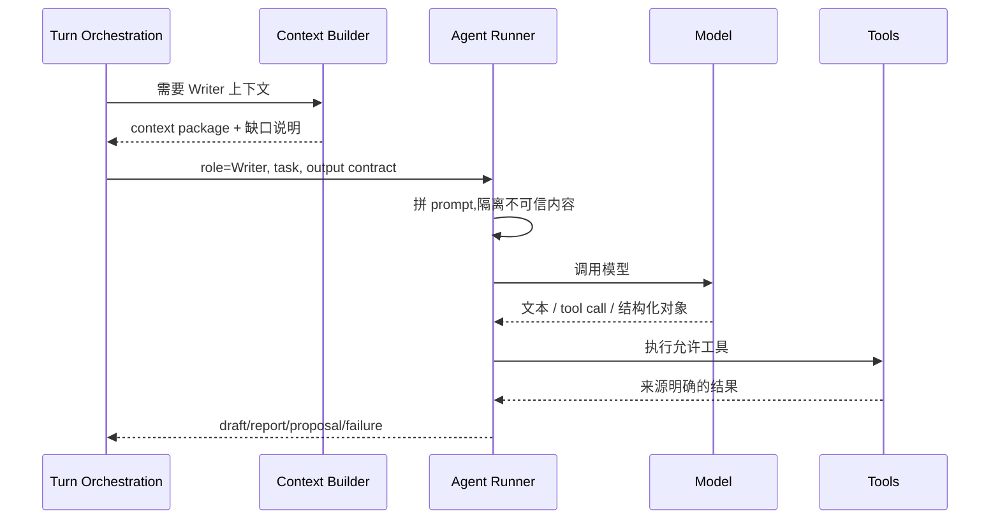
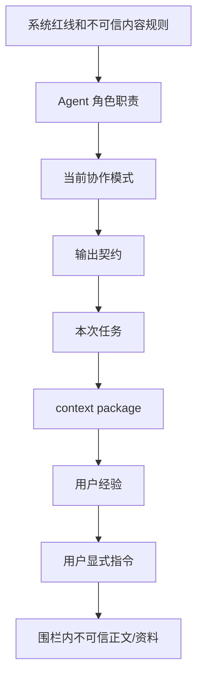
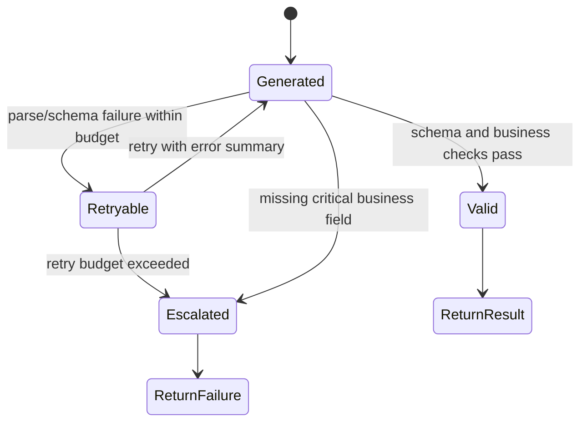

# 03 · Agent Runtime

这篇把 Agent 当成“受控执行器”来写,不是把它当成一个会自己管理流程的黑盒。Agent Runtime 只负责拿到任务、上下文和工具后产出结果;它不批准写入、不保存项目、不决定 UI 状态。

## 一次 Writer 调用的台前幕后

作者点“写本章正文”时,系统不会把整本书丢给模型然后等待奇迹。实际发生的是:

runner 的返回值只回到编排层。只要结果会改变作品,它必须成为 proposal 或 ChangeSet,等待 [04](./04-turn-orchestration.md) 处理。

## Runner 不是 Agent 框架

| 选择 | 本项目做法 | 原因 |
|---|---|---|
| workflow | 显式 turn orchestration | 审批、取消、回滚需要可恢复状态 |
| memory | 应用层 runtime/context builder | 不能让框架隐式塞历史 |
| tools | 白名单工具,分读/提议/内部 | 防止工具绕过审批写入 |
| JSON | runner 校验并有限重试 | 结构化失败不能靠自然语言猜 |
| stream | 事件和持久状态分离 | UI 断线后可恢复 |

通用框架可以提供灵感,但不能拥有主流程主权。

## Prompt 堆叠图

prompt 的顺序表达优先级。章节正文、导入资料和用户粘贴内容必须被围栏隔离,不能变成高优先级系统指令。

## 工具边界

| 工具类型 | 能做什么 | 不能做什么 |
|---|---|---|
| 读取工具 | 查项目事实、上下文、索引、会话材料 | 读取 workspace 外文件 |
| 提议工具 | 构造 ChangeSet、候选改写、风险报告 | 直接写盘或标记审批通过 |
| 内部工具 | 摘要、结构化提取、影响复核、校验 | 产生用户不可见的第二条写入链路 |
| 查询工具 | 返回带来源的事实或引用 | 用 LLM 编造无来源事实 |

如果工具内部需要再调用模型,仍走同一 runner 纪律:上下文来源、结构化校验、trace 和失败语义都不能省略。

## 输出有四种

| 输出 | 例子 | 下一站 |
|---|---|---|
| answer | 讨论模式里的解释、澄清、建议 | UI 展示 |
| report | 守则诊断、读者反馈、查询结果 | UI/审批解释 |
| proposal | 章节草稿、改写候选、设定修改 | Approval/ChangeSet |
| failure | 模型失败、工具失败、JSON 无法校验 | Turn Orchestration 决定恢复 |

自然语言并不低级,但它不能承载自动编排所需的关键状态。只要下游要用它落盘、审批、判断风险或装配上下文,就必须结构化。

## JSON 失败循环

“补默认值”只能用于不会影响行为的可选字段。影响审批、落盘、风险、上下文或来源解释的字段缺失时,必须失败。

## 模型输出的安全门

| 风险 | runner 的门 |
|---|---|
| prompt injection | 不可信内容围栏 + 工具权限限制 |
| 幻觉事实 | 查询结果必须带来源,无来源不输出事实结论 |
| 长上下文被裁 | 交给 context overflow,不静默裁关键事实 |
| 工具失败被模型圆过去 | 工具失败作为失败结果进入 runner |
| 直接写入意图 | 降为 proposal 或拒绝 |
| 半截流式 JSON | 只展示分析态,不进入业务状态 |

## FAQ

**Q: 为什么 Router 也是 Agent,却不能直接执行动作?**

A: Router 只输出结构化 action。action 是否可执行、是否危险、是否需要审批,由 turn orchestration 判断。

**Q: Agent 能不能自己查数据库补上下文?**

A: 不能随意查。它只能调用白名单工具,且上下文主入口是 context builder。

**Q: 结构化输出失败后为什么不让模型“解释一下”?**

A: 可以解释失败给用户看,但不能把解释当结构化结果继续编排。

**Q: 流式文本是不是可以边写边进入编辑器?**

A: 可以展示草稿流,但替换作品或进入审批状态必须等结果完整并通过对应校验。

**Q: 内部辅助 Agent 会不会成为隐藏 Agent?**

A: 不允许。内部辅助 Agent 的输入、输出、trace 和失败都必须回到主 runner,不能绕过可观测性和审批。

## Appendix

- [appendix/tool-catalog](./appendix/tool-catalog.md) 保存工具、命令和参数明细。
- [appendix/json-schemas](./appendix/json-schemas.md) 保存结构化输出 schema。
- [appendix/prompt-templates](./appendix/prompt-templates.md) 保存 prompt 模板和公共片段。
