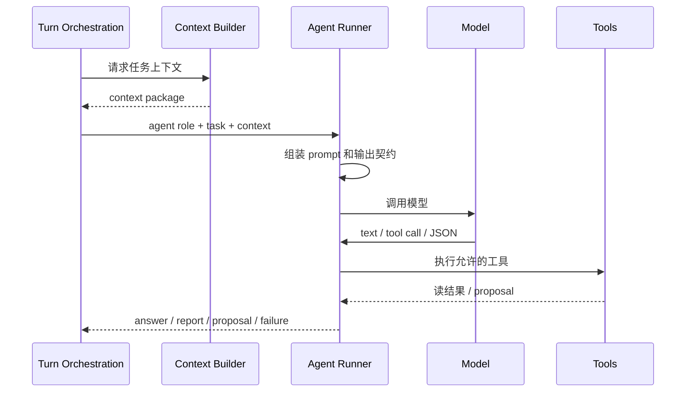

# 03 · Agent Runtime

本文档定义 Agent 如何被调用、如何拿上下文、如何使用工具、如何输出自然语言或结构化结果。读完本篇应能理解系统为什么使用自定义 runner,哪些工具可以读、哪些只能提议,以及 JSON 输出失败时不能怎么“糊弄过去”。

## 要解决的问题

Open Novel 需要多个 Agent 角色协作,但不能把写作主权交给一个黑盒 Agent 框架。系统需要明确知道:

- 现在运行的是哪个角色。
- 它拿到了哪些上下文。
- 它调用了哪些工具。
- 它输出的是回答、报告还是变更提议。
- 输出失败、工具失败、模型失败时由谁处理。

Agent Runtime 因此只负责“执行 Agent”,不负责“批准写入”。

## 主权对象

Agent Runtime 拥有:

- Agent runner。
- 模型调用入口。
- prompt 组装顺序。
- 工具调用边界。
- 结构化输出校验、重试和升级。
- Agent 角色的输入/输出契约。

它不拥有审批、落盘、rollback、UI 状态机或项目事实主权。

## Agent 类型

系统中的 Agent 可以分为三类:

| 类型 | 作用 | 输出 |
|---|---|---|
| 对话/路由 Agent | 理解用户意图,决定本 turn 做什么 | 回答或 action |
| 创作/分析 Agent | 写章节、诊断、读者预演、去 AI 味 | 文本、报告、proposal |
| 内部辅助 Agent | 影响复核、上下文摘要、结构化提取 | 结构化中间结果 |

内部辅助 Agent 不直接面对用户,也不能绕过主路径写入作品。它们的结果必须回到 runner、context 或 turn orchestration 继续处理。

## Runner 主路径

runner 的输出只返回给编排层。凡是会写入作品、修改设定、改变项目文件或更新长期经验的结果,都必须被包装成可审查结果,由 [04](./04-turn-orchestration.md) 决定下一步。

## 工具边界

工具分三类:

- 读取工具:读取项目事实、知识图谱、会话历史、上下文包。
- 提议工具:构造 ChangeSet、报告或候选修改,不直接写盘。
- 内部工具:做结构化提取、影响复核、摘要和校验。

工具必须遵守路径和项目边界。任何工具都不能读取 workspace 外的用户文件,不能把不可信正文当系统指令,不能把失败结果伪装成空结果。

工具内部如果再次调用模型,仍必须走同一套结构化输出、trace 和失败语义,不能变成“藏起来的第二条 Agent 路线”。

## Prompt 组装

prompt 由稳定头部和动态正文组成:

- 稳定头部说明角色、系统红线、模式边界、输出契约和不可信内容规则。
- 动态正文注入本次任务、上下文包、用户显式指令、相关经验和必要引用。

不可信内容必须被围栏隔离。章节正文、用户粘贴内容、导入资料和外部文件内容都不能被模型当作高优先级指令。

完整 prompt 模板属于 appendix。根层只规定注入顺序和安全边界。

## 结构化输出

结构化 Agent 必须产出可校验对象。校验路径是:

1. 模型按当前任务输出 JSON 或结构化对象。
2. runner 校验 schema 和业务必填项。
3. 失败时有限重试,重试 prompt 必须说明错误。
4. 仍失败则升级为可解释失败。

系统不允许用默认值静默补齐关键字段,也不允许把无法解析的 JSON 当作成功。可选字段可以缺省,但会影响审批、落盘、上下文或风险判断的字段缺失时必须失败。

流式场景下,JSON 分析态可以展示“正在分析”,不能逐字展示半成品 JSON,也不能让半截结构进入 turn 状态。

## 自然语言输出

不是所有 Agent 都需要 JSON。讨论模式下的解释、澄清问题、普通回答可以是自然语言。但只要输出会进入自动编排、审批、落盘、风险判断或上下文装配,就必须转成可校验结构。

## 失败语义

| 失败 | 处理 |
|---|---|
| 模型调用失败 | 返回 Agent failure,由 turn orchestration 决定重试/取消/提示 |
| 工具失败 | 工具结果标记失败,Agent 不得伪造成功 |
| JSON 校验失败 | 有限重试后升级失败 |
| prompt 超长 | 交给 context overflow 语义,不能静默裁关键事实 |
| 不可信内容越权 | 拒绝执行,记录 trace |
| 提议含直接写入 | 转为 proposal 或拒绝 |

## 用户可见结果

用户看到的是 Agent 当前角色、正在做的事、输出是否可信、失败原因和需要自己确认的点。用户不需要看到工具参数全表,但系统必须能解释“为什么这个 Agent 不能继续”。

## Appendix

- [appendix/tool-catalog](./appendix/tool-catalog.md) 保存工具、命令和参数明细。
- [appendix/json-schemas](./appendix/json-schemas.md) 保存结构化输出 schema。
- [appendix/prompt-templates](./appendix/prompt-templates.md) 保存 prompt 模板和公共片段。
