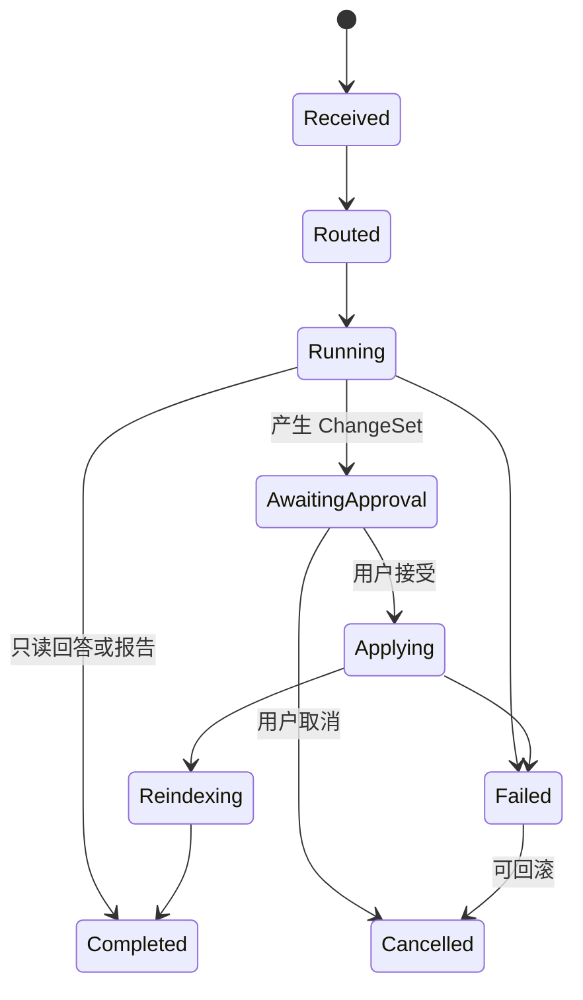

# 04 · Turn Orchestration

本文档定义一次用户输入如何被理解、执行、审批、落盘、取消和恢复。读完本篇应能理解:Router 只产出动作,Agent 只产出提议,系统如何把一批连带修改汇总成一次可审定的 ChangeSet,以及失败时为什么不能简单“停掉生成”。

## 要解决的问题

长篇创作中的一次输入可能只是聊天,也可能触发写章、改设定、连带改章节、重建索引和经验学习。Turn Orchestration 的职责是把这些动作放进同一个生命周期,保证:

- 用户知道系统正在做什么。
- 所有写入前都能审。
- cascade 在审批前内部完成,用户一次看全。
- 取消、失败和 rollback 都有统一语义。

## 主权对象

Turn Orchestration 拥有:

- user turn。
- Router actions。
- action queue。
- cascade controller。
- ChangeSet。
- approval lifecycle。
- cancel / rollback。
- 单 active turn 约束。

它不拥有模型调用细节、项目表结构、UI 视觉和知识图谱底层索引。

## Turn 生命周期

同一项目同一时间只允许一个 active turn 进入可写路径。只读查询可以并行,但不能改变正在审批或落盘的状态。

## Router 与 Action

Router 负责把用户输入变成 actions,例如讨论、写章节、改设定、查询事实、发起 cascade 或取消当前 turn。Router 不执行写入,也不重新解释已经在执行中的 cascade。

Router actions 是 turn 编排输入,必须是结构化结果。非法 action 让 turn 失败,不能让后续能力猜测用户意图。

## Cascade 主路径

cascade 用于“改一处,连带找全”。它的路径是:

1. 读取用户明确变更或 Agent 提议。
2. 影响分析先用项目事实、索引、引用和依赖找候选范围。
3. LLM 只对候选做二次过滤、解释和低置信标记。
4. 受影响项递归展开,但必须单调收缩或达到深度上限。
5. 所有候选修改汇总成一个 ChangeSet。
6. 用户在 ApprovalCard 中一次审定。

cascade 不能边发现边写。审批前的递归只是生成候选和解释;真正写入只发生在用户接受后。

## ChangeSet 与 Approval

ChangeSet 是一次可审定变更的最小批次。它可以包含章节改写、设定更新、风险报告、索引刷新要求和 rollback 信息。用户可以接受、拒绝、修改后接受或取消整批。

审批原则:

- pending 不自动过期。
- 相关文件外部变更会让审批失效。
- 审批失败不能标记为已生效。
- 接受后按事务顺序落盘并触发 reindex。
- ChangeSet 的解释要足够让用户理解“为什么这些地方一起改”。

五大守则风险进入审批时分级处理。提示级风险可以作为说明;需要确认的风险要求用户明确接受;阻断级风险不能在未解决前落盘。

## 取消与 Rollback

取消不是单纯 abort 模型调用。系统根据 turn 状态决定:

- 未产生持久影响:停止当前运行并记录取消。
- 产生 pending ChangeSet:废弃或标记取消。
- 已落盘部分动作:按 rollback 信息逆序撤销。
- rollback 不安全:停止后续动作并提示人工处理。

所有取消入口都必须走同一语义,包括输入条取消、命令面板取消、状态点取消和 Router action。

## 恢复

浏览器刷新、网络中断或事件流断开后,系统不重跑 Router 来恢复。恢复应读取持久 turn 状态、actions、approval 和落盘结果,判断当前处于运行、待审批、已完成、失败或需人工处理。

过程事件可以帮助展示 Trace,但不决定业务结果。

## 与其他层的关系

| 层 | 本篇如何调用 |
|---|---|
| Agent Runtime | 请求 Agent 产出回答、报告或 proposal |
| Context And Query | 请求影响分析和上下文装配 |
| Project Storage | 在审批接受后执行落盘和 rollback |
| Knowledge Graph | 落盘后触发 reindex,或读取影响范围 |
| Streaming UI | 把 turn 状态、审批和错误展示给前端 |

## 失败语义

| 失败 | 系统行为 |
|---|---|
| Router action 非法 | turn 失败,提示无法理解或无法执行 |
| cascade 递归不收敛 | 停止扩展,升级用户确认或拆分 |
| 影响分析低置信 | 保守扩大审查范围或要求用户确认 |
| ChangeSet 生成失败 | 不进入审批,展示失败原因 |
| 审批落盘失败 | 不标记已完成,保留可重试/回滚状态 |
| rollback 失败 | 停止后续动作,展示人工恢复建议 |
| recovery 状态缺失 | 不重跑危险动作,提示不可恢复缺口 |

## 用户可见结果

用户看到的是当前 turn 状态、系统为什么等待、哪些内容需要审、接受后会改哪里、失败后还能做什么。系统不能让用户在一个“好像还在运行”的状态里等待一个其实已经失败或待审批的 turn。

## Appendix

- [appendix/event-catalog](./appendix/event-catalog.md) 保存 turn、cascade、approval、cancel 事件明细。
- [appendix/json-schemas](./appendix/json-schemas.md) 保存 Router actions、ChangeSet 和审批输出 schema。
- [appendix/tool-catalog](./appendix/tool-catalog.md) 保存影响分析和 cascade 工具参数。
