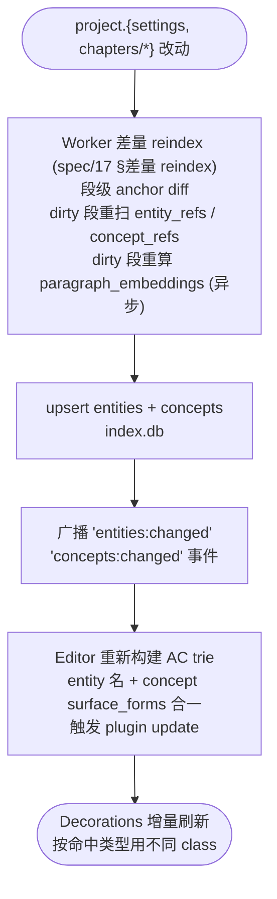

# Spec 05 — 实体 / 概念高亮与跳转

> **[info]** **W7 升级**: 高亮范围从仅 entity 扩展为 **entity + concept** 双索引。concept 是 worldview 硬规则被抽出来的 pseudo-entity (见 spec/16 §表 3),其 `surface_forms` 也被注入 AC trie,在正文里高亮以提醒作者"这里命中了某概念,可能是 violation 候选"。

## 数据流

**数据结构图**



## 编辑器选型与设计取舍

**TipTap 3.x(基于 ProseMirror)** + 自定义 ProseMirror Decorations + Aho-Corasick 自动机。装饰器对原始 markdown **零侵入**(不污染文件内容);SSR 下要求 `useEditor({ ..., immediatelyRender: false })`。

为什么不用 TipTap 的 `Mention` 节点:取舍见下表 ADR-02;`addProseMirrorPlugins` + Decorations 是 ProseMirror 社区对"已写就文本自动识别"场景的标准做法。

| 编号 | 决策 | 选项 | 选择 | 理由 |
|---|---|---|---|---|
| ADR-01 | 编辑器框架 | TipTap 3.x / CodeMirror 6 / Monaco / Slate | **TipTap 3.x** | 中文长文排版最舒服;ProseMirror 底层成熟;装饰器 API 适合实体高亮场景;Monaco 偏代码,Slate API 不稳 |
| ADR-02 | 实体识别方式 | TipTap Mention 节点 / **ProseMirror Decorations + AC trie** | **Decorations + AC trie** | 需求是"已写就的名字自动识别"而非"@ 召唤";Mention atomic node 破坏纯文本流且不能自动识别已有文本 |
| ADR-03 | 抽象 EditorAdapter 接口 | 直接耦合 TipTap / **抽象适配器** | **抽象适配器** | 未来如发现 TipTap 性能瓶颈或社区下沉,可换 CodeMirror 而业务代码零改动;接口稳定的代价是少量样板 |

## EditorAdapter 接口

业务代码(Editor 组件、ApprovalCard、框选修改、Cmd+E 查询浮层)只与 `EditorAdapter` 交互,不直接依赖 TipTap。换实现只需替换 `lib/editor/tiptap-impl.ts`:

```ts
// lib/editor/adapter.ts
export interface EditorAdapter {
  // 文件操作
  open(filePath: string): Promise<void>
  save(): Promise<void>
  isDirty(): boolean

  // 内容读写
  getContent(): string
  setContent(text: string): void
  getSelection(): { from: number; to: number; text: string } | null
  replaceRange(from: number, to: number, text: string): void

  // 高亮装饰 (entity + concept 双索引)
  decorateHighlights(items: Highlightable[]): void
  clearDecorations(): void

  // 事件
  onSelectionChange(cb: (sel) => void): Unsubscribe
  onHighlightClick(cb: (kind: 'entity' | 'concept', id: string, pos: { x: number; y: number }) => void): Unsubscribe
  onHighlightHover(cb: (kind: 'entity' | 'concept', id: string, pos: { x: number; y: number }) => void): Unsubscribe
  onContentChange(cb: (content: string) => void): Unsubscribe
}
```

entity 与 concept 装饰共用同一通道:`decorateHighlights` 一次接收两类 `Highlightable`,点击 / hover 回调的 `kind` 由装饰 DOM 上的 `data-kind` 区分(见 §ProseMirror Plugin 集成)。

### 别名映射 (Entity 类型)

```ts
type Entity = {
  id: string
  canonicalName: string      // "刘备"
  aliases: string[]           // ["玄德", "刘玄德", "皇叔"]
  category: 'character' | 'place' | 'item' | 'org'
  filePath: string            // "characters/liubei.md"
}
```

构建 AC trie 时把 `[canonicalName, ...aliases]` 全部入桶,每个 pattern 反指 `entityId`;点击 / Hover / Goto 行为只看 `entityId`,所有别名等价(concept 同理用 `surfaceForms` 入桶;entity + concept 合一的 `Highlightable` 定义见 §AC trie 构建)。`filePath` 供 Hover 卡片"打开 →"与 Goto Definition 使用。

### 编辑器迁移路径 (将来切 CodeMirror / Monaco)

要换编辑器,只需:

1. 写新的 `lib/editor/codemirror-impl.ts` 实现 `EditorAdapter`
2. `lib/editor/index.ts` 切默认导出
3. 业务代码(含 ApprovalCard、框选修改、Cmd+E 查询浮层)零改动

预计成本:3-5 天(主要是装饰器层的迁移,纯文本部分零成本)。

## AC trie 构建 (entity + concept 双索引)

选用 `BrunoRB/ahocorasick`(约 10KB,纯 JS,无 Node/WASM 依赖,浏览器与 Web Worker 均可运行);单次扫描 O(N + matches),量化目标见 §性能数据。

```ts
// lib/editor/aho-corasick.ts
import AhoCorasick from 'ahocorasick'

type Highlightable =
  | { kind: 'entity'; id: string; canonicalName: string; category: string; aliases: string[] }
  | { kind: 'concept'; id: string; title: string; category: string; semantic: string; surfaceForms: string[] }

type HighlightIndex = Map<string, Highlightable>  // 命中字符串 → 来源

export function buildAC(items: Highlightable[]): { ac: AhoCorasick; index: HighlightIndex } {
  const patterns: string[] = []
  const index: HighlightIndex = new Map()
  for (const item of items) {
    const names = item.kind === 'entity'
      ? [item.canonicalName, ...item.aliases]
      : item.surfaceForms
    for (const name of names) {
      if (!isViableMatch(name)) continue
      patterns.push(name)
      // 注: 同一字符串可能既是 entity 别名又是 concept 表面词 (e.g. "怀表" 既是 item entity 又被某概念引用)
      // 这种情况优先 entity (语义更具体);concept 仅在 entity 未命中时使用
      const exist = index.get(name)
      if (!exist || (exist.kind === 'concept' && item.kind === 'entity')) {
        index.set(name, item)
      }
    }
  }
  return { ac: new AhoCorasick(patterns), index }
}

function isViableMatch(name: string): boolean {
  if (name.length < 2) return false
  return true
}

// 调用方:
//   const entities = await db.entities.list(projectId)
//   const concepts = await db.concepts.where(status='active')
//   const items: Highlightable[] = [
//     ...entities.map(e => ({ kind: 'entity', ...e })),
//     ...concepts.map(c => ({ kind: 'concept', ...c })),
//   ]
//   const { ac, index } = buildAC(items)
```

## 边界裁剪 (中文场景)

`BrunoRB/ahocorasick` 默认输出所有重叠匹配。需要后处理:

```ts
type Match = { from: number; to: number; entityId: string }

function postProcess(text: string, rawMatches: AcMatch[], index: EntityIndex): Match[] {
  // 1. 转成 [from, to] (AC 给的是 [endIndex, [matchedStrs]])
  const flat = rawMatches.flatMap(([endIdx, strs]) =>
    strs.map(s => ({ from: endIdx - s.length + 1, to: endIdx + 1, str: s }))
  )
  
  // 2. 边界检查: 命中前后字符
  const filtered = flat.filter(m => isCleanBoundary(text, m.from, m.to, m.str))
  
  // 3. 重叠裁剪: 优先保留更长的匹配
  filtered.sort((a, b) => (b.to - b.from) - (a.to - a.from))
  const taken: Match[] = []
  for (const m of filtered) {
    if (!overlaps(taken, m)) {
      taken.push({ from: m.from, to: m.to, entityId: index.get(m.str)!.id })
    }
  }
  
  return taken.sort((a, b) => a.from - b.from)
}

function isCleanBoundary(text: string, from: number, to: number, str: string): boolean {
  const before = text[from - 1] ?? '\n'
  const after = text[to] ?? '\n'

  // 中文场景 — Aho-Corasick 默认输出全部子串匹配。需要白名单边界判定避免误命中:
  // 例: 角色 "李白" 不应命中 "我家的李白菜很好吃"

  // 黑名单: 后接修饰名词扩展 (e.g. "李白菜")
  const SUFFIX_BLOCK = ['菜', '鸟', '花', '草', '酒', '杯', '种']
  if (SUFFIX_BLOCK.includes(after)) return false

  // 黑名单: 前接修饰使其变成另一词 (e.g. "小刘备" 中 "刘备" 仍命中,但若是别名 "备",前接"小"应过滤)
  if (str.length === 1) {
    const PREFIX_BLOCK = ['小', '大', '老', '阿']
    if (PREFIX_BLOCK.includes(before)) return false
  }

  // 白名单: 前接动作 / 标点 / 句首 (强证据是命名实体)
  const PREFIX_OK = ['\n', ' ', '。', ',', '!', '?', ':', '"', '"', '\'',
                     '见', '看', '听', '说', '问', '答', '叫', '是', '与', '和']
  const SUFFIX_OK = ['\n', ' ', '。', ',', '!', '?', ':', '"', '"', '\'',
                     '说', '道', '答', '问', '笑', '想', '的', '在', '又', '却', '是']
  if (PREFIX_OK.includes(before) || SUFFIX_OK.includes(after)) return true

  // 中间情况: 默认放行,但置信度降低 (UI 可显示淡色)
  // 真要严控可改为默认 false;先放行,实测 false-positive 后再调
  return true
}
```

**调优策略**: 上述 PREFIX/SUFFIX 列表是种子。在 dev console 落一个 `falsePositiveLog` — 用户 hover 标"误识别"按钮,记录 entity + context 入 SQLite (新表 `entity_match_feedback`)。每周回看,迭代列表。

## ProseMirror Plugin 集成

```ts
// lib/editor/entity-highlight.ts
import { Plugin, PluginKey } from 'prosemirror-state'
import { Decoration, DecorationSet } from 'prosemirror-view'

const key = new PluginKey<DecorationSet>('entityHighlight')

export function entityHighlightPlugin(getEntities: () => Entity[]) {
  return new Plugin({
    key,
    state: {
      init(_, { doc }) {
        return computeDecorations(doc, getEntities())
      },
      apply(tr, old, _oldState, newState) {
        const codexChanged = tr.getMeta('codexChanged')
        if (codexChanged) return computeDecorations(tr.doc, getEntities())
        if (!tr.docChanged) return old
        // 增量: 映射旧装饰 + 重扫 dirty range
        const mapped = old.map(tr.mapping, tr.doc)
        const dirty = computeDirtyRange(tr)
        return updateInRange(mapped, tr.doc, dirty, getEntities())
      },
    },
    props: {
      decorations(state) { return key.getState(state) },
      handleDOMEvents: {
        click(view, ev) {
          const target = ev.target as HTMLElement
          const id = target?.dataset?.entityId
          if (id) {
            const rect = target.getBoundingClientRect()
            window.dispatchEvent(new CustomEvent('entity:click', {
              detail: { id, x: rect.left, y: rect.bottom },
            }))
            return true
          }
          return false
        },
        mouseover(view, ev) {
          const target = ev.target as HTMLElement
          const id = target?.dataset?.entityId
          if (id) scheduleHover(id, ev.clientX, ev.clientY)
          return false
        },
      },
    },
  })
}

function computeDecorations(doc, items) {
  const text = doc.textContent
  const { ac, index } = buildAC(items)
  const matches = postProcess(text, ac.search(text), index)
  
  const decos = matches.map(m => {
    const { from, to } = textToPmPos(doc, m.from, m.to)
    const item = index.get(m.matchedText)!
    if (item.kind === 'entity') {
      return Decoration.inline(from, to, {
        class: `entity-mention entity-${item.category}`,
        'data-entity-id': item.id,
        'data-kind': 'entity',
      })
    } else {
      // concept: 视觉区分 (虚线下划线 + 半透明色)
      // 若 concept.semantic = 'absent' 且本段命中 → 这是 violation,用红色虚线
      const violationClass = item.semantic === 'absent' ? 'concept-violation' : ''
      return Decoration.inline(from, to, {
        class: `concept-mention concept-${item.category} ${violationClass}`,
        'data-concept-id': item.id,
        'data-kind': 'concept',
        'data-semantic': item.semantic,
      })
    }
  })
  
  return DecorationSet.create(doc, decos)
}
```

## 性能数据

参考目标 (W2/W6 期间用 vitest bench 实测填充,见 spec/14-testing.md):

| 章节大小 | 实体数 | AC trie 构建 | AC 全扫耗时 | 增量扫描耗时 |
|---|---|---|---|---|
| 5K 字 | 50 | < 1ms | < 2ms | < 1ms |
| 20K 字 | 200 | < 5ms | < 8ms | < 2ms |
| 50K 字 | 500 | < 15ms | < 25ms | < 3ms (单段变更) |
| 50K 字 | 500 | — | (Worker 兜底) | < 5ms 主线程 |

**W2 末尾必须跑** 一次基准 (`tests/unit/ahocorasick.bench.ts`),把数据填回此表。文档不允许长期留"待实测"。

**输入防抖**: 用户连续输入时,dirty-range 的 AC 重扫做 **100ms debounce**;debounce 等待期间 Decoration 仅 `map(tr.mapping)` 跟随位置、不重算(IME composition 期间同样只 map 不重算,见 §IME 安全)。全文扫描只发生在初次加载与 Codex 变更。

## AC trie 重建策略 (新增)

> **[info]** audit 发现:`BrunoRB/ahocorasick` 不支持增量插入。每改一个角色都要全量重建 trie + 全文重扫,**写设定模式下 Validator cascade 的 reindex 会触发数十次重建**。

**降损策略**:

1. **Codex 变更 debounce 1s**: 用户连续创建/编辑实体时,1s 内的多次"Codex 变了"事件合并为一次重建
2. **trie 版本号**: `entityHighlightPlugin` 缓存当前 trie 与对应 entitySetHash;Codex 事件携带新 hash,plugin 比对 hash 不变就不重建
3. **per-章节 trie 缓存** (W6 优化): 当前章节正文 hash + entity set hash → 计算结果 cache;打开历史章节直接复用
4. **Worker 兜底**: 章节 >30K 字时 trie 构建 + 全扫扔到 Web Worker (主线程仅 apply Decorations);<30K 主线程同步跑 (避免 Worker 通讯开销)

如果 W6 实测发现重建仍是瓶颈,**升级路径**: fork BrunoRB/ahocorasick 加入 `addPattern(pattern)` 增量插入 (Aho-Corasick 算法本身支持增量,只是该库 API 没暴露;扩展约 50 行代码)。

## IME (中文输入法) 安全 (新增)

> **[info]** audit 发现两个 IME 相关坑,都对中文用户致命:
>
> 1. ChatBox textarea 中 IME 候选窗口活跃时按 Tab — 直接 preventDefault 切模式会破坏 IME 翻页
> 2. TipTap Decoration 重算与 IME composition 重叠时,Decoration 的 from/to 可能落在 composition pending 区间,导致光标跳或字丢

### ChatBox Tab 处理

ShortcutListener 在每次 `keydown` 中先检查:

```ts
function onKeyDown(e: KeyboardEvent) {
  if (e.isComposing || e.keyCode === 229) return    // ← IME composing,放行原生行为
  // 后续走 normal shortcut 解析
}
```

`isComposing` 是 W3C 标准属性,所有现代浏览器支持。`keyCode === 229` 是 Chrome/Edge 在某些情况的兜底。

### TipTap Decoration 重算

`entityHighlightPlugin.apply(tr, old)` 中:

```ts
apply(tr, old, _oldState, newState) {
  // 跳过 IME composition 中的中间状态 — Decoration 重算等到 composition 结束再做
  // ProseMirror EditorView 提供 view.composing 属性
  const view = (newState as any).editorViewRef?.current   // 通过 EditorAdapter 注入
  if (view?.composing) return old.map(tr.mapping, tr.doc)  // 仅 map 位置,不重新计算

  // 后续走 normal increment / rebuild 路径
}
```

`compositionend` 事件触发时 plugin 会自动收到一个新 transaction,届时再做完整 update。

### 单测覆盖 (spec/14)

- `shortcuts.test.ts`: composing=true 时 Tab 不切模式
- `entity-highlight.test.ts`: composing 期间 Decoration 不重算 + composition 结束后重算正确

## 富文本粘贴策略

用户从 Word / 微信 / 网页粘贴带格式段落 → TipTap 默认会保留 HTML 格式,污染纯文本流。策略:TipTap `editor.setOptions({ enablePasteRules: false })` + 自定义 paste handler:

```ts
editorView.props.handleDOMEvents = {
  paste(view, event) {
    const text = event.clipboardData?.getData('text/plain') ?? ''
    if (text) {
      event.preventDefault()
      view.dispatch(view.state.tr.insertText(text))   // 仅插纯文本
      return true
    }
    return false
  },
}
```

例外:粘贴自身(TipTap → TipTap 的内部 paste,如 reorder 段落)走默认 schema-aware 路径,不剥格式。判别手段:`event.clipboardData` 的 `text/html` 含 ProseMirror 写入的 `data-pm-slice` 标记即视为内部粘贴,走 schema-aware 路径;否则按上述 handler 剥格式、仅插纯文本。

## Hover 卡片

两类 hover 卡共用同一个 `Floating` 浮层定位组件:定位由 `@floating-ui/react` 提供(`useFloating` + `offset` / `flip` / `shift` middleware),呈现位置遵循 [design/01 §纸面](../design/01-main-layout.md#纸面) 的右缘旁注——浮现在纸面右缘、与命中词所在段落顶对齐,**不是锚定命中词的 tooltip**;版本见 [spec/28 §锁定的库版本](./28-tech-stack.md#锁定的库版本)。

### Entity Hover

```tsx
// components/editor/EntityHoverCard.tsx
export function EntityHoverCard({ entityId, anchorPos }) {
  const entity = useEntity(entityId)
  if (!entity) return null
  return (
    <Floating anchor={anchorPos}>
      <div className="entity-hover-card">
        <div className="header">
          <span className="category-badge">{entity.category}</span>
          <span className="name">{entity.canonicalName}</span>
          {entity.aliases.length > 0 && <span className="aliases">({entity.aliases.join(', ')})</span>}
        </div>
        <p className="summary">{entity.metadata.summary || entity.metadata.background?.slice(0, 80)}</p>
        <button onClick={() => gotoFile(entity.filePath)}>打开 →</button>
      </div>
    </Floating>
  )
}
```

卡片字段为名称 / 类别 / 别名 / 两行摘要;角色实体可选扩展头像与关键属性(由角色卡要素提供),默认不展示。完整字段集见上;[design/01 §纸面](../design/01-main-layout.md#纸面) 旁注默认仅展示名称 / 类别 / 两行摘要(不含别名)。

### Concept Hover

```tsx
// components/editor/ConceptHoverCard.tsx
export function ConceptHoverCard({ conceptId, anchorPos }) {
  const concept = useConcept(conceptId)
  if (!concept) return null
  const semanticLabel = {
    absent: '⛔ 此世界不存在',
    restricted: '⚠️ 受限',
    mandatory: '★ 强制要求',
    unique: '◆ 独一无二',
    present: '· 普通',
  }[concept.semantic]
  return (
    <Floating anchor={anchorPos}>
      <div className={`concept-hover-card concept-${concept.semantic}`}>
        <div className="header">
          <span className="category-badge">{concept.category}</span>
          <span className="name">{concept.title}</span>
          <span className="semantic">{semanticLabel}</span>
        </div>
        <p className="description">{concept.description}</p>
        {concept.semantic === 'absent' && (
          <div className="warning">⚠ 本段命中此概念表面词,可能违反设定 — 建议改写</div>
        )}
        <button onClick={() => gotoFile(concept.definedIn)}>打开定义 →</button>
      </div>
    </Floating>
  )
}
```

入口分发:`mouseover` event 拿到 `data-kind` 判 entity / concept,渲染对应 hover card。延迟 100ms 出现,移开 200ms 消失。

## Goto Definition 行为

```ts
function gotoFile(filePath: string, modifier?: 'cmd' | 'shift') {
  if (modifier === 'cmd') openInFullscreen(filePath)
  else openInRightSplit(filePath)
}
```

`openInRightSplit` 即 writing-first 主界面的「对照打开」:目标文件在纸面右侧以对照视图展开,当前章纸面不动、不丢上下文(见 [design/01 §实体右键与全项目改名](../design/01-main-layout.md#实体右键与全项目改名);主界面无 Tabs,多文件心智由库面板「最近」组承担)。这是与 VSCode 的"Go to Definition"(默认是同栏) 的关键差异 — 长篇写作要保留上下文。

## Backlinks 面板

`components/panels/BacklinksPanel.tsx`:

```tsx
export function BacklinksPanel({ filePath }) {
  const { data } = useSWR(`/api/backlinks?file=${filePath}`, fetcher)
  return (
    <div className="backlinks-panel">
      <h3>被 {data?.length ?? 0} 处引用</h3>
      {data?.map(bl => (
        <div key={bl.id} className="backlink-row" onClick={() => goto(bl.source_file, bl.position)}>
          <div className="source">{bl.source_section}</div>
          <div className="snippet">...{bl.snippet}...</div>
        </div>
      ))}
    </div>
  )
}
```

**数据源与索引时机**:面板数据来自 `index.db` 的 `backlinks` 表(完整 schema 见 [spec/01 §backlinks](./01-storage-schema.md#backlinks-反向索引在某文件打开时用));索引在章节 / 设定写盘后由 reindex Worker 异步刷新(entity_refs → 反向推导 backlinks,见 [spec/01 §索引刷新流程](./01-storage-schema.md#索引刷新流程)),不阻塞 UI;面板打开时按 `target_file` 查询、按 `source_file` group 计数。

## 重命名实体 (Rename Refactor)

右键实体 → "Rename Across Project":

1. 弹输入框,输入新名
2. 后端: 把 entities.canonicalName 改了
3. 用 entity_refs 表找出所有需要替换的位置
4. 生成 batch ApprovalCard,逐文件展示 diff
5. 用户批准后逐个写盘

## 自动从正文抽取新角色 (二期)

打开方式: 右键正文 → "标记为角色" → 弹角色创建对话框,自动填充类型/canonical name/category。

更激进版本 (二期): NER 自动检测正文中"未登记"的人名,在状态栏提示"发现 3 个未登记角色,是否登记?"。

## Concept Violation 实时提示 (W7-W9 落地)

> **[info]** 与 entity highlight 不同的是,concept 高亮带语义判断:concept.semantic = 'absent' 时,任何命中即 violation。

UI:

- violation concept 用红色虚线下划线 + 段落左侧 ⚠ icon
- ChatBox 顶部状态栏:"本章命中 N 个 violation 概念,见 [X 段]"
- 命令面板 `Cmd+Shift+P` 提供"修复 violation"快捷动作 → 调 `analyzeImpact` (spec/19) 把 concept-add delta 当作 trigger,跑一次 cascade

数据落 `concept_refs.is_violation` 列(spec/16 §表 4),Validator cascade 直接 SQL 查 violation 行作为候选。
