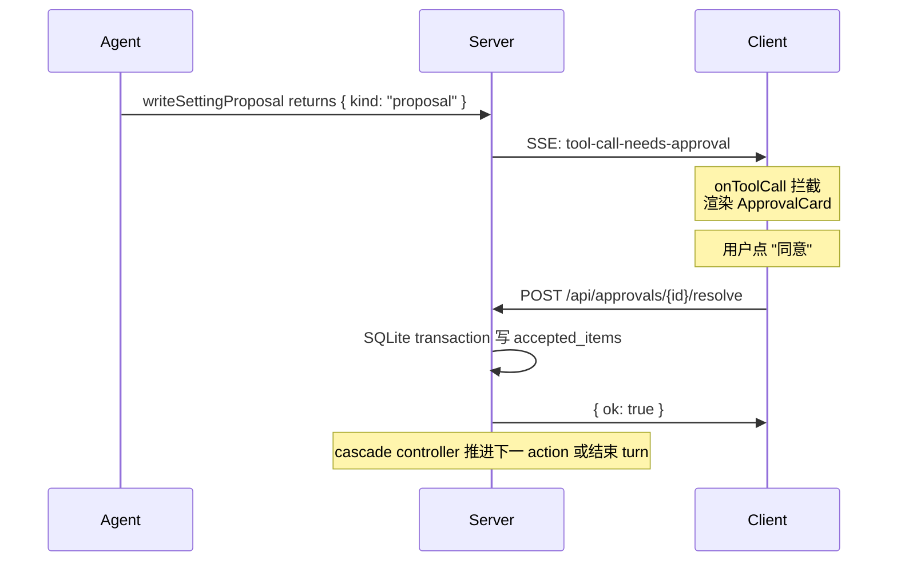
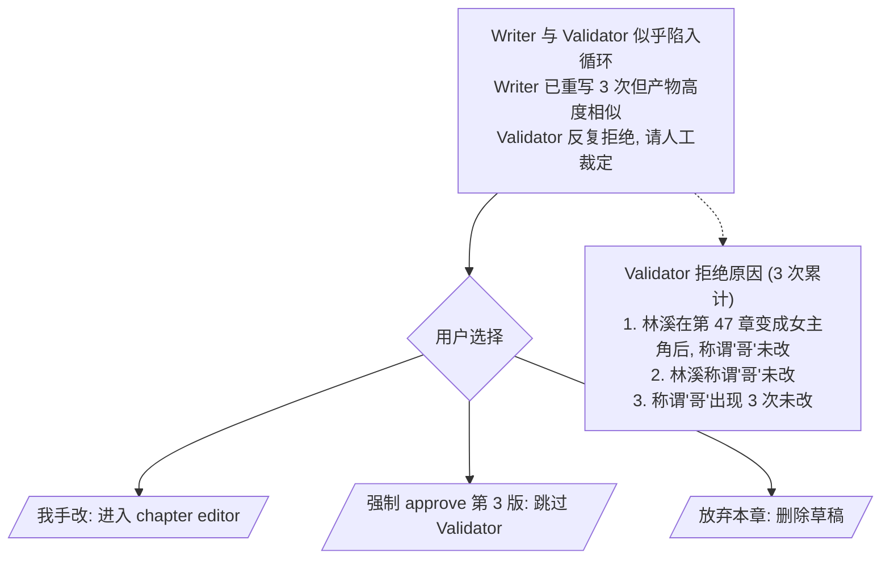

# Spec 06 — 审批流 (Human-in-the-Loop)

> **[info]** 本文档采用 **proposal-only tool + 独立 resolve endpoint**。AI SDK 的 `onToolCall` 只负责把 proposal 推到 UI;用户决议不回灌同一条 stream,而是调用 `POST /api/approvals/{id}/resolve`。

## 设计

把"工具生成 proposal → 用户审 → endpoint 决议 → 后端 transaction 落盘"的链路标准化。服务端 proposal 工具不直接写 fs/db 副作用;它只计算完整 ChangeSet,落一条 `approvals(status='pending')`,然后让 stream 结束等待用户。

## 流程时序

**审批流程图**



## 服务端实现 (proposal-only + 内部 cascade 递归)

需要审批的工具**不直接执行 fs/db 副作用**,而是先在内部跑完 cascade 递归 (spec/19),把整批 ChangeSet 落 `approvals` 表后返回 proposal 给客户端:

```ts
import { tool } from 'ai'

// 工具 "提议"——内部跑 cascade 递归后返回整批 ChangeSet;真正写盘在用户批准后由后端 endpoint 完成
export const writeSettingProposal = tool({
  description: '提议写一个设定文件 (内部计算 cascade 影响 → 整批 ChangeSet → 用户审批后落盘)',
  inputSchema: z.object({
    path: z.string(),
    content: z.string().max(50_000),
    reason: z.string(),
  }),
  execute: async ({ path, content, reason }, { projectId, agent }) => {
    // 1. 路径越权防御 (见 spec/02 §safeFromProjectRoot)
    const safe = safeFromProjectRoot(projectId, `settings/${path}`)
    // 2. 读 before (用于 diff + cascade 算 delta)
    const before = await tryReadFile(safe)
    // 3. analyzeImpact 内部递归 (spec/19) — ≤3 轮把 cascade 全部跑出来
    //    返回的 proposals 含 cascadeLevel: 1 (一级) / 2 (二级) / 3 (三级)
    //    主修改本身用 cascadeLevel=0 标
    const impact = await analyzeImpactRecursive(projectId, {
      mainChange: { filePath: `settings/${path}`, before, after: content, reason },
    })
    // impact = { proposals: ChangeProposal[], graph, metadata }
    // 4. 把整批 ChangeSet 写入 approvals 表 (status=pending) — 一行包含所有 levels 的 ChangeSet
    const approvalId = await db.approvals.insert({
      tool_call_id: ctx.toolCallId,
      agent, tool_name: 'writeSetting',
      change_set: JSON.stringify({
        main: { path, content, reason, before, diff: renderDiff(before, content) },
        cascade: impact.proposals,           // 含 cascadeLevel 1-3
        graph: impact.graph,
        metadata: impact.metadata,
      }),
      status: 'pending',
      created_at: new Date().toISOString(),
    })
    // 5. 返回 proposal — Agent loop 拿到这个,Router 会终止本轮等用户决议
    return {
      kind: 'proposal',
      approvalId,
      changeSet: { /* same as above */ },
    }
  },
})
```

**关键差异 (vs 旧版 `runValidatorScan`)**:

- ❌ 旧:cascade 是平铺一级 ChangeProposal[],"同意并 cascade 全部"再逐项 ApprovalCard
- ✅ 新:cascade 是 ≤3 级的 ChangeSet,**一次** ApprovalCard 内部勾选,后端 transaction 一次落盘
- 内部递归 ~15-45s,期间 stream 保持活跃,UI 显示进度;完成后 stream 才结束等审

**`approvals` 表 schema 升级** (在 spec/01 既有 schema 上加):

```sql
ALTER TABLE approvals ADD COLUMN change_set TEXT;       -- JSON,含 main + cascade[] + graph + metadata
ALTER TABLE approvals ADD COLUMN parent_approval_id INTEGER;  -- 二期: 跨多次审批的链路 (当前 ApprovalCard 整批,无需用)
```

旧 `payload` / `diff` / `cascade` 列保留兼容(读取时 fallback);新逻辑全用 `change_set`。

**Agent runner 约定**: Writer 在生成完内容后调 `writeSettingProposal`,工具返回 `{ kind: 'proposal' }` 后由 AI SDK `stopWhen` 显式终止本轮,进入"等待审批"状态。stream 不长留挂起,也不等待用户决议回灌。

**真正落盘**: 由独立 endpoint `POST /api/approvals/{id}/resolve` 处理,接受用户的 `accepted_items`(勾选了哪些 cascade proposal),按 SQLite transaction 一次写所有 accepted 文件:

```ts
// app/api/approvals/[id]/resolve/route.ts
export const runtime = 'nodejs'

export async function POST(req: Request, { params }: { params: { id: string } }) {
  const { decision, accepted_items, edits, feedback } = await req.json()
  // accepted_items: string[] — 勾选的 proposal id (含 'main' + cascade proposal anchorId 们)
  // edits: Record<string, string> — 用户手动改过的 content,key = proposal id
  const approval = await db.approvals.get(params.id)
  if (!approval || approval.status !== 'pending') {
    return new Response(JSON.stringify({ error: 'not_pending' }), { status: 409 })
  }

  const changeSet = JSON.parse(approval.change_set)

  if (decision === 'approved') {
    const cascadeGroupId = `cgroup_${Date.now()}_${approval.id}`

    // 一个 transaction 内写所有 accepted 文件
    await db.transaction(async (tx) => {
      // 1. 主修改 (若 'main' 在 accepted_items)
      if (accepted_items.includes('main')) {
        const finalMain = edits?.main ?? changeSet.main.content
        const safe = safeFromProjectRoot(approval.projectId, `settings/${changeSet.main.path}`)
        await fs.writeFile(safe + '.tmp', normalizeForWrite(finalMain))
        await fs.rename(safe + '.tmp', safe)
        await tx.history.add(approval.projectId, {
          action: 'write_setting', target: `settings/${changeSet.main.path}`,
          before: changeSet.main.before, after: finalMain,
          cascade_group_id: cascadeGroupId, approval_id: approval.id, agent: approval.agent,
        })
      }
      // 2. 每条 accepted cascade proposal
      for (const p of changeSet.cascade) {
        if (!accepted_items.includes(p.anchorId)) continue
        const finalText = edits?.[p.anchorId] ?? p.proposedText
        // 用 anchor 找到段范围,做段级写入 (paragraph splice)
        await applyParagraphRewrite(tx, approval.projectId, p.anchorId, finalText)
        await tx.history.add(approval.projectId, {
          action: 'cascade_rewrite', target: p.targetFile,
          anchor_id: p.anchorId, before: '...', after: finalText,
          cascade_group_id: cascadeGroupId, parent_approval_id: approval.id,
          cascade_level: p.cascadeLevel, agent: 'validator+writer',
        })
      }
      // 3. 主审批状态更新
      await tx.approvals.update(approval.id, {
        status: 'approved', decided_at: new Date().toISOString(),
        accepted_items: JSON.stringify(accepted_items),
      })
    })

    // transaction 外: 异步副作用 (reindex 不阻塞 transaction)
    const allFiles = collectAffectedFiles(changeSet, accepted_items)
    for (const f of allFiles) await reindexQueue.add(approval.projectId, f)
    await reflectorQueue.add(approval.projectId, approval.id)  // 按 cascade group 批次合并
  } else {
    // rejected — 全部丢弃,不落盘
    await db.approvals.update(approval.id, {
      status: 'rejected', user_feedback: feedback,
      decided_at: new Date().toISOString(),
    })
    await reflectorQueue.add(approval.projectId, approval.id)
  }
  return Response.json({ ok: true })
}
```

**事务原子性**: 任一文件写盘失败 → 全部 rollback,UI 收到错误后保留 ApprovalCard 让用户重试。这避免了"主修改落了但 cascade 第 5 项失败,数据半落地"的尴尬状态。

`history` 表新增三列:

```sql
ALTER TABLE history ADD COLUMN cascade_group_id TEXT;          -- 同 ChangeSet 落盘的所有 history 共享一个 group
ALTER TABLE history ADD COLUMN cascade_level INTEGER;          -- 0 = 主修改 / 1-3 = cascade 层级
ALTER TABLE history ADD COLUMN anchor_id TEXT;                 -- 段级 cascade rewrite 的锚点
CREATE INDEX idx_history_cgroup ON history(cascade_group_id);
```

UI"回退某次审批"现在按 `cascade_group_id` 批量回退,不允许只回退主修改不回退 cascade(否则又出现一致性问题)。

**为什么独立 endpoint 而不在 stream 内执行**:

1. 审批悬挂期间 stream 早超时关闭 (Node ~5min,Edge 30s),不能依赖 stream 还活着
2. 独立 endpoint 幂等 (status='pending' 检查) — 浏览器重连 / 关闭重开场景下重复点击不重复落盘
3. 与 Agent loop 解耦 — 用户审完 30 分钟后才点同意也合法

## 客户端 UI 拦截

```tsx
// components/panels/ChatBox.tsx
const { messages, sendMessage, status } = useChat({
  api: '/api/chat',
  body: { projectId, sessionId, mode },
  onToolCall: async ({ toolCall }) => {
    if (toolCall.toolName !== 'writeSettingProposal' && toolCall.toolName !== 'writeChapterProposal') {
      return  // 普通工具自动执行
    }
    // 服务端 execute 已经把 proposal 落 approvals 表,result 也回来了
    // 这里 toolCall.result 含 { kind: 'proposal', approvalId, ... }
    pushPending(toolCall.result)             // 进入待审 store
    // 不回灌 tool result — 让 stream 按 stopWhen 自然结束
    // 用户在 ApprovalCard 决议后,通过 fetch /api/approvals/{id}/resolve 落盘
    // 后续若需重做,用户重新发一条 message 触发新 stream
  },
})
```

注意:**决议不回灌进同一个 stream**,因为 stream 早结束了。改为独立 endpoint。这是与短挂起 cookbook 最大的差异 — cookbook 假设 stream 短期挂起(秒级),本项目假设审批可能拖分钟级。

## 客户端 UI 恢复

页面加载时 `useApprovals.hydrate()` 从 `/api/approvals?status=pending` 拉回所有未决 ChangeSet。stream 中收到新的 proposal 时只作为即时提示;事实来源仍是 `approvals` 表。

## ApprovalCard 组件 (整批审,W9 升级)

> **[info]** 整个 ChangeSet (主修改 + 1-3 级 cascade) 在**一个** ApprovalCard 内呈现。每条 proposal 有独立勾选框,默认按 confidence 决定是否勾选 (high/medium 默认勾,low 默认不勾)。用户可手动 toggle、整批同意、整批拒绝。

```tsx
// components/panels/ApprovalCard.tsx
export function ApprovalCard({ proposal }: { proposal: ApprovalProposal }) {
  const { changeSet } = proposal
  // 每条 proposal 一个 checkbox state + 一个 edits 文本 state
  const [acceptedItems, setAcceptedItems] = useState<Set<string>>(() => {
    const s = new Set<string>(['main'])
    for (const p of changeSet.cascade) {
      if (p.confidence === 'high' || p.confidence === 'medium') s.add(p.anchorId)
    }
    return s
  })
  const [edits, setEdits] = useState<Record<string, string>>({})

  const toggle = (id: string) => setAcceptedItems(s => {
    const ns = new Set(s); ns.has(id) ? ns.delete(id) : ns.add(id); return ns
  })

  return (
    <Card>
      <Header>
        ✱ {proposal.agent} 想要 {proposal.toolName}: {changeSet.main.path}
        <span className="cascade-badge">
          + {changeSet.cascade.length} 项 cascade ({changeSet.metadata.rounds} 轮分析)
        </span>
      </Header>

      {/* 影响图谱 (顶部) */}
      <ImpactGraphView graph={changeSet.graph} />

      {/* 主修改 */}
      <ChangeRow
        id="main"
        checked={acceptedItems.has('main')}
        onToggle={() => toggle('main')}
        title={`主修改: ${changeSet.main.path}`}
        reason={changeSet.main.reason}
        diff={computeDiff(changeSet.main.before, edits.main ?? changeSet.main.content)}
        editable={edits.main ?? changeSet.main.content}
        onEdit={text => setEdits(e => ({ ...e, main: text }))}
        cascadeLevel={0}
      />

      {/* Cascade proposals (按 cascadeLevel 分组,折叠可展开) */}
      {[1, 2, 3].map(level => {
        const items = changeSet.cascade.filter(p => p.cascadeLevel === level)
        if (items.length === 0) return null
        return (
          <CascadeGroup key={level} level={level} count={items.length}>
            {items.map(p => (
              <ChangeRow
                key={p.anchorId}
                id={p.anchorId}
                checked={acceptedItems.has(p.anchorId)}
                onToggle={() => toggle(p.anchorId)}
                title={`${p.targetFile} § ${p.anchorId.slice(-8)}`}
                reason={p.reason}
                confidence={p.confidence}
                diff={computeDiff(p.beforeText, edits[p.anchorId] ?? p.proposedText)}
                editable={edits[p.anchorId] ?? p.proposedText}
                onEdit={text => setEdits(e => ({ ...e, [p.anchorId]: text }))}
                cascadeLevel={level}
              />
            ))}
          </CascadeGroup>
        )
      })}

      {/* 五大守则风险报告 (spec/25) */}
      {proposal.cardinalRulesReport && (
        <CardinalRulesReportPanel
          report={proposal.cardinalRulesReport}
          onAcknowledge={(acked) => setAcknowledgedRisks(acked)}
        />
      )}

      <Actions>
        <Button onClick={() => setAcceptedItems(allItemIds(changeSet))}>全选</Button>
        <Button onClick={() => setAcceptedItems(new Set())}>全不选</Button>
        <Button onClick={() => reject(proposal.approvalId)}>拒绝全部 (N)</Button>
        <Button
          variant="primary"
          disabled={
            acceptedItems.size === 0 ||
            // 守则 4 blocking violation (deadline 已过的 critical promise) → 完全禁用 approve
            proposal.cardinalRulesReport?.blockingViolations?.length > 0 ||
            // critical 级风险存在但用户未勾"明知违反仍通过" → 禁用
            (hasCriticalRisks(proposal.cardinalRulesReport) && !acknowledgedRisks)
          }
          onClick={() => approve(proposal.approvalId, acceptedItems, edits)}
        >
          同意勾选项 ({acceptedItems.size}/{1 + changeSet.cascade.length}) (Y)
        </Button>
      </Actions>
    </Card>
  )
}

/**
 * 五大守则风险报告面板 (spec/25).
 *
 * 渲染规则:
 * - critical 数 ≥ 1 → 红色块,展示 "{N} 项严重违反守则,可能让读者直接弃书"
 *                     强制 user 必须勾 "我已阅读上述风险, 明知违反仍通过" checkbox
 * - blockingViolations 数 ≥ 1 → 红色块,显示 "{已过 deadline 的 critical promise 数} 项 blocking 违反"
 *                                同意按钮完全禁用,只能拒绝 (用户先去解决 promise 或调 deadline)
 * - major 数 ≥ 1 → 黄色块,展示具体问题与建议
 * - warn 数 ≥ 1 → 橙色块,提示性
 * - 各条可点击跳转到对应章节段 (spec/05 entity-highlight 同款 anchor 跳转)
 */
function CardinalRulesReportPanel({ report, onAcknowledge }: {
  report: CardinalRulesReport
  onAcknowledge: (acked: boolean) => void
}) {
  const sections = ['goldenChapters', 'characterIntegrity', 'pacing', 'promiseAccountability', 'protagonistAgency'] as const
  const criticalCount = sections.reduce((n, s) => n + report[s].details.filter(d => d.severity === 'critical').length, 0)
  const blockingCount = report.blockingViolations.length

  return (
    <div className="cardinal-rules-report">
      {blockingCount > 0 && (
        <Alert variant="critical-blocking">
          ⛔ {blockingCount} 项 blocking 违反 — 必须先解决才能通过审批 (e.g. 已过 deadline 的 critical promise)
        </Alert>
      )}
      {criticalCount > 0 && (
        <Alert variant="critical">
          🔴 {criticalCount} 项严重违反守则 — 可能让读者直接弃书
        </Alert>
      )}
      {/* 各 section 详情列表 */}
      {sections.map(s => (
        <RuleSection key={s} title={ruleSectionTitle(s)} report={report[s]} />
      ))}

      {/* critical (非 blocking) 必勾 checkbox */}
      {criticalCount > 0 && blockingCount === 0 && (
        <label>
          <Checkbox onChange={(e) => onAcknowledge(e.target.checked)} />
          我已阅读上述 critical 风险,明知违反仍通过
        </label>
      )}
    </div>
  )
}

function hasCriticalRisks(report?: CardinalRulesReport) {
  if (!report) return false
  return ['goldenChapters', 'characterIntegrity', 'pacing', 'promiseAccountability', 'protagonistAgency']
    .some((s) => (report as any)[s]?.details?.some((d: any) => d.severity === 'critical'))
}

async function approve(approvalId: string, acceptedItems: Set<string>, edits: Record<string, string>) {
  await fetch(`/api/approvals/${approvalId}/resolve`, {
    method: 'POST',
    headers: { 'content-type': 'application/json' },
    body: JSON.stringify({
      decision: 'approved',
      accepted_items: Array.from(acceptedItems),
      edits,
    }),
  })
  popPending(approvalId)
}

async function reject(approvalId: string) {
  const feedback = await promptUserFeedback()
  await fetch(`/api/approvals/${approvalId}/resolve`, {
    method: 'POST',
    headers: { 'content-type': 'application/json' },
    body: JSON.stringify({ decision: 'rejected', feedback }),
  })
  popPending(approvalId)
  if (feedback) {
    sendMessage({ role: 'user', content: `[拒绝并希望重做] ${feedback}` })
  }
}
```

**关键变化 (vs 旧版)**:

- ❌ 旧:`approveWithCascade` 把 cascade 各项**展开**成独立 approvals 行,逐项 push 到 pending queue
- ✅ 新:**单一** approval 行包含整个 ChangeSet;UI 内部勾选;后端一个 transaction 写所有 accepted
- ❌ 旧:cascade 各项独立 ApprovalCard 逐项审 (用户体验"批 N 次")
- ✅ 新:一次 ApprovalCard 看完整批 (用户体验"批 1 次")
- ❌ 旧:`approve(approvalId, { content })` 单文件
- ✅ 新:`approve(approvalId, acceptedItems, edits)` 批量勾选 + 各自 edits

## 多审批排队

同一时刻可能有多个待审 (e.g. cascade 链路),用 Zustand store 维护:

```ts
// lib/store/approvals.ts
export const useApprovals = create<{
  pending: ApprovalProposal[]                    // 主 + cascade 全在这里,按 createdAt asc
  push: (proposal: ApprovalProposal) => void
  pop: (approvalId: string) => void
  hydrate: () => Promise<void>                   // 启动时从 server 拉所有 status=pending
}>((set, get) => ({
  pending: [],
  push: (p) => set(s => ({ pending: [...s.pending, p] })),
  pop: (id) => set(s => ({ pending: s.pending.filter(r => r.approvalId !== id) })),
  hydrate: async () => {
    const list = await fetch('/api/approvals?status=pending').then(r => r.json())
    set({ pending: list })
  },
}))
```

UI 显示**第一个** (按时间),其他角标提示。

## Turn 取消语义 (chat box 顶部 [取消本次对话] 按钮)

> **[info]** 设计原则: **用户可随时取消 — 一旦取消, 当前 turn 内所有已落盘 changes 全部 revert**。turn 是 transactional checkpoint, 不是 action 是 turn 整体。

用户每次输入 → Router 输出 `actions[]` → cascade 控制器顺序执行 → 一个或多个 ApprovalCard。整个过程是**一个 user_turn** (见 spec/01 §user_turns 表), chat box 顶部常驻 **[取消本次对话]** 按钮直到该 turn 进入 `done` / `cancelled` 终态。

**各 action 决议规则**:

- ApprovalCard **[同意]**: 该 action 落盘 (走本文 §服务端实现 transaction); 下一 action 开始
- ApprovalCard **[拒绝]**: 该 action 跳过, 不落盘; 下一 action 仍继续 (turn 不中断)
- chat box **[取消本次对话]** 按钮: 整 turn 中止 — 已落盘 action **逆序 revert**, 未跑 action 直接丢弃

### 取消时各时刻的行为

| 时刻 | 已落盘 actions | 取消后 |
|---|---|---|
| Router 还在跑 | 无 | 中断 Router 调用, turn.status='cancelled', 无 revert |
| action[0] cascade 跑中 (ApprovalCard 未弹) | 无 | 丢弃 in-memory cascade 状态, turn.status='cancelled', 无 revert |
| action[0] ApprovalCard 弹出但未决议 | 无 | 关闭 ApprovalCard, 同上, 无 revert |
| action[0] 已 approve 落盘, action[1] cascade 跑中 | action[0] | revert action[0] (按 cascade_group_id 倒序), 丢 in-memory cascade, turn.status='cancelled' |
| action[0]/[1] 都 approve 落盘, action[2] 在跑 | action[0], action[1] | 逆序 revert action[1] → action[0] (同一 transaction), turn.status='cancelled' |
| 所有 actions 都决议完, turn.status='done' | 所有 approved | [取消本次对话] **按钮置灰** — 用户改走 §撤销 单条回退 |

### rollbackTurn 实现

```ts
// app/api/turns/[id]/cancel/route.ts
export async function POST(req: Request, { params }: { params: { id: string } }) {
  const turn = await db.userTurns.get(params.id)
  if (!turn) return new Response(JSON.stringify({ error: 'not_found' }), { status: 404 })
  if (turn.status === 'done' || turn.status === 'cancelled') {
    return new Response(JSON.stringify({ error: 'terminal_state' }), { status: 409 })
  }

  // 1. 中断 cascade 控制器内存状态 (取消 in-flight Router / cascade / Writer 短调用)
  await cascadeController.abortTurn(turn.id)

  // 2. 查所有该 turn 内 approved 的 approvals (按 created_at 倒序)
  const approvedApprovals = await db.approvals.findApprovedByTurn(turn.id, { orderDesc: true })

  // 3. 单 transaction 内逐个 rollback — 利用现有 cascade_group_id 链
  await db.transaction(async (tx) => {
    for (const approval of approvedApprovals) {
      await rollbackApproval(tx, approval.id)        // 见本文 §撤销, 反写 history.before
    }
    await tx.userTurns.update(turn.id, {
      status: 'cancelled',
      cancelled_at: Date.now(),
      reverted_approval_count: approvedApprovals.length,
    })
  })

  // 4. transaction 外: 副作用入队 (reindex 反向 / snapshot / Reflector 不跑取消 turn)
  for (const approval of approvedApprovals) {
    const files = collectAffectedFiles(JSON.parse(approval.change_set), JSON.parse(approval.accepted_items))
    for (const f of files) await reindexQueue.add(turn.project_id, f)
  }

  return Response.json({ ok: true, reverted: approvedApprovals.length })
}
```

**history trace 保留**: rollbackApproval 不删 history 表中 approve 时写的行, 而是**追加**一行 `action='cascade_revert'` 标注同一 `cascade_group_id`。Settings → 审批历史 里能看到 "这个 turn 试过又取消了, 内容是 X" — 创作者复盘有价值, 不被抹掉。

### 幂等 + 跨进程恢复

- **幂等**: `POST /api/turns/{id}/cancel` 检查 `turn.status NOT IN ('done', 'cancelled')`, 否则 409
- **浏览器关闭 → 重开**: rehydrate 时按 `user_turns.status IN ('running', 'awaiting_approval')` 拉所有 in-flight turn, UI 在 chat box 上方 banner 列出 — 用户选择"继续审"或"取消本次对话"。**不再自动 expired** (旧版 24h 机制删除); turn 永远 pending 直到用户显式决议
- **ApprovalCard pending 行为**: `POST /api/approvals/{id}/resolve` 仍幂等 (status='pending' check), 但不再判 expired

**stream 端**: Mastra Agent 调 writeSettingProposal 后 prompt 显式 stop。stream 在 30s 内自然结束 (proposal emit 完即收尾),不长留挂起。stream 超时不是问题, turn 持久化也不依赖 stream。

## Cascade 大批量审 (新增)

> **[info]** audit 发现:100+ cascade 改动需要分页吗?用户能"全选/反选/全过"吗?

**UI 升级 BulkApprovalDialog**:

```tsx
<BulkApprovalDialog>
  {/* 虚拟滚动,默认 5 项一屏 */}
  <Virtualizer items={cascade} itemSize={80} maxVisible={5}>
    {(item, index) => (
      <CheckRow
        key={item.id}
        item={item}
        checked={selected.has(item.id)}
        onToggle={(c) => toggle(item.id, c)}
      />
    )}
  </Virtualizer>

  <FilterBar>
    <select value={filter} onChange={e => setFilter(e.target.value)}>
      <option value="all">全部 ({cascade.length})</option>
      <option value="high">高置信度 ({cascade.filter(c => c.confidence === 'high').length})</option>
      <option value="medium">中</option>
      <option value="low">低 (建议先看再批)</option>
    </select>
  </FilterBar>

  <Actions>
    <Button onClick={selectAll}>全选 ({cascade.length})</Button>
    <Button onClick={selectNone}>清空</Button>
    <Button onClick={() => bulkApprove(Array.from(selected))} variant="primary">
      批准 {selected.size} 项
    </Button>
    <Button onClick={() => bulkReject(Array.from(selected))}>拒绝选中</Button>
    <Button onClick={oneByOne}>逐项审 (默认)</Button>
  </Actions>
</BulkApprovalDialog>
```

`bulkApprove` 内部不再逐条 fetch,而是 `POST /api/approvals/bulk { ids, decision }`,后端在 transaction 内串行执行,失败回滚。

## 持久化

每次审批 (无论决策) 都写到 `approvals` 表 (见 spec/01)。

```ts
async function recordApproval(call, decision, payload?) {
  await db.approvals.insert({
    tool_call_id: call.id,
    agent: call.agent,
    tool_name: call.toolName,
    payload: JSON.stringify(call.input),
    diff: renderedDiff,
    status: decision,  // approved | rejected | edited
    user_feedback: payload?.feedback,
    decided_at: new Date().toISOString(),
    created_at: call.createdAt,
  })
}
```

## 批量审批

对长 cascade 链 (>5 项),提供"全选/全拒/逐项"三种模式:

```tsx
<BulkApprovalDialog>
  <CheckList items={cascade} />
  <Actions>
    <Button onClick={() => bulkApprove(selected)}>批准选中 ({selected.length})</Button>
    <Button onClick={() => bulkReject(selected)}>拒绝选中</Button>
    <Button onClick={() => oneByOne()}>逐项审 (默认)</Button>
  </Actions>
</BulkApprovalDialog>
```

bulkApprove 内部调用 `POST /api/approvals/bulk`,后端按 approval 顺序在 transaction 中处理。它不回灌 stream。

## 与 Reflector 联动

每次审批 resolve 后:

```ts
async function onResolve(call, decision, finalContent) {
  await recordApproval(call, decision, { feedback })

  // 入队 Reflector
  await reflectorQueue.add({
    context: {
      agent: call.agent,
      input: call.input,
      output: call.output,
      decision,
      feedback,
      edited_content: finalContent !== call.input.content ? finalContent : undefined,
    },
  })
}
```

Reflector 异步消费 (Worker),不阻塞主链路。

## 撤销

`approvals` 表支持**单条回退**和**整 turn 回退**两种粒度。整 turn 回退由 §Turn 取消语义 触发, 内部循环调下面这个 `rollbackApproval`:

```ts
// lib/storage/rollback.ts
async function rollbackApproval(tx: Transaction, approvalId: string) {
  const approval = await tx.approvals.get(approvalId)
  if (!approval || approval.status !== 'approved') {
    throw new Error(`approval ${approvalId} not approved, cannot rollback`)
  }
  const historyRows = await tx.history.findByApproval(approvalId)        // 一个 approval 多条 history (主 + cascade)
  if (historyRows.length === 0) throw new Error('无回退基准')

  // 按 cascade_level 倒序回退 (先 cascade 后主修改, 避免 dangling reference)
  const sorted = historyRows.sort((a, b) => b.cascade_level - a.cascade_level)
  for (const h of sorted) {
    if (h.before === null) {
      // before=null = 新建文件, 回退 = 删除
      await fs.unlink(h.target).catch(() => {})
    } else {
      await fs.writeFile(h.target + '.tmp', h.before)
      await fs.rename(h.target + '.tmp', h.target)
    }
    // 追加一行反向 history, 保留原 cascade_group_id 链, 便于审批历史显示
    await tx.history.add(approval.projectId, {
      action: h.action === 'write_setting' ? 'revert_setting' : 'cascade_revert',
      target: h.target,
      before: h.after,                                                     // 反向: 之前的 after 现在是 before
      after: h.before,                                                     // 反向: 之前的 before 现在是 after
      cascade_group_id: h.cascade_group_id,                                // 保留链
      reverted_from_history_id: h.id,                                      // 反向引用原 history
      cascade_level: h.cascade_level,
      agent: 'system-rollback',
    })
  }
  await tx.approvals.update(approvalId, { status: 'reverted' })
}
```

**UI 路径**:

- **单条回退**: Settings → 审批历史 → 选某条 approved → "回退" 按钮 → 调 `POST /api/approvals/{id}/rollback`
- **整 turn 回退**: chat box 顶部 [取消本次对话] (turn 未完结时) 或 Settings → 审批历史 → 按 turn_id 分组 → "回退整个 turn" (turn 已完结时)

**派生视图守卫** (plan/01 inv L10): rollbackApproval 写 fs 前必须检查 `h.target` 对应文件 frontmatter `derived: true` — 若是, 跳过 fs.writeFile (派生文件由 reindex 重生成, 不应手工回退)。

## 安全防护

- **input schema 严格** (Zod 校验失败 → 自动拒绝,不进入审批)
- **路径越权防御** (见 spec/02 §safeFromProjectRoot) — 在 execute 第一行强制检查,不依赖前端校验
- **写入大小上限** — `inputSchema` 中 `content: z.string().max(50_000)`,~30K 字硬上限;超过用续写协议 (spec/02 §工具输出长度上限)
- **不可信内容围栏** — 所有从 readSetting / readChapter / webSearch 读出的内容,在拼接进 LLM prompt 时用 `wrapUntrusted()` (spec/02 §不可信输入的围栏);LLM 看到 `<<<UNTRUSTED:...>>>` 内的"指令"应忽略
- **原子写盘** — `fs.writeFile(path + '.tmp')` + `fs.rename` 避免半截内容;db.history.insert 在同一 transaction
- **AbortSignal 检查** — execute 内每次进 fs/db 操作前 `if (signal.aborted) return earlyExit()`,但**不中断**已开始的 fs.rename (单步原子操作);step 级粒度的取消

## Validator-Writer doom-loop 检测 (借鉴 opencode `processor.ts:351-374`)

> **[info]** **问题场景**: 用户开启自动 cascade (write 模式 → Writer 写 → Checker / Validator / ReaderPanel 跑 → Validator 拒绝 → Writer 重生成 → Validator 又拒绝 → ...). 如果 Writer 反复给出几乎相同的输出 (LLM 没真正吸收 Validator 的反馈), 就会无限循环烧 token, 用户在前端看到的只是"还在生成"。

opencode 处理类似情况 (`processor.ts:351-374`): 检测最近 N 个 tool call 是否同名同 input → 触发 `permission.ask({permission: "doom_loop"})` 让用户决策。我们对应版本: 检测 Writer 自我重写循环。

### 检测逻辑

```ts
// lib/agents/doom-loop-detector.ts
const DOOM_LOOP_THRESHOLD = 3
const SIMILARITY_THRESHOLD = 0.9    // 经验值,可基于实测调整

export class DoomLoopDetector {
  private recentWriterOutputs: { chapterId: string; text: string; rejectReason: string }[] = []

  async checkAndMaybeEscalate(input: {
    chapterId: string
    writerOutput: string
    rejectReason: string                          // Validator / Checker 的本次拒绝理由
  }): Promise<{ verdict: 'continue' | 'escalate'; reason?: string }> {
    this.recentWriterOutputs.push({ ...input, rejectReason: input.rejectReason })
    if (this.recentWriterOutputs.length > DOOM_LOOP_THRESHOLD) {
      this.recentWriterOutputs.shift()
    }
    if (this.recentWriterOutputs.length < DOOM_LOOP_THRESHOLD) {
      return { verdict: 'continue' }
    }

    // 同章节连续 3 次 Writer 输出 — 检查相似度
    const sameChapter = this.recentWriterOutputs.every(o => o.chapterId === input.chapterId)
    if (!sameChapter) return { verdict: 'continue' }

    const similarities = computePairwiseSimilarity(this.recentWriterOutputs.map(o => o.text))
    const allHigh = similarities.every(s => s >= SIMILARITY_THRESHOLD)
    if (allHigh) {
      return {
        verdict: 'escalate',
        reason: [
          `Writer 在章节 ${input.chapterId} 连续 ${DOOM_LOOP_THRESHOLD} 次重生成产物高度相似 (>= ${SIMILARITY_THRESHOLD})`,
          `Validator/Checker 反复拒绝原因:`,
          ...this.recentWriterOutputs.map((o, i) => `  ${i + 1}. ${o.rejectReason}`),
          `LLM 未能吸收反馈, 升级到用户判断`,
        ].join('\n'),
      }
    }
    return { verdict: 'continue' }
  }

  reset() {
    this.recentWriterOutputs = []
  }
}
```

`computePairwiseSimilarity` 用简化策略:

- 去除空白和标点后做 character-level Jaccard 相似度 (二期可换 BGE-M3 embedding 余弦相似度)
- 阈值 0.9 是经验值,实测后再调整

### 升级到用户的 UI 表现

`escalate` 时不直接抛 error, 而是把 cascade 流程**暂停在审批入口**, 在 ApprovalCard 顶部显示橙色警告条:

**审批流程图**



(三个动作对应 spec/05 §modes-and-approval 的标准动作, 加 "强制 approve 跳过 Validator" 一个新动作)

### 与 spec/22 §subagent task_id 续跑 的协同

opencode `tool/task.ts` 的 `task_id` 续跑模式: Validator 拒绝后 Writer 重生成应**续上原 threadId** 而不是开新会话, 让 Mastra lastMessages=30 能让 Writer 看到"我刚才被拒了"。这是 doom-loop 检测能不能起作用的前提 — 如果每次重生成都是空白上下文, Writer 当然会一直输出同一个东西。

```ts
// 在 cascade 控制器内 (spec/06 §cascade 流转)
const writerThreadId = `proj:${projectId}:session:${sessionId}:writer:${chapterId}`
                                                          // 同一 chapter 续用同 thread

if (validatorReport.contradictions.length > 0) {
  const detection = await doomLoopDetector.checkAndMaybeEscalate({
    chapterId, writerOutput: writerLastDraft, rejectReason: validatorReport.summary,
  })
  if (detection.verdict === 'escalate') {
    return showApprovalCardWithDoomLoopWarning(detection.reason)
  }
  // 续 thread 重生成 (借 opencode tool/task.ts task_id 续跑)
  await runHiddenAgent('chapter-writer-retry', {                  // 或者直接 callJsonAgent / streamText
    threadId: writerThreadId,                                     // 关键: 续 thread
    rejectReason: validatorReport.summary,                        // 把拒绝理由作为新 user message
    chapterId,
  })
}
```

### 重置时机

- 用户 approve 章节后 reset (新章节开始)
- 用户主动改写 / 放弃 → reset
- 用户切换 chapter → reset (检测器是 per-chapter)

### 测试 (spec/14 联动)

```ts
describe('doom-loop detector', () => {
  it('3 次完全相同输出 → escalate', () => { /* ... */ })
  it('3 次相似度 0.95 → escalate', () => { /* ... */ })
  it('3 次相似度 0.7 → continue', () => { /* ... */ })
  it('跨章节不计 → continue', () => { /* ... */ })
  it('escalate 后 UI 显示警告条 + 3 项动作 + 拒绝原因列表', () => { /* ... */ })
})
```
