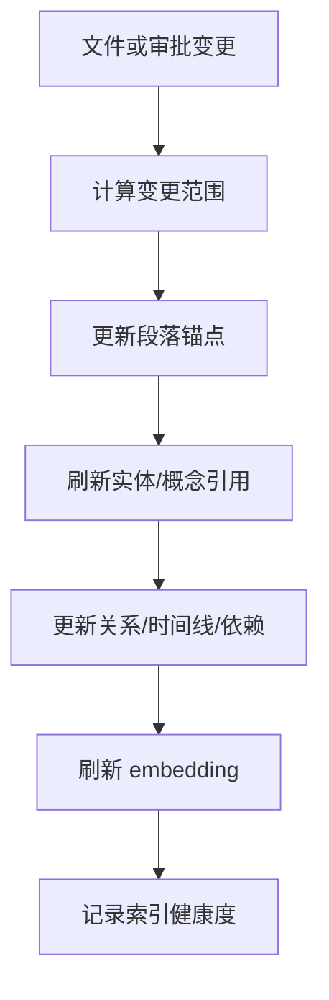

# 06 · Knowledge Graph

本文档定义项目知识图谱如何从作品事实中生成、更新和服务其他能力。读完本篇应能理解:实体、概念、关系、时间线、段落锚点和 embedding 各自解决什么问题,为什么它们是派生索引而不是作品真源,以及索引失败时上下文和 UI 如何降级。

## 要解决的问题

百万字长篇最难维护的是一致性。人物状态、关系变化、世界规则、伏笔承诺和章节事实分散在大量正文和设定文件中。Knowledge Graph 的职责是把这些事实变成可查询、可引用、可解释的机器索引。

它不是第二份作品,也不是让模型自由总结出的事实库。它必须能回到作者文件、段落锚点或审批记录解释来源。

## 主权对象

Knowledge Graph 拥有:

- 实体与别名。
- 概念与世界规则。
- 实体关系。
- 实体时间线。
- 伏笔、禁忌、承诺和依赖。
- 段落锚点。
- 实体/概念引用。
- embedding 与语义召回索引。
- reindex 状态和索引健康度。

## 事实来源优先级

知识图谱遵守事实优先级:

1. 作者文件和用户直接编辑。
2. 审批通过并已落盘的 ChangeSet。
3. 明确标记的设定快照。
4. 派生索引和模型抽取结果。

派生抽取不能覆盖更高优先级事实。发现冲突时,系统提出冲突和来源,不自动改写作品。

## Reindex 主路径

reindex 应尽量局部化。稳定段落保留原锚点;小幅编辑迁移锚点;大幅重写或删除使相关引用失效并触发下游刷新。

## 段落锚点

段落锚点让系统能说清“这个角色在第几章哪一段被提到”。锚点用于:

- 高亮和跳转。
- 查询引用来源。
- 影响分析候选范围。
- embedding 与原文段落绑定。
- rollback 和审批冲突判断。

锚点失稳时,系统不能继续把旧引用当最新事实。相关查询和影响分析必须标记为低置信或待修复。

## 实体、概念和依赖

实体用于人物、地点、组织、物品等可命名对象。概念用于世界规则、能力体系、禁忌、设定约束等不可简单归入实体的事实。

关系和时间线回答“谁和谁是什么关系”“什么时候发生了什么”。依赖回答“这个伏笔、承诺、禁忌或设定被哪些章节依赖”。这些结构共同服务 cascade:改动一个设定时,系统能先用确定性索引找出受影响候选。

## Embedding

embedding 只负责语义召回。它可以帮助找到措辞不同但语义相关的段落,不能作为事实判断的唯一来源。

语义命中必须回到原文段落、设定文件或项目事实解释。embedding provider 失败时,精确查询、实体引用和规则索引仍应工作;系统只把语义召回标记为不可用或低覆盖。

## Plan Lock 与 Derived Guard

某些设定、卷级规划、红线或用户明确锁定内容属于高主权事实。知识图谱可以引用它们,不能自动改写它们。

派生文件或派生表必须带有派生标记。任何写入派生内容的工具都不能让派生内容伪装成作者原始事实。

## 与其他层的关系

| 调用方 | 使用知识图谱做什么 |
|---|---|
| Context And Query | 装配上下文、事实查询、语义召回 |
| Turn Orchestration | cascade 候选范围、审批冲突 |
| Creative Engine | 守则检测、角色一致性、伏笔兑现 |
| Editor Interaction | 高亮、旁注、跳转、查询入口 |
| Project Storage | 文件变更后触发 reindex |

## 失败语义

| 失败 | 系统行为 |
|---|---|
| reindex 失败 | 作品事实保留,索引标记部分过期 |
| 锚点失稳 | 下游引用低置信或失效 |
| embedding 失败 | 语义召回降级,精确事实查询继续 |
| 抽取冲突 | 进入一致性报告或审批,不自动覆盖 |
| 派生写入越权 | 阻断并记录错误 |
| 索引健康度过低 | 高风险 Agent 不继续自动生成 |

## 用户可见结果

用户看到的是高亮、旁注、跳转来源、查询结果、影响范围和一致性提醒。系统需要能解释每条提醒来自哪个文件、段落、实体、概念或依赖。

## Appendix

- [appendix/schema-tables](./appendix/schema-tables.md) 保存知识图谱、锚点、embedding、派生索引表结构。
- [appendix/tool-catalog](./appendix/tool-catalog.md) 保存 reindex、查询和索引工具明细。
